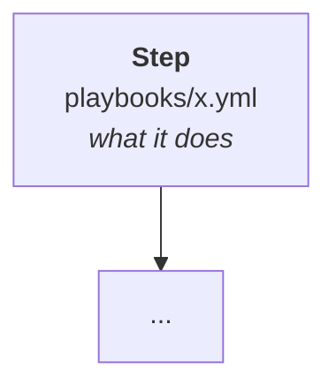

# Architecture — [Use case]

<!-- REFERENCE, not narrative. The presenter opens this when someone asks "how
     does that actually work" and needs an answer rather than a guess. Tables
     and diagrams; save the reasoning for the plan doc. -->

Reference for the presenter. What exists, what builds what, and how long each
part takes.

This describes the demo as it is *shown*. For **why** it is built this way — the
research, the decisions, and the ones that were reversed — read
[`docs/plan/`](../../plan/).

---

## The flow

<!-- A Mermaid graph. GitHub renders it natively, it survives dark mode, and it
     needs no environment to produce — which makes it better than a screenshot
     of the UI for this purpose. -->

<!-- Then the non-obvious things about the flow. Ordering that is not guessable,
     waits that exist for a reason, deliberate omissions. These are the details
     that make a presenter sound like they built it. -->

---

## Inputs

| Question | Variable | Choices | Default |
|---|---|---|---|
| | | | |

<!-- Note anything deliberately ABSENT from the interface and why. A decision
     about what to leave off is more persuasive than the form itself. -->

---

## What gets created

| Resource | Purpose |
|---|---|
| | |

---

## What AAP holds

<!-- Object names exactly as they appear in the UI, so a presenter can find them
     while screen-sharing. -->

| Type | Name |
|---|---|
| | |

---

## Timing

<!-- Real measured numbers, not estimates. If a number is disputed or did not
     reproduce, say so — a retired measurement with an explanation is worth more
     than a confident wrong one. -->

| Step | Time |
|---|---|
| | |

---

## What does not work yet

<!-- The material for the talk track's honest-bits beat. Link the issues. -->

---

## Cleanup

| Destroyed | Preserved |
|---|---|
| | |
