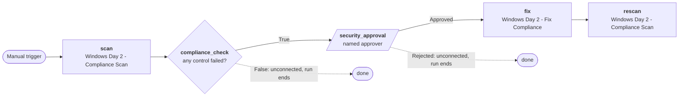

# Demo: Automation Orchestrator

**Start here.** A customer watches an Automation Orchestrator workflow chain
existing AAP job templates with logic nodes and human approval — a visual canvas
over the AAP they already have — in about twenty minutes.

| | |
|---|---|
| **Length** | 20 minutes (15 + 5 for questions) |
| **Audience** | Platform engineers and automation leads evaluating workflow orchestration beyond what AAP provides natively |
| **Reader** | The Ansible pre-sales engineer presenting it |
| **Needs a live environment?** | **Yes** — the workflow canvas and AAP integration are live |
| **Status** | Ready — rehearsed end to end on sandbox, 2026-09-15 |

---

## Red Hat links

Start here before rehearsing. These are the confirmed, publicly available
resources as of 2026-09-11.

| Link | What it is |
|---|---|
| [Product page](https://www.redhat.com/en/technologies/management/ansible/automation-orchestrator) | Sold as an add-on to an AAP subscription |
| [Product documentation](https://docs.redhat.com/en/documentation/automation_orchestrator/2026.8) | AO is its own docs product, not a section of AAP docs |
| [What is AO](https://docs.redhat.com/en/documentation/automation_orchestrator/2026.8/discover-what_is_automation_orchestrator) | Overview and positioning |
| [Create your first workflow](https://docs.redhat.com/en/documentation/automation_orchestrator/2026.8/get_started-create_your_first_workflow) | Getting started guide |
| [AAP-integrated topology](https://docs.redhat.com/en/documentation/automation_orchestrator/2026.8/plan-ansible_automation_platform_integrated_topology) | The topology we run |
| [Install](https://docs.redhat.com/en/documentation/automation_orchestrator/2026.8/install-install_and_manage_automation_orchestrator) | OLM, `AutomationOrchestrator` CR, PostgreSQL must be provisioned in advance |
| [Add AAP to workflows](https://docs.redhat.com/en/documentation/automation_orchestrator/2026.8/develop-add_ansible_automation_platform_to_automation_orchestrator_workflows) | Wiring AAP job templates into AO workflows |
| [Approvals and human oversight](https://docs.redhat.com/en/documentation/automation_orchestrator/2026.8/develop-add_human_oversight_to_workflows) | Approval nodes and gating |
| [Authentication (SSO/OIDC)](https://docs.redhat.com/en/documentation/automation_orchestrator/2026.8/configure-authenticate_users_and_systems) | How SSO is configured |
| [REST API guide](https://docs.redhat.com/en/documentation/automation_orchestrator/2026.8/develop-integrate_with_the_rest_api) | Service accounts, OpenAPI 3.1 |
| [Node type catalog](https://docs.redhat.com/en/documentation/automation_orchestrator/2026.8/reference-node_type_catalog) | Every node type AO supports |
| [Release notes](https://docs.redhat.com/en/documentation/automation_orchestrator/2026.8/whats_new-automation_orchestrator_release_notes) | Version history |
| [GA blog](https://www.redhat.com/en/blog/unify-it-workflows-scale-new-automation-orchestrator-ansible-automation-platform) | Justin Braun, 2026-08-21; GA add-on for AAP 2.7 or later |
| [Interactive demo](https://www.redhat.com/en/interactive-demo/automation-orchestrator) | CVE remediation: EDA trigger, AI analysis, approval |
| [Overview video](https://youtu.be/oGjroM4IAYM) | Product overview |
| [Red Hat Summit press release](https://www.redhat.com/en/about/press-releases/red-hat-establishes-ansible-automation-platform-trusted-execution-layer-it-operations-agentic-era) | 2026-05-12 — said "technology preview"; the August GA superseded it |
| [Community announcement](https://forum.ansible.com/t/introducing-automation-orchestrator-for-ansible-automation-platform/46221) | 2026-08-24, Ansible Forum |
| [AAP 2.7 documentation hub](https://docs.redhat.com/en/documentation/red_hat_ansible_automation_platform/2.7) | The platform AO extends |

### Instance API docs

Every AO instance serves its own interactive API reference. The host changes
with every RHDP environment — substitute the Route from the
`automation-orchestrator` namespace.

| Endpoint | Format |
|---|---|
| `https://<ao-host>/api_docs/v1/docs` | Swagger UI |
| `https://<ao-host>/api_docs/v1/redoc` | ReDoc |
| `https://<ao-host>/api_docs/v1/openapi.json` | OpenAPI 3.1 spec |

---

## The six documents

| File | Read it when |
|---|---|
| [`run-sheet.md`](run-sheet.md) | **While presenting.** Minute markers, what is on screen, the timing budget, recovery moves |
| [`talk-track.md`](talk-track.md) | **While rehearsing.** The narrative and the actual words, beat by beat |
| [`build-guide.md`](build-guide.md) | **Learning the build.** The canvas click-by-click, every field value and screenshot |
| [`architecture.md`](architecture.md) | **When asked "how does that work".** The install flow, what happens at run time, the workflow as code |
| [`troubleshooting.md`](troubleshooting.md) | **When something breaks.** Every error seen in rehearsal, verbatim, with cause and fix |
| [`objections.md`](objections.md) | **Before you go in.** What this audience asks, answered from the code |

Present from the run sheet. Rehearse from the talk track. The other four are
reference.

> **Seven files, not the template's five.** The canvas build is thirty-odd
> clicks with field values and screenshots, and the rehearsal surfaced errors
> whose causes are not obvious from their text. Either
> would swamp a run sheet that has to stay scannable, so `build-guide.md` and
> `troubleshooting.md` are reference the run sheet cites — the same
> relationship `architecture.md` already has to it.

---

## The workflow

`Windows Day 2 - Compliance Remediation`: scan the Windows guest, and only if a
CIS control failed, ask a named person before fixing it and scanning again.



The three AAP steps are ordinary job templates. What AO adds is the diamond and
the parallelogram — a branch on a job's result, and a gate a person has to
open.

### Measured

Sandbox, 2026-09-15, execution `76e8be52`:

| Step | Time |
|---|---|
| `scan` | 32 s |
| `compliance_check` | 0 s |
| `security_approval` | 1 m 31 s — as long as you talk |
| `fix` | 11 s |
| `rescan` | 32 s — `compliant: true` |
| **Whole run** | **2 m 48 s**, about **76 s** of it automation |

### What works, and what does not

| Works | Does not, yet |
|---|---|
| Login through AAP SSO | AO branding — no `custom_login_info` on the CR ([sales.demos#477](https://github.com/ericcames/sales.demos/issues/477)) |
| Every AAP job template visible on the canvas — 36 on sandbox | Expressions by step name — AO references steps by internal ID |
| Branching on a job's `set_stats` artifacts | Boolean literals in conditions — compare numbers |
| Named-user approval with an audit record | Group approvers — the AAP identity provider maps no groups |
| AAP steps in a run, from any user ([sales.demos#621](https://github.com/ericcames/sales.demos/issues/621)) | Browsing AAP with a credential another AO user created ([sales.demos#622](https://github.com/ericcames/sales.demos/issues/622)) |
| The workflow reloaded from code on any environment ([sales.demos#474](https://github.com/ericcames/sales.demos/issues/474)) | Creating or running workflows through the MCP server — it is read-only |

---

## The 60-second version

1. **Log in to AO through AAP SSO** — one click, same credentials. AO redirects
   to the AAP gateway; once authenticated, you land on the AO dashboard.
2. **Build a workflow on the visual canvas** — add AAP job templates from the
   integration, a condition on the scan's result, and an approval step.
3. **Run it** — AAP executes the jobs, AO orchestrates the sequence and gates the
   approval. The audience watches nodes light up on the canvas as each step
   completes.

**What the demo is actually about** is not that AO exists. It is that AO is a
canvas over the AAP you already have. Your job templates, your credentials, your
RBAC. The orchestration layer adds logic and human oversight without replacing
anything.

---

## Why it does not work without a cluster

The compelling beats are a live canvas and a running workflow. There is no
renderer for the AO UI — the workflow builder, the execution timeline, and the
approval gate are all interactive and cannot be captured as static artifacts
the way the OpenShift Virtualization demo page can.

Screenshots from a previous run can carry a shortened version of the story, but
the drop in persuasion is steep: the whole argument is "look at the thing
working", and a screenshot of something working is the weakest form of that
claim.

---

## If you want to run it live

Two things, in order:

```bash
/sales-demos-orchestrator         # install AO + its CloudNativePG database
/sales-demos-orchestrator-config  # connect AO to AAP: OIDC SSO + integration
```

Or launch the AAP workflow `AAP Ecosystem - Deploy Automation Orchestrator`,
which chains both.

Then log in to AO through AAP SSO and build the demo workflow on the canvas
with the [build guide](build-guide.md).

### Recreate it

The rehearsed workflow does not live only in one cluster's database. It is
committed by name in
[`inventory/group_vars/aap/ao_workflows.yml`](https://github.com/ericcames/sales.demos/blob/main/inventory/group_vars/aap/ao_workflows.yml),
and two skills turn it back into a working demo on any environment:

| Skill | AAP job template | Does |
|---|---|---|
| [`/sales-demos-orchestrator-workflow`](https://github.com/ericcames/sales.demos/blob/main/.claude/skills/sales-demos-orchestrator-workflow/SKILL.md) | `AAP Ecosystem - Load Automation Orchestrator Workflows` | Loads `Windows Day 2 - Compliance Remediation (as code)`, resolving every name to this environment's IDs. Under a minute; a re-run changes nothing |
| [`/sales-demos-orchestrator-rehearse`](https://github.com/ericcames/sales.demos/blob/main/.claude/skills/sales-demos-orchestrator-rehearse/SKILL.md) | `AAP Ecosystem - Rehearse Automation Orchestrator Demo` | Preflights every fault the first rehearsal hit and breaks compliance; optionally runs to the approval gate; reports a run's timings and approval record |

Neither approves anything. A person approving in AO is the demo.

New to this repo? Run [`/sales-demos-first-time`](https://github.com/ericcames/sales.demos/blob/main/.claude/skills/sales-demos-first-time/SKILL.md) first.

---

## Related

- [`../../plan/automation-orchestrator-plan.md`](../../plan/automation-orchestrator-plan.md) — why
  the automation is built this way: the experiment, the database trap, the OIDC
  setup
- [`ROADMAP.md`](https://github.com/ericcames/sales.demos/blob/main/ROADMAP.md) — what is done and what is not
- [`sales.demos`](https://github.com/ericcames/sales.demos) — the automation itself
