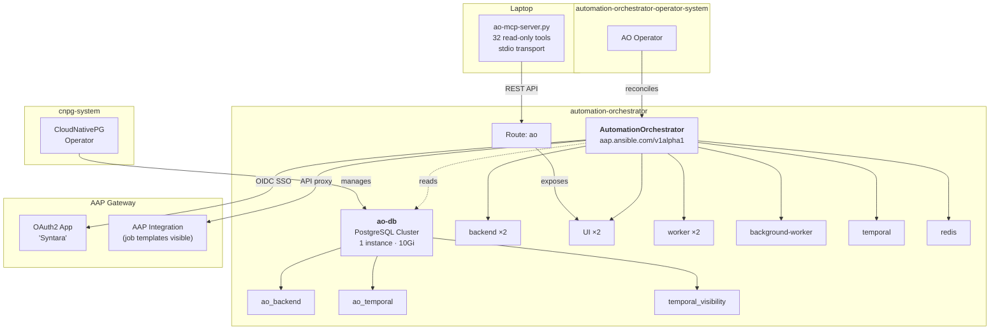

# Architecture — Automation Orchestrator

Reference for the presenter. What exists, what builds what, and how long each
part takes. Use it to answer "how does that actually work" without guessing.

This describes the demo as it is *shown*. For **why** it is built this way — the
research, the experiment, and the decisions — read
[`docs/plan/automation-orchestrator-plan.md`](../../plan/automation-orchestrator-plan.md).

---

## The deploy flow

`AAP Ecosystem - Deploy Automation Orchestrator`. Two job templates chained on
success — install, then configure.


**Install creates the infrastructure.** CloudNativePG, three PostgreSQL
databases, the AO operator, and the `AutomationOrchestrator` CR. The Route
serves a login page at the end, but AO cannot see AAP yet.

**Configure connects AO to AAP.** Patches the SSRF allowlist so AO can reach
AAP's private IP, sets up AAP as an OIDC identity provider (SSO), creates an
AAP credential in AO, and creates the AAP integration so AO can see job
templates. After this step, the "Log in with Ansible Automation Platform" button
works and AO lists all AAP job templates on its canvas.

---

## What install creates



**Three databases, not two.** The CRD requires exactly two secretRefs —
`backendDatabase` and `temporalDatabase` — so two is what you build. Then
`ao-temporal-migration` crash-loops on `pq: database "temporal_visibility" does
not exist`. Temporal keeps its visibility store in a separate database with a
**fixed name**. Nothing in the CRD, the sample CR, or the operator description
mentions it. It was found by reading migration logs on the first live install
([#141](https://github.com/ericcames/sales.demos/issues/141)).

---

## Inputs

| Question | Variable | Default |
|---|---|---|
| Target environment | `target_env` | (required) |
| Install AO? | `install_ao` | `true` |
| AO namespace | `ao_namespace` | `automation-orchestrator` |
| DB storage size | `ao_db_storage_size` | `10Gi` |

**The admin password is not an input.** AO's admin password is seeded from
`aap_password` so the two always match
([#143](https://github.com/ericcames/sales.demos/issues/143)). It is set
only on first install — the CRD ignores the secret once the admin user exists.

---

## What gets created

### On OpenShift

| Resource | Namespace | Purpose |
|---|---|---|
| Namespace `cnpg-system` | — | CloudNativePG operator |
| Namespace `automation-orchestrator-operator-system` | — | AO operator |
| Namespace `automation-orchestrator` | — | AO instance + database |
| Subscription `cloudnative-pg` | `cnpg-system` | CNPG from `certified-operators` |
| Subscription `automation-orchestrator-operator` | `automation-orchestrator-operator-system` | AO from `redhat-operators` |
| Cluster `ao-db` (CloudNativePG) | `automation-orchestrator` | PostgreSQL — 1 instance, 10Gi |
| Database `ao-temporal` | `automation-orchestrator` | Temporal workflow engine |
| Database `temporal-visibility` | `automation-orchestrator` | Temporal visibility store (fixed name) |
| AutomationOrchestrator `ao` | `automation-orchestrator` | The product instance |
| Route `ao` | `automation-orchestrator` | External access |
| Secret `ao-admin-password` | `automation-orchestrator` | Admin password, matched to AAP |

### On AAP

| Resource | Purpose |
|---|---|
| OAuth2 Application "Syntara" | OIDC client for SSO — created by `setup_aap_oidc` |

### On the laptop

| Resource | Purpose |
|---|---|
| `ao-sandbox` / `ao-demo` MCP server | 32 read-only tools wrapping the AO REST API |

---

## What AAP holds

| Type | Name |
|---|---|
| Job template | `AAP Ecosystem - Install Automation Orchestrator` |
| Job template | `AAP Ecosystem - Configure Automation Orchestrator` |
| Workflow | `AAP Ecosystem - Deploy Automation Orchestrator` |

The workflow chains the two templates on success. Install is idempotent —
re-running on an environment that already has AO converges rather than failing.
Configure checks before it creates: OIDC, credential, and integration are each
skipped if they already exist.

---

## Timing

Measured on sandbox (`cluster-kbjvc`), 2026-09-03 (install) and 2026-09-11
(configure).

| Step | Time |
|---|---|
| Install (CloudNativePG + PostgreSQL + AO operator + CR) | ~8 min |
| Configure (SSRF patch + OIDC + credential + integration) | ~3 min |
| **Total deploy workflow** | **~11 min** |

The install is dominated by operator subscription resolution and database
readiness. Configure is fast once the backend deployment has rolled out after
the SSRF environment variable patch.

---

## Resource footprint

Measured in [#141](https://github.com/ericcames/sales.demos/issues/141) by
running `probe_env.yml` before and after install.

| | Requested CPU | Requested memory |
|---|---|---|
| **Delta from install** | **+1.91 vCPU** | **+2.47 GiB** |
| 9 AO pods | 1.80 vCPU | 1.91 GiB |
| 1 PostgreSQL instance | 0.10 vCPU | 0.50 GiB |
| 1 PVC | — | 10Gi disk |

The nine pods: backend (x2), UI (x2), worker (x2), background-worker (x1),
temporal (x1), redis (x1).

---

## What does not work yet

- **No environment badge on the AO login page.**
  [#426](https://github.com/ericcames/sales.demos/issues/426) tracks it. The
  `AutomationOrchestrator` CR has no `custom_login_info` or `custom_logo`
  field — the product is version 2026.8 and does not yet offer branding.
- **The AO MCP server is read-only.** It wraps 32 GET endpoints. Creating or
  executing workflows via MCP is not yet possible.
- **No `aap-edge` AAP MCP server.** AO on edge has no MCP entry point. The
  posture decision is tracked in the server inventory.
- **The demo workflow must be built manually on the canvas.** AO supports YAML
  export and import, but no automation commits the workflow as code yet
  ([#474](https://github.com/ericcames/sales.demos/issues/474)).

---

## Cleanup

| Destroyed | Preserved |
|---|---|
| (nothing — `teardown.yml` does not touch AO) | AO instance, database, operators |

AO is setup-time infrastructure, not per-demo state. `teardown.yml` destroys
demo VMs and preserves everything else — AO joins that list alongside CNV and
the boot sources.

**To remove AO by hand:**

```bash
oc delete namespace automation-orchestrator                  # instance + database + PVC
oc delete namespace automation-orchestrator-operator-system  # the AO operator
oc delete namespace cnpg-system                              # CloudNativePG
oc delete crd automationorchestrators.aap.ansible.com
```
