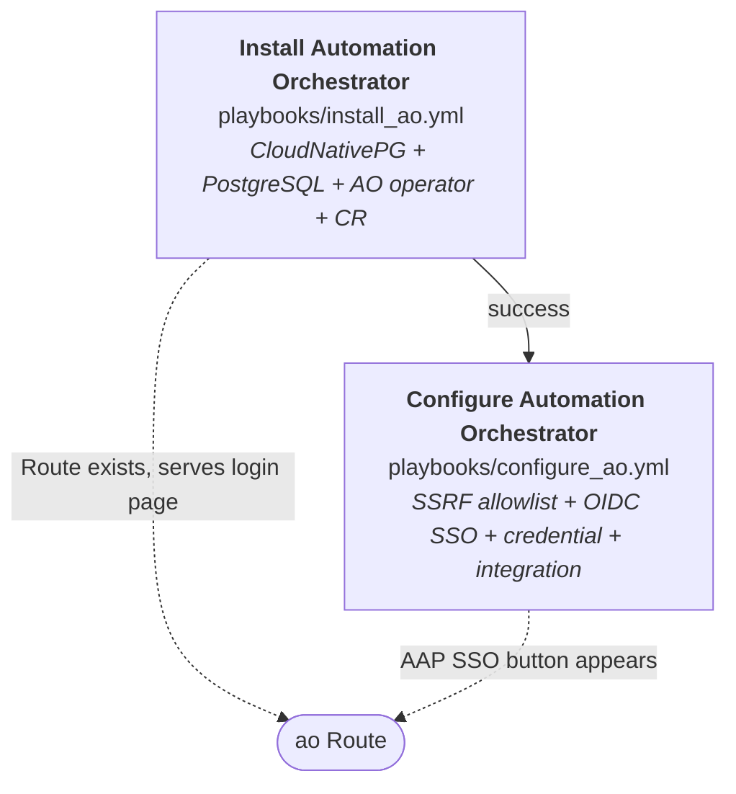
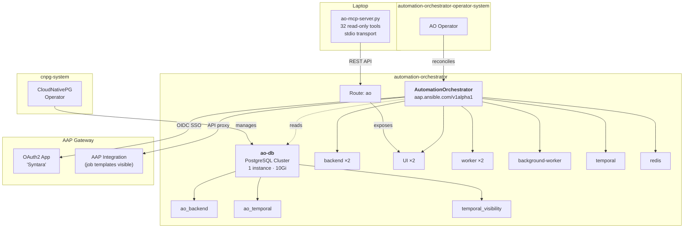
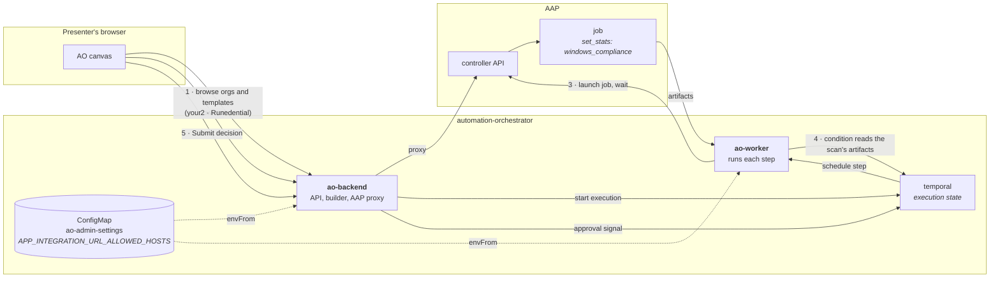
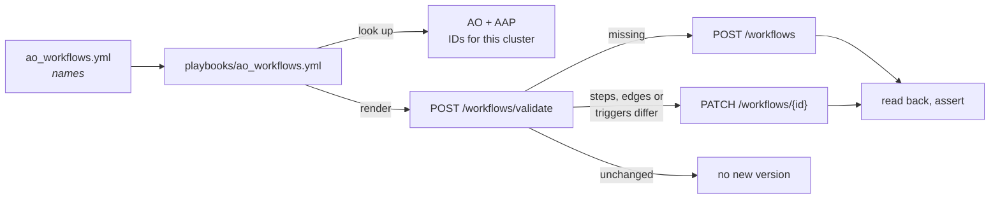

# Architecture — Automation Orchestrator

Reference for the presenter. What exists, what builds what, and how long each
part takes. Use it to answer "how does that actually work" without guessing.

This describes the demo as it is *shown*. For **why** it is built this way — the
research, the experiment, and the decisions — read
[`docs/plan/automation-orchestrator-plan.md`](../../plan/automation-orchestrator-plan.md).

---

## The deploy flow

`AAP Ecosystem - Deploy Automation Orchestrator`. Two job templates chained on
success — install, then configure.



**Install creates the infrastructure.** CloudNativePG, three PostgreSQL
databases, the AO operator, and the `AutomationOrchestrator` CR. The Route
serves a login page at the end, but AO cannot see AAP yet.

**Configure connects AO to AAP.** Writes the SSRF allowlist to the ConfigMap
`ao-admin-settings` so both `ao-backend` and `ao-worker` can reach AAP's private
IP, sets up AAP as an OIDC identity provider (SSO), creates the `AAP Admin`
credential in AO, and creates the AAP integration so AO can see job templates.
After this step, the "Log in with Ansible Automation Platform" button works, AO
lists all AAP job templates on its canvas, and a workflow's AAP steps run.

---

## What install creates



**Three databases, not two.** The CRD requires exactly two secretRefs —
`backendDatabase` and `temporalDatabase` — so two is what you build. Then
`ao-temporal-migration` crash-loops on `pq: database "temporal_visibility" does
not exist`. Temporal keeps its visibility store in a separate database with a
**fixed name**. Nothing in the CRD, the sample CR, or the operator description
mentions it. It was found by reading migration logs on the first live install
([#141](https://github.com/ericcames/sales.demos/issues/141)).

---

## What happens when you click Run

Two AO components talk to AAP, for different reasons, and that split explains
the two worst failures the rehearsal hit.



1. **Building browses AAP through `ao-backend`**, using the step's credential.
   AO allows only the credential's creator to do that — which is why an SSO
   presenter needs a credential of their own
   ([sales.demos#622](https://github.com/ericcames/sales.demos/issues/622)).
2. **Running happens in `ao-worker`.** It needs the SSRF allowlist as much as
   `ao-backend` does; with only `ao-backend` allowed, the builder worked and
   every run failed in under a second
   ([sales.demos#621](https://github.com/ericcames/sales.demos/issues/621)). Both
   Deployments load the one ConfigMap, so they cannot disagree. A run does
   **not** check credential ownership.
3. **Each AAP step is an ordinary AAP job.** AO launches it and waits; each
   step costs about 5 s more than the job itself.
4. **The job's `set_stats` become the step's artifacts.** The compliance scan
   publishes `windows_compliance` — `pass`, `fail`, `notconfigured`, `errors`,
   `score`, `compliant` — and the condition reads
   `${activity_scan.artifacts.windows_compliance.fail} > 0`. Steps are
   referenced by **node ID**, not display name, and there are no boolean
   literals.
5. **The approval is a pause, not a notification.** The execution sits at
   **Pending approval** until a named approver submits a decision; the decision,
   who, when and the note become the audit record. Removing the workflow
   deletes that record with its executions.

---

## The workflow as code

The demo workflow is committed in sales.demos, **by name, not as an AO export**
([sales.demos#474](https://github.com/ericcames/sales.demos/issues/474)). An
export embeds values that exist only in the cluster it came from, and every one
is wrong on the next RHDP environment:

| In AO's saved definition | In `ao_workflows.yml` | Resolved at load time from |
|---|---|---|
| `job_template_id: <id>` | `job_template: "Windows Day 2 - Compliance Scan"` | `GET /api/v1/proxies/aap/job_templates` |
| `credential_id: <uuid>` | `credential: "AAP Admin"` | `GET /api/v1/credentials` |
| `integration_id: <uuid>` | `integration: "Ansible Automation Platform"` | `GET /api/v1/integrations` |
| project UUID | `project: "default"` | `GET /api/v1/projects` |
| approver `admin-<hash>` | `approvers_sso: ["{{ aap_username }}"]` | `GET /api/v1/users?auth_type=federated` |
| `activity_e4e7a3f2_…` | `id: activity_scan` | chosen in the file — AO accepts readable IDs |



- **Loaded as `Windows Day 2 - Compliance Remediation (as code)`.** The suffix
  keeps a load from overwriting a copy a presenter built live under the plain
  name.
- **Idempotent.** Positions are ignored in the comparison, so re-running saves
  nothing new.
- **Owned by the local `admin`.** Anyone can run it; editing an AAP step in the
  builder as an SSO user needs your own credential.
- **`-e ao_workflow_state=absent`** removes the workflows in the file — and
  their run history.

[`/sales-demos-orchestrator-rehearse`](https://github.com/ericcames/sales.demos/blob/main/.claude/skills/sales-demos-orchestrator-rehearse/SKILL.md)
runs the loaded workflow to its approval gate and reports its timings, so the
committed copy is proven on each environment, not assumed.

---

## Inputs

| Question | Variable | Default |
|---|---|---|
| Target environment | `target_env` | (required) |
| Install AO? | `install_ao` | `true` |
| AO namespace | `ao_namespace` | `automation-orchestrator` |
| DB storage size | `ao_db_storage_size` | `10Gi` |

**The admin password is not an input.** AO's admin password is seeded from
`aap_password` so the two always match
([#143](https://github.com/ericcames/sales.demos/issues/143)). It is set
only on first install — the CRD ignores the secret once the admin user exists.

---

## What gets created

### On OpenShift

| Resource | Namespace | Purpose |
|---|---|---|
| Namespace `cnpg-system` | — | CloudNativePG operator |
| Namespace `automation-orchestrator-operator-system` | — | AO operator |
| Namespace `automation-orchestrator` | — | AO instance + database |
| Subscription `cloudnative-pg` | `cnpg-system` | CNPG from `certified-operators` |
| Subscription `automation-orchestrator-operator` | `automation-orchestrator-operator-system` | AO from `redhat-operators` |
| Cluster `ao-db` (CloudNativePG) | `automation-orchestrator` | PostgreSQL — 1 instance, 10Gi |
| Database `ao-temporal` | `automation-orchestrator` | Temporal workflow engine |
| Database `temporal-visibility` | `automation-orchestrator` | Temporal visibility store (fixed name) |
| AutomationOrchestrator `ao` | `automation-orchestrator` | The product instance |
| Route `ao` | `automation-orchestrator` | External access |
| Secret `ao-admin-password` | `automation-orchestrator` | Admin password, matched to AAP |

### On AAP

| Resource | Purpose |
|---|---|
| OAuth2 Application "Syntara" | OIDC client for SSO — created by `setup_aap_oidc` |

### On the laptop

| Resource | Purpose |
|---|---|
| `ao-sandbox` / `ao-demo` MCP server | 32 read-only tools wrapping the AO REST API |

---

## What AAP holds

| Type | Name |
|---|---|
| Job template | `AAP Ecosystem - Install Automation Orchestrator` |
| Job template | `AAP Ecosystem - Configure Automation Orchestrator` |
| Workflow | `AAP Ecosystem - Deploy Automation Orchestrator` |
| Job template | `AAP Ecosystem - Load Automation Orchestrator Workflows` |
| Job template | `AAP Ecosystem - Rehearse Automation Orchestrator Demo` |

The workflow chains the two templates on success. Install is idempotent —
re-running on an environment that already has AO converges rather than failing.
Configure checks before it creates: OIDC, credential, and integration are each
skipped if they already exist.

---

## Timing

Measured on sandbox (`cluster-kbjvc`), 2026-09-03 (install) and 2026-09-11
(configure).

| Step | Time |
|---|---|
| Install (CloudNativePG + PostgreSQL + AO operator + CR) | ~8 min |
| Configure (SSRF patch + OIDC + credential + integration) | ~3 min |
| **Total deploy workflow** | **~11 min** |

The install is dominated by operator subscription resolution and database
readiness. Configure is fast once the AO pods have restarted with the
`ao-admin-settings` ConfigMap.

| Demo workflow | Time |
|---|---|
| Load it as code | under a minute |
| Rehearse preflight + break compliance | ~20 s |
| Run to the approval gate | ~40 s |
| Whole run, approval included | 2 m 48 s in rehearsal |

---

## Resource footprint

Measured in [#141](https://github.com/ericcames/sales.demos/issues/141) by
running `probe_env.yml` before and after install.

| | Requested CPU | Requested memory |
|---|---|---|
| **Delta from install** | **+1.91 vCPU** | **+2.47 GiB** |
| 9 AO pods | 1.80 vCPU | 1.91 GiB |
| 1 PostgreSQL instance | 0.10 vCPU | 0.50 GiB |
| 1 PVC | — | 10Gi disk |

The nine pods: backend (x2), UI (x2), worker (x2), background-worker (x1),
temporal (x1), redis (x1).

---

## What does not work yet

- **No server-side branding on AO.** The `AutomationOrchestrator` CR has no
  `custom_login_info` or `custom_logo` field — the product is version 2026.8
  and does not yet offer branding. The `aap-env-badge` browser extension fills
  the gap: it paints the SANDBOX/DEMO pill on every AO page, login and
  post-login ([sales.demos#477](https://github.com/ericcames/sales.demos/issues/477),
  [#496](https://github.com/ericcames/sales.demos/issues/496)).
- **The AO MCP server is read-only.** It wraps 32 GET endpoints. Creating or
  executing workflows via MCP is not yet possible.
- **No `aap-edge` AAP MCP server.** AO on edge has no MCP entry point. The
  posture decision is tracked in the server inventory.
- **A credential works in the builder only for the AO user who created it.**
  `AAP Admin` belongs to the local `admin`, so an SSO presenter browsing AAP
  with it gets "AAP Authentication Failed" and needs a credential of their own.
  Runs are not checked
  ([sales.demos#622](https://github.com/ericcames/sales.demos/issues/622)).
- **Expressions reference steps by internal ID, not name.** The AO docs show
  `${step_name.field}`; this build rejects it at save time. Conditions also
  cannot use `true`/`false` literals — compare numbers. Measured on sandbox,
  2026-09-15.
- **Group approvers have nothing to pick.** The AAP identity provider maps no
  AAP teams to AO groups; name approver users.
- **Removing a workflow deletes its executions and approval records.** Capture
  an approval you need as evidence first.
- **TLS verification is disabled on the AAP integration**
  (`insecure_skip_tls_verify: true` in `configure_ao.yml`), because RHDP clusters
  serve self-signed certificates. The integration detail page shows it.

---

## Cleanup

| Destroyed | Preserved |
|---|---|
| (nothing — `teardown.yml` does not touch AO) | AO instance, database, operators |

AO is setup-time infrastructure, not per-demo state. `teardown.yml` destroys
demo VMs and preserves everything else — AO joins that list alongside CNV and
the boot sources.

**To remove AO by hand:**

```bash
oc delete namespace automation-orchestrator                  # instance + database + PVC
oc delete namespace automation-orchestrator-operator-system  # the AO operator
oc delete namespace cnpg-system                              # CloudNativePG
oc delete crd automationorchestrators.aap.ansible.com
```
