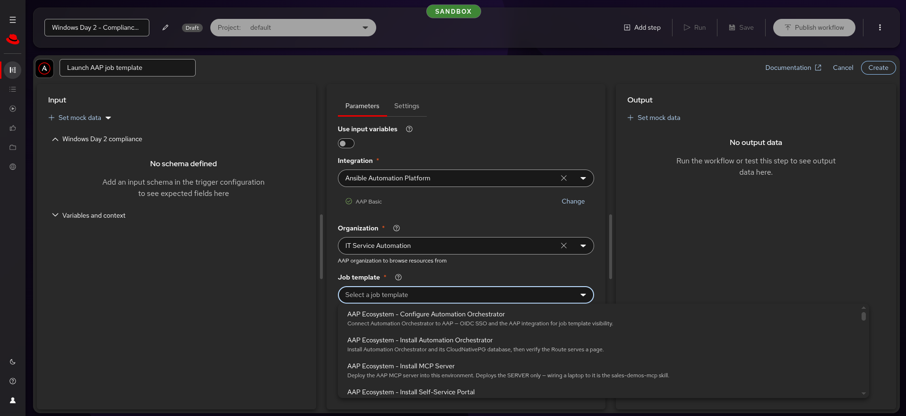
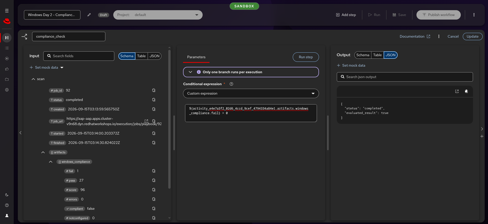
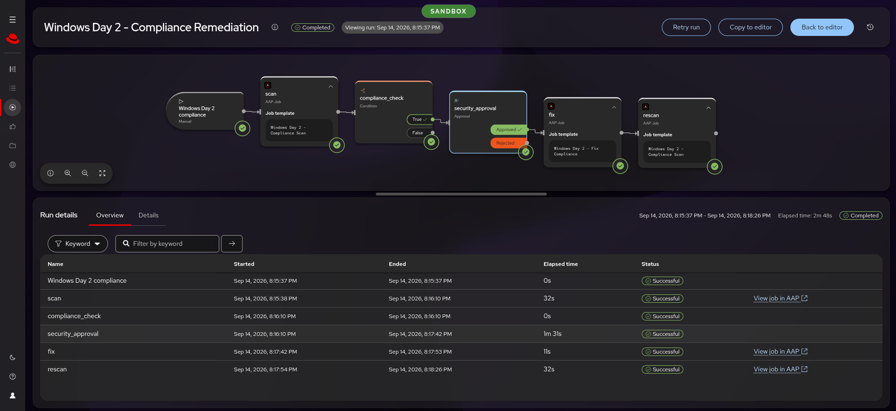
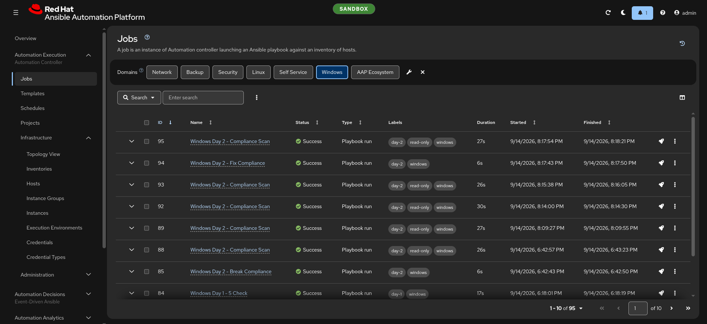

# Build guide — Automation Orchestrator

**The click-by-click for the canvas build**, every field and value, with a
screenshot of each step as it looked in rehearsal. The
[run sheet](run-sheet.md) gives the same build one line per step; this is where
you learn it.

| | |
|---|---|
| **Builds** | `Windows Day 2 - Compliance Remediation` — scan → condition → approval → fix → rescan |
| **Takes** | About 6 minutes on stage; allow 15 the first time |
| **Rehearsed** | Sandbox, 2026-09-15 — [evidence](https://github.com/ericcames/sales.demos/issues/470#issuecomment-5674156533) |
| **When it goes wrong** | [`troubleshooting.md`](troubleshooting.md) — every error seen, verbatim |

---

## Load it instead

The same workflow is committed as code in
[`inventory/group_vars/aap/ao_workflows.yml`](https://github.com/ericcames/sales.demos/blob/main/inventory/group_vars/aap/ao_workflows.yml).
Load it when you want a fallback before presenting, or on a fresh environment:

```bash
/sales-demos-orchestrator-workflow   # or AAP: AAP Ecosystem - Load Automation Orchestrator Workflows
```

[`/sales-demos-orchestrator-workflow`](https://github.com/ericcames/sales.demos/blob/main/.claude/skills/sales-demos-orchestrator-workflow/SKILL.md)
creates `Windows Day 2 - Compliance Remediation (as code)`. The suffix keeps it
apart from the copy you build live, which the loader never touches. It resolves
every job template, credential and approver **by name** to this environment's
IDs, so it works on any RHDP cluster — an AO export would carry the old
cluster's IDs.

**Building live stays the demo.** The loaded copy belongs to AO's local `admin`.
Anyone can run it, but an SSO user editing an AAP step in it is refused the
credential
([sales.demos#622](https://github.com/ericcames/sales.demos/issues/622)).

---

## Before you build

1. **Run the rehearsal preflight.**
   [`/sales-demos-orchestrator-rehearse`](https://github.com/ericcames/sales.demos/blob/main/.claude/skills/sales-demos-orchestrator-rehearse/SKILL.md)
   checks every fault the first rehearsal hit, then breaks compliance on the
   guest so the scan has something to find. About 20 seconds.
2. **Log in to AO through AAP SSO** — the identity you will present as.
3. **Have a credential of your own.** AO lets only a credential's creator
   browse AAP with it. `AAP Admin` was created by `configure_ao.yml` as the
   local `admin`, so as an SSO user you create one once: AAP, Basic Auth, the
   AAP admin username and password. Sandbox's is named `AAP Basic`.

### Log in and find the integration


**Log in with Ansible Automation Platform** redirects to the AAP sign-in page.


**Configuration → Integrations** shows one row, Ansible Automation Platform,
Enabled. **Status `Unknown` and Enabled resources `0` are normal on this
build** — the templates still list.


The detail page shows the AAP gateway URL and the connection credential.


---

## Build it

Click **Create Workflow**. Pick **Manual trigger**, name the workflow
`Windows Day 2 - Compliance Remediation`, and set **Project** to `default`.


**Add every step with the ⊞ on the output of the step before it.** The **Add
step** button at the top adds a step connected to nothing.

### 1. `scan`

⊞ on the trigger → **AAP Execution**.

| Field | Value |
|---|---|
| Credential | Your own (see *Before you build*) — click **Change** if it shows `AAP Admin` |
| Organization | `IT Service Automation` |
| Job template | `Windows Day 2 - Compliance Scan` |
| Limit | `windemo` |
| Name | `scan` (replace "Launch AAP job template") |



**If the rename does not stick**, open the step again, set the name, click
outside the box, then **Update**.

### 2. `compliance_check`

⊞ on `scan` → **Logic → Condition** → **Custom expression**. In the Input panel,
click the copy icon on **scan → artifacts**, paste, and finish it as:

```
${activity_<id>.artifacts.windows_compliance.fail} > 0
```

Two rules, both learned the hard way:

- **Insert the reference with the copy icon; never type it.** AO references a
  step by its internal `activity_…` ID. The AO docs show `${step_name.field}`;
  this build refuses it when you save.
- **Compare a number.** There are no boolean literals: `== false` is read as a
  reference to a step named `false` and fails at run time.

The scan publishes `windows_compliance` with `pass`, `fail`, `notconfigured`,
`errors`, `score` and `compliant`.

**Check it without a full run:** open the condition and click **Run step**. It
re-runs the steps before it against the guest and shows `evaluated_result`.



Only one branch runs per condition — AO says so in the node panel.

### 3. `security_approval`

⊞ on **True** → **Approval**.

| Field | Value |
|---|---|
| Approver users | Your own SSO user (`admin-<hash>`) |
| Message | `Security lead: approve remediation of CIS 2.3.6.6 (RequireStrongKey) on web-win-1.` |
| Name | `security_approval` |

The committed copy adds the scan's numbers to the message with
`${activity_scan.artifacts.windows_compliance.fail}` and `…score}`. **Approver
groups do not work here**: the AAP identity provider has no team→group
mapping, so only AO's built-in groups exist.

### 4. `fix`

⊞ on **Approved** → **AAP Execution**: `Windows Day 2 - Fix Compliance`, same
credential, organization and limit. Name it `fix`.

### 5. `rescan`

⊞ on `fix` → **AAP Execution**: `Windows Day 2 - Compliance Scan` again. Name it
`rescan`.

### 6. Save

Leave **False** and **Rejected** unconnected, then **Save**. The yellow ⚠ on
those two outputs is expected, and "Saved with N issues" lists them — an
unfinished build can be saved.


---

## Run it

**Run** → **Run now**. `scan` takes about 32 s, then `compliance_check` takes
**True** and `security_approval` waits: the header shows **Paused** and
**Pending approval**.


**Review approval** → **Approve** → type a note → **Submit decision**. Approve
only selects the decision. An unanswered approval waits a day by default.


`fix` (about 11 s) and `rescan` (about 32 s) run, and the execution ends
**Completed**.


**Details → security_approval** is the audit entry: decision, who, when, the
note.


**Overview** lists every step with its duration, and each AAP step links to its
job in AAP.



In AAP the run is three ordinary jobs.



**A failed run's Retry** starts a new execution linked to the failed one
(`retried_from_execution_id`), so both stay in the history.

**For timings and the approval record in text**, run
`/sales-demos-orchestrator-rehearse` with
`-e ao_rehearse_report_execution=<id>`.
