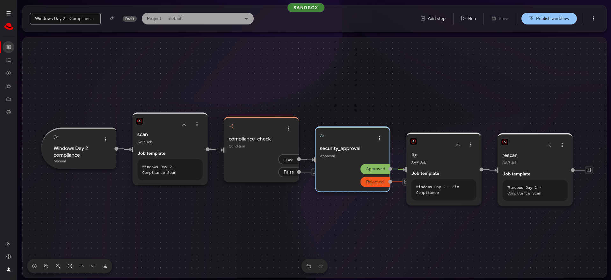
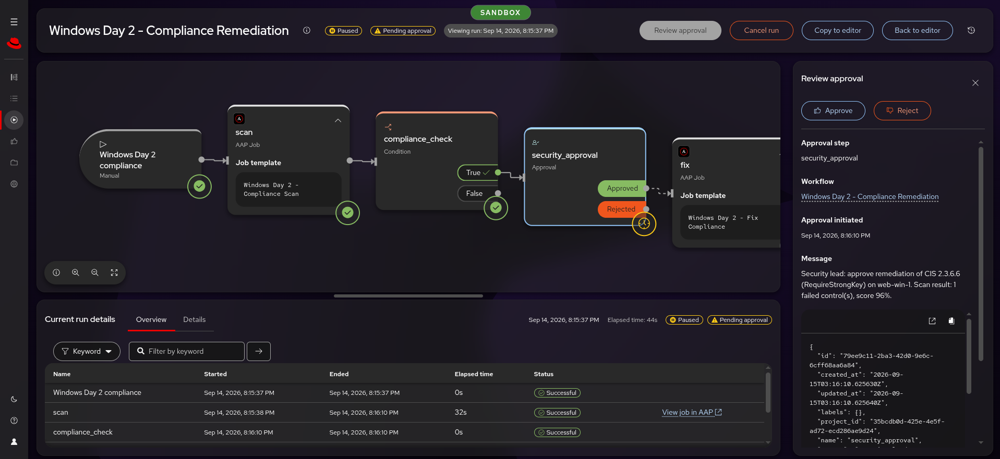
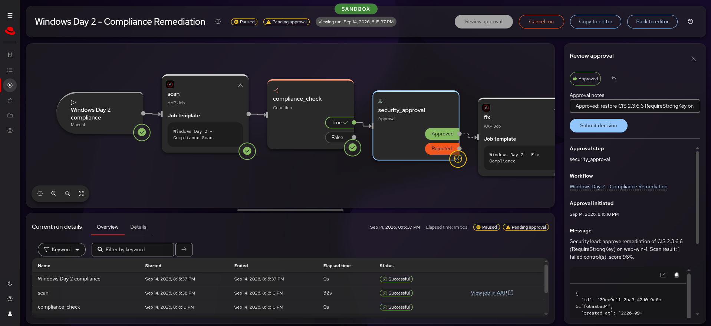
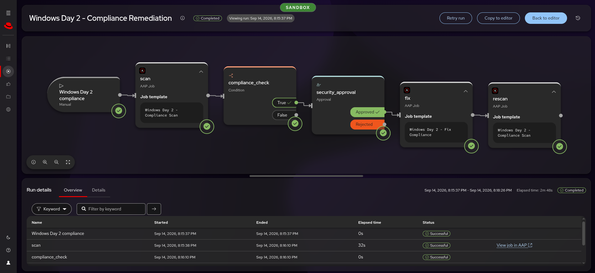
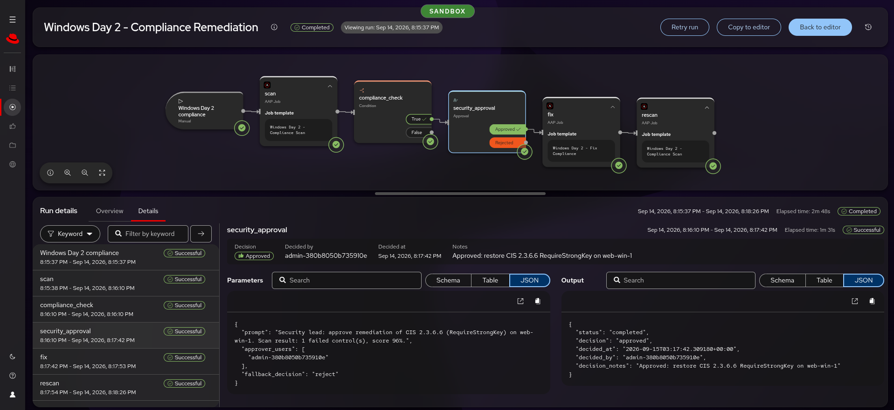

# Run sheet — Automation Orchestrator

**This is the page you hold while presenting.** The narrative behind each beat,
with the actual words, is in [`talk-track.md`](talk-track.md) — rehearse from
that, present from this.

| | |
|---|---|
| **Length** | 20 minutes (15 + 5 for questions) |
| **Audience** | Platform engineers and automation leads |
| **Needs an environment?** | **Yes** — the compelling beats are live workflow builds on the canvas |
| **Assets** | AO login page, AAP sign-in page, AO canvas, AO execution view, AO approval record |
| **Rehearsed** | End to end on sandbox (`cluster-v9n68`), 2026-09-15 — [evidence](https://github.com/ericcames/sales.demos/issues/470#issuecomment-5674156533) |
| **Learn the build from** | [`build-guide.md`](build-guide.md) — every field, every screenshot |
| **When something breaks** | [`troubleshooting.md`](troubleshooting.md) — every error seen, verbatim |

---

## Before you start (10 minutes)

1. Open these in tabs:
   1. AO: `https://ao-automation-orchestrator.apps.<cluster>.dyn.redhatworkshops.io/`
   2. AAP: `https://aap-aap.apps.<cluster>.dyn.redhatworkshops.io/`
   3. This run sheet
2. **Run the preflight and break the guest** —
   [`/sales-demos-orchestrator-rehearse`](https://github.com/ericcames/sales.demos/blob/main/.claude/skills/sales-demos-orchestrator-rehearse/SKILL.md),
   or `AAP Ecosystem - Rehearse Automation Orchestrator Demo` from AAP. About
   20 s. It checks every fault the first rehearsal hit, then runs
   `Windows Day 2 - Break Compliance` so the scan finds `fail: 1`.
3. **Load the fallback** —
   [`/sales-demos-orchestrator-workflow`](https://github.com/ericcames/sales.demos/blob/main/.claude/skills/sales-demos-orchestrator-workflow/SKILL.md).
   `Windows Day 2 - Compliance Remediation (as code)` is your safety net if the
   live build goes wrong.
4. **Log in through SSO and check you have your own AAP credential.** An AAP
   step's Organization dropdown must load. `AAP Admin` belongs to the local
   `admin`, so an SSO presenter needs one they created
   ([sales.demos#622](https://github.com/ericcames/sales.demos/issues/622)).
5. No Windows VM? Use the **Linux Day 1** fallback story.
6. Decide your close before you begin — see **Landing it** at the bottom.

---

## The arc

| Time | Beat | On screen |
|---|---|---|
| 0–2 | Login through AAP SSO | AO login → AAP sign-in → AO dashboard |
| 2–4 | Show the integration | AO Integrations page, template list |
| 4–10 | Build the workflow on the canvas | AO workflow builder |
| 10–14 | Run the workflow | AO execution view, approval gate, approval record |
| 14–17 | The honest bits | (conversation, no screen) |
| 17–20 | Close | AO dashboard |

---

## 0–2 · Login through AAP SSO

**AO login page** → "Log in with Ansible Automation Platform" → the AAP sign-in
page (point at the environment badge) → AO dashboard.

> **"Same credentials. One identity store. Automation Orchestrator delegates
> authentication to the AAP gateway — no separate user database."**

---

## 2–4 · Show the integration

**Configuration → Integrations** → Ansible Automation Platform, Enabled. Click
it: state, AAP gateway URL, connection credential. Status `Unknown` / `0`
resources is normal — do not stop on it.

> **"These are your existing job templates. Nothing was migrated, nothing was
> copied. AO sees them through the integration and can use them as workflow
> steps."**

---

## 4–10 · Build the workflow on the canvas

**Create Workflow** → **Manual trigger** → name
`Windows Day 2 - Compliance Remediation`, project `default`. Add every step with
the **⊞ on the output before it**.

| # | Step | ⊞ on | Type | Set |
|---|---|---|---|---|
| 1 | `scan` | trigger | AAP Execution | `IT Service Automation`, **Windows Day 2 - Compliance Scan**, limit `windemo` |
| 2 | `compliance_check` | `scan` | Logic → Condition → Custom | copy icon on **scan → artifacts**, then `${activity_<id>.artifacts.windows_compliance.fail} > 0` |
| 3 | `security_approval` | **True** | Approval | your SSO user; message naming CIS 2.3.6.6 on web-win-1 |
| 4 | `fix` | **Approved** | AAP Execution | **Windows Day 2 - Fix Compliance**, same org and limit |
| 5 | `rescan` | `fix` | AAP Execution | **Windows Day 2 - Compliance Scan** |
| 6 | **Save** | | | leave **False** and **Rejected** unconnected — the ⚠ is expected |

**Never type a step reference — use the copy icon. Never compare to
`false` — compare a number.**

> **"Three things you cannot express in an AAP workflow: a conditional branch,
> a human gate, and both in the same sequence. That is what you are looking at."**

### Fallback story: Linux Day 1 (if no Windows VM)

**Not rehearsed.** The Windows story is the one with measured timings.

1. Add: **Linux Day 1 - 1 Provision**
2. Connect: **Linux Day 1 - 2 Register**
3. Add an **approval node** — "Ops team approves configuration"
4. Connect: **Linux Day 1 - 3 Configure**
5. Connect: **Linux Day 1 - 4 Compliance Scan**
6. Save the workflow

> **"Provision and register happen automatically. Configuration waits for a
> person. The scan proves it worked. That is one workflow, not four tickets."**

---

## 10–14 · Run the workflow

**Run** → **Run now**. `scan` (~32 s) → `compliance_check` takes **True** →
`security_approval` **waits**: **Paused**, **Pending approval**.

> **"This is blocking. The job will not proceed until someone with the right
> permissions approves it. That is not a notification — it is a gate."**

**Review approval** — point at the scan's numbers in the message →
**Approve** → note → **Submit decision**. *Approve alone does nothing.*

`fix` (~11 s) → `rescan` (~32 s) → **Completed**.

**Details → security_approval** — decision, who, when, the note.

**Overview** tab → **View job in AAP** on any step: the run is three ordinary
AAP jobs.

---

## 14–17 · The honest bits

No screen needed. Step away from the keyboard for this beat.

Two points, volunteered:

1. **The redhat.com interactive demo shows EDA triggers and LLM analysis** —
   those are not wired up here. This demo shows the canvas and the gate, which
   are the parts that are GA and running.
2. **The MCP server is read-only** — it queries AO, it does not create or run
   workflows. The governance model for AI-initiated workflows is a separate
   conversation.

> **"I show you the gaps because every one of them has an issue number. The
> things I showed you working are the things that are working."**

---

## 17–20 · Landing it

> **"Your templates, your credentials, your RBAC. The orchestration adds
> conditional branches and human gates — the two things that turn a chain of
> jobs into a governed process."**

Then ONE question. Pick based on what they asked during the demo:

- If they asked about compliance: *"Which of your remediation sequences needs
  a gate that is not a Slack message?"*
- If they asked about multi-team handoffs: *"Where does work stop today
  because someone has to approve something and there is no governed way to do
  it?"*
- If they asked about the canvas: *"What is the first workflow you would build
  on this?"*

---

## Running it live

Every beat in this run sheet is already live — there is no offline version of
this demo. The canvas build is the demo.

### Budget for job execution time

Measured on sandbox, 2026-09-15, execution `76e8be52`:

| Step | AO step | AAP job runtime |
|---|---|---|
| `scan` — Windows Day 2 - Compliance Scan | 32 s | 26.9 s |
| `compliance_check` | 0 s | — |
| `security_approval` | as long as you talk (1 m 31 s in rehearsal) | — |
| `fix` — Windows Day 2 - Fix Compliance | 11 s | 6.6 s |
| `rescan` — Windows Day 2 - Compliance Scan | 32 s | 27.1 s |
| **Whole run** | **2 m 48 s**, of which about **76 s** is automation | |

Each AAP step costs about 5 s more than the job itself — AAP starting the job
pod, then AO noticing the job finished.

**Keep a fallback.** If the live build stalls, open
`Windows Day 2 - Compliance Remediation (as code)` and run that. If the run
stalls, describe the workflow verbally and show the integration page as
evidence. Do not debug in front of the customer.

### Recovery moves

The cause and the full fix for each is in
[`troubleshooting.md`](troubleshooting.md).

| Symptom | Move |
|---|---|
| Organization dropdown: "AAP Authentication Failed" | **Change** the step's credential to one you created |
| Save: "references unknown activity or scope" | Re-insert the reference with the copy icon |
| Save: "Saved with N issues" | Expected for unconnected outputs — carry on |
| Renamed step still says "Launch AAP job template" | Rename again, click outside, **Update** |
| Run fails in under a second: "base_url is not permitted by SSRF policy" | The loaded copy fails the same way. Narrate the rest; re-run Configure afterwards |
| Condition fails: 'references "false"' | Compare a number: `… .fail} > 0` |
| Run ends at the condition, no approval | The guest was compliant — run Break Compliance, run again |
| Approval looks stuck | **Submit decision** |
| AO returns 502, 503 or times out | Describe the demo verbally, show AAP directly |
