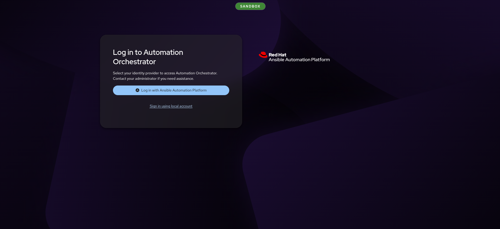
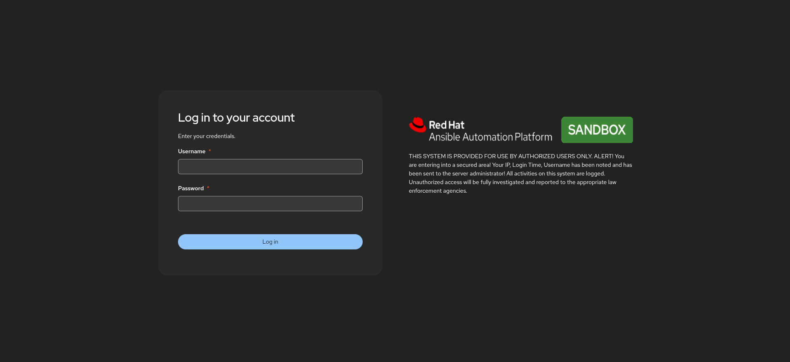
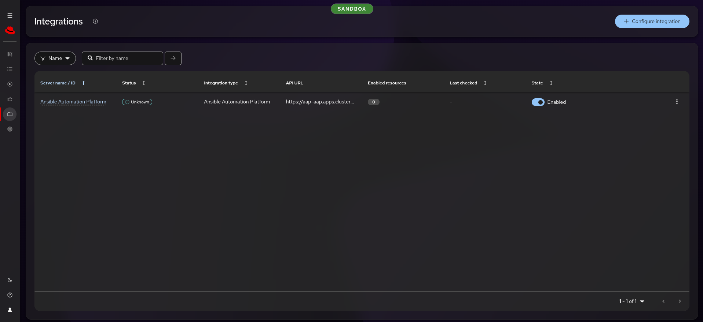
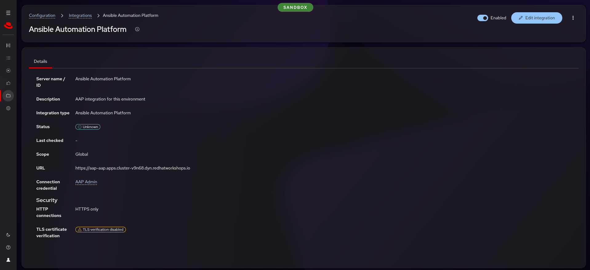
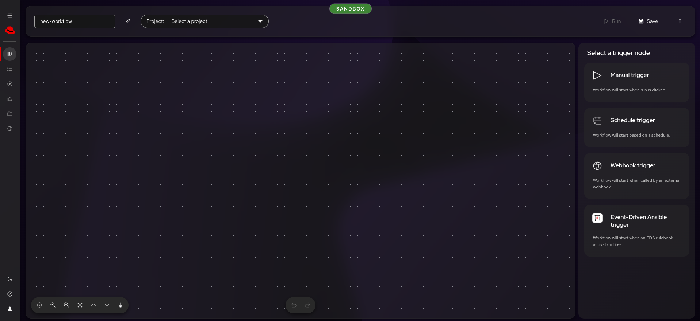

# Run sheet — Automation Orchestrator

**This is the page you hold while presenting.** The narrative behind each beat,
with the actual words, is in [`talk-track.md`](talk-track.md) — rehearse from
that, present from this.

| | |
|---|---|
| **Length** | 20 minutes (15 + 5 for questions) |
| **Audience** | Platform engineers and automation leads |
| **Needs an environment?** | **Yes** — the compelling beats are live workflow builds on the canvas |
| **Assets** | AO login page, AAP sign-in page, AO canvas, AO execution view |

---

## Before you start (5 minutes, offline)

1. Open these in tabs:
   1. AO: `https://ao-automation-orchestrator.apps.<cluster>.dyn.redhatworkshops.io/`
   2. AAP: `https://aap-aap.apps.<cluster>.dyn.redhatworkshops.io/`
   3. This run sheet
2. Verify AO is reachable — the login page should render.
3. Verify the integration sees templates: from a Claude Code session with
   `ao-sandbox`, call `proxies_aap_job_templates` — expect 33 templates.
4. Decide whether to run the **Windows Day 2** story (needs a running Windows
   VM) or the **Linux Day 1** fallback. Check the VMs:
   `openshift-sandbox` → `resources_list` (VirtualMachineInstance).
5. Decide your close before you begin — see **Landing it** at the bottom.

---

## The arc

| Time | Beat | On screen |
|---|---|---|
| 0–2 | Login through AAP SSO | AO login → AAP sign-in → AO dashboard |
| 2–4 | Show the integration | AO Integrations page, template list |
| 4–10 | Build the workflow on the canvas | AO workflow builder |
| 10–14 | Run the workflow | AO execution view, approval gate |
| 14–17 | The honest bits | (conversation, no screen) |
| 17–20 | Close | AO dashboard |

---

## 0–2 · Login through AAP SSO

**Show the AO login page.** Point at "Log in with Ansible Automation Platform".

Click it. The redirect lands on the AAP sign-in page — point at the
environment badge.

Log in with the AAP admin credentials. Land in AO.

> **"Same credentials. One identity store. Automation Orchestrator delegates
> authentication to the AAP gateway — no separate user database."**

---

## 2–4 · Show the integration

Navigate to **Configuration → Integrations**. One row: Ansible Automation
Platform, Enabled.

Click the AAP integration. Point at three things:

- Status: enabled
- Base URL: the AAP gateway hostname
- Connection credential: AAP Admin

> **"These are your existing job templates. Nothing was migrated, nothing was
> copied. AO sees them through the integration and can use them as workflow
> steps."**

---

## 4–10 · Build the workflow on the canvas

Click **Create Workflow**. The canvas opens with trigger options on the right.

Pick **Manual trigger**, then name it.

### Preferred story: Windows Day 2 compliance (if VMs are running)

Build on the canvas, narrating each step:

1. Add an AAP node: **Windows Day 2 - Compliance Scan**
2. Add a conditional node — connect from the scan result
3. On the failure path: add an **approval node** — name it
   "Security lead approves remediation"
4. After approval: add **Windows Day 2 - Fix Compliance**
5. After fix: add **Windows Day 2 - Compliance Scan** again
6. Save the workflow

> **"Three things you cannot express in an AAP workflow: a conditional branch,
> a human gate, and both in the same sequence. That is what you are looking at."**

### Fallback story: Linux Day 1 (if no Windows VM)

1. Add: **Linux Day 1 - 1 Provision**
2. Connect: **Linux Day 1 - 2 Register**
3. Add an **approval node** — "Ops team approves configuration"
4. Connect: **Linux Day 1 - 3 Configure**
5. Connect: **Linux Day 1 - 4 Compliance Scan**
6. Save the workflow

> **"Provision and register happen automatically. Configuration waits for a
> person. The scan proves it worked. That is one workflow, not four tickets."**

---

## 10–14 · Run the workflow

Click **Run**. Point at each node as it progresses:

- The AAP job nodes dispatch to the controller — show the status updating
- The approval node **waits** — nothing proceeds until a person acts

> **"This is blocking. The job will not proceed until someone with the right
> permissions approves it. That is not a notification — it is a gate."**

Approve it. Show the audit entry: who approved, when.

After approval, the remaining nodes execute. Point at the final scan result.

---

## 14–17 · The honest bits

No screen needed. Step away from the keyboard for this beat.

Two points, volunteered:

1. **The redhat.com interactive demo shows EDA triggers and LLM analysis** —
   those are not wired up here. This demo shows the canvas and the gate, which
   are the parts that are GA and running.
2. **The MCP server is read-only** — it queries AO, it does not create or run
   workflows. The governance model for AI-initiated workflows is a separate
   conversation.

> **"I show you the gaps because every one of them has an issue number. The
> things I showed you working are the things that are working."**

---

## 17–20 · Landing it

> **"Your templates, your credentials, your RBAC. The orchestration adds
> conditional branches and human gates — the two things that turn a chain of
> jobs into a governed process."**

Then ONE question. Pick based on what they asked during the demo:

- If they asked about compliance: *"Which of your remediation sequences needs
  a gate that is not a Slack message?"*
- If they asked about multi-team handoffs: *"Where does work stop today
  because someone has to approve something and there is no governed way to do
  it?"*
- If they asked about the canvas: *"What is the first workflow you would build
  on this?"*

---

## Running it live

Every beat in this run sheet is already live — there is no offline version of
this demo. The canvas build is the demo.

| Beat | What to verify first |
|---|---|
| Login | AO login page loads; "Log in with Ansible Automation Platform" button is present |
| Integration | `proxies_aap_job_templates` returns 33 templates |
| Canvas | The templates you plan to use are in the list |
| Execution | For Windows Day 2: a Windows VM is running. For Linux Day 1: sufficient cluster capacity |

**Budget for job execution time.** TODO — measure wall-clock per job during
rehearsal. Provision and register are the long poles; compliance scan is fast.

**Keep a fallback.** If AO stalls during the live build, describe the workflow
verbally and show the integration page as evidence. Do not debug in front of
the customer.

### Recovery moves

| Symptom | Move |
|---|---|
| AO login page returns 502 | The Route or backend pod is down. Describe the demo verbally and show AAP directly |
| OIDC redirect fails | Click "Sign in using local account" — use `admin` / the AAP admin password. Unlikely since `APP_OIDC_ALLOW_PRIVATE_NETWORKS` was set (#492) |
| Integration shows 0 templates | Re-run `AAP Ecosystem - Configure Automation Orchestrator` from AAP, wait 60 seconds |
| Approval node does not appear in node types | Confirm you are logged in as an authenticated user (not a service account) |
| Workflow fails to save | Check the validation message — duplicate node names or unconnected edges are the common causes |
| AO unreachable (503 or timeout) | Re-run `AAP Ecosystem - Deploy Automation Orchestrator` from AAP — it converges |
| AAP job fails inside the workflow | Open the job in AAP to see the error. The most common cause is a missing VM — provision first |

---

## Screenshots still worth capturing

- [x] AO login page with "Log in with Ansible Automation Platform" button
- [x] AAP sign-in page showing the OIDC redirect (environment badge visible)
- [x] AO Integrations page showing AAP connected with template count
- [ ] AO canvas with a completed workflow — all nodes connected (needs live rehearsal)
- [ ] AO execution view mid-run, approval node waiting
- [ ] AO execution view after approval, showing the audit trail
- [ ] AO execution view at completion, all nodes succeeded
