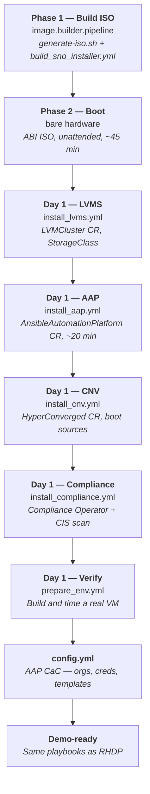

# Architecture — Edge / Single Node OpenShift

Reference for the presenter. What the kit builds, how the pieces connect, and
how long each part takes.

For **why** it is built this way — the storage race condition, the partition
fix, the CIS approach — read
[`image.builder.pipeline/docs/design.md` section 11](https://github.com/ericcames/image.builder.pipeline/blob/main/docs/design.md#11-sno-installer-kit--agent-based-installer-iso).

---

## The flow



LVMS must come before AAP because the AAP operator needs PVCs for its database
and Hub file storage. AAP must come before CNV because `config.yml` configures
both, and it needs the AAP gateway to be reachable. **`config.yml` is a separate
step, not part of the install sequence** — it needs the admin password, which
only exists after AAP deploys and the user updates the vault. That ordering
constraint is why [sales.demos#406](https://github.com/ericcames/sales.demos/issues/406)
proposes `setup_edge.yml` as the first five stages only.

---

## Inputs

| Question | Flag / Variable | Example |
|---|---|---|
| Node IP (CIDR) | `--ip` | `192.168.1.100/24` |
| Gateway | `--gateway` | `192.168.1.1` |
| DNS server | `--dns` | `192.168.1.1` |
| MAC address | `--mac` | `1c:69:7a:0d:50:30` |
| NIC name | `--interface` | `eno1` |
| Disk device | `--disk` | `/dev/sda` |
| Hostname | `--hostname` | `nuc01` |
| Cluster name | `--cluster-name` | `edge` |
| Base domain | `--base-domain` | `internal.ames.net` |
| Pull secret | `--pull-secret` | `~/pull-secret.json` |
| SSH public key | `--ssh-key` | `~/.ssh/id_ed25519.pub` |

All hardware-specific values are required. The script validates them before
touching anything.

**Deliberately absent from the interface:** OCP version. The kit tracks the
latest stable channel by default, which is what a demo environment should run.
Override with `--ocp-version` only when pinning to a specific z-stream matters.

---

## What gets created

### Day 0 — baked into the ISO

| Resource | Purpose |
|---|---|
| `install-config.yaml` | SNO topology: 1 control plane, 0 workers |
| `agent-config.yaml` | NIC, disk, static IP, hostname |
| `98-lvms-partition.yaml` | MachineConfig: partition 5 for LVMS, pinning root at 200 GB |
| AAP operator Subscription | `stable-2.7` channel |
| CNV operator Subscription | `stable` channel |
| LVMS operator Subscription | `stable-4.22` channel |
| Compliance Operator Subscription | `stable` channel |

### Day 1 — applied by the install playbooks

| Resource | Playbook | Purpose |
|---|---|---|
| `LVMCluster` CR | `install_lvms.yml` | Thin-provisioned VolumeGroup from partition 5, StorageClass `lvms-vg1` |
| `AnsibleAutomationPlatform` CR | `install_aap.yml` | Gateway, Controller, Hub, EDA, PostgreSQL |
| `HyperConverged` CR | `install_cnv.yml` | CNV with `lvms-vg1` scratch space |
| `ScanSettingBinding` | `install_compliance.yml` | CIS L1 compliance scan |
| AAP objects | `config.yml` | Orgs, credentials, projects, job templates, inventories, schedules |

---

## Storage layout

The ISO's Day 0 MachineConfig creates a partition layout that pins root and
gives LVMS the rest of the disk:

```
Partition  Start sector    End sector     Size    Name
    4         1050624      419430399    199.5 GB   root
    5       419430400      end-of-disk  (rest)     lvms
```

**Why partition 5, not sizing root directly:** RHCOS runs `ignition-ostree-growfs`
after Ignition's disk stage, which unconditionally grows root into whatever free
space follows it. A partition declared after root stops `growpart` at that
boundary. This is the documented RHCOS mechanism, not a workaround.

LVMS auto-discovers the unformatted, unmounted partition 5 — no `deviceSelector`
is needed. The label (`lvms`) avoids the reserved names that LVMS filters out.

Configurable: set `sno_root_partition_size_gb` to adjust the split. Set it to
`0` to skip the partition and let root fill the entire disk (no LVMS).

---

## Manual AAP deployment

Every field below is documented in
[Customize your AAP Operator](https://docs.redhat.com/en/documentation/red_hat_ansible_automation_platform/2.7/install-assembly_operator_customize_aap);
the shape it produces is Red Hat's
[Operator growth topology](https://docs.redhat.com/en/documentation/red_hat_ansible_automation_platform/2.7/plan-ref_ocp_a_env_a).

**Everything lands on the one node, as separate containers.** Controller web
and task, hub web/API/content/worker, EDA API and workers, the platform
gateway, metrics, PostgreSQL and Redis are each their own pod — that is the
topology, not a compromise we made to fit a NUC. It is the answer to *"surely
you need more than one box for all of that."*

The operator-managed PostgreSQL has a default `max_connections` of 100 and a
100 GB ceiling, and Red Hat's guidance is to move to an external database only
past those limits. A demo environment is nowhere near either, so nothing here
cuts a corner.

Until `install_aap.yml` ships ([#395](https://github.com/ericcames/sales.demos/issues/395)),
create the CR manually:

```bash
oc apply -f - <<'EOF'
apiVersion: aap.ansible.com/v1alpha1
kind: AnsibleAutomationPlatform
metadata:
  name: aap
  namespace: aap
spec:
  controller:
    disabled: false
  eda:
    disabled: false
  hub:
    disabled: false
    file_storage_storage_class: lvms-vg1
    file_storage_size: 50Gi
    file_storage_access_mode: ReadWriteOnce
  lightspeed:
    disabled: true
EOF
```

`file_storage_storage_class: lvms-vg1` is the SNO-specific part — LVMS is the
storage this cluster has.

Wait for all components:

```bash
oc get aap aap -n aap -w
```

Extract the admin password:

```bash
oc get secret aap-admin-password -n aap \
  -o jsonpath='{.data.password}' | base64 -d && echo
```

---

## Timing

Measured on a NUC (12 CPU, 64 GB RAM, SATA SSD), 2026-09-09:

| Phase | Time | Notes |
|---|---|---|
| ISO generation | ~2 min | Downloads `openshift-install` binary |
| Cluster install | ~45 min | Unattended; varies with hardware and network |
| LVMS install | ~2 min | Operator + LVMCluster CR |
| AAP deployment | ~20 min | All five components (gateway, controller, hub, eda, postgres) |
| CNV install | ~4 min | Operator + HyperConverged CR + rhel9 boot source import |
| Compliance Operator | ~2 min | Operator install only; scan runs in background |
| `config.yml` | ~3 min | AAP objects via CaC |
| **Total to demo-ready** | **~80 min** | ~35 min hands-on, ~45 min unattended |

---

## DNS

SNO requires two DNS records pointing at the node's IP:

| Record | Example |
|---|---|
| `api.<cluster>.<domain>` | `api.edge.internal.ames.net` |
| `*.apps.<cluster>.<domain>` | `*.apps.edge.internal.ames.net` |

On a home network, dnsmasq provides both from a single `address=` line.
See the [run sheet](run-sheet.md#phase-2-boot-and-install-45-minutes-unattended)
for the exact setup commands.

**Why static IP:** DHCP risks assigning a different IP after a reboot, breaking
the DNS records and making the cluster unreachable. Static IP is the default.

---

## Hardware minimums

**There are three different numbers here and they are not interchangeable.**
Quote the one you mean.

| Whose number | RAM | CPUs | Disk | Source |
|---|---|---|---|---|
| Red Hat single-node OpenShift minimum | 16 GB | 4 vCPU | 120 GB | [Matching edge topologies](https://developers.redhat.com/articles/2026/09/18/matching-openshift-edge-topologies-your-physical-footprint), 2026-09-18 |
| Red Hat **tested** AAP growth topology | 32 GB | **16** | 128 GB, 3000 IOPS | [Operator growth topology](https://docs.redhat.com/en/documentation/red_hat_ansible_automation_platform/2.7/plan-ref_ocp_a_env_a) |
| This kit | 32 GB | 8 | 120 GB | `sno_defaults.yml` |
| This kit, recommended | 64 GB | 12+ | 500 GB+ (200 GB root + LVMS for VM disks) | `sno_defaults.yml` |
| The NUC it was proven on | 64 GB | 12 | 953 GB SATA SSD | measured 2026-09-09 |

The first row is what OpenShift itself needs. The second is what Red Hat tests
**AAP on OpenShift** against, and it is the one a customer planning their own
deployment should size to — the metrics service alone adds roughly 3.5 Gi of
RAM request (7 Gi limit) before CNV and the demo VMs exist.

**Be straight about the gap.** The NUC runs 12 CPUs and this kit's floor is 8,
both under Red Hat's tested 16. The demo is reliable at 12 — it is not the
tested configuration, and a customer who opens the growth topology page will
work that out in about ten seconds. Say it first.

Any x86_64 hardware meeting the minimums should work — the ISO generator
parameterizes everything hardware-specific.

---

## What does not work yet

- **`install_aap.yml` is not automated** — tracked in
  [#395](https://github.com/ericcames/sales.demos/issues/395). Manual CR
  creation documented above.
- **Operator channel selection** — the Day 0 manifests hardcode channels
  (`stable-2.7`, `stable-4.22`). Tracked in
  [image.builder.pipeline#107](https://github.com/ericcames/image.builder.pipeline/issues/107)
  and [#108](https://github.com/ericcames/image.builder.pipeline/issues/108).
- **CIS L1 MachineConfigs** — the Day 0 CIS manifests are placeholders. Tracked
  in [image.builder.pipeline#110](https://github.com/ericcames/image.builder.pipeline/issues/110).

---

## Cleanup

| Destroyed by teardown | Preserved |
|---|---|
| Demo VMs and their PVCs | OpenShift Virtualization |
| AAP inventory hosts for destroyed VMs | AAP itself, all job templates |
| Terraform state for destroyed VMs | Terraform state namespace |
| | LVMS StorageClass |
| | Boot source DataSources |
| | Compliance Operator and scan results |
