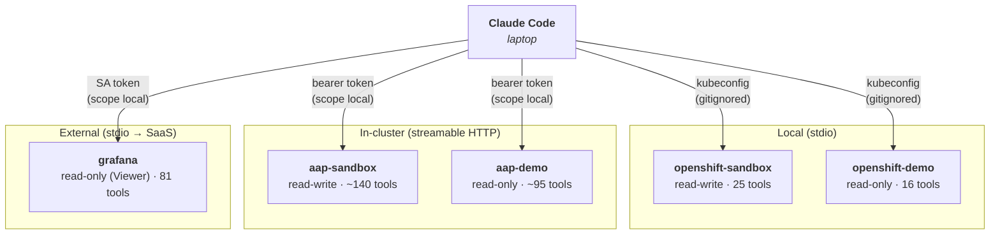

# Architecture — MCP Servers

Reference for the presenter. What exists, how it connects, and how long each
part takes to set up.

This describes the demo as it is *shown*. For **why** it is built this way —
the transport decision, the local-first rationale, the in-cluster AAP
deployment — read
[`docs/plan/platform-addons-plan.md`](../../plan/platform-addons-plan.md).

---

## The flow

**Two transports, one reason.** The OpenShift servers run locally because a
stdio server needs no hosting, survives environment churn, and works before a
cluster exists. The AAP servers run in the cluster because they are a platform
component deployed by `setup.yml`. The transport choice follows from that — not
the other way around.

**The environment is in the server's name.** `openshift-sandbox` and
`openshift-demo` are two servers, not one server with a switch. Issue #16 is
the precedent — a single server whose target changed underneath you would
reintroduce the cross-environment confusion. Picking a tool *is* picking an
environment.

---

## Server overview

Full tool listings and verification commands are in
[`server-inventory.md`](server-inventory.md). The condensed table:

| Server | Platform | Transport | Access | Tools | Auth | Source |
|---|---|---|---|---|---|---|
| `openshift-sandbox` | OpenShift | stdio (local) | read-write | 25 | kubeconfig | `.mcp.json` (committed) |
| `openshift-demo` | OpenShift | stdio (local) | read-only | 16 | kubeconfig | `.mcp.json` (committed) |
| `aap-sandbox` | AAP | streamable HTTP | read-write | ~140 | bearer token | `claude mcp add --scope local` |
| `aap-demo` | AAP | streamable HTTP | read-only | ~95 | bearer token | `claude mcp add --scope local` |
| `grafana` | Grafana Cloud | stdio (local) | read-only (Viewer) | 81 | SA token | `claude mcp add --scope local` |

Measured 2026-09-03 (OpenShift, AAP) and 2026-09-06 (Grafana) against
`kubernetes-mcp-server@0.0.66` (OpenShift), AAP 2.7 / controller 4.8.6 (AAP),
and `mcp-grafana` via `uvx` (Grafana).

---

## The read-only asymmetry

`--read-only` removes exactly nine tools from the OpenShift server. It does
**not** remove all tools that could theoretically have side effects:

| Survives read-only | Removed by read-only |
|---|---|
| `vm_guest_info` — queries the guest agent | `vm_create`, `vm_clone`, `vm_lifecycle` |
| `vm_troubleshoot` — diagnostic, not mutating | `pods_delete`, `pods_exec`, `pods_run` |
| `pods_log`, `pods_get`, `pods_top` | `resources_create_or_update`, `resources_delete`, `resources_scale` |

The classification is the upstream project's (`kubernetes-mcp-server`), not
ours. The talk track's honest-bits beat says so.

On the AAP side, read-only is controlled by the `aap_mcp_allow_write_operations`
flag on the `AnsibleMCPServer` CR. `demo` is `false`; `sandbox` is `true`.
Changing it requires deleting and recreating the CR — the flag is not idempotent
on the operator. `playbooks/mcp_server.yml` handles the detect-and-recreate
sequence.

On Grafana Cloud, read-only is in the token, not the server. The service account
has the Viewer role, so all 81 tools are exposed but write calls return `403`.
The server does not filter tools by role — unlike `--read-only` (which removes
tools) or `allow_write_operations` (which changes the tool surface).

---

## What gets created

### OpenShift MCP servers

| Resource | Purpose |
|---|---|
| `.kube/<env>.kubeconfig` | Auth for `kubernetes-mcp-server`, gitignored, mode 0600 |
| `.mcp.json` entries | Server definitions, committed — Claude Code reads these at startup |

Nothing is deployed to the cluster. The server runs as a local subprocess.

### Grafana Cloud MCP server

| Resource | Purpose |
|---|---|
| `claude mcp add --scope local` registration | Client-side config, not tracked |

Nothing is deployed anywhere. The server runs as a local subprocess via `uvx`,
connecting to Grafana Cloud over HTTPS. Credentials (URL and SA token) are
passed as environment variables, read from the vault by `make-grafana-mcp.sh`.

### AAP MCP servers

| Resource | Purpose |
|---|---|
| `AnsibleMCPServer` CR in the `aap` namespace | The in-cluster MCP server, deployed by `playbooks/mcp_server.yml` |
| `aap-mcp` Route | Ingress for the MCP server (`ingress_type: Route`, not LoadBalancer — RHDP constraint) |
| Personal access token | OAuth2 bearer token, created via the gateway API |
| `claude mcp add --scope local` registration | Client-side config, not tracked |

---

## What AAP holds

| Type | Name |
|---|---|
| Custom Resource | `AnsibleMCPServer` (`ansiblemcpservers.mcpserver.ansible.com/v1alpha1`) |
| Route | `aap-mcp` in the `aap` namespace |
| Deployment | `aap-mcp` — the pod that serves the MCP endpoint |

**The typed CRD, not `spec.mcp`.** `spec.mcp` is an unvalidated shortcut on the
AAP CR. The typed CRD gets schema validation from the operator and is the path
Red Hat documents.

---

## Credential flow

See [`server-inventory.md`](server-inventory.md#credential-flow) for the full
diagram. Summary:

- **OpenShift:** vault → `make-kubeconfig.sh` → `.kube/<env>.kubeconfig`
  (gitignored) → read by `kubernetes-mcp-server` at startup
- **AAP:** vault → `make-aap-mcp.sh` → creates OAuth token via gateway API →
  `claude mcp add --scope local` (user config, not tracked)
- **Grafana Cloud:** vault → `make-grafana-mcp.sh` → `claude mcp add --scope
  local` with env vars (user config, not tracked) → read by `mcp-grafana` at
  startup

All credentials originate from `playbooks/group_vars/all/secrets.yml`
(vault-encrypted). Nothing is committed in plaintext except the hostnames in
`connection.yml`. Grafana Cloud credentials (`grafana_cloud_url`,
`grafana_cloud_sa_token`) are top-level vault keys, not under `env_secrets`,
because the instance spans both environments.

---

## Timing

| Step | Time | Notes |
|---|---|---|
| `make-kubeconfig.sh` per environment | ~5 s | Vault decrypt + file write |
| `make-aap-mcp.sh` per environment | ~10 s | Token creation + route lookup + client registration |
| `make-grafana-mcp.sh` | ~5 s | Vault decrypt + client registration (no token creation) |
| `/sales-demos-mcp` full run (both environments) | ~2 min | Includes verification |
| `mcp_server.yml` (deploy AAP MCP to cluster) | ~3 min | Part of `/ocpvirt-setup`, not part of `/sales-demos-mcp` |
| AAP MCP pod readiness after deploy | ~60 s | Route returns 503 until the pod serves |

---

## What does not work yet

- **Network vendor MCP servers** — Cisco, Palo Alto, Aruba. Options brief at
  [`docs/plan/network-mcp-plan.md`](../../plan/network-mcp-plan.md), tracked as
  [#94](https://github.com/ericcames/sales.demos/issues/94)
- **Agentic ITSM** — no ServiceNow MCP server here. The native MCP Server
  Console needs a platform version the demo instance does not have, and the
  Ansible write path needs no MCP server at all — see
  [`servicenow.md`](servicenow.md)
- **Agentic observability — data pipeline.** Grafana Alloy is deployed on
  sandbox (#265), pushing Prometheus metrics and logs to Grafana Cloud. The
  Grafana Cloud MCP server (#260) queries those metrics and logs directly.
  Full detail in
  [`docs/plan/grafana-plan.md`](../../plan/grafana-plan.md). Dynatrace (#99)
  remains the application-level complement

---

## Cleanup

| Destroyed | Preserved |
|---|---|
| Bearer tokens (manual — see [`server-inventory.md`](server-inventory.md#aap--bearer-token)) | `.mcp.json` (committed) |
| Kubeconfigs (re-generated on next run) | `AnsibleMCPServer` CR (in-cluster, survives client-side cleanup) |
| `claude mcp add` registrations (local only) | Server definitions and access posture |
| Grafana SA token (revoke in Grafana UI) | Grafana Cloud instance and service account |
