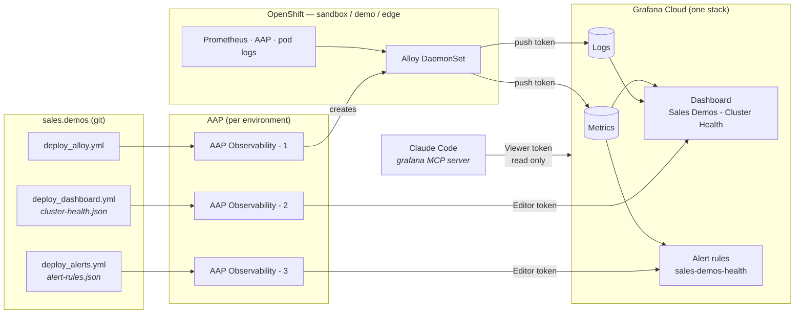

# Architecture — Grafana Cloud

Reference for the presenter. What exists, what builds what, which credential can
do what, and what changes when the trial ends.

For **why** it is built this way, read the design plan:
[`plan/grafana-plan.md`](../../../plan/grafana-plan.md). For each playbook in
detail, [`playbooks.md`](playbooks.md).

---

## The flow

**The non-obvious parts:**

- **Only step 1 touches a cluster.** Steps 2 and 3 run on `localhost` and talk
  to Grafana's HTTP API. That is why they have no `--limit`, and why running
  them from either controller changes the same Grafana.
- **One dashboard and one rule group serve every cluster.** Alloy stamps a
  `cluster` label on every series and log line; the dashboard has a Cluster
  picker and each alert fires per cluster.
- **Grafana Cloud outlives the clusters.** It was chosen over a self-hosted
  Grafana because it survives an RHDP environment being rebuilt. When the trial
  ends the account moves to the Free plan and keeps running; the demo fits.

---

## Three credentials, three roles

| Token | Held by | Grafana permission | Can | Cannot |
|---|---|---|---|---|
| **Push** — Cloud Access Policy | Alloy, in a cluster Secret | `metrics:write`, `logs:write` | Send data | Read anything, change dashboards |
| **Editor** — service account | AAP jobs and the laptop, via the vault | Editor role | Create and replace dashboards, folders, alert rules | Push data |
| **Viewer** — service account | Claude's MCP server, local config only | Viewer role | Read dashboards, query metrics and logs, render panels | Change anything — proven with a 403 |

Each one is the smallest permission that does its job, and a leak of any one
is limited to that job. **MCP reads, Ansible writes** is enforced by Grafana,
not by convention.

---

## Inputs

| Variable | Where | Default | Meaning |
|---|---|---|---|
| `target_env` | `deploy_alloy.yml` extra var | the AAP environment | Which cluster to instrument |
| `alloy_state` | `deploy_alloy.yml` | `present` | `absent` removes Alloy and its cluster-scoped RBAC |
| `alerts_state` | `deploy_alerts.yml` | `present` | `absent` deletes the rule group |
| `grafana_cloud_*` | vault, top-level keys | — | Eight keys; listed in [`playbooks.md`](playbooks.md#the-credentials) |

**Deliberately absent:** there is no variable for *which dashboard* or *which
rules*. They are the committed JSON files. Changing them is a pull request,
which is the point.

---

## What gets created

| Where | Resource | Created by |
|---|---|---|
| Each cluster | Namespace `grafana-alloy`, ServiceAccount `alloy`, DaemonSet `alloy`, ConfigMap `alloy-config`, Secrets `alloy-grafana-cloud` and `alloy-aap-auth` | `deploy_alloy.yml` |
| Each cluster | ClusterRole and ClusterRoleBinding `alloy-discovery`, ClusterRoleBinding `alloy-cluster-monitoring-view` | `deploy_alloy.yml` |
| Grafana Cloud | Folder **Sales Demos** (uid `sales-demos`) | `deploy_dashboard.yml` or `deploy_alerts.yml` |
| Grafana Cloud | Dashboard **Sales Demos - Cluster Health** (uid `sales-demos-cluster-health`) | `deploy_dashboard.yml` |
| Grafana Cloud | Rule group **sales-demos-health**, five rules | `deploy_alerts.yml` |
| Laptop | Local MCP server registration `grafana` | `make-grafana-mcp.sh` |

---

## What AAP holds

| Type | Name |
|---|---|
| Job template | `AAP Observability - 1 Deploy Alloy` |
| Job template | `AAP Observability - 2 Deploy Dashboards` |
| Job template | `AAP Observability - 3 Deploy Alerts` |
| Credential | `Sales Demos - Env Secrets` — carries the Grafana keys as extra vars |
| Credential | `Sales Demos - Vault` |
| Label | `observability` — filter the template list by it |

---

## Timing

Measured on sandbox, 2026-09-15.

| Step | Time |
|---|---|
| `AAP Observability - 1 Deploy Alloy` | about 2 minutes, then data appears within a minute |
| `AAP Observability - 2 Deploy Dashboards` | under 30 seconds |
| `AAP Observability - 3 Deploy Alerts` | **6.4 seconds** (AAP job 143) |
| A stopped VM disappearing from Grafana | **about 5 minutes** — Prometheus keeps a vanished series for its 5-minute lookback |
| "Running VM count dropped" firing after that | 1–2 minutes — one evaluation to go pending, a 1-minute wait to fire |

**The five-minute gap is the one to rehearse around.** Stop a VM on stage and
the dashboard will still show it running for several minutes. That is
Prometheus behaving correctly, not the demo failing — but it looks like failure
if you have not said it first.

---

## Data volume

| Signal | Per cluster | Stack total | Free-tier limit |
|---|---|---|---|
| Metric series | ~1,100 (edge) to ~1,930 (sandbox) | ~2,300 active | 10,000 |
| Logs | ~42 MB a day | 4.8 GB in the first half of the month | 50 GB a month |
| Traces | none | 0 | 50 GB |

Detail and reduction options: [`usage-and-cost.md`](usage-and-cost.md).

---

## What does not work yet

- **No traces.** Nothing in the platform emits OpenTelemetry traces, so the
  Tempo data source and its tools sit empty.
- **"Nodes Ready" shows the wrong total on single-node clusters** — "1 of 3" on
  a one-node box. The count query matches every `Ready` condition value, not
  every node.
- **Network Throughput plots transmit as negative** so receive and transmit
  share one axis. Correct, but unexplained on the panel.
- **No notifications.** Alerts fire in Grafana; nothing is emailed or posted,
  on purpose, because a receiver would put an address in a public repo.

---

## What the free plan changes

| Lost when the trial ends | Kept |
|---|---|
| Metric and log history | `deploy_alloy.yml` — the whole collection pipeline |
| The three tokens | `cluster-health.json` — the dashboard |
| The dashboard as rendered, with live data | `alert-rules.json` — the alerts |
| Alert state history | `make-grafana-mcp.sh` and the skills |
| | These docs, the screenshots and the captured MCP answers |

Rebuilding on a new free account is [`rebuild.md`](rebuild.md). Nothing in the
repository has to change except the vault values.

---

## Cleanup

| Removed | Kept |
|---|---|
| Alloy on a cluster: `deploy_alloy.yml -e alloy_state=absent` | The dashboard and rules (they are not per cluster) |
| Alert rules: `deploy_alerts.yml -e alerts_state=absent` | The folder and dashboard |
| The MCP registration: `claude mcp remove grafana` | The vault keys, until you replace them |
| Tokens: delete them in the Grafana UI — nothing automates this | |
