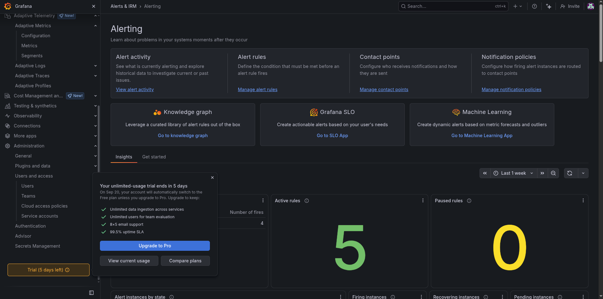
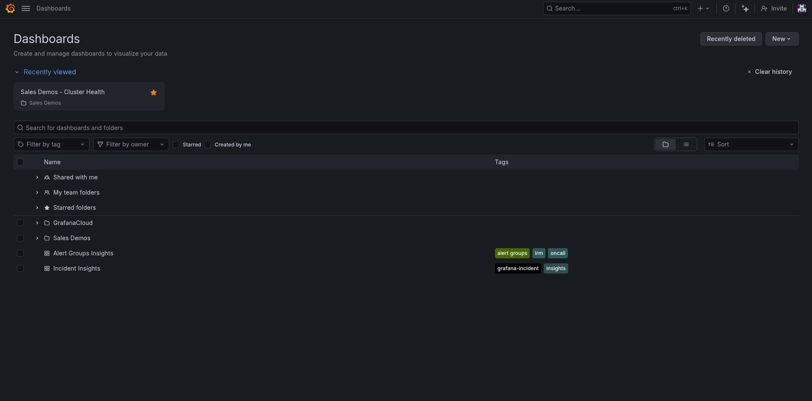
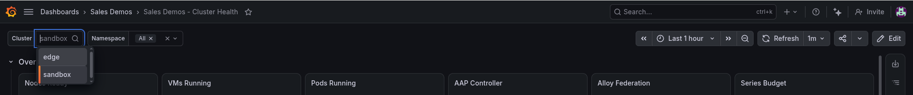
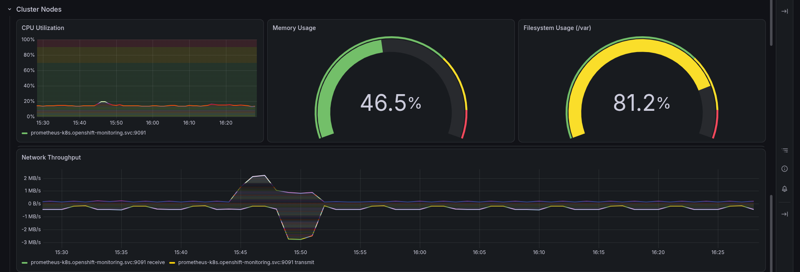
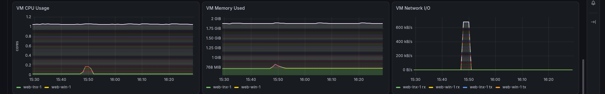
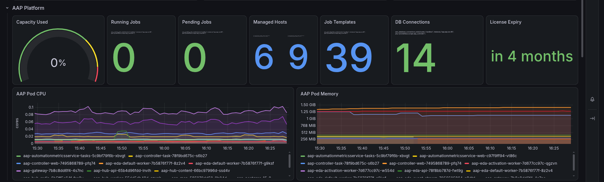
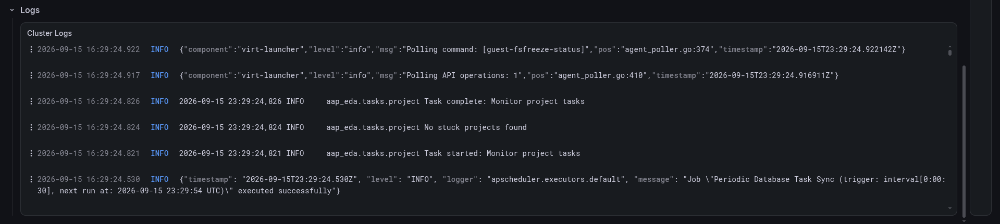
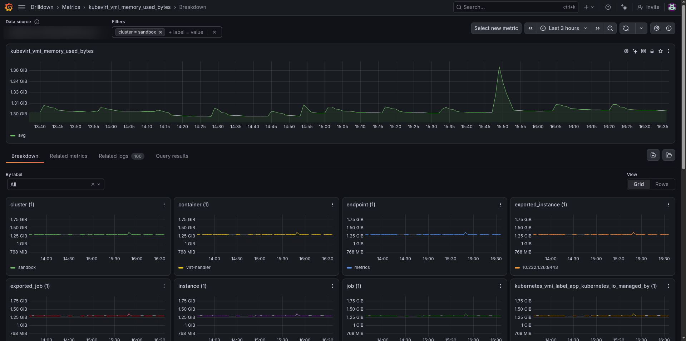
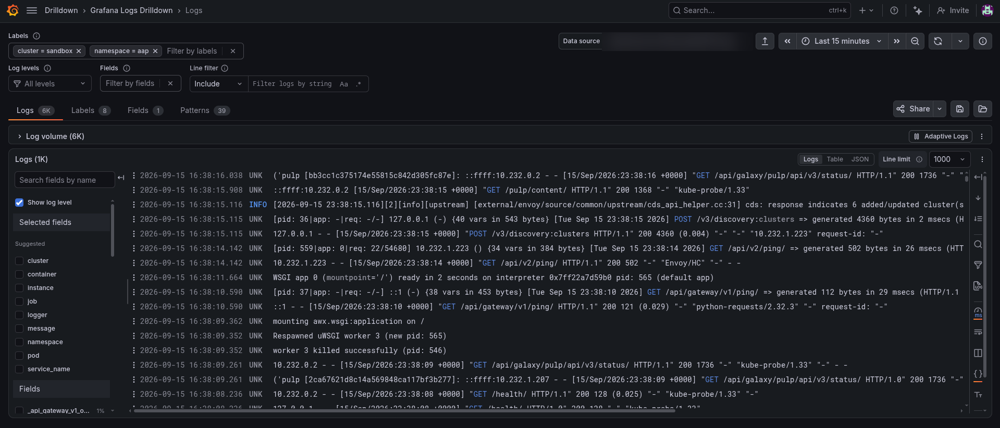

# Grafana 101 — a beginner's tour

**For someone who has never opened Grafana.** Read this before presenting the
demo, and you will know what is on each screen, what "good" looks like, and
which words to use.

All screenshots are from the sandbox cluster in September 2026, cropped to
remove the account's address.

---

## What Grafana is, in two sentences

Grafana is a **window**, not a database. It connects to places that store
telemetry — **data sources** — and draws what it finds as dashboards, graphs,
tables and alerts.

**Grafana Cloud** is Grafana Labs running that window *and* the storage behind
it for you. When you sign up you get a **stack**: a Grafana, plus a metrics
store, a log store and a trace store, already wired together.

---

## The three kinds of data

| | **Metrics** | **Logs** | **Traces** |
|---|---|---|---|
| **What** | Numbers, sampled on a schedule | Lines of text, as the software wrote them | The timed path of one request through many services |
| **Answers** | *How much? How fast? Is it getting worse?* | *What exactly happened?* | *Where did the time go?* |
| **Example here** | CPU at 47%, 2 VMs running, 0 jobs pending | an AAP task pod's output | *(none — see below)* |
| **Stored in** | Prometheus-compatible store (Mimir) | Loki | Tempo |
| **Query language** | **PromQL** | **LogQL** | **TraceQL** |
| **In this demo** | Yes | Yes | **No** |

A phrase worth borrowing in front of customers: **metrics tell you something is
wrong, logs tell you what, traces tell you where.**

### Why there are no traces

A trace only exists if the application *emits* one, span by span, usually
through OpenTelemetry. OpenShift, OpenShift Virtualization and AAP as deployed
here do not, so there is nothing to collect. The trace data source is still
there — every Grafana Cloud stack has one — and it is empty.

If a customer asks: tracing belongs to **their applications**. The platform
demo shows the infrastructure; tracing would be the next conversation, with
their developers in the room.

---

## A tour of the screen

### 1. Home and the menu

The menu on the left is the whole product. You need four entries:

| Menu item | What you use it for |
|---|---|
| **Dashboards** | Find and open saved dashboards |
| **Explore** | Ask one-off questions of metrics or logs, without building a dashboard |
| **Alerting › Alert rules** | See every rule and whether it is firing |
| **Administration** | Service accounts and tokens (you only need this to rebuild) |

### 2. Finding our dashboard

**Dashboards › Sales Demos › Sales Demos - Cluster Health.**

Everything else in the list — *Usage Insights*, *Cardinality management*,
*Billing/Usage* — came with the account. Only the **Sales Demos** folder was
made by our automation.

### 3. The top bar: cluster, namespace, time

| Control | What it does |
|---|---|
| **Cluster** | Which environment every panel shows: `sandbox`, `edge`, `demo`. **Change this first** — a wrong cluster is the usual cause of "No data" |
| **Namespace** | Filters the VM and log panels. `All` is fine |
| **Time range** (clock icon) | How far back to look. *Last 1 hour* is the default; *Last 24 hours* shows a day's pattern |
| **Refresh** | How often the page re-queries. `1m` is set |

### 4. The Overview row

Six **stat panels** — one big number each. This row is the pre-demo health
check: glance at it before anyone is watching.

| Panel | Good | Worry |
|---|---|---|
| Nodes Ready | Ready equals the node count | Ready is lower |
| VMs Running | the number of VMs you built | fewer than expected |
| Pods Running | a steady number (~57 on sandbox) | a sudden drop |
| AAP Controller | **UP** in green | **DOWN** |
| Alloy Federation | **UP** in green | **DOWN** — nothing below is current |
| Series Budget | well under 10K | approaching 8K |

!!! warning "A known quirk"
    On a single-node cluster **Nodes Ready** shows *Total 3*. The query counts
    condition values rather than nodes. One node is correct; the 3 is not.

### 5. Cluster Nodes

- **CPU Utilization** — a **time series**: time runs left to right. Short spikes
  are normal; a line that stays high is not. The coloured bands are thresholds:
  green under 60%, yellow, then red above 80%.
- **Memory Usage** and **Filesystem Usage** — **gauges**: one value, with the
  same green-yellow-red idea. Sandbox's `/var` sat at 79%, in the yellow.
- **Network Throughput** — traffic **in above the zero line, out below it**.
  The negative numbers are not an error; it is a way of drawing both on one axis.

### 6. KubeVirt Virtual Machines

The **VM Status** table lists each running VM with its guest OS, size and
node. **A stopped VM disappears from this table** rather than showing
"Stopped" — and it takes about five minutes to disappear (see *Alerts* below
for why).

The three graphs beside it show each VM's CPU, memory and network, one line per
VM. Hover over a line to see its name.

### 7. AAP Platform

AAP's own metrics: **Capacity Used** (how full the execution capacity is),
**Running** and **Pending** jobs, **Managed Hosts**, **Job Templates**, and
**License Expiry**. During a job launch, *Running Jobs* ticks up and the AAP pod
CPU graph moves.

A pending count that stays above zero means jobs are waiting for capacity — and
there is an alert for exactly that.

### 8. Logs

Live pod log lines from the four collected namespaces, newest first. Use the
**Namespace** picker to narrow it. Click a line to see its labels: `cluster`,
`namespace`, `pod`, `container`.

---

## Explore: asking your own question

**Explore** is where you go when no panel answers the question.

### Metrics

1. **Explore**, choose the data source ending in **-prom**
2. Switch the editor to **Code**
3. Type a query, press **Run query** (or Shift+Enter)

Queries worth trying:

| Question | PromQL |
|---|---|
| Memory each VM is using | `kubevirt_vmi_memory_used_bytes{cluster="sandbox"}` |
| Pending AAP jobs, per cluster | `awx_pending_jobs_total` |
| Series each cluster sends | `count by (cluster) ({__name__!=""})` |

**Reading PromQL:** a metric name, then `{label="value"}` filters in braces.
`count by (cluster) (...)` means "count them, one answer per cluster".

### Logs

Choose the data source ending in **-logs**, then:

| Question | LogQL |
|---|---|
| Everything from AAP on sandbox | `{cluster="sandbox", namespace="aap"}` |
| Only lines mentioning errors | `{cluster="sandbox", namespace="aap"} \|= "error"` |
| Log volume per namespace | `sum by (namespace) (bytes_over_time({cluster="sandbox"}[1h]))` |

**Reading LogQL:** the braces pick *which streams*; `|= "text"` then keeps only
lines containing that text.

---

## Alerts

**Alerting › Alert rules**, folder *Sales Demos*. Five rules, each shown with a
state:

| State | Means |
|---|---|
| **Normal** | the condition is false |
| **Pending** | the condition just became true; Grafana is waiting out the rule's delay to make sure it is not a blip |
| **Firing** | it stayed true for the whole delay |
| **Recovering / Normal** | the condition cleared |

Rehearsed on sandbox on 2026-09-15: a VM was stopped at 18:01:50. The dashboard
still showed it running until about 18:07. The rule went **pending** at 18:07:30
and **firing** a minute later.

**Why five minutes?** When a series stops arriving, Prometheus keeps answering
with its last value for up to five minutes, in case it was only one missed
sample. That is correct behaviour and it looks like the demo is broken. **Say
it before you stop a VM on stage.**

---

## Words you will hear

| Word | Meaning |
|---|---|
| **Stack** | Your Grafana Cloud instance: a Grafana plus its metrics, logs and traces stores |
| **Data source** | A connection from Grafana to somewhere data lives |
| **Dashboard / panel** | A page / one chart or table on it |
| **Variable** | A dropdown at the top of a dashboard that changes every panel's query — *Cluster* here |
| **Series** | One metric with one set of labels. The unit of metrics billing |
| **Label** | A `name="value"` tag on a series or log stream; how you filter |
| **Cardinality** | How many series a metric or label produces. High cardinality is expensive |
| **PromQL / LogQL / TraceQL** | The query languages for metrics / logs / traces |
| **Alloy** | Grafana's collector; the agent on each cluster that sends data in |
| **Federation** | Copying selected series from one Prometheus to another — how Alloy gets OpenShift's metrics |
| **Service account** | A non-human Grafana user that tokens belong to |
| **Access policy** | A grafana.com permission set for sending data in, separate from service accounts |
| **Adaptive Metrics / Logs** | Grafana Cloud features that recommend dropping data nobody queries |
| **MCP** | Model Context Protocol — how Claude calls Grafana's API as tools |
