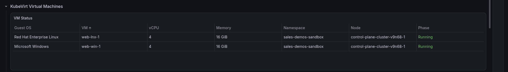

# MCP server — Grafana Cloud

What Claude could do with Grafana, how it was wired, and why it could not
change anything. Every answer quoted here was captured from the live instance
on 2026-09-15, before the instance expires on 2026-09-20.

For every other MCP server in this repo — OpenShift, AAP, Automation
Orchestrator, the portal — see
[`../../mcp-servers/server-inventory.md`](../../mcp-servers/server-inventory.md).

---

## At a glance

| | |
|---|---|
| **Server** | [`grafana/mcp-grafana`](https://github.com/grafana/mcp-grafana), Grafana Labs, Apache-2.0 |
| **Runs as** | `uvx mcp-grafana` — a local stdio process, started by Claude Code |
| **Registered by** | [`utilities/make-grafana-mcp.sh`](https://github.com/ericcames/sales.demos/blob/main/utilities/make-grafana-mcp.sh), with `claude mcp add --scope local` |
| **Name in Claude** | `grafana` — one server, no environment suffix |
| **Identity** | a Grafana service account with the **Viewer** role |
| **Tools exposed** | 81 |
| **Can it write?** | **No.** Write tools are listed; Grafana refuses them |

---

## Why it is wired this way

**One server, not one per environment.** The OpenShift and AAP servers are
`openshift-sandbox`, `aap-demo` and so on, because the environment belongs in
the name — picking the tool is picking the target. Grafana Cloud is *one*
external service that every environment reports into, so there is nothing to
pick. The `cluster` label inside the data does that job instead.

**`--scope local`, not the committed `.mcp.json`.** The OpenShift servers
authenticate from a kubeconfig generated out of the vault, so the committed file
can name a path and hold nothing secret. A Grafana service account token has no
such derivation step — it is the credential itself — and the stack URL
identifies the account. Both stay in the vault and in each person's local
Claude config, never in git.

**Viewer, on purpose.** The governance line for the whole demo is *Ansible
writes, AI reads*. The playbooks that change dashboards and alerts hold a
separate **Editor** token. The token the AI holds cannot do that, and the
proof is below.

---

## The read-only design, proven

The server exposes write tools like `create_annotation` and `update_dashboard`.
Asking it to use one:

```text
create_annotation  dashboardUid=sales-demos-cluster-health
  text="Denied-write proof — the Viewer MCP token should not be able to create this."

→ create annotation: [POST /annotations][403] postAnnotationForbidden
  {"message":"You'll need additional permissions to perform this action.
   Permissions needed: annotations:create"}
```

**The guard is in Grafana, not in the client.** Nothing in Claude's config lists
which tools are allowed. A new write tool added to the server tomorrow is
refused the same way, because the refusal comes from the token's role on the
Grafana side. That is the same principle as `openshift-demo` running
`--read-only` and `aap-demo` having writes disabled server-side.

---

## Real questions, real answers

Captured against sandbox. Each shows the question as asked, the tool Claude
chose, and a trimmed answer.

### "Which clusters are sending data?"

`query_prometheus` — `count by (cluster) (up)`

| Cluster | Targets up |
|---|---|
| sandbox | 2 |
| edge | 2 |

*Two targets per cluster: the Prometheus federation and the AAP metrics scrape.
`demo` is absent because that environment had expired.*

### "What VMs are running, and how big are they?"

`query_prometheus` — `kubevirt_vmi_info`, `kubevirt_vmi_vcpu_count`,
`kubevirt_vmi_memory_domain_bytes`

| VM | Guest OS | vCPU | Memory | Phase |
|---|---|---|---|---|
| web-lnx-1 | Red Hat Enterprise Linux 9.8 | 4 | 16 GiB | running |
| web-win-1 | Microsoft Windows Server 2022 | 4 | 16 GiB | running |

### "How close are we to the free-tier limit?"

`query_prometheus` on `grafanacloud-usage` — `grafanacloud_instance_active_series`

> 2,310 active series against 10,000 — about 23%.

### "Where are our logs coming from?"

`query_loki_logs` — `sum by (namespace) (bytes_over_time({cluster="sandbox"}[24h]))`

> `aap` 25.5 MB · `openshift-cnv` 15.5 MB · `sales-demos-sandbox` 1.2 MB ·
> `grafana-alloy` 0.08 MB

### "Do we have any traces?"

`tempo_traceql-search` — `{}` over the previous seven days

> No traces. *The data source exists on every Grafana Cloud stack; nothing in
> this platform sends to it.*

### "Which alerts do we have, and is anything firing?"

`alerting_manage_rules` — `operation: list`, folder `sales-demos`

> Five rules in group `sales-demos-health`, all `normal`, health `ok`.

### "Show me the VM table."

`get_panel_image` — dashboard `sales-demos-cluster-health`, panel 14,
`var-cluster=sandbox`



*Grafana Cloud includes the image renderer, so the agent can hand back a picture
of a panel, not only the numbers. Several screenshots in these docs were
produced this way.*

### "Who am I connected as?"

`user_info`

> login `sa-1-claude-code-mcp`, not a Grafana admin, organization 1.

---

## The 81 tools, grouped

**R** reads. **W** is a write the Viewer token is refused. **—** is a Grafana
feature this demo does not use, so the tool returns nothing useful here.

### Used in this demo

| Area | Tools | Access |
|---|---|---|
| **Metrics** (Prometheus) | `query_prometheus`, `query_prometheus_histogram`, `list_prometheus_metric_names`, `list_prometheus_label_names`, `list_prometheus_label_values`, `list_prometheus_metric_metadata` | R |
| **Logs** (Loki) | `query_loki_logs`, `query_loki_stats`, `query_loki_patterns`, `list_loki_label_names`, `list_loki_label_values`, `analyze_loki_labels` | R |
| **Dashboards** | `search_dashboards`, `get_dashboard_summary`, `get_dashboard_by_uid`, `get_dashboard_property`, `get_dashboard_panel_queries`, `list_dashboard_versions`, `search_folders` | R |
| **Alerting** | `alerting_manage_rules` (list, get, versions), `alerting_manage_routing` (read) | R |
| **Rendering and links** | `get_panel_image`, `generate_deeplink` | R |
| **Data sources** | `list_datasources`, `get_datasource`, `check_datasources_health` | R |
| **Identity and docs** | `user_info`, `search_docs`, `get_doc`, `get_plugin`, `search_plugin_information` | R |
| **Annotations** | `get_annotations`, `get_annotation_tags` | R |

### Exposed, refused

| Area | Tools |
|---|---|
| Dashboards and folders | `update_dashboard`, `create_folder` |
| Alerting | `alerting_manage_rules` (create, update, delete), `alerting_manage_silences` |
| Annotations | `create_annotation`, `update_annotation`, `delete_annotation` |
| Snapshots | `create_snapshot`, `delete_snapshot` |
| Data sources and plugins | `create_datasource`, `update_datasource`, `install_plugin` |
| Incidents and OnCall | `create_incident`, `update_incident`, `add_activity_to_incident`, `update_alert_group` |
| Anything | `grafana_api_request` — reads work; writes get the same 403 |

### Not used here

| Area | Tools | Why not |
|---|---|---|
| **Traces** (Tempo) | `tempo_traceql-search`, `tempo_get-trace`, `tempo_trace-diff`, `tempo_traceql-metrics-instant`, `tempo_traceql-metrics-range`, `tempo_get-attribute-names`, `tempo_get-attribute-values`, `tempo_docs-traceql`, `tempo_docs-config` | No traces are sent |
| **Profiles** (Pyroscope) | `query_pyroscope`, `list_pyroscope_profile_types`, `list_pyroscope_label_names`, `list_pyroscope_label_values` | No profiles are sent |
| **Incident, OnCall, Sift, Asserts** | `list_incidents`, `get_incident`, `list_oncall_schedules`, `get_current_oncall_users`, `list_sift_investigations`, `find_error_pattern_logs`, `find_slow_requests`, `get_assertions`, and their siblings | Grafana's incident-response and AI-investigation products, not set up |
| **Snapshots, provisioning** | `list_snapshots`, `get_snapshot`, `list_provisioning_repositories`, `validate_provisioning_file` | Dashboards come from Ansible, not Grafana's git sync |
| **Config helpers** | `suggest_loki_alloy_label_config` | Alloy config is in the playbook |

---

## How it pairs with the other servers

The Grafana server answers **"what has been happening?"** The others answer
**"what is it now, and change it"**:

| Question | Server |
|---|---|
| Has CPU on sandbox been climbing all afternoon? | `grafana` |
| Which pod is using it right now? | `openshift-sandbox` |
| Did an AAP job start around then? | `aap-sandbox` |
| Re-run the job | `aap-sandbox` (write-enabled on sandbox) |
| Did the error rate come back down? | `grafana` |

That chain — history from Grafana, present state from OpenShift, action through
AAP, confirmation back in Grafana — is the agentic-operations story in one
sentence, with the write only ever happening through automation.

---

## Setting it up again

1. Create a **Viewer** service account and token in Grafana (see
   [`rebuild.md`](rebuild.md)).
2. Put `grafana_cloud_url` and `grafana_cloud_sa_token` in the vault.
3. `bash utilities/make-grafana-mcp.sh`, or run
   [`/sales-demos-mcp`](https://github.com/ericcames/sales.demos/blob/main/.claude/skills/sales-demos-mcp/SKILL.md).
4. Restart Claude Code and ask `list_datasources`. **Call it; do not trust
   "Connected"** — a stdio server reports connected as soon as its local process
   starts, whether or not Grafana answers.

**To retire it:** delete the token under *Administration › Users and access ›
Service accounts* in Grafana, then `claude mcp remove grafana`.
