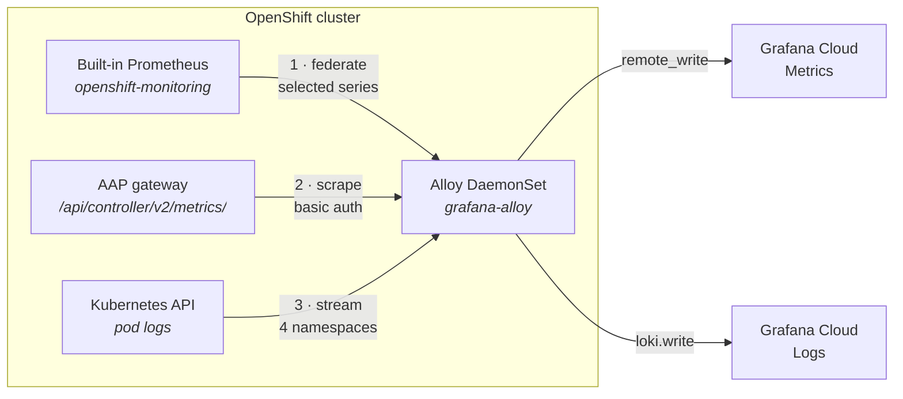

# Playbooks — Grafana Cloud

The automation behind the Grafana demo, one entry per piece. Everything here is
in [sales.demos](https://github.com/ericcames/sales.demos); nothing in Grafana
was built by clicking, apart from the account and its three tokens (see
[`rebuild.md`](rebuild.md)).

**The one-line version:** Ansible writes, AI reads. Three playbooks put data,
a dashboard and alert rules *into* Grafana Cloud. A read-only MCP server lets
Claude read them back out.

| Order | What | Playbook | AAP job template | Skill | Per environment? |
|---|---|---|---|---|---|
| 1 | Send metrics and logs | [`deploy_alloy.yml`](https://github.com/ericcames/sales.demos/blob/main/playbooks/deploy_alloy.yml) | `AAP Observability - 1 Deploy Alloy` | [`/sales-demos-alloy`](https://github.com/ericcames/sales.demos/blob/main/.claude/skills/sales-demos-alloy/SKILL.md) | **Yes** — once per cluster |
| 2 | Push the dashboard | [`deploy_dashboard.yml`](https://github.com/ericcames/sales.demos/blob/main/playbooks/deploy_dashboard.yml) | `AAP Observability - 2 Deploy Dashboards` | [`/sales-demos-dashboard`](https://github.com/ericcames/sales.demos/blob/main/.claude/skills/sales-demos-dashboard/SKILL.md) | No — one Grafana |
| 3 | Push the alert rules | [`deploy_alerts.yml`](https://github.com/ericcames/sales.demos/blob/main/playbooks/deploy_alerts.yml) | `AAP Observability - 3 Deploy Alerts` | [`/sales-demos-dashboard`](https://github.com/ericcames/sales.demos/blob/main/.claude/skills/sales-demos-dashboard/SKILL.md) | No — one Grafana |
| — | Connect Claude | [`make-grafana-mcp.sh`](https://github.com/ericcames/sales.demos/blob/main/utilities/make-grafana-mcp.sh) | *(laptop only)* | [`/sales-demos-mcp`](https://github.com/ericcames/sales.demos/blob/main/.claude/skills/sales-demos-mcp/SKILL.md) | No — one server named `grafana` |

**The templates are numbered because it is a chain.** A dashboard on a cluster
with no Alloy renders empty panels, and an alert rule on a cluster with no data
never fires. Templates 2 and 3 are deliberately not in a workflow with 1: they
are not per-environment, and a workflow would imply a per-environment sequence
that does not exist. Running 2 or 3 from *either* controller updates the same
Grafana.


---

## 1 · `deploy_alloy.yml` — instrument the cluster

**Grafana Alloy** is Grafana's collector: a small agent that gathers telemetry
and ships it somewhere. The playbook runs it as a DaemonSet in the
`grafana-alloy` namespace and gives it three jobs.



### Path 1 — metrics, by federation rather than scraping

OpenShift already scrapes the kubelet, cAdvisor, node-exporter,
kube-state-metrics and KubeVirt. Re-scraping all of that from Alloy would
duplicate a lot of fragile config, so Alloy asks the cluster's own Prometheus
for a **filtered copy** through its `/federate` endpoint instead.

The `match[]` list is the whole selection, and therefore **the series budget
control**:

| Selector | Why |
|---|---|
| `kubevirt_vmi_.*` | VM metrics — the demo headline |
| `node_cpu_seconds_total`, `node_memory_.*`, `node_filesystem_.*`, `node_network_.*` | Node health |
| `kube_pod_status_phase`, `kube_pod_container_resource_requests` | Pods — only in `aap`, `sales-demos-*`, `openshift-cnv` |
| `kube_node_status_.*` | Node readiness |
| `container_cpu_usage_seconds_total`, `container_memory_working_set_bytes` | Container usage — same three namespaces |

A relabel stage then **drops** quiet CPU modes (`irq`, `softirq`, `steal`,
`nice`, `guest`, `guest_nice`) and pause containers, and **adds** a `cluster`
label (`sandbox`, `demo`, `edge`). That label is how one dashboard and one set
of alert rules serve every environment.

Two things that were learned the hard way (#273):

- **The target is `prometheus-k8s`, not the Thanos Querier.** Thanos does not
  implement `/federate`.
- **Alloy authenticates with its own service account token**, bound to the
  built-in `cluster-monitoring-view` ClusterRole. The playbook creates that
  binding.

### Path 2 — AAP metrics, through the gateway

Alloy scrapes `/api/controller/v2/metrics/` on the in-cluster gateway service
using the environment's existing `aap_username` and `aap_password`. That gives
the `awx_*` metrics behind the dashboard's AAP row: capacity, running and
pending jobs, hosts, templates, database connections, licence expiry.

On AAP 2.7 the controller service rejects basic auth directly, so this has to
go through the gateway and needs the `/api/controller/` prefix (#273). No new
token is created.

### Path 3 — logs, through the Kubernetes API

`loki.source.kubernetes` streams pod logs through the API server rather than
reading files off the node. The DaemonSet therefore needs **no hostPath volume
and no privileged SCC**; it runs under `restricted`. The trade-off is slightly
more API server load and the possibility of missing lines during a pod restart,
which is irrelevant for a demo.

Only four namespaces are kept: `aap`, `sales-demos-<env>`, `openshift-cnv` and
`grafana-alloy`. Everything `openshift-*` is excluded so control-plane noise
does not consume the log budget. Each stream carries `namespace`, `pod`,
`container` and `cluster` labels.

### What it creates

| Resource | Name |
|---|---|
| Namespace | `grafana-alloy` |
| ServiceAccount | `alloy` |
| ClusterRole + ClusterRoleBinding | `alloy-discovery` — read-only (`get`, `list`, `watch`) on nodes, pods, pod logs, services, endpoints, namespaces and ingresses |
| ClusterRoleBinding | `alloy-cluster-monitoring-view` — the built-in role that lets it federate from Prometheus |
| Secret | `alloy-grafana-cloud` — push endpoints, instance IDs and the push token |
| Secret | `alloy-aap-auth` — the AAP username and password for the metrics scrape |
| ConfigMap | `alloy-config` — the Alloy pipeline above |
| DaemonSet | `alloy` — 100m / 256Mi request, 500m / 512Mi limit |

### Reversal

```bash
./utilities/run-ansible.sh playbooks/deploy_alloy.yml -i inventory --limit sandbox \
  -e target_env=sandbox -e alloy_state=absent \
  --vault-id sales.demos@~/secrets/.vault_pass_sales_demos
```

This removes everything in the table, **including the cluster-scoped RBAC**,
which a plain namespace delete would have left behind.

---

## 2 · `deploy_dashboard.yml` — the dashboard as code

Runs on `localhost`: Grafana Cloud is an external service, so there is no
cluster host to target and no `--limit`.

1. Create the **Sales Demos** folder (idempotent — "already exists" is a success).
2. Read [`playbooks/files/grafana/cluster-health.json`](https://github.com/ericcames/sales.demos/blob/main/playbooks/files/grafana/cluster-health.json).
3. POST it to the dashboard API with `overwrite: true` and the version message
   **"Applied by playbooks/deploy_dashboard.yml"**, so every change shows up in
   Grafana's version history with its source.

The dashboard, **Sales Demos - Cluster Health**, has five rows:

| Row | Panels |
|---|---|
| Overview | Nodes ready, VMs running, pods running, AAP controller up, Alloy federation up, series budget |
| Cluster Nodes | CPU, memory, `/var` filesystem, network throughput |
| KubeVirt Virtual Machines | VM status table (guest OS, vCPU, memory, node, phase), VM CPU, memory, network |
| AAP Platform | Capacity, running and pending jobs, managed hosts, job templates, DB connections, licence expiry, AAP pod CPU and memory |
| Logs | Live pod logs, filtered by namespace |

Two variables at the top — **Cluster** and **Namespace** — make one definition
serve every environment.

It uses the **Editor** service account token. The Viewer token the MCP server
holds cannot write, and that split is a talking point, not an accident.

---

## 3 · `deploy_alerts.yml` — alert rules as code

Same shape as the dashboard playbook: `localhost`, the Editor token, no new
vault keys. It reads
[`playbooks/files/grafana/alert-rules.json`](https://github.com/ericcames/sales.demos/blob/main/playbooks/files/grafana/alert-rules.json)
and **replaces** the rule group `sales-demos-health` in the Sales Demos folder.

Because the whole group is replaced, **a rule deleted from the JSON is deleted
from Grafana** on the next run. Then the playbook reads the group back and
asserts Grafana holds exactly the committed rules — a green run is proof, not a
hope.

| Rule | Fires when | Wait |
|---|---|---|
| Alloy federation down | a cluster sent metrics in the last hour but not now | 5m |
| AAP controller metrics down | the AAP scrape answered in the last hour but not now | 5m |
| Running VM count dropped | fewer VMs running than ten minutes ago | 1m |
| AAP jobs stuck pending | any job pending | 15m |
| Free-tier series budget above 80% | over 8,000 active series, stack-wide | 15m |

Things worth knowing:

- **"VM count dropped", not "VM stopped".** A stopped VM has no running
  instance, so its metrics *disappear* rather than change to zero. The rule
  compares the count with ten minutes earlier. It fires on a deliberate teardown
  too, and says so in its description.
- **"Down" means "was up recently".** A cluster that has been gone for more than
  an hour stops alerting, so a retired environment does not page for ever.
- **No contact point is configured.** Firing alerts follow the stack's default
  notification policy. A receiver would put an email address or webhook into a
  public repository.
- **The rules stay editable in the UI**, so someone learning Grafana can open
  one and change it. The next run puts the committed version back.

Reversal: `-e alerts_state=absent` deletes the group and asserts it is gone.

---

## `make-grafana-mcp.sh` — connect Claude

Registers the official `grafana/mcp-grafana` server with Claude Code, reading
the Grafana URL and the **Viewer** token from the vault:

```bash
bash utilities/make-grafana-mcp.sh
```

It is registered with `claude mcp add --scope local`, not committed to
`.mcp.json`, because the token is a standalone credential and the stack URL is
treated as sensitive. There is one Grafana, so there is one server, named
`grafana`, with no environment suffix. It takes no arguments.

The token is created in the Grafana UI and **must be revoked there**; the script
prints how. What the server can do is its own page: [`mcp-server.md`](mcp-server.md).

---

## The credentials

All in the vault-encrypted `playbooks/group_vars/all/secrets.yml` (see
[`secrets.yml.example`](https://github.com/ericcames/sales.demos/blob/main/playbooks/group_vars/all/secrets.yml.example)),
as **top-level** keys because one Grafana spans every environment. AAP jobs
receive the same values through the `Sales Demos - Env Secrets` credential.

| Key | What it is | Role | Used by |
|---|---|---|---|
| `grafana_cloud_url` | The stack URL, `https://<stack>.grafana.net` | — | all |
| `grafana_cloud_sa_token` | Service account token | **Viewer** | MCP server (reads) |
| `grafana_cloud_editor_sa_token` | Service account token | **Editor** | dashboard and alert playbooks (writes) |
| `grafana_cloud_push_api_key` | Cloud Access Policy token | `metrics:write`, `logs:write` | Alloy |
| `grafana_cloud_prom_push_url` | Metrics remote-write endpoint | — | Alloy |
| `grafana_cloud_prom_username` | Metrics instance ID | — | Alloy |
| `grafana_cloud_loki_push_url` | Logs push endpoint | — | Alloy |
| `grafana_cloud_loki_username` | Logs instance ID | — | Alloy |

**Three tokens, three jobs, three different permissions.** The collector can
only push data. The playbooks can change dashboards and alerts but cannot push
data. The AI can read everything and change nothing.

**The stack URL is treated as a credential.** Unlike the ephemeral RHDP
hostnames committed elsewhere in this repo, it identifies a specific Grafana
account, so it appears in these docs only as `<stack>`.
