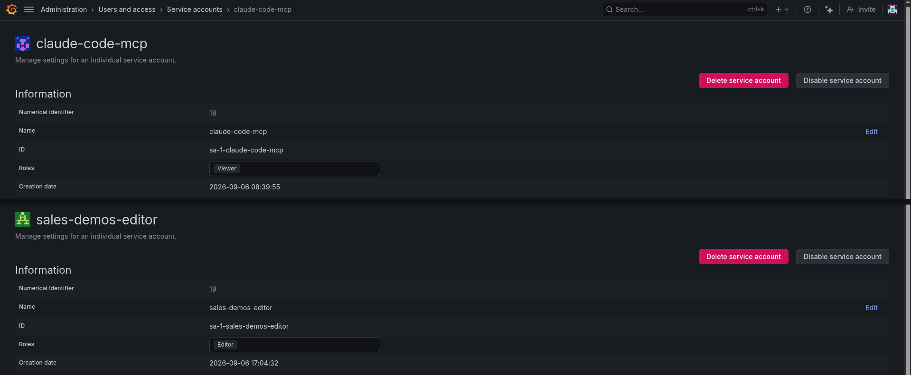
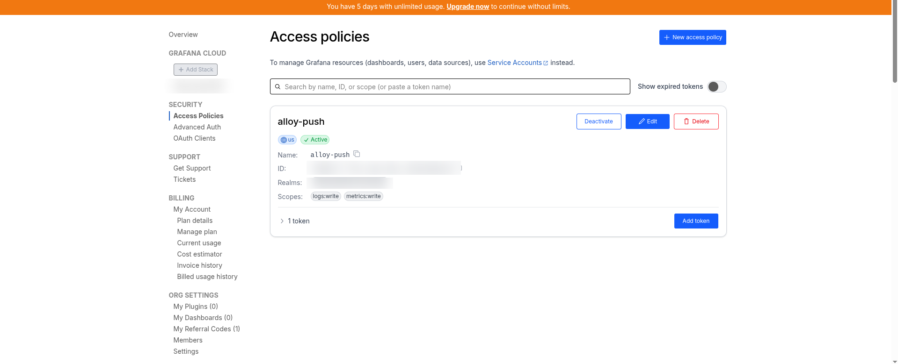

# Rebuild from zero — Grafana Cloud

How to recreate this whole demo on a **new, free Grafana Cloud account**.
Nothing in the repository changes; you create an account and three tokens, put
eight values in the vault, and run three job templates.

**Allow about 45 minutes** the first time: 15 in the Grafana UI, 10 in the
vault, 20 for the job templates and checks.

!!! note "Documented from the working build"
    These steps were written from the instance that ran from September 2026,
    and every automated step was run end to end. The account-creation steps
    were **not** repeated on a fresh account. Grafana moves menu items between
    releases — if a path below has changed, the thing you are looking for is
    still called the same name. Search for it.

---

## Before you start

You need an environment already set up with the sales.demos basics — the vault
password, `secrets.yml`, and an AAP with `config.yml` applied. If not, start at
[`/sales-demos-first-time`](https://github.com/ericcames/sales.demos/blob/main/.claude/skills/sales-demos-first-time/SKILL.md).

Keep a scratch file open (outside any git repo) to paste values into as you go.
You will collect **eight**.

---

## Part 1 · The account (Grafana UI)

### 1. Sign up

Go to **grafana.com**, sign up for the **Free** plan. No credit card. Choose a
stack name when asked — it becomes your URL.

> Free tier at the time of writing: 10,000 metric series, 50 GB logs,
> 50 GB traces, 14 days of full features, 3 users.

**Value 1 — `grafana_cloud_url`:** the stack address, `https://<stack>.grafana.net`.

!!! warning "Treat the stack URL as private"
    Unlike the ephemeral demo-platform hostnames elsewhere in this repo, it
    identifies your account. Never commit it, and crop it out of screenshots.

### 2. The Viewer token — for Claude

In **your stack** (`https://<stack>.grafana.net`):

1. **Administration › Users and access › Service accounts › Add service account**
2. Name `claude-code-mcp`, role **Viewer**, **Create**
3. **Add service account token › Generate token** — copy it now; it is shown once

**Value 2 — `grafana_cloud_sa_token`:** starts `glsa_`.



### 3. The Editor token — for the playbooks

Same page, a second account:

1. **Add service account** — name `sales-demos-editor`, role **Editor**
2. **Add service account token › Generate token**

**Value 3 — `grafana_cloud_editor_sa_token`:** also starts `glsa_`.

**Keep these two separate.** It is tempting to make one Editor token for
everything. Don't — the Viewer-only MCP token is what lets you tell a customer
the AI cannot change anything, and prove it.

### 4. The push token — for Alloy

This one is made in the **grafana.com portal**, not in the stack:

1. **grafana.com › My Account › Security › Access Policies › Create access policy**
2. Realm: your stack. Scopes: **metrics › Write** and **logs › Write**. Create.
3. On the new policy: **Add token › Create** — copy it

**Value 4 — `grafana_cloud_push_api_key`:** starts `glc_`.



### 5. The two push endpoints

Still in the portal: **My Account › your stack › Details**.

| Section | Value | Vault key |
|---|---|---|
| **Prometheus** | Remote Write Endpoint — ends `/api/prom/push` | 5 · `grafana_cloud_prom_push_url` |
| **Prometheus** | Username / Instance ID — a number | 6 · `grafana_cloud_prom_username` |
| **Loki** | URL, **plus** `/loki/api/v1/push` on the end | 7 · `grafana_cloud_loki_push_url` |
| **Loki** | User — a number, different from Prometheus | 8 · `grafana_cloud_loki_username` |

The most common mistake is the Loki URL: the Details page shows the base
address, and Alloy needs the full push path.

---

## Part 2 · The vault (laptop)

Add all eight as **top-level** keys — not under `env_secrets`, because one
Grafana serves every environment:

```bash
cd ~/git-repos/sales.demos
ansible-vault edit playbooks/group_vars/all/secrets.yml \
  --vault-id sales.demos@~/secrets/.vault_pass_sales_demos
```

```yaml
grafana_cloud_url: "https://<stack>.grafana.net"
grafana_cloud_sa_token: "glsa_..."            # Viewer — MCP
grafana_cloud_editor_sa_token: "glsa_..."     # Editor — playbooks
grafana_cloud_push_api_key: "glc_..."         # Alloy
grafana_cloud_prom_push_url: "https://prometheus-prod-NN-....grafana.net/api/prom/push"
grafana_cloud_prom_username: "1234567"
grafana_cloud_loki_push_url: "https://logs-prod-NNN.grafana.net/loki/api/v1/push"
grafana_cloud_loki_username: "7654321"
```

The shape is documented in
[`secrets.yml.example`](https://github.com/ericcames/sales.demos/blob/main/playbooks/group_vars/all/secrets.yml.example).

Then push the new values into AAP, so its `Sales Demos - Env Secrets` credential
carries them:

```bash
./utilities/run-ansible.sh playbooks/config.yml -i inventory --limit sandbox \
  -e target_env=sandbox \
  --vault-id sales.demos@~/secrets/.vault_pass_sales_demos
```

---

## Part 3 · Build it (AAP)

In AAP, **Automation Execution › Templates**, filter by the label
`observability`, and launch **in order**:

| # | Template | Takes | Check |
|---|---|---|---|
| 1 | `AAP Observability - 1 Deploy Alloy` | ~2 min | Job green; `alloy` pod Running in `grafana-alloy` |
| 2 | `AAP Observability - 2 Deploy Dashboards` | <30 s | **Dashboards › Sales Demos › Sales Demos - Cluster Health** exists |
| 3 | `AAP Observability - 3 Deploy Alerts` | ~7 s | **Alerting › Alert rules** shows five rules in *Sales Demos* |

Run template 1 once for **each** environment you want to see. Run 2 and 3 once
in total — they are not per environment.

Prefer the laptop? The same playbooks run through
[`/sales-demos-alloy`](https://github.com/ericcames/sales.demos/blob/main/.claude/skills/sales-demos-alloy/SKILL.md)
and
[`/sales-demos-dashboard`](https://github.com/ericcames/sales.demos/blob/main/.claude/skills/sales-demos-dashboard/SKILL.md).

---

## Part 4 · Connect Claude (laptop)

```bash
bash utilities/make-grafana-mcp.sh
```

Restart Claude Code in the repository, then ask it to prove the connection —
not to report it:

| Ask | Tool it should use | Good answer |
|---|---|---|
| "Who are you connected to Grafana as?" | `user_info` | the Viewer service account, not an admin |
| "Are metrics arriving from sandbox?" | `list_prometheus_metric_names`, regex `node_cpu_seconds_total` | the metric is listed |
| "Is AAP sending metrics?" | `list_prometheus_metric_names`, regex `awx_.*` | `awx_*` metrics listed |
| "Are logs arriving?" | `list_loki_label_names` | includes `namespace`, `pod`, `cluster` |
| "How many series are we using?" | `query_prometheus` `count({__name__!=""})` | well under 10,000 |
| "Try to add an annotation." | `create_annotation` | **403** — that is the correct result |

---

## Part 5 · Look at it

Open **Dashboards › Sales Demos › Sales Demos - Cluster Health**, choose your
cluster in the **Cluster** dropdown at the top, and give it ten minutes for the
graphs to fill. New to Grafana? [`grafana-101.md`](grafana-101.md) walks through
the screen.

---

## When something is wrong

| Symptom | Cause | Fix |
|---|---|---|
| Template 1 fails the push-credentials assert | a vault key is missing or still `CHANGEME` | Part 2, then re-run `config.yml` |
| Alloy pod running, no metrics in Grafana | wrong Prometheus URL or username | check `mcp__openshift-<env>__pods_log` in `grafana-alloy` for `401` or `404` |
| Metrics arrive, no logs | Loki URL missing `/loki/api/v1/push` | Part 1 step 5 |
| Dashboard exists but every panel says *No data* | wrong cluster selected, or Alloy not deployed there | pick the cluster in the dropdown; run template 1 for it |
| Template 2 or 3 fails with `403` | the Editor value is actually the Viewer token | Part 1 step 3 |
| Template 2 or 3 fails with `401` | token deleted or mistyped | generate a new one |
| MCP server "Connected" but calls fail | Viewer token wrong, or the stack expired | re-run `make-grafana-mcp.sh`; check the account still exists |

---

## When you are finished

Free accounts expire. Before yours does:

1. Capture anything you want to keep — this folder is the example.
2. Delete the three tokens in the Grafana UI. Nothing automates this.
3. `claude mcp remove grafana`.
4. Optionally `deploy_alloy.yml -e alloy_state=absent` on each cluster, so
   nothing keeps pushing to an account that no longer exists.
