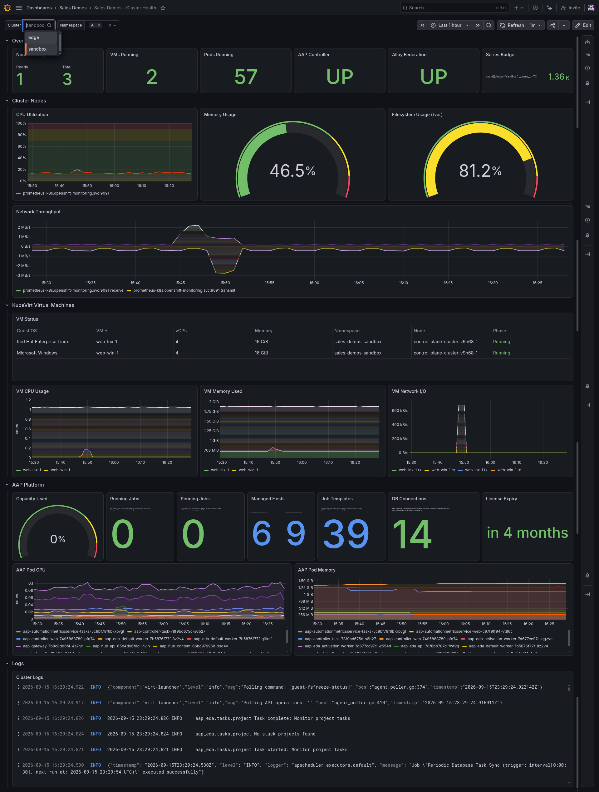
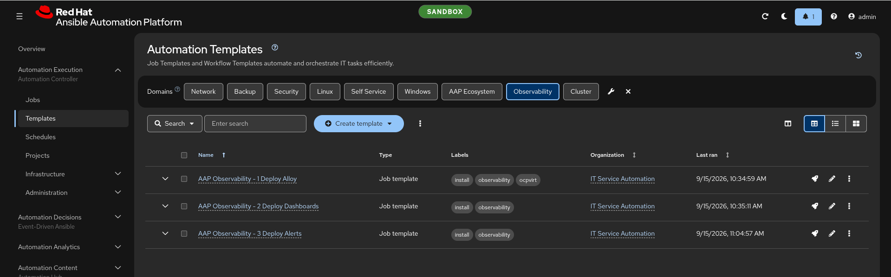
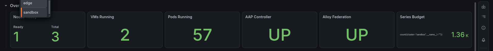
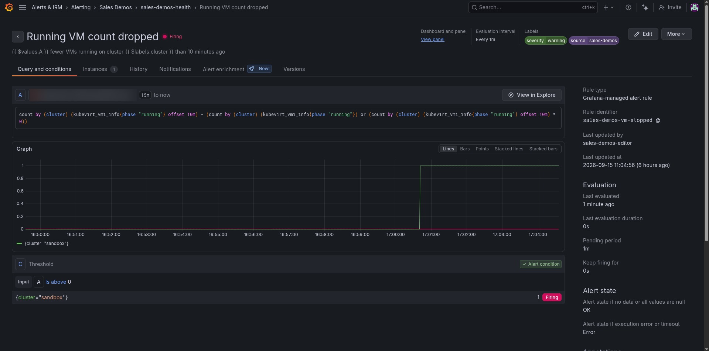

# Talk track — Observability with Grafana Cloud

**Rehearse from this. Present from [`run-sheet.md`](run-sheet.md).**

Everything a live run would put on screen is embedded in this folder's pages,
so the whole track works with no Grafana instance — which is just as well,
because the one it was built on expires on 2026-09-22.

---

## Who is in the room

**You are the pre-sales engineer.** Every document in this folder is written to
you. You do not need to be a Grafana expert; read
[`grafana-101.md`](grafana-101.md) once and you know more than this demo needs.

**They are platform engineers, SREs and automation leads.** They already run
monitoring — probably several tools, probably configured by hand in each tool's
UI. They have been shown "AI for ops" demos that ended with a chatbot
confidently restarting something.

| They do not care about | They care intensely about |
|---|---|
| Which monitoring vendor is best | Whether this works with what they already have |
| Pretty dashboards | Whether the config is reviewable and repeatable |
| "AI can answer anything" | Whether the AI can *break* anything |
| Free tiers | What it costs at their volume |

Three delivery notes:

- **Do not sell Grafana.** It is the example, not the product. The moment it
  sounds like a Grafana pitch, the SREs with a Datadog contract stop listening.
- **Do not say "real-time".** The alert took seven minutes. Say "minutes" and
  explain why before anyone asks.
- **The 403 is the climax.** Everything before it builds to it. Don't rush it,
  and don't bury it in the middle of another sentence.

---

## Beat 1 · Monitoring configured by hand (0–2)

*The Sales Demos - Cluster Health dashboard on sandbox, rendered by Grafana
from the committed JSON.*

> **"Most monitoring is configured the way servers were configured fifteen years
> ago. Someone opens the UI and clicks. It works, until someone asks what
> changed last Tuesday, or you need the same thing on a second cluster."**

**Why this beat exists.** It names a problem they recognise before showing a
solution. Keep it to the one image and two sentences.

**Transition:** *"So we did it the other way round."*

---

## Beat 2 · Ansible instruments the cluster (2–5)

> **"Three job templates in AAP, and they're numbered because they're a chain.
> Number one puts Grafana's collector, Alloy, on the OpenShift cluster."**

> **"It doesn't scrape anything OpenShift already scrapes. It asks OpenShift's
> own Prometheus for a filtered copy — about two thousand series out of the tens
> of thousands it holds. That filter is a list in the playbook, which makes it
> the cost control too."**

> **"It also picks up AAP's own metrics, and streams pod logs from four
> namespaces through the Kubernetes API — no host mounts, no privileged
> containers."**

**Why this beat exists.** It establishes that the data is *there* because
automation put it there, and plants two answers early: cost is controlled in
code, and the collector is not a security exception.

**Transition:** *"Data on its own isn't much use. Number two."*

---

## Beat 3 · The dashboard, from git (5–8)

> **"This dashboard is a JSON file in the repository. Template two pushes it.
> If you want a panel changed, that's a pull request — and Grafana's own
> version history records which playbook applied each change."**

Point at the **Cluster** dropdown:

> **"One definition, every environment. Every series Alloy sends carries the
> cluster's name, so this dropdown is the only difference between sandbox and
> edge."**

Point at the VM table:

> **"Guest OS, size, node, phase — for every VM, straight from OpenShift
> Virtualization's own metrics."**

**Why this beat exists.** It is the first thing that looks good, and it is where
"as code" becomes concrete.

**Transition:** *"A dashboard is something you have to be looking at. Number
three is for when you aren't."*

---

## Beat 4 · Alerts, from git (8–11)

Show [`alert-rules.json`](https://github.com/ericcames/sales.demos/blob/main/playbooks/files/grafana/alert-rules.json)
briefly, then:

> **"Five rules. The playbook replaces the whole group, so if you delete a rule
> from git it's deleted from Grafana. Then it reads the group back and fails
> unless Grafana holds exactly what's committed."**

Then tell the rehearsal:

> **"We tested it by stopping a VM. Stopped at 18:01, alert firing at 18:08.
> Seven minutes. That isn't the demo being slow — when a series stops, Prometheus
> keeps its last value for five minutes in case it was one missed sample, and
> then the rule waits one more minute to be sure. It's being careful."**

**Why this beat exists.** It shows the pattern extends beyond dashboards, and it
pre-empts the most likely "gotcha" by being first to the seven-minute delay.

**Transition:** *"So now there's a lot of useful data in one place. Here's who
else can read it."*

---

## Beat 5 · Claude reads it (11–14)

Open [`mcp-server.md`](mcp-server.md) → *Real questions, real answers*.

> **"Claude connects to Grafana through Grafana Labs' own MCP server. We asked it
> ordinary questions."**

Walk three:

> **"'What VMs are running and how big are they?' — it queried the metrics and
> gave us the table."**

> **"'Where are our logs coming from?' — sixty percent is AAP, a third is the
> virtualization operator. Nobody had built a panel for that; it wrote the
> query."**

> **"'Show me the VM table' — and it hands back a picture of the panel."**

**Why this beat exists.** It moves from "we built monitoring" to "the monitoring
is conversational", which is the new part. Three examples; more is a list.

**Transition:** *"Which raises the question you're all thinking."*

---

## Beat 6 · The 403 (14–15)

Open [`mcp-server.md`](mcp-server.md) → *The read-only design, proven*.

> **"Can it change things? We asked it to. We told it to add an annotation to
> this dashboard."**

Pause.

> **"Grafana said 403. Permission denied."**

> **"The important part is where that 'no' comes from. It isn't a list of allowed
> tools in the assistant's settings — those go stale. The assistant holds a
> token with Grafana's Viewer role, so Grafana itself refuses. The dashboards
> and alerts change through a pull request and an AAP job, with a different
> token. The AI reads. Ansible writes."**

**Why this beat exists.** It is the argument of the whole demo: a clear,
enforced line between an assistant and automation. Everything before it is
set-up.

**Transition:** *"Before you ask me the hard questions, let me volunteer a few."*

---

## Beat 7 · The honest bits (15–16)

> **"Three things. There are no traces — nothing in this platform emits them, so
> that part of Grafana is empty. The 'Nodes Ready' panel says three on a
> one-node cluster, which is wrong, and a one-line pull request. And the Grafana
> instance behind these screenshots was a free trial that has since expired —
> they're pictures of a working system, not a working system."**

**Why this beat exists.** A room of SREs has seen demos skip the hard parts.
Being first to the limitations is what makes them believe the rest.

---

## Beat 8 · Close (16–20)

> **"Monitoring configuration in git, applied by AAP, and read by an assistant
> that can't change it. None of that depends on Grafana."**

Then **one** question, chosen from what you heard:

- If they talked about tool sprawl: *"Where does your monitoring configuration
  live today?"*
- If they reacted to the 403: *"What would you need to see before letting an
  assistant act on an alert, not just explain it?"*

---

## If you only get ten minutes

Keep **Beat 2** (one sentence), **Beat 3**, **Beat 5** (one example) and
**Beat 6**. Cut Beats 1 and 4. Never cut the 403.

---

## Where the words come from

| Claim | Source |
|---|---|
| Three numbered templates, not a workflow | [`controller_templates.yml`](https://github.com/ericcames/sales.demos/blob/main/inventory/group_vars/aap/controller_templates.yml) — AAP OBSERVABILITY block |
| Alloy federates from OpenShift's Prometheus | [`deploy_alloy.yml`](https://github.com/ericcames/sales.demos/blob/main/playbooks/deploy_alloy.yml) — `prometheus.scrape "thanos_federate"` |
| The `match[]` list is the cost control | `deploy_alloy.yml` comment "The match[] list IS the series budget control" |
| About two thousand series | [`usage-and-cost.md`](usage-and-cost.md) — sandbox ~1,930, measured 2026-09-15 |
| Logs via the Kubernetes API, no privileged containers | `deploy_alloy.yml` — `loki.source.kubernetes`, header comment |
| The dashboard is committed JSON | [`cluster-health.json`](https://github.com/ericcames/sales.demos/blob/main/playbooks/files/grafana/cluster-health.json) |
| Version history names the playbook | [`deploy_dashboard.yml`](https://github.com/ericcames/sales.demos/blob/main/playbooks/deploy_dashboard.yml) — `message: "Applied by playbooks/deploy_dashboard.yml"` |
| Rule group replaced, then read back and asserted | [`deploy_alerts.yml`](https://github.com/ericcames/sales.demos/blob/main/playbooks/deploy_alerts.yml) |
| Stopped 18:01, firing 18:08 | [sales.demos#629](https://github.com/ericcames/sales.demos/issues/629) comment, 2026-09-15 |
| 60% AAP, a third openshift-cnv | [`mcp-server.md`](mcp-server.md) — captured `query_loki_logs` answer |
| The 403 | [`mcp-server.md`](mcp-server.md) — captured `create_annotation` response |
| Viewer token for MCP, Editor for playbooks | [`make-grafana-mcp.sh`](https://github.com/ericcames/sales.demos/blob/main/utilities/make-grafana-mcp.sh); `deploy_dashboard.yml` header |
| No traces | [`mcp-server.md`](mcp-server.md) — `tempo_traceql-search` over 7 days, 0 results |
| "Nodes Ready: 3" is wrong | [`architecture.md`](architecture.md) → What does not work yet |
