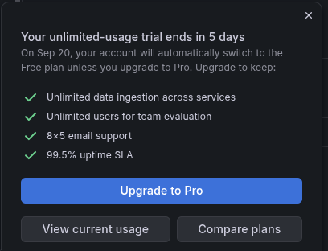
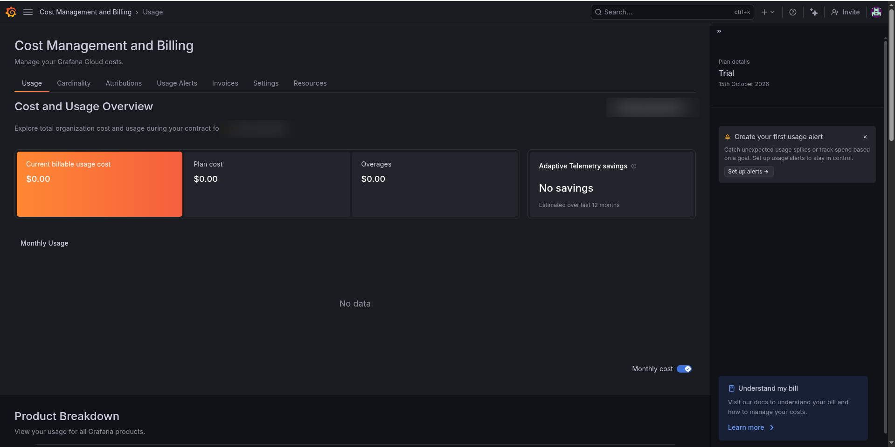

# Usage and cost — Grafana Cloud

How much data this demo sends, where it comes from, and how to send less.
Everything was **measured on 2026-09-15** with sandbox and edge reporting (the
demo environment had already expired).

In Grafana Cloud this subject is called **usage management**, or for metrics
specifically **cardinality management**. The built-in tools are **Adaptive
Metrics** and **Adaptive Logs**, both covered below.

---

## The trial ends, the stack stays

On **2026-09-20** the account leaves its unlimited-usage trial. Grafana switches
it to the **Free plan** automatically — the stack is not deleted:

That matters because this demo fits inside the free plan with room to spare. The
numbers below are the evidence.

## The free tier, and where we sat in it

| Signal | Free-tier allowance | Our usage | Headroom |
|---|---|---|---|
| **Metrics** — active series | 10,000 | **~2,300** active, ~3,100 billable | ~70% free |
| **Logs** — ingested per month | 50 GB | **4.8 GB** so far this month | ~90% free |
| **Traces** | 50 GB | **0** — nothing sends traces | all of it |
| Log retention | — | 31 days | — |
| Users | 3 | — | — |

**The two numbers people confuse:**

- An **active series** is one unique combination of a metric name and its labels
  that received a sample recently. `node_cpu_seconds_total{cpu="3", mode="idle",
  cluster="sandbox"}` is one series; the same metric for CPU 4 is another. The
  bill is driven by *how many* series exist, not how often they are sampled.
- **Cardinality** is that count for a metric or a label. A label whose value is
  different for every pod or every request makes cardinality explode — it is
  the usual reason a metrics bill grows faster than the infrastructure.

<!-- Screenshot: the Billing/Usage dashboard, redacted -->

---

## Where the metrics come from

Top metrics by series on **sandbox**, measured with
`topk(15, count by (__name__) ({cluster="sandbox"}))`:

| Metric | Series | Used by the dashboard? |
|---|---|---|
| `kube_pod_status_phase` | 305 | Yes — "Pods Running" |
| `node_filesystem_device_error` | 219 | **No** |
| `node_filesystem_readonly` | 219 | **No** |
| `kube_pod_container_resource_requests` | 147 | No |
| `container_memory_working_set_bytes` | 129 | Yes — AAP pod memory |
| `node_cpu_seconds_total` | 128 | Yes — CPU utilization |
| `container_cpu_usage_seconds_total` | 127 | Yes — AAP pod CPU |
| `kubevirt_vmi_phase_transition_time_*_bucket` (three metrics) | 171 | **No** |

Per cluster: **sandbox ~1,930**, **edge ~1,100**. Every environment running
Alloy adds its own, and the 10,000 limit is for the whole stack, which is why
the "series budget above 80%" alert counts across all clusters.

**Grafana's own recommendation engine agreed the list is already tight:**
Adaptive Metrics estimated savings of **6 series**. The larger savings below
come from knowing which panels exist, which Adaptive Metrics cannot know.

---

## Where the logs come from

Bytes ingested on **sandbox** over 24 hours, from
`sum by (namespace) (bytes_over_time({cluster="sandbox"}[24h]))`:

| Namespace | 24 h | Share |
|---|---|---|
| `aap` | 25.5 MB | 60% |
| `openshift-cnv` | 15.5 MB | 37% |
| `sales-demos-sandbox` | 1.2 MB | 3% |
| `grafana-alloy` | 0.08 MB | <1% |

About **42 MB a day per cluster**, which is roughly 1.3 GB a month each.
Averaged across the stack the ingest rate was **~2.8 KB/s**.

---

## How to send less

In order of effort. **None of these is implemented** — the demo fits the free
tier comfortably, and each is a trade-off to decide deliberately.

### 1. Tighten the federation `match[]` list (metrics, ~-600 series per cluster)

The list in `deploy_alloy.yml` is the control. Two selectors are broader than
the dashboard needs:

| Today | Narrower | Saves per cluster |
|---|---|---|
| `node_filesystem_.*` | `node_filesystem_avail_bytes` and `node_filesystem_size_bytes` only — the `/var` gauge | ~450 |
| `kubevirt_vmi_.*` | exclude `kubevirt_vmi_phase_transition_time_.*` histograms | ~170 |

The cost is that anyone exploring in Grafana later finds those metrics missing.
That is the whole trade: **you can only query what you kept.**

### 2. Drop series with a relabel rule (metrics)

Where a selector cannot be narrowed, a `drop` rule in the existing
`prometheus.relabel "budget_filter"` stage removes series before they are sent.
It already drops idle CPU modes and pause containers this way.

### 3. Drop or sample noisy log lines (logs)

`openshift-cnv` is more than a third of the log volume and is almost entirely
operator chatter. A `stage.drop` in the existing `loki.process` block can discard
lines below a level, or lines matching a pattern, before they leave the cluster.

### 4. Adaptive Metrics and Adaptive Logs (in Grafana, no redeploy)

Grafana Cloud analyses what is actually *queried* and recommends:

- **Adaptive Metrics** — aggregate away labels no dashboard or alert uses, so
  many series are stored as one. It found little to do here (6 series).
- **Adaptive Logs** — drop a percentage of log *patterns* that nobody queries.

Both apply on the Grafana side without touching the cluster, which makes them
the lowest-risk option — and the least transparent, because the reduction is
not in the repository. For a config-as-code demo, prefer options 1–3.

### 5. Shorten what you look back over

Not a saving on ingest, but on query cost: a dashboard set to **Last 7 days**
scans far more than **Last 1 hour**. The committed dashboard defaults to one
hour.

---

## Checking it yourself

Grafana Cloud writes its own usage into a data source called
`grafanacloud-usage`. The queries used on this page:

| Question | Data source | Query |
|---|---|---|
| Active series now | `grafanacloud-usage` | `grafanacloud_instance_active_series` |
| Log GB this month | `grafanacloud-usage` | `grafanacloud_logs_instance_usage` |
| Series per cluster | `grafanacloud-prom` | `count by (cluster) ({__name__!=""})` |
| Heaviest metrics | `grafanacloud-prom` | `topk(15, count by (__name__) ({cluster="sandbox"}))` |
| Log bytes per namespace | `grafanacloud-logs` | `sum by (namespace) (bytes_over_time({cluster="sandbox"}[24h]))` |

The pre-built **Cardinality management** and **Usage Insights** dashboards in
the `GrafanaCloud` folder show the same data with no query writing. And every
row in the tables above was produced by asking Claude through the Grafana MCP
server — see [`mcp-server.md`](mcp-server.md).
