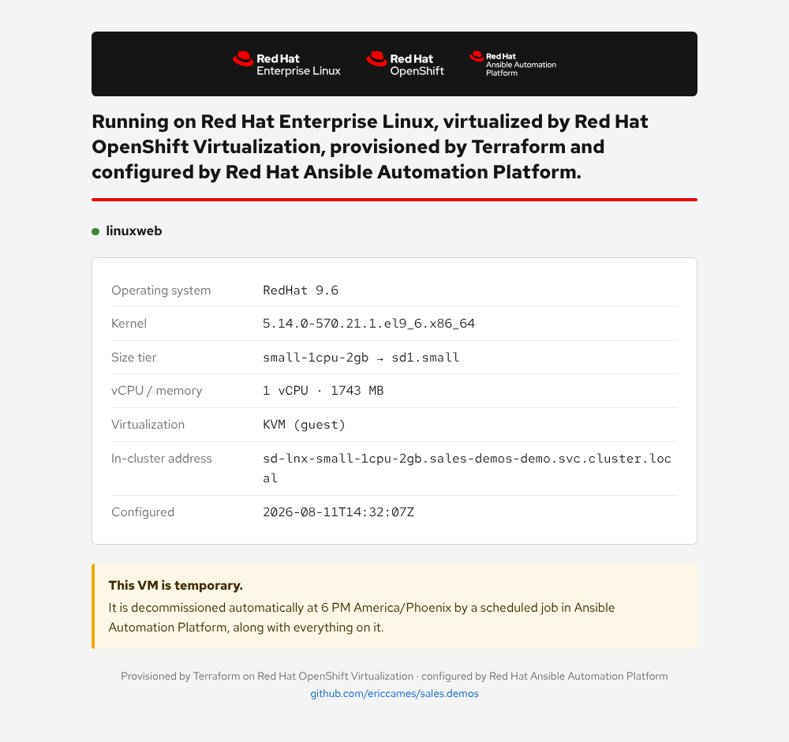
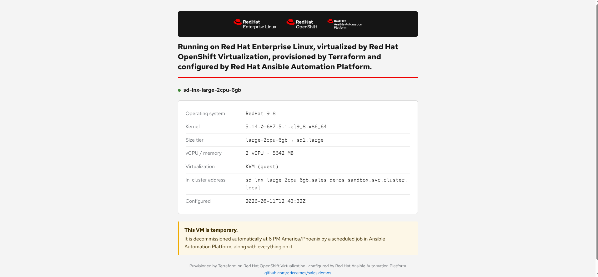
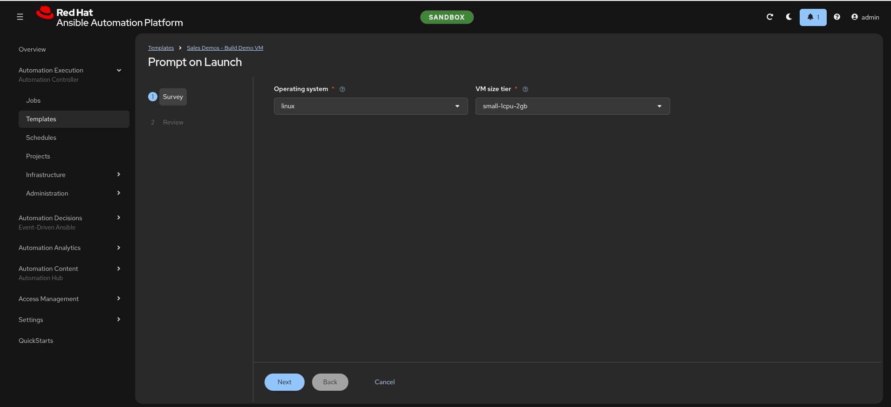
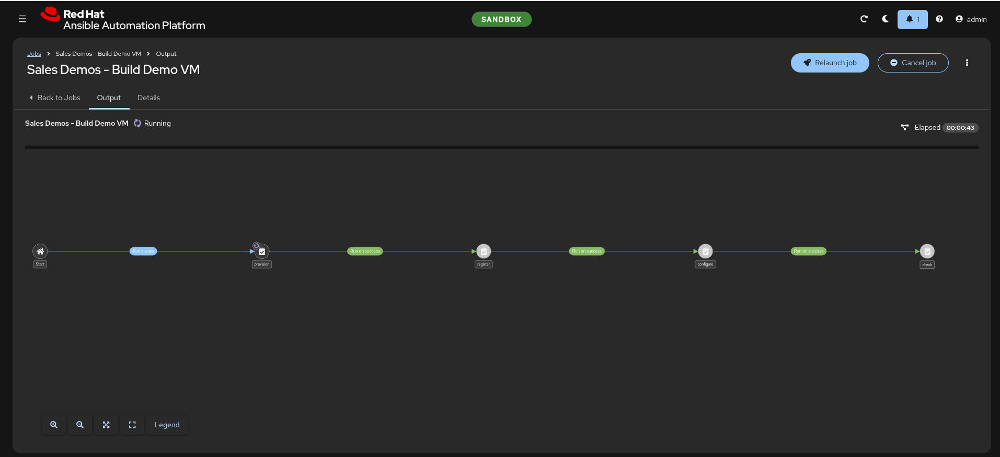
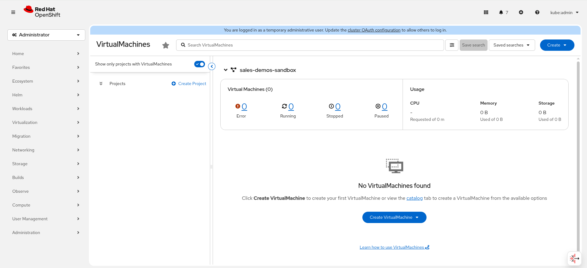
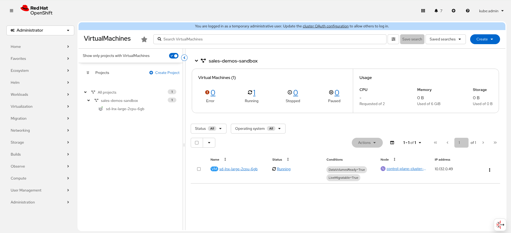
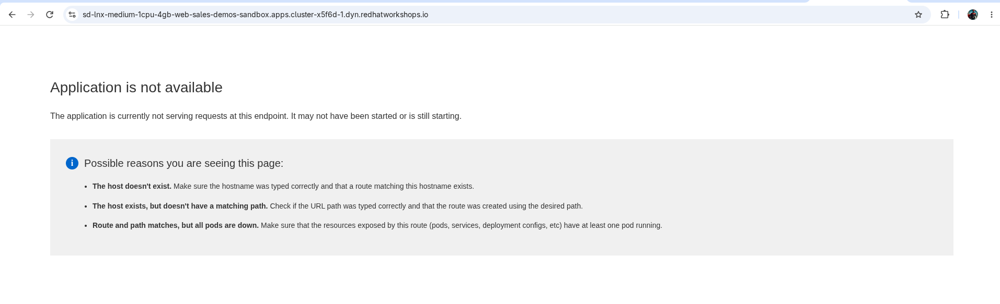
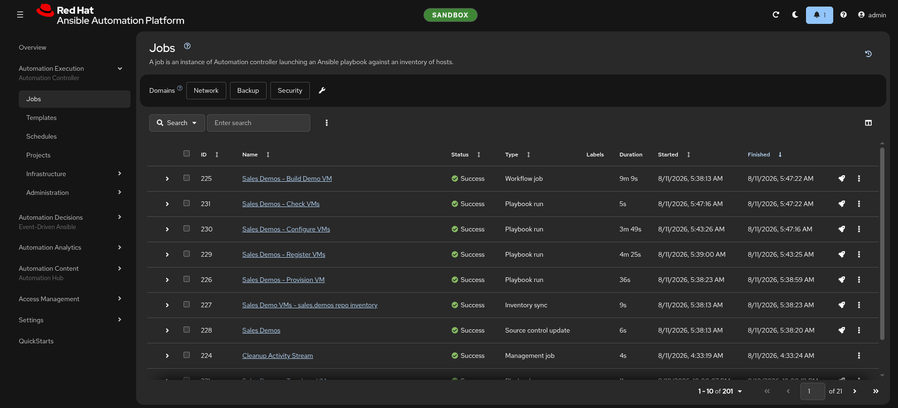
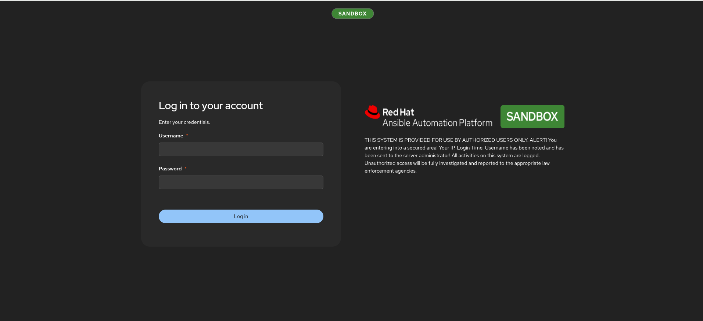

# Demo: OpenShift Virtualization

**Start here.** A customer-facing demo showing a RHEL 9 virtual machine
provisioned by Terraform onto OpenShift Virtualization, registered, configured,
patched and published — one button, about nine minutes, and torn down on a
schedule that night.

| | |
|---|---|
| **Length** | 30 minutes (25 + 5 for questions) |
| **Audience** | Linux and platform sysadmins who want to run their estate with AAP |
| **Reader** | The Ansible pre-sales engineer presenting it |
| **Needs a live environment?** | **No** — every artifact is committed |
| **Status** | Ready to present |

---

## The four documents

| File | Read it when |
|---|---|
| [`run-sheet.md`](run-sheet.md) | **While presenting.** Minute markers, what is on screen, exact commands, recovery moves |
| [`talk-track.md`](talk-track.md) | **While rehearsing.** The narrative and the actual words, beat by beat, with the rendered assets embedded |
| [`architecture.md`](architecture.md) | **When asked "how does that work".** The workflow graph, the object inventory, the timing table |
| [`objections.md`](objections.md) | **Before you go in.** What this audience asks, answered from the code — including the honest "no" answers |

Present from the run sheet. Rehearse from the talk track. The other two are
reference.

---

## The 60-second version

A requester answers two questions — an operating system and a t-shirt size — and
a workflow in Ansible Automation Platform does the rest:

1. **Provision** — Terraform builds the VM on OpenShift Virtualization and
   registers it as a managed host in AAP. The public URL exists immediately and
   correctly returns 503, because there is no web server yet.
2. **Register** — waits for ssh, then attaches the guest to the Red Hat CDN.
   This has to happen before anything else: the boot image ships with no package
   repositories at all.
3. **Configure** — web server, firewall, Cockpit, the demo page, security
   patches. The URL turns 200.
4. **Check** — logs in, gathers facts, caches them in AAP, so the workflow ends
   by proving the machine is genuinely reachable rather than that the tasks ran.

That night, a scheduled teardown destroys the VM and deregisters it — while
deliberately preserving the expensive things.

**What the demo is actually about** is not speed. It is that provisioning,
configuration, patching and decommissioning are one artifact, in version
control, in public, that converges instead of merely running.

---

## Why it works without a cluster

Every image the talk track needs is committed, from two different sources.

**Rendered, not photographed.** Both guest-facing artifacts are Jinja templates,
so they render on a laptop with nothing running. `utilities/render-demo-assets.py`
renders the demo page and screenshots it with headless Chrome, and prints the two
login banners and `facts.json` as text:

```bash
python3 utilities/render-demo-assets.py
```

That writes [`demo-page.png`](../../images/demo-page.png):

<a href="../../images/demo-page.png">
  
</a>

It is accurate — the guest serves that exact template — but it is **not** a
capture of a live run. Say so if anyone asks, and prefer
[`demo-page-live.png`](../../images/demo-page-live.png) (first row of the table
below) when you are presenting: it is the same page, genuinely served, and a
real capture is worth more in the cold open. The rendered one is what keeps this
working when there is no cluster, and what the render script regenerates when
the template changes.

The same run prints `/etc/motd`, which is what somebody sees after they
authenticate to the guest:

<!-- rendered: motd.j2 -->
```
        ___________________________________________________________________
       /                                                                   \
      |    ____  _____ ____    _   _    _  _____                            |
      |   |  _ \| ____|  _ \  | | | |  / \|_   _|                           |
      |   | |_) |  _| | | | | | |_| | / _ \ | |                             |
      |   |  _ <| |___| |_| | |  _  |/ ___ \| |                             |
      |   |_| \_\_____|____/  |_| |_/_/   \_\_|                             |
      |                                                                     |
      |   ___   ____   _____  _   _  ____   _   _  ___  _____  _____        |
      |  / _ \ |  _ \ | ____|| \ | |/ ___| | | | ||_ _||  ___||_   _|       |
      | | | | || |_) ||  _|  |  \| |\___ \ | |_| | | | | |_     | |         |
      | | |_| ||  __/ | |___ | |\  | ___) ||  _  | | | |  _|    | |         |
      |  \___/ |_|    |_____||_| \_||____/ |_| |_||___||_|      |_|         |
      |                                                                     |
      |         =============================================               |
      |          V I R T U A L I Z A T I O N   D E M O                      |
      |         =============================================               |
      |                                                                     |
      |   Powered by:                                                       |
      |     - OpenShift Virtualization    (host)                            |
      |     - Terraform                   (provision)                       |
      |     - Ansible Automation Platform (configure/patch)                 |
      |     - Red Hat Insights            (detect)                          |
      |                                                                     |
      |   This host is managed by AAP. Manual changes may be reverted.      |
       \___________________________________________________________________/
              \
               \   ^__^
                \  (oo)\_______
                   (__)\       )\/\
                       ||----w |
                       ||     ||

   Demo page:  https://sd-lnx-small-1cpu-2gb-web-sales-demos-demo.apps.cluster-abcde.dyn.redhatworkshops.io
   Console:    https://sd-lnx-small-1cpu-2gb-cockpit-sales-demos-demo.apps.cluster-abcde.dyn.redhatworkshops.io
   Compliance: https://sd-lnx-small-1cpu-2gb-web-sales-demos-demo.apps.cluster-abcde.dyn.redhatworkshops.io/compliance/report.html
```

Let the cow get its laugh, then land the line under it: *"This host is managed
by AAP. Manual changes may be reverted."* — the whole operating model, printed
where the person about to do something manual will read it.

The **pre**-authentication banner, `/etc/issue.net`, is deliberately not here.
It is the contrast half of a beat that only works when both are shown in order,
and that beat — with the words — is
[in the talk track](talk-track.md#the-two-banners-and-why-there-are-two).

**Captured from a live run**, because the AAP and OpenShift interfaces cannot be
rendered:

Click any thumbnail for the full-size image.

| Image | Shows | |
|---|---|---|
| `demo-page-live.png` | The demo page **served by a real guest** — use this for the cold open | <a href="../../images/demo-page-live.png"></a> |
| `aap-survey.png` | The launch survey a requester sees | <a href="../../images/aap-survey.png"></a> |
| `aap-workflow-running.png` | The four chained nodes, mid-run | <a href="../../images/aap-workflow-running.png"></a> |
| `ocp-vms-before.png` / `ocp-vms-after.png` | The namespace empty, then with one VM Running | <a href="../../images/ocp-vms-before.png"></a><br><a href="../../images/ocp-vms-after.png"></a> |
| `route-503.png` | The URL live and correctly serving nothing yet | <a href="../../images/route-503.png"></a> |
| `aap-job-timings.png` | Every node's measured duration, all Success | <a href="../../images/aap-job-timings.png"></a> |
| `aap-login-badged.png` | The environment badge on the sign-in page | <a href="../../images/aap-login-badged.png"></a> |

> **These come from several different launches, at different size tiers** —
> `small` in the survey, `medium` in the 503, `large` in the namespace shot.
> They illustrate the mechanism; they are not one continuous sequence, and the
> talk track does not claim they are. If you want a matched set, capture one in
> a single run and replace them.

The run sheet ends with the shots still worth capturing — the most valuable
being the 200 half of `route-503.png` in the same browser frame.

---

## If you want to run it live

Two things, in order:

```bash
/ocpvirt-new-env      # proves the environment is warm — builds and times a real VM
/ocpvirt-provision    # or launch "Sales Demos - Build Demo VM" in AAP
```

Then read [Running it live](run-sheet.md#running-it-live) in the run sheet — it
changes three beats and nothing else, and it tells you when to cut back to the
screenshot rather than debug with an audience.

New to this repo? Run `/sales-demos-first-time` first.

---

## Related

- [`../../plan/ocpvirt-demo-plan.md`](../../plan/ocpvirt-demo-plan.md) — why the
  automation is built this way: the research, the decisions, the reversals
- [`../../../ROADMAP.md`](../../../ROADMAP.md) — what is done and what is not
- [`../../../README.md`](../../../README.md) — the repo itself
