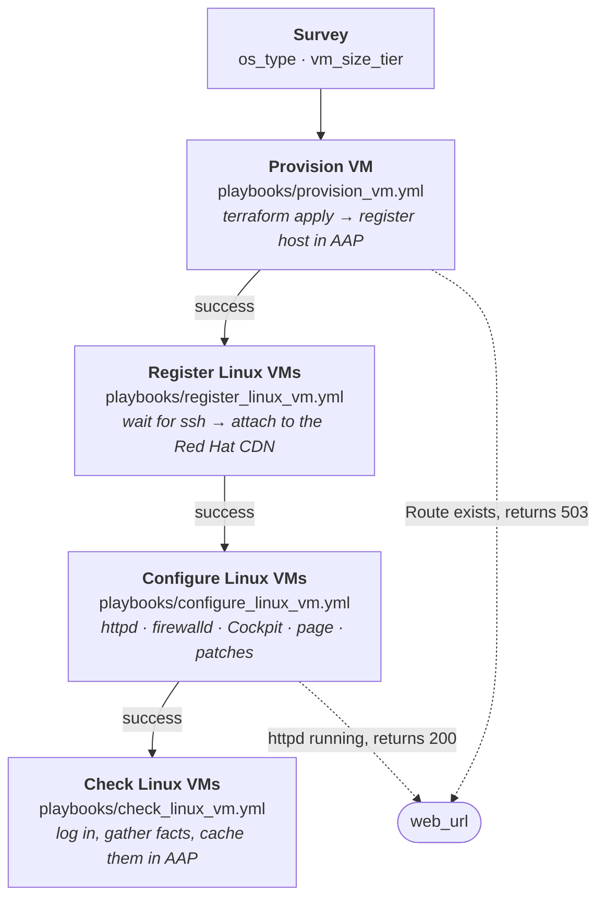

# Architecture — OpenShift Virtualization

Reference for the presenter. What exists, what builds what, and how long each
part takes. Use it to answer "how does that actually work" without guessing.

This describes the demo as it is *shown*. For **why** it is built this way — the
research, the constraints, the decisions and the ones that were reversed — read
[`docs/plan/ocpvirt-demo-plan.md`](../../plan/ocpvirt-demo-plan.md).

---

## The one-button workflow

`Linux Day 1 - 0 Workflow`. Four job templates chained on success, one survey
that feeds all of them.

As the controller draws it, mid-run:

The diagram above is a simplification: the real graph is left to right and
carries an explicit `Start` node, with each edge labelled `Run on success`.

**Chained on `success_nodes`, with no failure nodes at all.** A failure stops the
chain rather than cascading — and there is deliberately no incident-creation
path, because a failure node that does nothing useful is worse than an obvious
stop.

**Why a workflow rather than three buttons.** The order is not guessable.
`register` must precede `configure` because the OpenShift Virtualization `rhel9`
boot image ships with **no package repositories**, so every `dnf` task fails on
an unregistered guest. Encoding the sequence means it cannot be got wrong in
front of a customer (`controller_workflows.yml:10-14`).

**Why the wait lives in the playbook, not the workflow.** `provision` returns as
soon as `terraform apply` finishes; the guest takes roughly another minute to
accept ssh. In a workflow the nodes run back to back with no human pause, so
`register_linux_vm.yml` opens with `wait_for_connection` — which also protects the
run-it-by-hand path.

---

## The survey

| Question | Variable | Choices | Default |
|---|---|---|---|
| Hypervisor | `hypervisor` | `ocpvirt` | `ocpvirt` |
| VM size tier | `vm_size_tier` | `small` · `medium` · `large` | `small` |

**There is deliberately no question for the operating system, and there used to
be.** This table showed `os_type` with a `linux · windows · both` dropdown until
#300 removed it and #301 removed the possibility behind it. With one Terraform
state per environment, picking `windows` in that dropdown set `create_linux=false`
and planned the *running* Linux VM for destruction — a way to delete the demo
mid-demo. `os_type` is now pinned per template: `Linux Day 1 - 1 Provision`
provisions Linux, `Windows Day 1 - 1 Provision` provisions Windows, and each has
its own state.

**There is deliberately no question for the target environment either.** A dropdown is
one mis-click away from provisioning into the customer-facing cluster. Each
controller's template is templated off its own `aap_env_name`, and
`playbooks/tasks/assert_target_environment.yml` fails the run if `limit` and
`target_env` ever disagree.

---

## Size tiers

Mapped to **repo-owned** `sd1.*` cluster instance types, not Red Hat's shipped
`u1.*` series.

| Tier | Instance type | vCPU / RAM | Linux disk |
|---|---|---|---|
| `small-1cpu-2gb` | `sd1.small` | 1 / 2 GiB | 30 GiB |
| `medium-1cpu-4gb` | `sd1.medium` | 1 / 4 GiB | 30 GiB |
| `large-2cpu-6gb` | `sd1.large` | 2 / 6 GiB | 50 GiB |

**Why not `u1.*`:** that series has no 6 GiB size — it goes 2 / 4 / 8 / 16. At
`u1.large`'s 8 GiB, `os_type=both` needs about 16.6 GiB, which did not fit the
~14 GiB free on the smaller cluster these tiers were designed against.

**That constraint no longer binds, and the tiers were left alone anyway.**
`sales-demos-probe-env` measured 75.63 GiB free on sandbox (2026-09-03) and
`available_memory_gb` is now 67 (#118). `u1.large` would fit comfortably. The
tiers stay at 6 GiB because resizing them is a separate decision with its own
blast radius — the lesson of #100 is that a number moves when something is
measured, not merely when it becomes possible.

**The ceiling is enforced in code.** `terraform/ocpvirt/locals.tf` carries a
`terraform_data.memory_budget` precondition:
`vm_count × (tier_memory + 350 MiB overhead) ≤ available_memory_gb`. An
over-budget request **fails at `plan`** rather than leaving a `Pending` VM while
Terraform reports success.

---

## What Terraform builds

`terraform/ocpvirt/` — one flat module, the official `hashicorp/kubernetes`
provider driving `kubernetes_manifest`. No community KubeVirt provider.

| Resource | Purpose |
|---|---|
| `kubernetes_namespace.demo` | The VM namespace, `sales-demos-<env>` |
| `VirtualMachineClusterInstancetype` ×3 | The `sd1.small` / `.medium` / `.large` types |
| `kubernetes_manifest.linux_vm` | RHEL 9 guest, cloned from the `rhel9` DataSource |
| `kubernetes_manifest.windows_vm` | Windows Server 2022, CIS L1 hardened (**verified on the clone: 26 of 27, 96%**), cloned from `win2k22` |
| `kubernetes_service.linux` | **Headless.** Stable in-cluster DNS for the AAP inventory |
| `kubernetes_service.linux_web` | ClusterIP on :80, existing solely to back the Route |
| `kubernetes_manifest.linux_web_route` | The public URL, edge TLS |
| `kubernetes_service.linux_cockpit` | ClusterIP on :9090, backing the Cockpit Route |
| `kubernetes_manifest.linux_cockpit_route` | Cockpit (browser terminal), edge TLS |

**Two Services per Linux VM is not redundancy.** A headless Service gives the VM
a stable DNS name so AAP can reach it, but a headless Service cannot back a
Route — hence a second ClusterIP Service whose only job is to be the Route
target.

**The Route terminates TLS at the edge and redirects http.** Without it Chrome
auto-upgrades to HTTPS, finds no TLS route, and shows "Application is not
available"; forcing `http://` paints "Not secure" for the whole demo. The
platform's wildcard certificate is publicly issued, so this gets a real padlock
with zero certificate management.

**URL shape:** `https://<vm-name>-web-<namespace>.<apps-domain>`

**State lives on the Kubernetes backend** in its own long-lived namespace,
`sales-demos-tfstate`, keyed by environment. Local state is fatal when the run
happens inside an ephemeral execution-environment pod.

---

## What AAP holds

All of it is configuration-as-code under `inventory/group_vars/`, applied by
`playbooks/config.yml`. Nothing is clicked into existence.

| Type | Name |
|---|---|
| Organization | `IT Service Automation` |
| Project | `Sales Demos` |
| Execution environment | `Sales Demos - OCP Virt EE` |
| Credentials | `Sales Demos - Vault` · `Sales Demos - Env Secrets` · `Sales Demos - Linux Machine` · `Sales Demos - Windows Machine` · `Sales Demos - PAH Registry` |
| Inventory | `Sales Demo VMs` · `Sales Demo VMs - Control` |
| Job templates | `Linux Day 1 - 1 Provision` · `2 Register` · `3 Configure` · `4 Compliance Scan` · `5 Check` · `Repair` · `Teardown` |
| | `AAP Ecosystem - Install Automation Orchestrator` · `Install MCP Server` · `Install Self-Service Portal` |
| | `AAP Observability - 1 Deploy Alloy` · `2 Deploy Dashboards` |
| | `Cluster Day 0 - 1 Install OpenShift Virtualization` · `2 Verify Environment` · `Probe Capacity` |
| | `Golden Image - Link RHEL 9 CIS L1` · `Link Windows 2022 CIS L1` |
| | `Self-Service - Request Linux Server` · `Request Windows Server` |
| | `Windows Day 1 - 1 Provision` · `2 Patch` · `3 Configure` · `4 Compliance Scan` · `5 Check` · `Repair` · `Teardown` |
| Workflows | `Cluster Day 0` · `Linux Day 1 - 0 Workflow` · `Windows Day 1 - 0 Workflow` |
| Labels | `linux` · `windows` · `cluster` · `aap-ecosystem` · `observability` · `golden-image` · `day-0` · `day-1` · `install` · `ocpvirt` · `read-only` · `self-service` |
| Schedules | `Linux Day 1 - Nightly teardown (6 PM)` · `Windows Day 1 - Nightly teardown (6 PM)` (+ 10 PM safety nets in sandbox) |

**Almost everything runs from AAP now, and the exceptions are deliberate.**
Standing up an environment is one laptop command — `config.yml` — and then
buttons. Three things stay off the platform on purpose:

| Stays on the laptop | Why |
|---|---|
| `utilities/build-ee.sh` | Needs podman and the Red Hat offline token, which #22 and #68 keep to a single copy. Building a container image is not an AAP job. |
| `playbooks/config.yml` | It *creates* the job templates. The thing that creates the automation is not itself automated by what it created. |
| `sync_hub.yml` / `curate_hub.yml` | Same offline-token reason (#68). |

Named here so nobody hunts for a job template that cannot exist. `setup.yml`
also remains as the single-command laptop path — the AAP route is additive.

**Domains chips are label filters, and per-user.** The `Network` / `Backup` /
`Security` chips above the Templates list filter on labels — measured:
`?labels__name=linux` returns 9. There is no Domains object in any API and
nothing in `settings/`, so `config.yml` cannot set them; each person configures
their own via the wrench icon. The labels below are what they filter on.

**Names order, labels group.** The name gives an object one position in the
alphabetical Templates list, which is why the chain steps are numbered — an SE
following along mid-demo needs to know what runs next. Labels are the other
axis: they filter the Templates *and* Jobs pages, and `ocpvirt` sits only on
the templates that actually run Terraform, so filtering by it returns what
breaks when the hypervisor changes rather than the whole family.

**Two inventories, one of them empty.** `Sales Demo VMs` holds the demo VMs;
`Sales Demo VMs - Control` stays empty and exists only for teardown, because AAP
locks the hosts of the inventory a running job is using — teardown cannot delete
hosts out from under itself.

**AAP reaches the guests over plain ssh on port 22.** The controller runs on the
same cluster, each VM has a headless Service giving it in-cluster DNS, and there
is no NetworkPolicy in between. No bastion, no agent. `virtctl` is the *laptop*
path only.

**There is no OpenShift credential in AAP.** Every connection value arrives via
the SCM-synced `inventory/hosts.yml` plus the environment's `connection.yml`, so
a new environment is a one-file edit. Credentials arrive at run time through the
Vault credential.

**The execution environment exists for one reason:** the provision playbook
shells out to the `terraform` CLI, and no stock image ships that binary.
Everything else in it is the standard AAP 2.6 base plus the same pinned
collections a laptop installs — so both entry points resolve identical code.

---

## Timing

### One real workflow run, node by node

Measured, not estimated — this is workflow job 225, start to finish:

| Node | Duration | Share |
|---|---|---|
| Source control update + inventory sync | 6 s + 9 s (parallel) | — |
| **Provision VM** | 36 s | 7% |
| **Register Linux VMs** | 4 m 25 s | 48% |
| **Configure Linux VMs** | 3 m 49 s | 42% |
| **Check Linux VMs** | 5 s | 1% |
| **Whole workflow** | **9 m 9 s** | |

**Ninety percent of the run is register plus configure** — attaching to the CDN
and then pulling packages and patches over it. The machine itself exists in
under 40 seconds. That is the honest shape of the demo, and it is why "the VM
built in 45 seconds" and "the demo takes nine minutes" are both true.

Use `Check Linux VMs` at 5 seconds when someone asks whether the verification step is
real: it logs in, gathers facts and caches them, and that is all it needs to do.

### Everything else

| Step | Time |
|---|---|
| Bare environment → demo-ready | ~20 min (mostly platform provisioning) |
| Install OpenShift Virtualization | ~4 min |
| Readiness proof (`prepare_env.yml`) | ~2 min |
| `terraform apply` returns | ~10 s |
| VM reports `Running` | ~45 s |
| Guest accepts ssh | ~1 min after that |
| Windows 60 GiB disk clone (CSI smart clone) | < 60 s |
| Windows VM reports `Running` | ~40 s after that |

---

## Windows

**The image exists and boots. What is missing is the login.**

This section used to say "what is missing is the image". That stopped being true
when the golden image was published and linked (#220, #3), and the whole path was
measured end to end on sandbox on 2026-09-05.

Terraform creates the VM, the `windemo` inventory group exists with WinRM
configured on 5986, and the outputs are the same shape as Linux. OpenShift
Virtualization ships `win2k22` as an **empty DataSource placeholder**, because
Red Hat cannot redistribute Windows media; `ocpvirt-windows-image` fills it the
same way CNV fills `rhel9`, with a `DataImportCron` that imports a containerdisk
from a private registry and takes the placeholder over.

### What was measured

Provisioning `os_type=windows` at `large-2cpu-6gb`:

| Observation | Value |
|---|---|
| 60 GiB DataVolume cloned from `win2k22` | `Succeeded` in **under 60 s** |
| VMI `Running`, `Ready=True` | ~40 s after that |
| Guest agent | connected, reporting Windows Server 2022 |
| AAP registration | into `windemo`, `ansible_user: demoadmin` |

The sub-minute clone is the number worth quoting. It is the CSI smart-clone path
on Ceph RBD — a snapshot, not a copy — so a 60 GiB Windows disk costs about what
a 30 GiB Linux one does.

### How the Windows clone works

The published image is **built to be CIS L1 hardened, and generalized** — the
build in `image.builder.pipeline` applies the `ansible-lockdown/Windows-2022-CIS`
role, then runs `sysprep /generalize /oobe /shutdown`.

> **The hardening half of that sentence is demonstrable again, and this page
> once stated the opposite.** It read that a clone scored 9 of 27 (33%) and that
> whether the hardening reached a clone was open. Measured 2026-09-08, a clone of
> `win2k22-cis-l1-golden:20260908-1853` scores **26 of 27 (96%)**, and the
> hardening was read directly off the guest's own disk at **10 of 10** on
> controls impossible to set on a clean install. **`sysprep /generalize` strips
> nothing** — that was the leading suspicion for two days and it is now measured
> and wrong. The 33% readings came from guests cloned from unhardened media.

A clone boots into the OOBE specialize pass and the built-in Administrator holds
a random password the build discarded. `terraform/ocpvirt` answers that with a `sysprep` volume: a Secret
holding an `Unattend.xml`, attached as a read-only CD-ROM, which sets the
ComputerName, creates the local administrator (`demoadmin`), skips OOBE, and
re-mints the WinRM listener (#201, #234, #255).

Three stacked bugs blocked this path until 2026-09-06:

1. **Cached answer file** — the producer left a build-time answer file in
   `%WINDIR%\Panther`, which Windows found before the sysprep CD
   (`image.builder.pipeline#69`).
2. **Secret key naming** — the Secret key was `autounattend.xml` but the
   specialize pass needs `Unattend.xml` (#234).
3. **15-char NetBIOS limit** — the ComputerName exceeded 15 characters and
   sysprep silently failed (#234).

All three are fixed and verified end-to-end: clone reaches the desktop,
`win_ping` succeeds from AAP (#257).

The provision playbook still **preflights the DataSource and warns rather than
refusing**, so `os_type=both` is never blocked by the Windows half.

---

## What teardown keeps

| Destroyed | Preserved |
|---|---|
| The demo VMs | OpenShift Virtualization itself |
| Their Services and Route | Boot-source DataSources (incl. the published Windows image) |
| Their AAP host entries | The `sales-demos-tfstate` namespace |
| The RHSM subscription and Insights host | The published container image |

Rebuilding the preserved half costs about 45 minutes, which is why teardown is
deliberately selective rather than a namespace delete.
