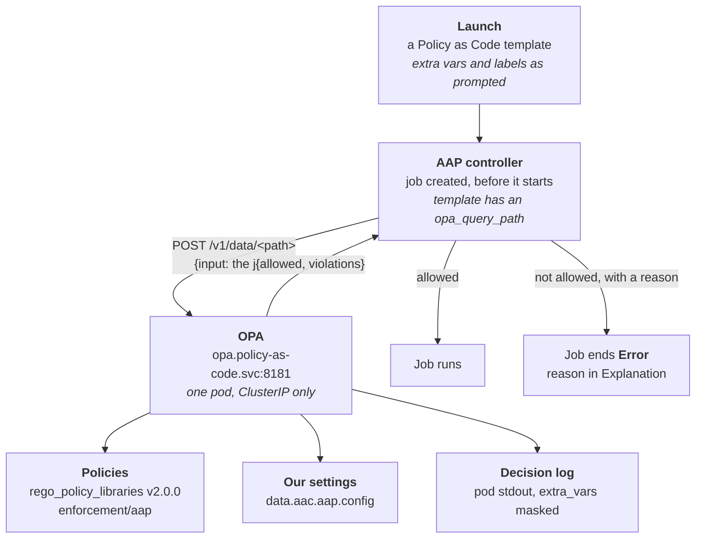

# Architecture — Policy as Code

Reference for the presenter. What exists, what builds what, and how long each
part takes.

This describes the demo as it is *shown*. For **why** it is built this way —
including what was measured and what was reversed — read
[sales.demos#841](https://github.com/ericcames/sales.demos/issues/841).

---

## The flow

Non-obvious things about the flow:

- **AAP sends the whole job.** Who launched it, the template, inventory,
  organization, credentials, labels, extra vars and creation time. Each rule
  reads only the fields it needs.
- **A job is blocked only when `allowed` is false *and* `violations` is
  non-empty.** A policy answering `{"allowed": false, "violations": []}` lets
  the job run.
- **No Route.** AAP runs on the same cluster and reaches OPA by Service DNS.
  Nothing about the policy server is exposed outside the cluster.
- **Launch labels are merged with the template's.** A job launched with
  `break-glass` carries `break-glass` *and* `policy`, and OPA sees both.
- **Fail-closed, but only where attached.** No query path, no call. A dead
  OPA cannot affect a template that has no rule attached.

---

## Inputs

| Question | Variable | Choices | Default |
|---|---|---|---|
| Which policy library release | `policy_library_version` | any tag of `rego_policy_libraries` | `v2.0.0` |
| Whose clock the change window uses | `policy_change_window_timezone` | any IANA zone, set per SE in `local.yml` | `America/Phoenix` |

Deliberately absent: an option to attach rules at **organization** level. The
library denies superuser launches by default and this platform runs as admin,
so an org-level rule would block `config.yml` and every VM workflow.

---

## What gets created

| Resource | Purpose |
|---|---|
| Namespace `policy-as-code` | Holds everything below |
| ConfigMap `opa-policies` | The library's `enforcement/aap/` files at the pinned tag, plus its tests |
| ConfigMap `opa-config` | Our settings (`data.json`) and the decision-log mask with its tests |
| Deployment `opa` | One pod. Two initContainers run the library's tests (47) and the mask's tests (4); a failure stops the rollout and the old pod keeps serving |
| Service `opa` | ClusterIP on 8181 |

---

## What AAP holds

| Type | Name |
|---|---|
| Setting | `OPA_HOST` = `opa.policy-as-code.svc.cluster.local`, `OPA_PORT` = `8181` |
| Job template | `Policy as Code - Hello` → `extra_vars_control` |
| Job template | `Policy as Code - Canary` → `deny_all` |
| Job template | `Policy as Code - Change Window` → `maintenance_window` |
| Job template | `Policy as Code - Change Ticket` → `required_labels` |
| Job template | `AAP Ecosystem - Install Policy Server` |
| Label | `policy` (on every demo template), `break-glass`, `change-ticket:CHG0012345` (launch-time only) |
| User / team | `policy-demo` in `app-team`, Execute on the four demo templates only |

The `opa_query_path` on each template is set by `install_opa.yml` through the
controller API — no collection module accepts the field yet.

---

## Timing

Measured on sandbox, 2026-10-02.

| Step | Time |
|---|---|
| OPA evaluating one decision | 0.4–0.6 ms (`timer_server_handler_ns` in the decision log) |
| Blocked launch, created → finished | 0.75 s (job 164); 6.4 s to reach OPA on job 141 — the difference is AAP's own queue, not the policy |
| `install_opa.yml`, end to end | Not measured |

Footprint: the OPA image is 85 MB; the pod requests 50m CPU and 128 MiB.

---

## What does not work yet

- **`owner_scope` (team-based rules)** — waits for a library release that
  includes [ynotbhatc/rego_policy_libraries#161](https://github.com/ynotbhatc/rego_policy_libraries/pull/161),
  which taught the library AAP 2.7's team format.
- **A label is a marker, not a permission** — anyone who can see the
  organization can apply `break-glass`. See [objections](objections.md).
- **Overnight change windows** — the library checks day and hour separately
  against the calendar date, so a window spanning midnight into Monday cannot
  be expressed. Raised upstream on #841.
- **The UI launch prompts** have not been rehearsed; every beat was proven
  through the API.

---

## Cleanup

| Destroyed | Preserved |
|---|---|
| Clear `opa_query_path` on a template and it runs unguarded | `OPA_HOST` — harmless with nothing attached |
| Delete namespace `policy-as-code` to remove the server — **clear the paths first**, or the guarded templates fail closed | The templates, labels and `policy-demo` user (config-as-code) |
