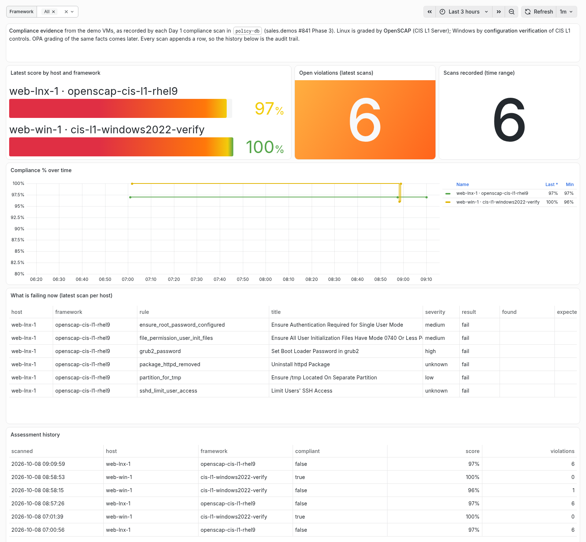

# Talk track — Policy as Code

**Rehearse from this. Present from [`run-sheet.md`](run-sheet.md).**

Nothing is rendered offline yet — every beat needs AAP with the OPA server
deployed. The verbatim AAP messages below were captured on sandbox, so you
can rehearse the words without a cluster.

---

## Who is in the room

**You are the pre-sales engineer.** Every document in this folder is written to
you.

**They are one of three rooms**, and the same four beats serve all three. Decide
which room you are in before you start, and spend your extra minute there.

| Room | Who | Lean on | They care intensely about |
|---|---|---|---|
| **Governance** | Automation leads, change managers, the CAB | Change Window, Change Ticket | Change control that is enforced, not requested; an audit trail that needs no reconstruction |
| **Platform** | Platform engineers who would run it | Canary, What OPA saw | How it fails, what it costs, who owns the rules, and that it does not slow every job |
| **Security** | Security and compliance | Hello, What OPA saw | Secrets kept out of records and logs; evidence a control actually ran |

| Nobody in any room cares about | Everyone cares about |
|---|---|
| Rego syntax | That the rule is enforced before the job starts, not reported after |
| OPA internals | That the reason is readable by the person who was blocked |
| A library of 638 policies | That *their* rule could be written down this way |

**Act 2, "Prove the state", is optional (+5 minutes).** Act 1 stops a bad
change before it starts; Act 2 shows the evidence of what the machines
actually look like. Run it for the governance and security rooms, or whenever
someone says *"auditors"*. Skip it for a platform room that only came for
enforcement.

Three delivery notes:

- **Do not open with OPA.** Open with the question AAP asks. OPA is the answer
  to "where do the rules live", and only the platform room asks it unprompted.
- **Never call `break-glass` RBAC-protected.** It is a marker. The honest-bits
  beat says so; do not undermine it earlier.
- **Do not claim a support status** for AAP's Policy as Code feature unless you
  have checked it for the version in front of you. This demo proves it works
  on AAP 2.7 (controller 4.8.6); it does not prove what Red Hat supports.

---

## Beat 1 · The question AAP now asks (0–2)

On screen: the Templates page filtered on label `compliance` and searched for
`Policy as Code`. The label is shared with Compliance as Code
(sales.demos#893), so the search narrows it to the four.

> **"Before any of these starts, AAP asks a policy server one question: may
> this job run? If the answer is no, it does not start — and it tells you
> why."**

> **"The rules are not in AAP. They are in a separate policy engine — Open
> Policy Agent — and they are written as code, tested, versioned and reviewed
> like anything else you automate."**

**Why this beat exists.** It names the whole idea in two sentences before
anything is shown, so each later beat is an instance of it rather than a new
concept. The second sentence is the one the platform room remembers.

**Transition:** *"Let me show you the simplest rule there is."*

---

## Beat 2 · A secret in extra vars (2–5)

Launch **Policy as Code - Hello** with `greeting: hello` — it runs. Launch it
again with `db_password: not-a-real-one` added — it ends **Error** before any
pod starts, and the Explanation reads:

```
This job cannot be executed due to a policy violation or error. See the following details:
{'Violations': {'Job template': ["extra_var 'db_password' looks like a secret "
                                 '— pass it through a credential or Ansible '
                                 'Vault, not extra_vars.']}}
```

> **"Same template, same person. The only difference is what was typed. That
> password would have sat in the job record for ever — now the job never
> starts, and the person who typed it is told exactly what to do instead."**

**Why this beat exists.** It is the smallest possible proof: one rule, two
launches, one difference. Everyone in every room has seen a password in an
extra var. The *reason* — readable, actionable, aimed at the person who was
blocked — is the thing to point at; it is what separates a control from an
error.

**Security room:** stay here an extra minute. The rule matches on the
variable's *name*, so it catches the habit before the value matters.

**Transition:** *"Now — how would you know if this stopped working?"*

---

## Beat 3 · The canary (5–7)

Launch **Policy as Code - Canary** — **Error**: *"All automation is blocked:
this is the Policy as Code wiring canary — if you can read this in AAP, OPA is
answering."*

> **"This one is wired to say no to everything. If it ever runs, the
> enforcement is off — and we find out from the canary, not from a rule that
> quietly let something through."**

**Why this beat exists.** Policies here default a missing field to *allowed*,
so broken wiring looks exactly like a permissive policy. The canary is the
answer to the platform room's first real question — "how do I know it's on?"
— asked before they ask it. The idea came from the policy library's
maintainer.

**Platform room:** the same rule, attached to an *organization*, is an
incident switch — one change halts every job in it. Say it; never do it live.

**Transition:** *"That's wiring. Here's a rule your change board would write."*

---

## Beat 4 · The change window, and break glass (7–11)

Launch **Policy as Code - Change Window** with no labels — **Error**:

> *"Friday is not an approved day for automation (allowed: ["Saturday", "Sunday"])."*

> **"Production changes happen at the weekend. It's a weekday, so this job
> waits — no matter who launches it, no matter how urgent it feels."**

Launch again, choose the label **`break-glass`** — it runs, and the finished
job carries labels `break-glass` and `compliance`.

> **"Emergencies happen, so the override exists. It's one label — and the
> label stays on the job. Every time someone broke glass is on the record,
> with who and when."**

**Why this beat exists.** It turns a policy document — "no production changes
during the week" — into something the platform enforces. The break-glass half
matters as much as the block: a control with no override gets routed around,
and an override that leaves a record is the one an auditor accepts.

**Governance room:** this is your beat. Ask what their change window is.

**Careful.** The window is evaluated in `policy_change_window_timezone` (Phoenix
by default) against the job's creation time. On a weekend there, this job
runs. Say so if it happens — that is the rule working.

**Transition:** *"A window says when. Most change processes also say which
change."*

---

## Beat 5 · The change ticket (11–14)

Launch **Policy as Code - Change Ticket** with no labels — **Error**:

> *"Label 'change-ticket' is required in 'key:value' form matching ^CHG[0-9]{7}$, but no value was supplied."*

Launch again with **`change-ticket:CHG0012345`** — it runs, with the ticket on
the job.

> **"No change record, no change. And because the ticket is on the job, audit
> can go from a job to its change record — and from a change record to every
> job that ran under it."**

A malformed ticket — `change-ticket:12345` — is refused with the expected
format in the reason. Describe it rather than create it: AAP labels cannot be
deleted.

**Why this beat exists.** It connects AAP to the system the governance room
already lives in. The format is ServiceNow's change-number shape on purpose.

**Transition:** *"So where does all this go?"*

---

## Beat 6 · What OPA saw (14–16)

The OPA pod log, filtered on `Decision Log`. One line per decision, carrying
the full input AAP sent — who launched, which template, inventory,
organization, labels — and the answer.

> **"Every decision is logged with exactly what it was asked. Notice the
> password: the key is there, the value is not. We know what happened without
> keeping what was typed."**

**Why this beat exists.** It answers "prove it ran" for the security room and
"how do I debug a rule" for the platform room in one screen. The masking is
ours, not OPA's default — unmasked, the demo's own password sat in this log in
plain text, and we found it by looking.

**Transition:** *"Let me tell you what this doesn't do."*

---

## Beat 7 · The honest bits (16–18)

Step away from the keyboard. Pick two.

> **"First: a label is a marker, not a permission. Anyone who can see the
> organization can apply `break-glass`. Today it buys you a record, not a
> restriction. Making it a privilege means the policy also checks who
> launched — we've proposed exactly that upstream."**

> **"Second: only jobs are checked. Workflows, project syncs and inventory
> syncs are not — although every job inside a workflow is."**

> **"Third: where a rule is attached, it fails closed. If the policy server is
> down, guarded jobs don't run. That's the right default for a control — and
> it's why you attach rules deliberately, template by template, not to a
> whole organization on day one."**

**Why this beat exists.** The first point is the one a sharp governance
person finds on their own in the next meeting; being first to it is worth more
than the break-glass beat itself.

---

## Beat 8 · Close (18–20)

> **"Your change rules, your secret-handling rules — written down once, tested,
> versioned, and enforced before the job starts, with the reason in front of
> the person who was stopped."**

Then **one** question, chosen for the room:

- Governance: *"Which of your change rules lives in a document today, rather
  than in the platform?"*
- Platform: *"Who would own the rules — your platform team, or security?"*
- Security: *"What would you want blocked first?"*

---

**Running Act 2?** Don't ask the closing question yet. Bridge instead:

> **"That's half of it. Stopping a bad change is one thing — proving what your
> machines actually look like is the other half, and it's the half your
> auditors ask for."**

---

## Act 2 · Prove the state (optional, 20–25)

Act 1 answered *"may this change run?"* Act 2 answers *"is it compliant
right now, and can you prove it?"* It's the other half the policy library's
maintainer describes: gating changes, and evaluating state. Evaluating state
is most of the real-world work.



### Beat 9 · Every scan leaves evidence (20–21)

On screen: the **Jobs** page, the last **Linux Day 1 - 4 Compliance Scan**.

> **"Every time we scan a machine, the result isn't just a report on that
> machine. It's written into an evidence store: a dated row per scan, with
> every rule's result. Nobody has to remember to save it."**

**Why this beat exists.** The scans already existed in the Day 1 workflow.
What's new is that they *accumulate*. An audit trail is built as a side
effect of normal operation, not assembled the week before the auditor arrives.

**Transition:** *"And here's what that looks like to someone who isn't in
AAP."*

### Beat 10 · The dashboard anyone can open (21–24)

Open the dashboard link. **No login.**

> **"This is a plain link. I can send it to your audit team; they don't need
> an AAP account or any training. Latest score per machine, what's failing
> right now, and every scan we've ever recorded."**

Point at **What is failing now**. The RHEL guest fails 6 CIS Level 1 rules,
each with the benchmark's own title and severity:

> **"Six failures on a hardened image. Five are exceptions the image factory
> made on purpose, each with a written reason. A boot-loader password and a
> root password are meaningless on a cloud VM, and the users these rules
> check don't exist yet when the image is built. The sixth is
> `package_httpd_removed`: we installed a web server, because that's this
> machine's job. That's the conversation an auditor actually wants. Not 'are
> you at 100%', but 'is every gap known, and does someone own it'."**

Then **Compliance % over time** and **Assessment history**. The Windows line
holds at 100%, steps down to 96%, and steps back up:

> **"Here somebody weakened a domain-security setting on this server — CIS
> 2.3.6.6, the strong session key. The next scan caught it: 96%, the control
> named, the value it found and the value it expected. Then it was fixed and
> scanned again: back to 100%. Every step is a row here and a job in AAP, with
> a timestamp. That's the audit trail, and nobody wrote it by hand."**

**Why this beat exists.** It turns compliance from a report someone runs into
a record that's always current, and it puts that record in front of people
who never log into automation.

**Security room:** stay on the Windows row. 100% across 28 verified controls,
plus 16 documented exceptions, each named.

**Optional live moment (adds about two minutes):** launch the **Windows Day 2
- 0 Break Fix** workflow at the start of Beat 9. It breaks CIS 2.3.6.6, scans,
fixes it and scans again in about 2 minutes. Refresh the dashboard here and
the dip and recovery appear as you talk. For something quicker, **Linux Day 1
- 4 Compliance Scan** adds one row in about 50 seconds.

### Beat 11 · The honest bits, Act 2 (24–25)

Pick one:

> **"These scores come from the scanners, OpenSCAP on Linux and a
> configuration check on Windows, not from the policy engine yet. Grading the
> same facts with the policy library is the next step, and we've found the
> library needs every input present before it can be trusted to say
> 'compliant'."**

> **"The link is open to anyone who has it. What protects the data is the
> database: the dashboard can only read the evidence, and we test on every
> install that a write is refused. In production you'd put your single
> sign-on in front of it."**

> **"This demo environment is temporary, and the evidence goes with it.
> Exporting a dated evidence bundle somewhere permanent isn't built yet."**

**Close for Act 2:**

- *"Where does the evidence you hand an auditor come from today, and how
  old is it when they get it?"*

---

## If you only get ten minutes

Keep **Beat 1**, **Beat 2** (Hello) and **Beat 4** (Change Window with break
glass), then the first honest bit. Drop the canary, the ticket and the log.

---

## Where the words come from

| Claim | Source |
|---|---|
| AAP asks OPA before a job starts; only jobs are evaluated; fail-closed where a path is attached | `inventory/group_vars/aap/opa_policy.yml` (header, read from [`awx/main/tasks/policy.py`](https://github.com/ansible/awx/blob/devel/awx/main/tasks/policy.py), #841) |
| The rules come from `ynotbhatc/rego_policy_libraries`, pinned to a tag, tested on every rollout | `inventory/group_vars/aap/opa_policy.yml` (`policy_library_version`), `playbooks/install_opa.yml` (`opa-test` initContainer) |
| Hello is blocked with `db_password`, runs without it | `inventory/group_vars/aap/controller_templates.yml`, `playbooks/policy_demo_hello.yml`, sales.demos#841 jobs 115/116 and 141 |
| The canary always blocks; `deny_all` at org level halts everything | `inventory/group_vars/aap/opa_policy.yml` (`deny_all`), sales.demos#841 jobs 131/133 |
| Change window is weekends only in `policy_change_window_timezone`; Friday message verbatim | `inventory/group_vars/aap/opa_policy.yml` (`maintenance_window`), sales.demos#841 job 164 |
| `break-glass` lets the job run and stays on the job | `inventory/group_vars/aap/controller_labels.yml`, sales.demos#841 job 165 |
| A label is a marker, not a permission | `inventory/group_vars/aap/controller_labels.yml` (launch-time labels comment, `LabelAccess` in [`access.py`](https://github.com/ansible/awx/blob/devel/awx/main/access.py)), sales.demos#846 |
| Change ticket required in `CHG` + 7 digits form; message verbatim | `inventory/group_vars/aap/opa_policy.yml` (`labels`), `playbooks/install_opa.yml` (change-ticket asserts), sales.demos#841 jobs 179/180 |
| The decision log keeps the key and redacts the value | `playbooks/files/opa/decision_log_mask.rego`, `playbooks/install_opa.yml` (log assert), sales.demos#844 |
| Rules are attached per template, never at organization level | `inventory/group_vars/aap/opa_policy.yml` (`opa_policy_associations`) |
| The canary was the library maintainer's suggestion | sales.demos#841 (review comment) |
| Gating changes and evaluating state are the two halves; evaluating state is most of the work | The policy library maintainer, 2026-10-07 meeting on sales.demos#841 |
| Every Day 1 compliance scan writes a dated assessment and the per-rule results to the evidence store | `playbooks/tasks/record_compliance_evidence.yml`, `playbooks/linux_compliance_scan.yml`, `playbooks/windows_compliance_scan.yml`, sales.demos#857 (jobs 321/322) |
| RHEL guest: 97%, 6 failing rules; Windows: 100%, 28 controls, 16 exceptions | sales.demos#857 (assessments 3 and 4) |
| Five of the six Linux failures are documented image-factory exemptions; the sixth is the installed web server | [`image.builder.pipeline/playbooks/vars/exempt_controls.yml`](https://github.com/ericcames/image.builder.pipeline/blob/16826028aebf8de7fe963bb5247eee0153516b19/playbooks/vars/exempt_controls.yml), `playbooks/roles/linux_configure/tasks/main.yml` (installs `httpd`) in sales.demos |
| The dashboard opens with no login; anonymous visitors can only read, and a write is refused on every install | `playbooks/install_policy_dashboard.yml` (anonymous-write assert), sales.demos#859 (job 328) |
| A Linux scan takes about 50 seconds | sales.demos#857 (job 321: 52 s) |
| Linux failures carry the benchmark's title and severity | `playbooks/linux_compliance_scan.yml` (rule parser), sales.demos#865 (assessment 8) |
| Break/fix: Windows 100% → 96% (CIS 2.3.6.6, found 0, expected 1) → 100% | `playbooks/break_windows_compliance.yml`, `playbooks/fix_windows_compliance.yml`, `Windows Day 2 - 0 Break Fix` in `inventory/group_vars/aap/controller_workflows.yml`, workflow 332 (assessments 6 and 7) |
| Scores come from OpenSCAP and configuration verification, not OPA | `playbooks/files/grafana/compliance-evidence.json` (header text), sales.demos#857 |
| OPA grading needs every input present; three `cis_rhel9` sections pass on empty input | sales.demos#851 (research comment) |
| Evidence is not exported off-cluster yet | sales.demos#841 Phase 3 §3d (open) |
