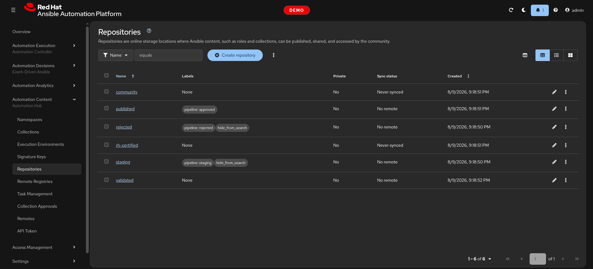
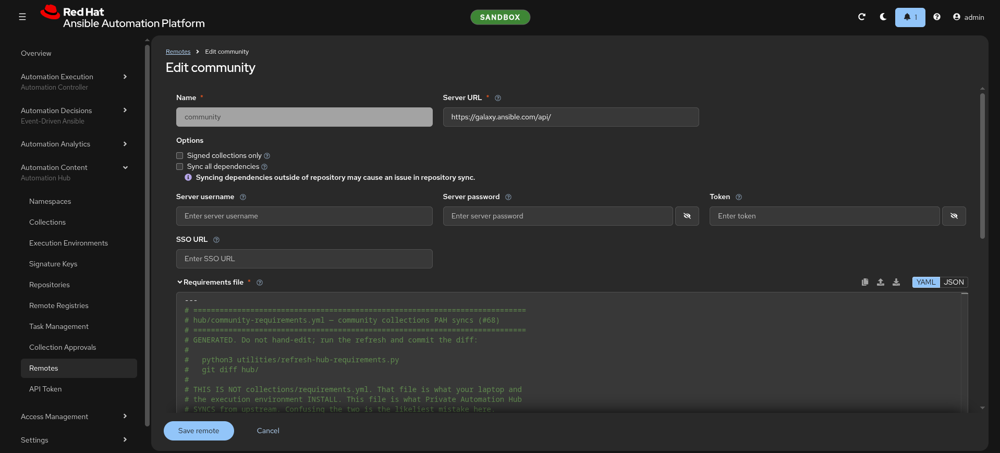
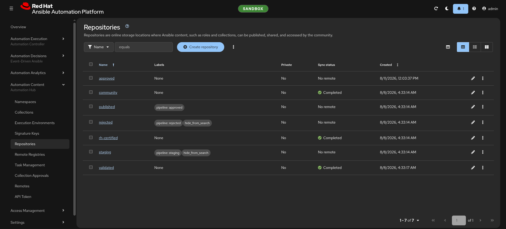
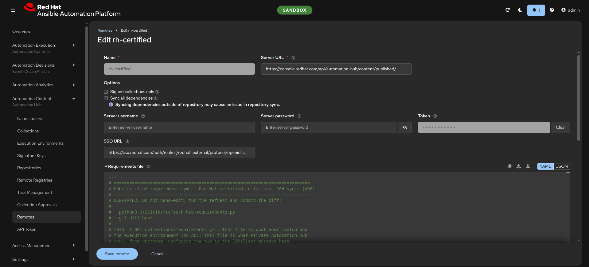

# ClickOps walkthrough — Private Automation Hub

**Reference for the manual half of the demo.** Every screen, every field, every
value. Keep it open in a second tab while presenting; the condensed live version
is beat 2 of [`run-sheet.md`](run-sheet.md).

This is a **real, working procedure**, not a strawman. If you never adopted the
config-as-code half, this is genuinely how you would configure a Private
Automation Hub, and it is what most people are doing today. The demo's argument
is not that this is wrong — it is that nothing here writes down what you did.

> **A sixth document, on purpose.** The five-file template has no slot for this,
> and the run sheet has to stay scannable by someone standing up mid-sentence.

---

## Getting there

Private Automation Hub is **not a separate URL**. AAP 2.6's gateway fronts it by
path on the same hostname:

```
https://<aap_hostname>/hub/
```

Log in with the same account as AAP itself. Left nav: **Automation Content**.

| Left nav item | What it is |
|---|---|
| *Collections* | What is actually in your hub |
| *Repositories* | The four containers — `published`, `rh-certified`, `validated`, `community` |
| *Remotes* | Where each repository fetches from. **This is the one you edit** |
| *Remote registries* / *Execution environments* | The container-image side |

**All three remotes already exist on a fresh install.** You are editing stock
objects, never creating them — worth saying out loud, because people expect to
have to build this.

---

## Step 1 — Show it empty

*Automation Content → Repositories*. `rh-certified`, `validated`, `community`
all show **Never synced**.



> "This ships with your subscription. This is what it looks like on nearly every
> install I see."

---

## Step 2 — Edit the community remote

*Automation Content → Remotes* → row `community` → **⋮ → Edit**.



Do `community` rather than `rh-certified` for the live portion: it needs **no
credential**, so nothing has to be hidden from the projector and no token can
expire mid-demo.

| Field | Value | Say this |
|---|---|---|
| **Name** | `community` | Fixed. Stock object |
| **URL** | `https://galaxy.ansible.com/api/` | Already correct |
| **Proxy URL / username / password** | leave blank | "Most enterprises need this. Three more fields, per hub" |
| **TLS validation** | leave **checked** | |
| **Client certificate / key** | leave blank | mTLS to an internal mirror lives here |
| **Requirements file** | **paste the block below** | The field that matters |
| **Download concurrency** | `10` | |
| **Rate limit** | `8` | "Remember this number" — beat 4 changes it |
| **Signed only** | leave **unchecked** | Signing is not configured here |

### The requirements file to paste

```yaml
---
collections:
  - name: ericcames.aap_as_code
    version: "1.0.2"
  - name: ericcames.aap_as_code_start_kit
    version: "1.0.0"
  - name: ericcames.demo_datacenter
    version: "1.0.0"
  - name: ericcames.f5_daily_demo
    version: "1.0.0"
  - name: ericcames.f5dailydemo
    version: "0.0.5"
  - name: ericcames.hashicorp_daily_demo
    version: "1.0.1"
  - name: ericcames.linux_daily_demo
    version: "0.0.1"
  - name: ericcames.panos_daily_demo
    version: "1.0.0"
  - name: ericcames.satellite_dailydemo
    version: "0.0.0"
  - name: ericcames.windows_daily_demo
    version: "1.0.0"
  - name: mlowcher61.appviewx_certplus
    version: "1.0.0"
  - name: mlowcher61.ivanti_itsm
    version: "0.2.2"
  - name: mlowcher61.metricstream_grc
    version: "0.1.0"
  - name: mlowcher61.netskope
    version: "0.3.1"
  - name: mlowcher61.rapid7_vulnerability
    version: "0.1.1"
```

**Pause on the versions.** Someone always asks why they are pinned:

> "Because there is no 'newest three' setting. Ask for a collection by name and
> you get every version ever published — some of these have forty. The only way
> to bound it is to say which ones."

Click **Save**.

---

## Step 3 — Sync it

*Repositories* → `community` → **⋮ → Sync**.

A task starts. Under a minute for these fifteen. All three repositories together
measured 4.4 minutes, and certified is the bulk of it — still too long to watch
in a thirty-minute slot, which is why you sync before rather than during.

*Collections* now shows fifteen entries, one version each.



---

## Step 4 — The count

Out loud, while it syncs:

- **1** remote configured
- **6** fields touched
- **2** screens
- **~4 minutes**
- **0** record of any of it

> "That is not bad. That is genuinely fine — for one hub, once."

Then the turn:

> "Now do that in dev, in test, and at the DR site. Identically. And in six
> months tell me what the rate limit was set to today."

---

## What the certified remote would need

Do not do this live — it needs a real credential on screen. Describe it.



| Field | Value |
|---|---|
| **URL** | `https://console.redhat.com/api/automation-hub/content/published/` |
| **Auth URL** | `https://sso.redhat.com/auth/realms/redhat-external/protocol/openid-connect/token` |
| **Token** | the Red Hat **offline token** from `console.redhat.com/ansible/automation-hub/token` |
| **Requirements file** | 214 collections with `>=` floors |

Validated is identical but with `.../content/validated/`.


**Two things worth flagging here**, because both bite people:

1. **That token is not your hub's API token.** It points outward, to Red Hat.
   See the three-token table in [`architecture.md`](architecture.md).
2. **Nobody hand-types 214 collections into a textarea.** This is the point at
   which the manual path stops being merely tedious and starts being
   impossible — which is a better argument than anything about speed.

---

## What has to happen on every other hub

The honest full list, per environment:

1. Edit three remotes
2. Paste three requirements files, one of them 214 entries long
3. Set the offline token on two of them
4. Trigger three syncs
5. Remember to redo all of it when the token rotates or a version window moves

---

## Pointing your laptop at the hub

Once the hub is populated, you still have to tell `ansible-galaxy` to use it.
That lives in `~/.ansible.cfg` — **the home directory, not the project
directory**. Ansible picks one config file and does not merge, so a project-local
`ansible.cfg` shadows everything in `~/.ansible.cfg`, including the Red Hat
offline token that syncs certified content. The home-directory file is the one
authoritative location.

```ini
[galaxy]
server_list = my_pah, galaxy

[galaxy_server.my_pah]
url = https://<aap_hostname>/api/galaxy/content/approved/
token = <your PAH API token>

[galaxy_server.galaxy]
url = https://galaxy.ansible.com/api/

[galaxy_server.rh_certified]
url = https://console.redhat.com/api/automation-hub/content/published/
auth_url = https://sso.redhat.com/auth/realms/redhat-external/protocol/openid-connect/token
token = <your Red Hat offline token>
```

The order in `server_list` matters — Ansible tries them left to right. With
`my_pah` first, `ansible-galaxy collection install` resolves from your hub
before falling back to public Galaxy.

Three things worth noting:

- **Point at `approved`, not the mirrors.** `approved` holds exactly the
  versions you declared, and it is the only repository where removal works.
  `rh-certified` carries every version inside the window; `community` never
  removes anything.
- **The token here is Token 2** — your hub's API token, from *Collections →
  API token* in the PAH UI. It is *not* the Red Hat offline token
  (`rh_certified`), which points outward to sync content *into* the hub. See
  the three-token table in [`architecture.md`](architecture.md).
- **The `rh_certified` section is already there** if you have ever installed a
  certified collection from `console.redhat.com`. That section stays — it is
  what `sync_hub.yml` reads when populating the hub. The new section above it
  is what makes your day-to-day installs resolve from *your* hub instead.

---

## Restoring the demo afterwards

The UI edits above are overwritten the next time the config-as-code runs, which
*is* the demo. But to reset deliberately:

```bash
ansible-playbook playbooks/sync_hub.yml -i inventory --limit sandbox \
  -e target_env=sandbox -e hub_sync_enabled_override=false \
  --vault-id sales.demos@~/secrets/.vault_pass_sales_demos
```

`hub_sync_enabled_override=false` re-applies the remote and repository
configuration without starting a sync — seconds rather than minutes.
