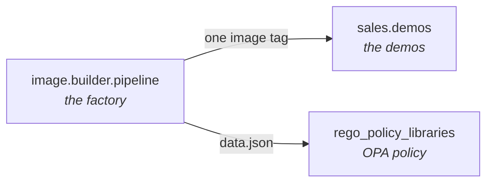

# Image Factory

The [`image.builder.pipeline`](https://github.com/ericcames/image.builder.pipeline)
repo builds the machine images the demos run on — and, just as deliberately, the
evidence that they are hardened.

Hardening an image is the straightforward half. Proving it *stayed* hardened is
the half that gets asked about with a customer in the room, and that is what
most of this section is about.

!!! tip "The 60-second version"
    A CIS-hardened RHEL 9 image and a CIS-hardened Windows Server 2022 image are
    built from code, published to a registry, and pulled by OpenShift
    Virtualization as boot sources. A scheduled GitHub Action rebuilds the RHEL
    one every month so it never falls behind errata. Neither image is trusted on
    its label: one is scored by OpenSCAP against a numeric gate, the other is
    read off the disk before it is allowed to claim a compliance level.

## Who this section is for

| You are | Start here |
|---|---|
| Presenting a demo and asked "where does that image come from?" | This page, then [Compliance evidence](compliance-evidence.md) |
| Asked whether it scales to another OS, benchmark or hypervisor | [Extending it](extending.md) — the honest answer, gaps included |
| Building or publishing an image | [RHEL 9](rhel9.md), [Windows](windows.md), [SNO kit](sno-kit.md) |
| Keeping the scheduled builds running | [Operations](operations.md) |

## What it produces today

| Output | Built by | Where it goes | Evidence |
|---|---|---|---|
| **RHEL 9 CIS L1 containerDisk** | `build_cis_containerdisk.yml` | `quay.io/zigfreed/rhel9-cis-l1-golden` — **public** | Hardened by Image Builder at compose time; the AMI lineage scores **98.07** against a 95 gate |
| **Windows Server 2022 CIS L1 containerDisk** | `build_windows_image.yml` → `publish_windows_containerdisk.yml` | `quay.io/zigfreed/win2k22-cis-l1-golden` — **private** | **27 of 27** controls on a booted clone of `20260908-1853`; the label is gated by an offline read of the disk |
| **RHEL 9 CIS L1 AMI** | `build_cis_image.yml` → `deploy_and_scan.yml` → `generate_policy_data.yml` | AWS, shared from Red Hat's Image Builder account `463606842039` | OpenSCAP **98.07** (gate 95), 254 pass / 5 fail, all 5 documented exempt |
| **Single-node OpenShift installer ISO** | `build_sno_installer.yml` | **Generated locally** — not published, [on purpose](sno-kit.md#why-this-is-not-published-to-quay) | Booted on real hardware: OCP 4.22.13, all Day 0 operators `Succeeded` |

!!! warning "Published and planned are different things"
    Only the first three rows are published anywhere. The SNO ISO is built on
    the machine that needs it, because the OpenShift pull secret is embedded in
    the ISO's Ignition config and a pull secret is a credential.

    Read every "where it goes" column as a claim that something checked. The
    roadmap in the producer repo also names a Quay repository for an SNO
    installer kit — nothing publishes to it, and [that is a
    decision](sno-kit.md#why-this-is-not-published-to-quay), not an omission.

## Why the images are separate from the demos

`image.builder.pipeline` is the **producer**; [`sales.demos`](https://github.com/ericcames/sales.demos)
is the **consumer**. The dependency only ever runs outward, and the only thing
binding them is **one string** — an image tag.

That split is deliberate. Hardening and compliance evidence have a different
audience and a different lifecycle from running a demo: an image is rebuilt
monthly against errata, a demo is rebuilt whenever a cluster expires. Merging
them would tie both to the faster clock.

In practice a consumer sets one variable — `quay_windows_image` or the RHEL
equivalent — and re-runs a link playbook. **Tags are immutable, so repointing is
the operation; overwriting is not.** A tag that shipped a defect keeps it
forever, which is what makes the tag usable as evidence.

## The three questions this section answers

**"Is it actually hardened?"** → [Compliance evidence](compliance-evidence.md).
Includes the time the answer was *no* while every label said yes, and what was
built so that cannot recur.

**"Does it work for our OS / our benchmark / our hypervisor?"** →
[Extending it](extending.md). Two of the three axes are already variables; one
is not, and the page says which.

**"Who keeps it running?"** → [Operations](operations.md). One scheduled
workflow, three secrets, and the failure modes worth recognising.

## Related

- [OpenShift Virtualization demo](../demos/openshift-virtualization/README.md) — boots what this factory produces
- [Edge / Single Node OpenShift demo](../demos/edge-sno/README.md) — presenting the cluster the [SNO kit](sno-kit.md) installs
- [`docs/design.md`](https://github.com/ericcames/image.builder.pipeline/blob/main/docs/design.md) — the cross-repo contract, cited by section number from three repos
