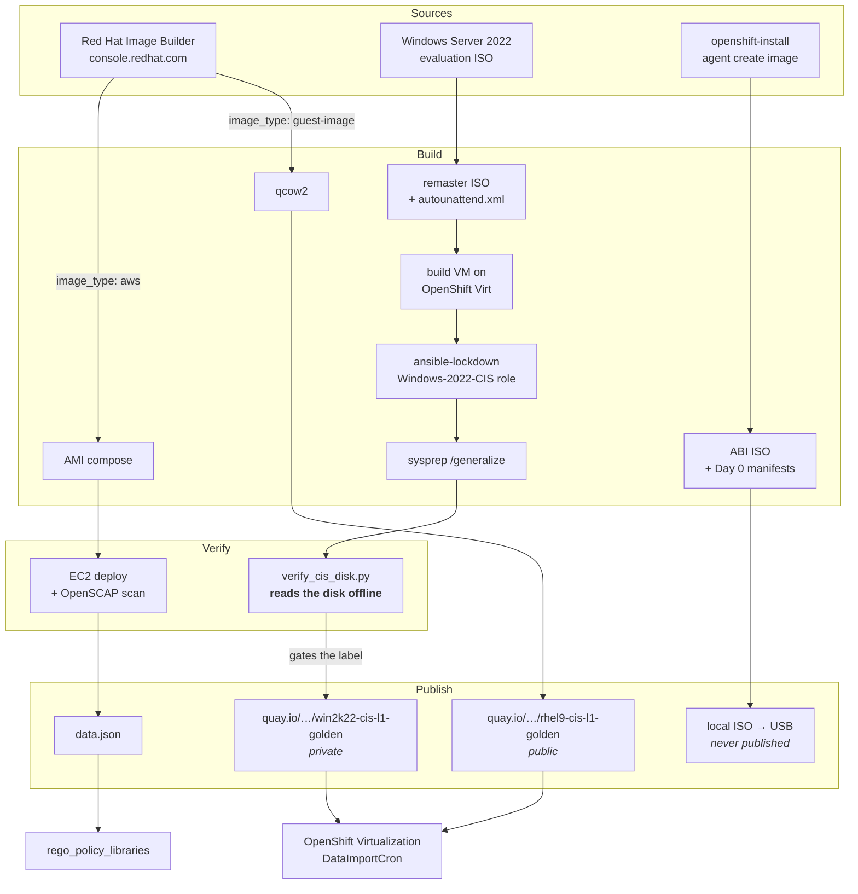

# Architecture

Four output shapes from one repo, sharing two ideas: **build from an API or an
answer file rather than a golden master someone clicked together**, and **never
let an artifact assert its own compliance**.

## The whole picture

## Where each stage runs

This matters more than it looks: the three environments have different
credentials available to them, and that constrains what can be automated.

| Stage | Runs on | Why there |
|---|---|---|
| RHEL compose | Red Hat's Image Builder service | It is an API — nothing local builds the image |
| RHEL containerDisk wrap and push | **GitHub Actions**, monthly | Needs only the Red Hat token and Quay credentials, both storable as Actions secrets |
| RHEL AMI scan | A laptop, against AWS | Needs live AWS credentials and a temporary EC2 instance |
| Windows build | A laptop, against an **OpenShift sandbox cluster** | Needs a KubeVirt cluster to run the build VM. The playbook refuses to run against the demo cluster |
| SNO ISO | A laptop | The pull secret is embedded in the ISO |

The pattern: **the more credentials a stage needs, the less automated it is.**
The RHEL containerDisk is the one path whose entire credential set fits in
GitHub secrets, and it is the only one on a schedule.

## The two verification paths, and why they differ

RHEL and Windows are verified by completely different mechanisms, because
OpenSCAP ships no Windows agent.

=== "RHEL 9 — scored by a scanner"

    Image Builder applies the CIS profile at compose time. The AMI is deployed
    to a throwaway EC2 instance, scanned with OpenSCAP, and the XCCDF results
    are parsed into a score.

    - **Gate:** a numeric threshold — 95, currently met at 98.07
    - **Formula:** `pass / (pass + fail)`, excluding N/A and not-checked
    - **Failures are curated, not hidden:** all 5 remaining fails have written
      rationale in `playbooks/vars/exempt_controls.yml`

=== "Windows 2022 — read off the disk"

    No scanner. Instead `playbooks/scripts/verify_cis_disk.py` mounts the qcow2
    about to be packaged, reads the `SOFTWARE` and `SYSTEM` registry hives, and
    **refuses to apply a CIS level label the disk does not support** — failing
    equally when it cannot reach a verdict.

    - **Gate:** the label itself. It is an output of verification, not an input
      to publishing
    - **Independent second reader:** `sales.demos` has its own
      `utilities/inspect-golden-image.py` for checking a published tag before
      linking it

Both paths obey the same rule, stated once: **desired state is tested, never
trusted.** See [Compliance evidence](compliance-evidence.md) for what happened
the one time it was trusted.

## The tagging contract

Consumers do not match on image *names*, which drift. They match on metadata.

**AMIs** carry tags — `Pipeline=image-builder-pipeline`, `OS=<os>`,
`CIS-Level=L<n>`, `BuildDate`, `ComposeID`. A Terraform `data "aws_ami"` filter
selects on the first three. Breaking them breaks consumers, so it is treated as
a versioned cross-repo contract.

**containerDisks** carry OCI labels — the same information in container-native
form:

| Label | Example | Purpose |
|---|---|---|
| `com.redhat.cis.pipeline` | `image-builder-pipeline` | Provenance |
| `com.redhat.cis.os` | `rhel9`, `windows-2022` | OS identifier |
| `com.redhat.cis.level` | `L1`, or `none` | CIS benchmark level |
| `com.redhat.cis.compose-id` | Image Builder compose UUID | Traceability (RHEL only) |
| `org.opencontainers.image.created` | ISO 8601 | Build date |
| `image-factory/eval-expires` | `YYYY-MM-DD` | **Windows only** — the 180-day evaluation clock, on the artifact |

Two details worth stealing:

**`com.redhat.cis.level` is always stated, never omitted.** An absent label reads
as an oversight. `none` on an unhardened image is a claim, and it is the true
one.

**The evaluation expiry lives on the image.** A note about a 180-day clock,
written on a build VM in a namespace that no longer exists, helps nobody three
months later.

## Credential model

Nothing in this repo stores a credential.

| Credential | Comes from | Notes |
|---|---|---|
| Red Hat offline token | `~/.ansible.cfg`, `[galaxy_server.rh_certified]` | One authoritative copy, shared with Automation Hub |
| AWS access key | Environment variables | **Today.** Planned: from Ansible Product Demos into a vault-encrypted `secrets.yml` |
| Quay credentials | `podman login`, or Actions secrets for the scheduled build | |
| Cluster access for Windows builds | `K8S_AUTH_HOST` / `K8S_AUTH_API_KEY` env vars | Maintained in `sales.demos`, not here |
| OpenShift pull secret | The user, at ISO generation time | Never enters a published artifact |

!!! danger "No credential file on disk"
    A `docs/aws-environment.md` holding a live AWS key in plaintext used to be
    the documented place for "local notes". It was untracked, gitignored, and
    never committed — nothing leaked — but it has been deleted and **the
    practice is retired**. Credentials come from environment variables today
    and from a vault later. Never write one to a file because a document told
    you to.
