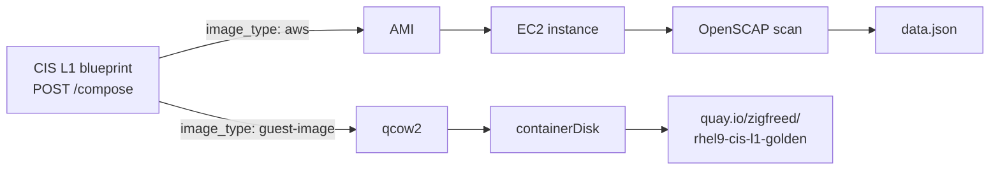

# RHEL 9 CIS Level 1

The RHEL path is the mature one, and it is the easiest to explain: **Red Hat
Image Builder applies the CIS profile at compose time**, so hardening is not a
post-install script that might half-run. The image is born hardened.

Two artifacts come off the same compose API with a different `image_type`.

## The two lineages



| | AMI lineage | containerDisk lineage |
|---|---|---|
| Playbooks | `build_cis_image.yml`, `deploy_and_scan.yml`, `generate_policy_data.yml` | `build_cis_containerdisk.yml` |
| Consumer | AWS, via a Terraform `data "aws_ami"` tag filter | OpenShift Virtualization, via a `DataImportCron` |
| Scanned | **Yes** — real OpenSCAP run on a booted instance | No — inherits the same profile, scan deferred |
| Automated | No — run by hand, needs live AWS credentials | **Yes** — monthly GitHub Action |
| Duration | ~30 min total | 20–35 min |

The profile is identical: `xccdf_org.ssgproject.content_profile_cis_server_l1`.
The AMI lineage is what produces the *number*; the containerDisk lineage is what
the demos actually boot.

## The compliance number, and how it is computed

From the last full end-to-end validation:

| Field | Value |
|---|---|
| Raw compliance score | **98.07** (gate: 95) |
| Pass / Fail / N/A | 254 / 5 / 33 |
| Effective compliance | ~99.6% |

`score = pass / (pass + fail)`, excluding N/A and not-checked. **Exempt rules
still count against the raw score** — the pipeline does not flatter itself by
removing them from the denominator. OPA does the effective-compliance
calculation later, at policy-evaluation time, using the exempt list.

### The five failures are documented, not hidden

Every remaining failure has written rationale in
`playbooks/vars/exempt_controls.yml`:

| Control | Severity | Why it is exempt |
|---|---|---|
| `grub2_password` | high | Cloud VMs lack the console boot path the rule protects |
| `ensure_root_password_configured` | medium | AWS uses `ec2-user` plus SSH keys; a root password is not in the model |
| `file_permission_user_init_files` | medium | The AMI build precedes user creation; the rule applies to deployed instances |
| `partition_for_tmp` | low | EBS AMIs use a single cloud-init-expanded root partition |
| `sshd_limit_user_access` | unknown | SSH access policy is a consumer decision, not a base-OS decision |

!!! note "This is the demo-able part"
    A customer who has sat through compliance demos where the failures were
    quietly filtered out will recognise the difference immediately. The exempt
    list is a **curated artifact with reasons**, reviewed when the benchmark
    changes — not a suppression list. It is also per-OS and per-target: this set
    is curated for RHEL 9 on AWS specifically, and a new target needs its own.

## The scheduled rebuild

`.github/workflows/containerdisk-rebuild.yml`:

- **Schedule:** `cron: "0 6 1 * *"` — 06:00 UTC on the 1st of each month
- **Also:** `workflow_dispatch`, so anyone can trigger it from the Actions tab
- **Does:** installs `ansible-core`, writes the Red Hat token into
  `~/.ansible.cfg`, logs in to Quay, runs `build_cis_containerdisk.yml`
- **Secrets:** `RH_OFFLINE_TOKEN`, `QUAY_USERNAME`, `QUAY_PASSWORD`

This is what keeps the image current with RHEL errata and CIS benchmark updates
with nobody remembering to do it. It is also the **only** scheduled build in the
repo — see [Extending it](extending.md) for why, and what that means for Windows.

```bash
gh workflow run "Rebuild RHEL 9 CIS containerDisk"
gh run list --workflow=containerdisk-rebuild.yml --limit 5
```

Full runbook including failure modes: [Operations](operations.md).

## Building it by hand

**containerDisk** — needs only a Red Hat token and a Quay login:

```bash
podman login quay.io
# QUAY_REPO defaults to quay.io/zigfreed/rhel9-cis-l1-golden
ansible-playbook playbooks/build_cis_containerdisk.yml
```

**AMI** — needs live AWS credentials in the environment:

```bash
export AWS_ACCESS_KEY_ID=<key>
export AWS_SECRET_ACCESS_KEY=<secret>
export AWS_DEFAULT_REGION=us-east-1
export AWS_ACCOUNT_ID=<account-id>

ansible-playbook playbooks/build_cis_image.yml         # ~20 min
ansible-playbook playbooks/deploy_and_scan.yml         # ~5 min
ansible-playbook playbooks/generate_policy_data.yml    # seconds
```

Stage 3 reports the score, the pass/fail breakdown and the exempt count. The
`data.json` lands in `output/rhel9/` and is gitignored.

!!! warning "Credentials go in the environment, never in a file"
    The AWS path reads `AWS_ACCESS_KEY_ID` and friends from environment
    variables and nothing else. Do not create a file to hold them — see
    [Architecture](architecture.md#credential-model).

## Consuming it

`sales.demos` points a cluster at the published tag with
`playbooks/link_rhel9_image.yml`, which creates a `DataImportCron` populating a
`rhel9-cis-l1` DataSource alongside the stock `rhel9`. Terraform then clones the
hardened one by default.

**The quay repository is public**, so no pull secret is needed and other SEs can
consume it directly.

## Where it goes next

RHEL 8, RHEL 10 and CIS L2 are all roadmap items, and the AMI path is genuinely
parameterised for the first of them — but the containerDisk path is not.
[Extending it](extending.md) names exactly which line blocks which.
