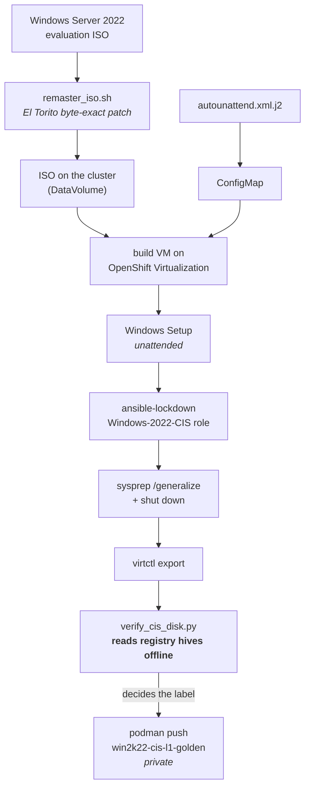

# Windows Server 2022 CIS Level 1

Windows has no Image Builder and no OpenSCAP agent, so almost nothing from the
[RHEL path](rhel9.md) carries over. The image is built the way a Windows image
has to be built — install from media with an answer file, harden the running
system, generalize — and then verified by a mechanism invented for it.

It works end to end. A clone reaches the desktop, `win_ping` succeeds from AAP,
and the published image measures **27 of 27** CIS controls.

## The flow



Roughly 30 minutes, run from a laptop against an **OpenShift sandbox cluster** —
the build needs KubeVirt to run the build VM in.

## Four problems worth knowing about

Each cost real time, and each is now a guard in the playbook rather than a thing
to remember.

### 1. The ISO is UDF, and Windows Setup wants a keypress

The Windows medium is UDF, which `xorriso` reads almost nothing out of — it
returns a single node. And the installer boots to *"Press any key to boot from
CD"*, which no unattended build can answer.

`playbooks/scripts/remaster_iso.sh` patches the El Torito boot entry **in place,
byte-for-byte at the same length**, rather than rebuilding the ISO. Rebuilding
would mean reconstructing a filesystem the tooling cannot fully read.

!!! warning "The keypress was also load-bearing"
    That prompt was the last manual step *and* the thing stopping an infinite
    Setup loop. Removing it required also reverting an earlier fix that had put
    the install CD first precisely because of the prompt. **Before removing a
    manual step, ask what it does on the paths you are not looking at.**

### 2. Four CIS controls break the build that applies them

The [`ansible-lockdown/Windows-2022-CIS`](https://github.com/ansible-lockdown/Windows-2022-CIS)
role is applied over WinRM. Four of its controls kill the WinRM session
mid-run, so the build can never reach sysprep:

| Control | What it does | Why it is fatal during a build |
|---|---|---|
| `2.3.17.1`, `2.3.17.2` | UAC Admin Approval Mode + elevation prompt | NTLM auth dies: *"the specified credentials were rejected by the server"* |
| `18.9.19.4`, `18.9.19.5` | Background security policy refresh | Immediately reprocesses the NTLM and lockout settings applied earlier in the same run — *"Remote end closed connection without response"* |

All four are **safe on a deployed VM and fatal during a build**. They are
disabled in `playbooks/vars/cis_profile.yml`, with the reasoning written beside
them. A further 11 controls are skipped by the role's own `win_skip_for_test`
for the same class of reason — renaming the Administrator account, disabling
WinRM auth methods, enabling the public firewall profile.

!!! note "State this plainly if asked"
    The published image is CIS L1 **with a documented, reasoned exception set**,
    the same as the RHEL image's five exempt controls. The alternative is not a
    purer image; it is no image.

### 3. `sysprep /generalize` strips nothing

This was suspected for two days and is worth knowing, because it is the obvious
explanation for a clone that scores badly and it is **wrong**. The published
image measures 27 of 27 on a booted, sysprepped clone. Hardening survives
generalization.

### 4. A cached answer file outlives the build

Windows caches the answer file in `%WINDIR%\Panther`, and a clone will
re-apply the *producer's* cached copy instead of the consumer's. That, plus a
Secret key naming mismatch and the 15-character NetBIOS `ComputerName` limit,
were three stacked bugs that together blocked the pipeline. All three are fixed
and verified.

## The guards in the publish path

`publish_windows_containerdisk.yml` refuses to run rather than publishing
something wrong:

- **Asserts the CIS verifier can run** before doing any work — a verification
  step that silently no-ops is worse than none
- **Asks the registry whether the repository is public**, and *refuses to
  publish Windows media to a public repository*. Microsoft licensing prohibits
  redistributing Windows media, so this is a licensing guard in code
- **Purges intermediates from a previous run** before converting. A stale local
  qcow2 repackaged by a `creates:`-guarded task is exactly how an unhardened
  disk once got published under a hardened tag
- **Measures free space** and refuses to start if the intermediates will not fit
- **Refuses to build into a namespace that is still terminating**

## Verification

The label is an **observation of the disk, not an input to the publish**.
`playbooks/scripts/verify_cis_disk.py` reads the `SOFTWARE` and `SYSTEM`
registry hives out of the very qcow2 about to be packaged and refuses to apply
an `L1` label the disk does not support — **failing equally when it cannot reach
a verdict**, which is the part that makes it a gate rather than a hint.

It checks 10 controls that **cannot exist on a clean install**, which is the
trick that makes offline verification meaningful: a property that a default
Windows install would also have proves nothing about hardening.

The full story, including the time this was missing and a `cis.level=L1` label
sat on an unhardened disk, is in
[Compliance evidence](compliance-evidence.md#the-time-the-label-was-false).

## Building it

```bash
export K8S_AUTH_HOST=https://api.<cluster>:6443
export K8S_AUTH_API_KEY=<bearer-token>
export WINDOWS_ADMIN_PASSWORD=<password>

ansible-playbook playbooks/build_windows_image.yml
ansible-playbook playbooks/publish_windows_containerdisk.yml
```

The playbook **asserts it is not running against the demo cluster**. Builds
belong on sandbox.

## Consuming it

The quay repository is **private** — Microsoft licensing again — so consumers
need a pull secret. `sales.demos` creates one in
`playbooks/link_windows_image.yml`, which also adds the `DataImportCron` and
imports via an explicit DataVolume.

!!! danger "Repoint, never overwrite"
    Tags are immutable. To move to a new image, set `quay_windows_image` and
    re-run the link playbook. A tag that shipped a defect keeps it forever —
    and that is a feature, because it is what lets a tag be used as evidence.

    The link playbook decides whether to import from **which image is being
    served**, not from whether the DataSource is `Ready`. Ready and Bound are
    both true of the wrong image.

## What it does not do yet

One SKU — Standard, GUI — and no scheduled rebuild. Both are named in
[Extending it](extending.md).
