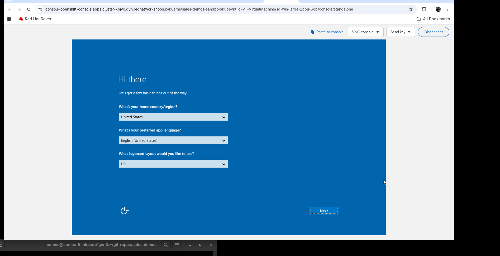
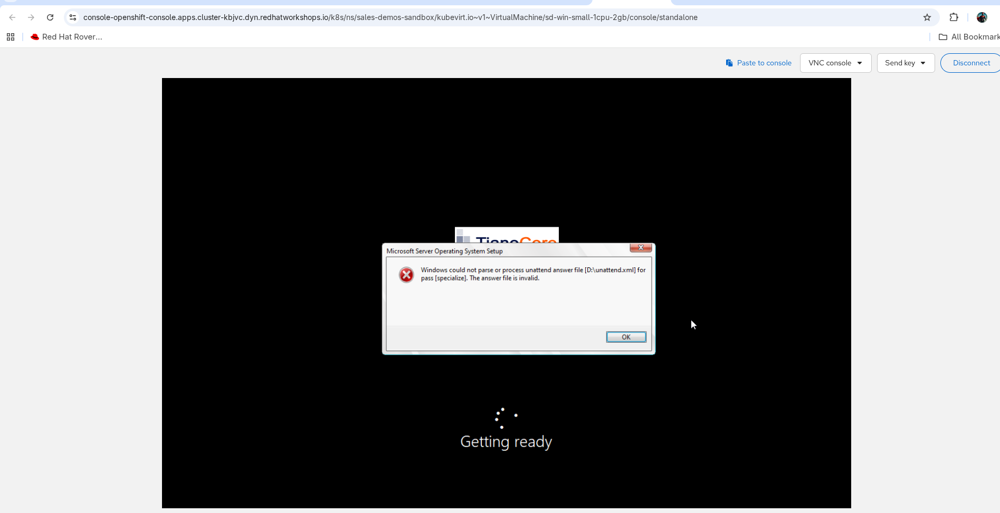
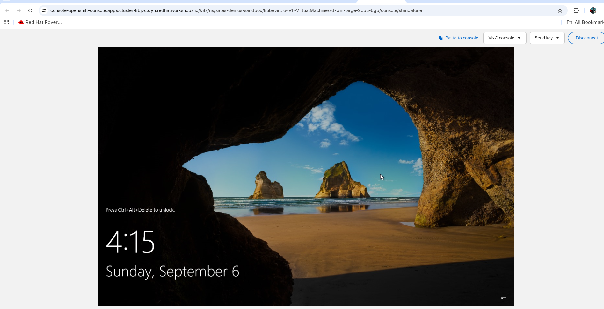
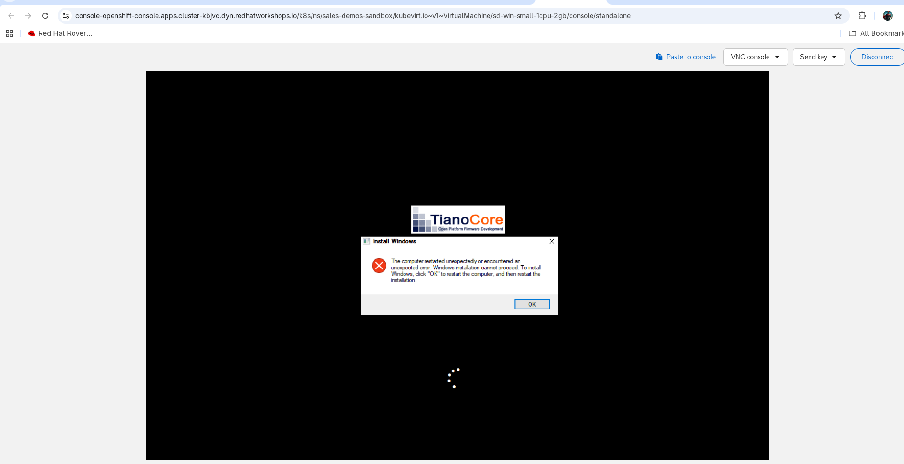

# sales.demos — project history

!!! note "Frozen archive — retired 2026-09-10"

    This is `CHANGELOG.md` from
    [ericcames/sales.demos](https://github.com/ericcames/sales.demos) as it stood
    when the per-PR changelog obligation was retired
    ([sales.demos#432](https://github.com/ericcames/sales.demos/issues/432)).
    Nothing is appended to it again.

    **Bare issue numbers refer to `ericcames/sales.demos`.** They do not autolink
    on this site — read `(#423)` as
    `https://github.com/ericcames/sales.demos/issues/423`. References to other
    repos are written out in full.

    Entries are verbatim and newest first. For anything after 2026-09-10, see
    [where things live now](README.md).

### Changed -- README is a front door again, 944 lines to 236 (#423)

- **It described a repo that no longer existed in six places.** Each was
  checkable against the tree, and each was wrong:
    - `demos/ocpvirt/` was documented as holding "job templates, surveys", and
      the skill/playbook contract table cited
      `demos/ocpvirt/controller_job_templates.yml`. **That file has never
      existed.** The directory held a lone `.gitkeep`; job templates live in
      `inventory/group_vars/aap/controller_templates.yml`. Directory removed.
    - The execution environment was given as `v1.1.0` in three places and
      `v1.0.0` in a fourth. It is **`v1.2.0`**, since #324 added the helm binary
      `playbooks/portal.yml` cannot run without.
    - The Windows golden image was described as unbuilt -- *"until it lands,
      `quay_windows_image` is a placeholder and the link refuses to run"*. All
      three environments carry a real published tag, proven end to end on
      2026-09-06 (#257).
    - *"Phase 3 will drive this same module from AAP; until then it is run by
      hand"* -- contradicted by the README's own table three sections earlier,
      and by `Linux Day 1 - 1 Provision` existing.
    - "verified on AAP 2.6", where the platform is **2.7** (#101).
    - `edge` was missing from six enumerations that said "both environments".
- **Windows was effectively invisible.** The AAP section listed 2 Linux job
  templates. The automation defines **32 live job templates and 4 live
  workflows**, including the entire `Windows Day 1` and `Windows Day 2` stories.
  That is now
  [Running from AAP](https://ericcames.github.io/sales.demos-docs/reference/running-from-aap/).
- **About four sections restated `CONTRIBUTING.md` at greater length** --
  secrets, the leak audit, the skill/playbook contract, verify-in-EE. Deleted
  rather than moved: two copies of a rule is how one of them goes stale, which
  is the whole lesson of the six defects above.
- The skills tables stay in full. CI enforces that every skill appears there,
  and it is the repo's real index -- verified at 20 of 20.

### Added -- `terraform/ocpvirt/README.md` (#423)

- The 145 lines of module reference the README carried: sizing, running it by
  hand, SSH, HTTP, Cockpit, Windows. Module docs belong with the module.
- **Three more stale facts surfaced while writing it**, all from #348 and #389:
    - Tier sizes. The README said `large` is "6 GiB rather than 8". `tiers.yaml`
      says **4 CPU / 16 GiB**. `small` is 2/4 and `medium` is 2/8.
    - `available_memory_gb` was given as 67; the default is **63**, measured on
      sandbox with Automation Orchestrator installed (#118, #141).
    - Outputs were named `web_url`, `cockpit_url`, `ssh_command`. They are
      **plural** -- `web_urls`, `cockpit_urls`, `ssh_commands` -- since VMs come
      in counts (#389).
- **The `*-1cpu-2gb` tier names are retained aliases and no longer describe the
  shape.** `large-2cpu-6gb` provisions 4 CPU and 16 GiB. Said once, explicitly,
  so nobody "helpfully" restores the old numbers. The same tables in the docs
  repo are ericcames/sales.demos-docs#14.

### Fixed -- three documentation claims that had gone stale (#423)

- **`secrets.yml.example` is not "the only `.example` file in the repo"**, and
  has not been since 2026-08-09 -- `terraform/ocpvirt/terraform.tfvars.example`
  shipped with the module in #28 and is tracked. It is legitimate for the same
  reason the other one is. The rule against *proliferating* them stands; the
  count stated as a fact is what went stale, silently.
- **`controller_execution_environments.yml` said this object would move to
  `demos/ocpvirt/` "when it gains a loader in #4".** #4 shipped and it never
  did -- dispatch reads `group_vars` implicitly, so every AAP object landed in
  `group_vars/aap/`. The comment now records what happened rather than a
  prediction that expired.
- **`assets/aap-branding/README.md` said `edge` had no badged logo**, which was
  true when it was written and stopped being true four commits later: #428 added
  the purple one. Corrected to name all three colours and to say what must move
  together when a fourth environment appears -- a colour in `env_colors.py`, a
  generated pair in `assets/aap-branding/`, and a `gateway_settings.yml`.
  `check-env-logos.py` catches the last two automatically and already validates
  the edge pair #428 added; it cannot catch a missing colour.

### Added -- env-urls.yml credentials and secrets guard (#429)

- **`generate-env-urls.py --with-creds`** decrypts the vault and includes
  usernames (from `connection.yml`) and passwords (from `secrets.yml`) in the
  gitignored `inventory/env-urls.yml`. Full cheat sheet: AAP, OCP, Linux VM,
  and Windows VM credentials per environment.
- **`check-no-secrets.sh`** now verifies `inventory/env-urls.yml` is not
  tracked and is covered by `.gitignore`, the same two checks that protect
  `secrets.yml`. With `--with-creds` the file holds plaintext vault
  credentials, so the guard must cover it.

### Added -- edge AAP environment-badged logo (#426)

- **Edge gets a purple sign-in logo** (`#6753AC`), matching the green (sandbox)
  and red (demo) convention. `gateway_settings_edge` sets `custom_logo` via the
  same `file` lookup pattern.
- `env_colors.py` now includes all three environments.
- Browser extension `colors.json` regenerated to include edge.

### Added -- gitignored environment URL reference file (#426)

- **`utilities/generate-env-urls.py`** reads `openshift_apps_domain` from each
  environment's `connection.yml` and writes `inventory/env-urls.yml` with every
  product URL (AAP, OCP Console, OAuth, AO, Portal) per environment. Avoids
  burning MCP tokens rediscovering Route hostnames every Claude session.
- **`inventory/env-urls.yml`** is gitignored. Regenerate after repointing an
  environment: `python3 utilities/generate-env-urls.py`.
- `--check` mode exits non-zero if the file is missing or stale, suitable for
  a preflight check in skills.

### Changed -- docs move to sales.demos-docs; runtime branding gets its own home (#422)

- **`docs/` is gone from this repo.** Talk tracks, run sheets, design plans and
  documentation images now live only in
  [sales.demos-docs](https://github.com/ericcames/sales.demos-docs), which
  absorbed them in that repo's #12. They existed in both repos with nothing
  keeping them in step, and 20 of the 35 shared files had drifted.
- **Tracked content drops from 4933 KB to 1883 KB, a 62% cut.** The point is
  that documentation churn no longer enters this repo's history at all, so AAP's
  SCM project sync stops fetching image churn it never needed. **This speeds up
  subsequent syncs, not the initial clone** -- git history keeps the blobs, and
  `.git` is unchanged at 14 MB. Worth doing for the first reason, not the second.
- **`assets/aap-branding/` is new, and it is not documentation.**
  `inventory/group_vars/<env>/gateway_settings.yml` reads `logo-<env>.png.b64`
  through a `file` lookup **at playbook run time, including from AAP's SCM
  checkout**, and `make-env-logo.py` reads `aap-logo-white.svg` as its source
  artwork. Six files, 92 KB, moved with `git mv` so history follows them.
- **`aap-logo-white.svg` is why the directory exists.** It is byte-identical to
  the copy in the docs repo, so a sweep of "images already duplicated over
  there" would have deleted it and `make-env-logo.py` would have stopped working
  with nothing to explain why. It only looks like a screenshot. Leaving six such
  files behind in a directory named `docs/images/`, immediately after deleting
  21 documentation images from it, is how that happens six months later.
- Every reference repointed: `ROADMAP.md`, `CLAUDE.md`, `README.md`, three
  skills, four playbooks, three `group_vars` files, `secrets.yml.example`, and
  the 14 `utilities/notebooklm-sources.txt` entries -- which name a repo per
  line and would have **failed the run**, not degraded it, since the collector
  exits 1 on a manifest file that does not exist.

### Added -- the generated env logos are verified for the first time (#422)

- `utilities/check-env-logos.py`, wired into the `generated-files` CI job.
  Asserts each `logo-<env>.png.b64` really is the base64 of the `.png` beside
  it, and that every `gateway_settings.yml` lookup path resolves.
- **Nothing checked either half before.** The `generated-files` job already
  says why that matters, about `colors.json`: *"A committed generator output
  that nothing verifies is a copy waiting to drift."* The logos were exactly
  that. Replace the PNG, forget the sidecar, and AAP serves the old logo with
  git looking correct and `config.yml` reporting `changed` as it always does.
- **It deliberately does not regenerate the PNG to compare.** That needs Pillow,
  ImageMagick with librsvg and the Red Hat Display font, and font rasterisation
  is not byte-reproducible across machines -- a regenerate-and-diff check would
  fail on a fontconfig change rather than on real drift. Same reason
  `check-docs-artifacts.py` skips `demo-page.png`. Base64 is deterministic, so
  the half that can be checked exactly, is.
- Proven in both directions before merging: passes clean, and fails on a
  one-character change to a sidecar.

### Changed -- the docs gate now works across the repo boundary (#422)

- `utilities/check-docs-artifacts.py` takes `--docs-root`, and CI checks out
  `ericcames/sales.demos-docs` to point it there. **The script stays here**,
  beside `render-demo-assets.py` and the `linux_configure` role it reads
  templates from; only the markdown moved. One copy, invoked from both repos.
- **This preserves the direction #85 was opened for**: edit `motd.j2` and it
  fails *here*, at the moment the template changes. The honest cost is that such
  a change now needs its paired docs PR merged first, and the job says so when
  it fails.
- The mirror job in the docs repo -- a talk-track edit failing on that side --
  needs this flag to exist first, so it lands in a follow-up there.
- `utilities/render-demo-assets.py` takes `--out`, defaulting to
  `../sales.demos-docs/docs/images/demo-page.png`, and **skips the screenshot
  with a clear message when that checkout is absent** rather than failing. The
  text rendering `check-docs-artifacts.py` depends on never touches the PNG, so
  the gate still works with no docs clone at all.
- `.claude/skills/sales-demos-talk-track/SKILL.md` takes `SALES_DEMOS_DOCS`,
  defaulting to `../sales.demos-docs`, and fails early with the `git clone`
  command if it is missing. The skill **stays in this repo** -- `CLAUDE.md` says
  never to send someone to another repo's skill, and the docs repo has none.
- `renderer-matches-role` is untouched: it compares the script against
  `playbooks/roles/linux_configure`, both local, and never read `docs/`.
- Still 8 required checks, none renamed.

### Changed -- collections-sync is now sales-demos-collections-sync (#419)

- **It was the one repo-wide skill without the `sales-demos-` prefix, and it
  collided with `image.builder.pipeline`'s skill of the same name.** Renamed
  `.claude/skills/collections-sync/` to `.claude/skills/sales-demos-collections-sync/`,
  matching every other repo-wide maintenance skill here -- `sales-demos-ee-build`,
  `sales-demos-mcp`, `sales-demos-verify-ee`, `sales-demos-first-time`.
- **`sales-demos-first-time/SKILL.md` contradicted itself**, which is what made
  this more than cosmetic. Line 15 states *"The `sales-demos-` prefix keeps
  these unambiguous when other skills happen to be loaded on the same machine"*
  -- and the same file then invoked `/collections-sync` without it, four times.
- **The failure it prevents is the silent kind.** Skills are discovered from the
  directory the agent starts in, so `/collections-sync` resolved to whichever
  repo the session began in, and the two skills pin different dependency sets.
  Nothing in the output said which one ran. Reachable in practice since #418
  documented working across both repos.
- **Nothing automated invoked it**, verified before the rename: no playbook, no
  inventory or AAP config, no CI job, no `.claude/settings.json` entry. The 14
  references were documentation, one Python error string, and a comment in
  `collections/requirements.yml`. All updated; no unprefixed reference remains.
- The factory's own `collections-sync` is deliberately left alone -- that repo
  has no prefix convention, and after this rename the two names no longer
  collide.

### Changed -- Getting started now segments by audience (#418)

- **Getting started served one audience of three, and the largest one first hit
  a clone command it does not need.** An SE presenting a demo needs a run sheet,
  published at the docs site; they were landing on `git clone` and a
  prerequisites table about vault passwords. `## Getting started` now opens with
  three doors -- presenting a demo (no clone), running or changing the
  automation (the previous content, commands unchanged), and working across both
  repos. `sales.demos-docs` already had this shape and is the model.
- **The cross-repo working shape existed only in `CLAUDE.md`.** A new reader
  opening `README.md` had no way to learn that `.mcp.json` is project-scoped, so
  a session spanning this repo and `image.builder.pipeline` must start here --
  the factory repo has no MCP servers at all. Promoted to a
  `### Working across the factory and the platform` subsection.
- **"Clone all three and start an agent in sales.demos" was considered and
  rejected: it does not work.** Skills are discovered from the directory the
  agent starts in, so `image.builder.pipeline`'s skills -- `first-time`,
  `dev-workflow`, `rhel9-containerdisk`, `windows-image-build` -- are not
  reachable from a session started here, and typing `/first-time` would get
  nothing. The new subsection says so explicitly rather than leaving it to be
  discovered. It would also have contradicted *"These are links, not a workflow
  dependency. This repo stays self-contained"* further down the same file.
- **The by-hand path is now stated as the fallback it has to be**, since not
  every reader has Claude Code. `sales-demos-first-time/SKILL.md` is almost
  entirely runnable shell; the README says that plainly instead of the weaker
  "reads perfectly well as a checklist". Claude Code stays named as the primary
  path -- the wording deliberately does *not* become "your favorite AI agent",
  which would be false: other agents do not discover `.claude/skills/`.
- **`README.md` never linked to `CONTRIBUTING.md`.** A contributor who arrived
  at the second door had no path to the branching and PR rules. Added.

### Changed -- Community Standards parity and a value-first README opening (#416)

- **The Code of Conduct was not detected as the Contributor Covenant, and the
  reason was a missing contact.** `CODE_OF_CONDUCT.md` was a 41-line trim of
  Contributor Covenant 2.1 with the Enforcement Guidelines ladder removed and
  no enforcement contact -- it said reports "may be reported to the community
  leaders responsible for enforcement" without saying how. GitHub's community
  profile returned `"code_of_conduct": {"key": "other"}` as a result. Replaced
  with the full 128-line CC 2.1 already carried by `image.builder.pipeline`,
  contact `ames@redhat.com`, so all three repos are byte-identical here.
- **Blank issues bypassed the templates.** Added
  `.github/ISSUE_TEMPLATE/config.yml` with `blank_issues_enabled: false` and
  contact links to the docs site, the security policy, and the contributing
  guide. `bug_report.md` and `feature_request.md` existed but GitHub offered
  "Open a blank issue" beside them.
- **The README opened with a stale status line.** The blockquote said *"Two use
  cases: OpenShift Virtualization, and Private Automation Hub as code"* while
  the README's own `## Use cases` table listed three and the docs site
  published four. Replaced with a value-first executive summary and an
  at-a-glance table (For / Produces / Run it / Status). `## Getting started`
  keeps its position immediately below.
- **Two enumerations in the body would have contradicted the new summary.**
  `## Use cases` was missing Edge / Single Node OpenShift, and `## Environments`
  still offered `sandbox` and `demo` only -- the same recurring class as #405
  and #414, in the file a first-time reader opens first. `edge` is now
  described there as what it is: persistent bare-metal SNO, local DNS, no
  expiry, reached with `--limit edge`.
- Set repository topics, which were unset.

### Fixed -- MCP server enumerations still said five, and omitted `openshift-edge` (#414)

- **`openshift-edge` has been a committed server since #375, but nothing that
  *counts* the servers was updated.** Measured 2026-09-09: `claude mcp list`
  returns six connected servers -- three `openshift-*` (sandbox and edge
  read-write at 25 tools, demo `--read-only` at 16), two `aap-*`, and
  `grafana`. The edge server is not merely configured: `namespaces_list`
  returns a live SNO running `openshift-cnv`, `openshift-compliance`, `aap`
  and `grafana-alloy`.
- **This is #405 one layer up.** That issue fixed the four operator-facing
  *messages* that offered two environments; these are the agent instructions
  and the demo docs that count the servers.
- **The demo docs were the sharp end.** `server-inventory.md` opens by telling
  the presenter its tables are "the same format Claude Code renders when asked
  'show me the MCP servers'", then asserts **"Five is the whole list ...
  complete rather than abridged."** Ask the question the doc invites and the
  screen says six -- a completeness claim disproved live, in front of the
  customer, by the tool the doc points at.
- Updated `CLAUDE.md`, `ROADMAP.md`,
  `.claude/skills/sales-demos-mcp/SKILL.md` (frontmatter `description`
  included -- its TRIGGER clause named the servers), and all six affected
  files under `docs/demos/mcp-servers/`: the at-a-glance and condensed tables,
  the mermaid diagram, both spoken talk-track lines, the run-sheet arc, and
  the "Where the words come from" source table.
- **`openshift-edge`'s tool listing is stated as identical, not duplicated.**
  Same binary, same `core,config,kubevirt` toolsets, no `--read-only`, so the
  25-row table is not repeated -- if the two ever differ, one of the three
  `.mcp.json` entries has drifted.
- **Three line-number citations in `talk-track.md` became section-name
  citations.** They pointed into `SKILL.md`, which this change edits, so they
  would have gone stale on merge -- a footgun the source table exists to
  prevent.
- **The absence of `aap-edge` is now documented rather than left to be
  noticed.** `edge` runs AAP, so a presenter who counts will ask. It is not
  built: `make-aap-mcp.sh` takes only `sandbox` and `demo` and defaults
  anything that is not `demo` to **write** scope, so adding `edge` is a
  posture decision, not a usage-line fix -- the same call #405 made about that
  script. The talk track now tells the presenter to say so plainly.
- **`docs/plan/platform-addons-plan.md` deliberately left alone.** It records
  two OpenShift servers as of the date it was written. Plan docs are design
  records; updating one would rewrite history rather than correct a stale
  instruction.

### Fixed -- roadmap environment and memory references (#410)

- **`ROADMAP.md` now documents all three live environments:** `sandbox` and
  `demo` are RHDP clusters, while `edge` is a persistent bare-metal SNO on a
  NUC.
- **Updated the documented memory budgets:** 63 GiB for the RHDP environments
  and 50 GiB for `edge`.

### Fixed -- four operator-facing messages still offered two environments, not three (#405)

- **`edge` has been a real target since it was added, but every message that
  enumerates the choices predated it.** `utilities/make-kubeconfig.sh` said
  `usage: ... <sandbox|demo>` while `.mcp.json` already points `openshift-edge`
  at `.kube/edge.kubeconfig` -- the script was not merely permitted to take
  `edge`, it was already the documented way that MCP server gets its credential.
  Same staleness in `utilities/check-kubeconfig.sh`, `playbooks/teardown.yml`
  (`-e target_env=<sandbox|demo>`) and
  `playbooks/tasks/assert_target_environment.yml`.
- **The assert message contradicted itself out loud**: it reported
  `This run targets 3 environments (sandbox-local, demo-local, edge-local)` and
  then offered `--limit sandbox` or `--limit demo`. Verified by running
  `probe_env.yml` with no `--limit`.
- **The two shell scripts now derive the list from `inventory/group_vars/`**
  rather than hardcoding a third value, reusing the idiom already six lines below
  in each -- the unknown-environment error path. A fourth environment cannot
  re-stale them, and the usage line and the error can no longer disagree. The two
  Ansible `fail_msg` strings name all three literally; deriving inside a failure
  message is not worth the indirection.
- **`check-kubeconfig.sh` gained the repo-root anchor its sibling already had.**
  Every path in it is relative, so it only ever worked from the repo root; the
  derived usage line printed `<>` from anywhere else, which is worse than the
  stale string it replaced. Caught by running it from `/tmp`, not by reading it.
- **Two look-alike sites deliberately left alone.**
  `utilities/make-aap-mcp.sh` carries the same stale string, but there is no
  `aap-edge` server yet and the script defaults anything that is not `demo` to
  **write** scope -- a posture decision that belongs to its own change, not to a
  usage line. `utilities/make-env-logo.py`'s `sandbox or demo` help is
  *accurate*: `utilities/env_colors.py` has no `edge` key, so `--env edge` exits
  with "unknown env". Supporting it means choosing a third badge colour.


### Added -- edge/SNO demo docs (in-repo mirror) (#404)

- **`docs/demos/edge-sno/`** — five-file demo directory for the edge / Single
  Node OpenShift use case, following the same template as the other three demos.
- Covers Phase 3 (this repo's responsibility: platform config, AAP CaC, the
  demo itself) and links to the published
  [full guide](https://ericcames.github.io/sales.demos-docs/demos/edge-sno/)
  for the three-phase flow including ISO build.
- Added row to `docs/demos/README.md` use-case table.

### Fixed -- the portal launcher sent `vm_count` as a string and AAP refused it (#400)

- **`Self-Service - Request Linux/Windows Server` could not launch anything.**
  Measured on sandbox, job 565: `400 {"variables_needed_to_start": ["Value 2 for
  'vm_count' expected to be an integer."]}`. `vm_count` is an `integer` survey
  question on both Day 1 workflows.
- **The filter is not what decides the type -- the template form is.** A quoted
  scalar template is rendered to text, so `vm_count: "{{ x | int }}"` yields
  `'2'` however it is filtered. Only a value that is entirely one native
  expression keeps its Python type. `extra_vars` is now built as a single dict
  template.
- **#242 diagnosed this correctly and then applied the fix in the shape that
  cannot work**, which is why the comment now carries all three measured forms
  rather than just the right one. Second time this trap has been hit here: the
  first was a Kubernetes `IntOrString` port, where a string means a *named* port,
  so nothing errored and a readiness probe simply never passed.

### Added -- self-service portal entry points (#242)

- **Two launcher job templates**, `Self-Service - Request Linux Server` and
  `Self-Service - Request Windows Server`, each firing one of the existing Day 1
  workflows via the new `playbooks/launch_workflow.yml`. `Self-Service - ` is a
  new family prefix under the #300 taxonomy, sorting as its own block.
- **The portal cannot surface workflows, and this is the answer to that.**
  Measured 2026-09-08: `portal.yml` writes
  `catalog.providers.rhaap.production.sync.jobTemplates` because it is the only
  key there is, and the deployed plugin bundle in the running `rhaap-portal` pod
  (chart 2.1.0) contains 200 occurrences of `jobTemplates` and **zero** of
  `workflowJobTemplates` / `WorkflowJobTemplate`. There is no config key to turn
  on. dc1.azure reached the same conclusion the same way, and
  `launch_workflow.yml` is ported from its solution.
- **The launchers fire the workflows an SE already uses.** #242 as written
  specified a second pair of provisioning workflows; every reason it gave had
  expired -- #238 made `provision_vm.yml` dispatch on `hypervisor`, so anything
  chaining Provision is already multi-hypervisor, and #300/#340 split the single
  workflow into the Linux and Windows pair these launch. One implementation, two
  entry points, so a fix to the chain reaches both.
- **`hypervisor` added to both Day 1 workflow surveys, and it is load-bearing.**
  A trigger hands `extra_vars` to the WORKFLOW, which feeds them to its nodes; a
  survey-enabled workflow rejects any extra_var that is not one of its own
  questions with `400 Variables ... are not allowed on launch` (dc1.azure AB#91).
  Without the question the launcher could not pass a hypervisor at all.
  `ask_variables_on_launch` stays **off** -- #243 is what will need it, for
  `ticket_number` / `ticket_sys_id` / `ansible_eda`.
- **New `self-service` label**, a fifth axis (*entry point*) in
  `controller_labels.yml`. On the launchers only, not the workflows: the
  workflows now serve both audiences, which is the point of reusing them.
- **No new credential.** `Sales Demos - Env Secrets` already injects
  `aap_password`, so unlike the dc1.azure original this needs no second copy of
  the admin password in a "Red Hat Ansible Automation Platform" credential.
- **`ansible.controller.workflow_launch`, a deliberate exception** to the
  `ansible.platform` preference. `ansible.platform` 2.7.20260604 ships 22
  modules and none of them launch anything; launching is controller-domain.
  Already pinned at 4.8.0 and present in the EE, so no rebuild.

### Fixed -- the `vm_count` ceiling was 10, but only 1 or 2 is buildable (#397)

- **Every `vm_count` constraint is now `1..2`**, in all six places that carry
  one: the `Linux`/`Windows Day 1 - 1 Provision` surveys, the
  `Linux`/`Windows Day 1 - 0 Workflow` surveys, the assert in
  `playbooks/provision_vm.yml`, and the variable validation in
  `terraform/ocpvirt/variables.tf`. They move together on purpose -- a survey
  offering 2 while Terraform validates 10 is the same split this closes.
- **10 was a guard rail set above anything the platform can build.** #389 chose
  it so "a typo in a survey box cannot ask for 100 VMs and spend a minute being
  refused" -- right in kind, wrong in degree. A `large` guest is 16 GiB against
  an `available_memory_gb` of 63, so three already exceed the budget. Eight of
  the ten values the dropdown offered had no outcome but the refusal the cap
  exists to pre-empt.
- **The capacity checks are untouched.** `locals.tf`'s precondition and
  `provision_vm.yml`'s cluster-wide query still do the real enforcement; this
  only moves the guard rail down to where the demo lives.
- **Prose that stated the old number moved with it** -- four copies of "Size of
  the farm, 1 to 10", the `fail_msg` in `provision_vm.yml`, the "CAP OF 10"
  comment in `variables.tf`, and the survey table in
  `.claude/skills/ocpvirt-provision/SKILL.md`. A constraint whose comment still
  says 10 is a constraint the next reader argues with.

### Added -- Windows Day 2 operations (#241)
- **Break/fix compliance demo.** Four new AAP templates: Break Compliance
  (deliberately violate CIS 2.3.6.6), Compliance Scan (re-run the verifier),
  Fix Compliance (restore the control), and a `Windows Day 2 - 0 Break Fix`
  workflow that chains the four steps. The break sets `RequireStrongKey=0`; the
  fix restores it to 1. Both are single-task playbooks, not roles.
- **CIS 2.3.6.6 added to `windows_compliance`.** `RequireStrongKey` was not
  previously verified. The check count goes from 27 to 28. This control is the
  one the break/fix demo targets, so it appears in the Day 1 report (passing)
  and in the Day 2 broken scan (failing).
- **Day 2 patching template.** `Windows Day 2 - Patch` re-uses the existing
  `patch_windows_vm.yml` playbook with a report-only default (`searched`
  instead of Day 1's `one`), aimed at drift detection rather than applying
  updates during a demo.
- **SMB check/disable.** `Windows Day 2 - Check SMB` reads SMBv1 status and
  optionally disables it. Survey-driven (`check` / `disable`), no new role.
- **.NET patch report.** `Windows Day 2 - .NET Patch Report` reads .NET
  Framework versions and patches from the registry. Read-only.
- **`day-2` label created** in `controller_labels.yml`, completing the phase
  axis anticipated since #300.

### Fixed -- the cluster-wide memory budget check silently totalled zero from AAP (#391)

- **`playbooks/tasks/sum_demo_vm_memory.yml` returned 0 GiB / 0 VMs from every
  AAP job template**, whatever was actually running. The cluster-wide budget
  assert in `provision_vm.yml` was therefore evaluating `0 + tier <= budget` and
  passing for that reason alone -- the same shape of failure as #334, which is
  the issue that created this shared file, with a different cause.
- **Neither `kubernetes.core` task carried an `environment:` block**, and the
  file's two callers do not agree about where credentials come from:
  `probe_env.yml` supplies `K8S_AUTH_*` at PLAY level, so it worked there;
  `provision_vm.yml` has no play-level environment -- `terraform_ocpvirt.yml`
  puts one on each task instead -- so it supplied nothing. Both reads failed
  with `Could not create API client: Invalid kube-config file`, `failed_when:
  false` swallowed it, and the total came back `0.0`.
- **Measured, not inferred.** Sandbox job 522, with three VMs holding 48 GiB
  running at the time, printed `0.0 GiB already held by 0 demo VM(s)`. The same
  file with the environment supplied totals `48.0` correctly.
- **This is the third file to learn the rule** -- `terraform_ocpvirt.yml` carries
  the same banner for #313 and #315. The environment now lives in the shared
  file rather than at the call sites, so a third caller cannot inherit the bug
  by not knowing about it.
- **`failed_when: false` stays, and a new assert makes it safe.** It has to
  stay: `probe_env.yml` runs against clusters with no OpenShift Virtualization,
  where a missing CRD is a legitimate zero. What it must not do is turn "I could
  not look" into that same zero. `resources` separates the two exactly, with no
  message matching -- measured on sandbox 2026-09-09: a missing CRD returns
  `resources: []` (defined), while missing credentials leave `resources` absent
  entirely. So a zero is now a measurement rather than the absence of one.
- **Both `success_msg` and `fail_msg` guard their lookups with `| default([])`.**
  Ansible templates both before choosing one, so a bare `_demo_vms.resources` in
  the success message raised a templating error in precisely the case the assert
  exists to explain -- the guard fired but printed nothing useful.

**Not caused by #389.** Verified against `76955ff~1`: neither the task file nor
the caller carried the environment before that change either. #389 only made it
visible, by being the first run to happen while unrelated demo VMs were already
present.

### Documentation -- correct the LVMS prerequisite comment (#387)
- **`install_lvms.yml` said LVMS uses unallocated disk space; it discovers
  unused block devices.** Auto-discovery ignores devices with children, so
  `/dev/sda` is ineligible however the root partition is sized -- free space
  behind the last partition is invisible to it. The installer kit reserves
  partition 5 (label `lvms`) unformatted; that is an explicit partition, not
  leftover space.

### Added -- server farms: `vm_count` and role-based naming (#389)
- **One workflow launch can now build up to 10 VMs.** `vm_count` (1-10, default
  1) and `vm_role` (`web` / `db` / `app`, default `web`) are new survey questions
  on both provision templates and both Day 1 workflows. `vm_count=1` is
  indistinguishable from the previous behaviour. #248 (F5 rolling patching)
  needs the pool this creates.
- **VM names are now `{role}-{os}-{index}`** -- `web-win-1`, `db-lnx-2` -- and
  that is the whole naming chain. `terraform/ocpvirt/locals.tf` builds
  `local.vm_names` and every Service, Route, in-cluster FQDN, URL and AAP host
  name derives from it, so the formula lives in exactly one place.
- **The name says what the machine is FOR, not how big it is.** The old
  `sd-win-large` was infrastructure sizing, which tells you nothing about the
  workload and collides the moment you want two. The tier did not disappear -- it
  moved to the `vm_size_tier` AAP host variable and the `sd1.*` instancetype
  label, where sizing belongs. A new `sales-demos/role` label makes a farm
  selectable without parsing names.
- **`tier_windows_hostname` is deleted.** It was a hand-maintained map of tier to
  NetBIOS-safe hostname, and it had to exist because `sd-win-medium-1cpu-4gb`
  does not fit in 15 characters. The computed name fits by construction:
  `vm_role` is capped at 8 characters, so the longest name is
  `{8}-win-{2 digits}` = 15 exactly.
- **AAP host names keep the #354 hex and gain the VM name** --
  `{role}-{os}-{index}-{hex}-{namespace}.{apps_domain}`. There is now one
  `random_id` per VM rather than one per state: a farm sharing a hex would put
  every member on the same Host Metrics row, which is the exact defect #354
  fixed.
- **The Terraform inventory outputs are LISTS**, one entry per VM, and the
  per-VM `web_url`, `cockpit_url` and `ssh_command` moved inside them. A farm has
  one Route each, so the URL has to travel with the host it belongs to -- else
  every member gets host variables describing the first one, and the demo page,
  the compliance report link and `check_*.yml` all agree on the wrong machine.

### Changed -- Terraform state is keyed per role as well as per OS (#389)
- **`secret_suffix` is now `<env>-<os>-<role>`.** `var.vm_role` feeds every
  resource name, so a `db` apply against a `web` state would find everything
  renamed and plan the RUNNING WEB FARM for destruction -- the same failure
  per-OS state fixed in #301, one level down.
- **A teardown must be given the role it was built with**, or it inits an empty
  state, destroys nothing, and still reports success. Both teardown templates
  pin `vm_role: web` to match the provision default, and
  `ask_variables_on_launch` is already on for anything else.
- **This is not backward compatible with pre-#389 state, deliberately.** An
  environment holding `<env>-<os>` state has VMs the new key cannot see. Tear
  down with the old code before deploying this. Verified 2026-09-09: both
  `sandbox` and `demo` hold zero demo VMs, so their remaining `<env>-<os>` state
  secrets are empty and harmless.

### Changed -- Terraform outputs renamed to their plural, list forms (#389)
- **`web_url` -> `web_urls`, `cockpit_url` -> `cockpit_urls`, `ssh_command` ->
  `ssh_commands`.** Renamed rather than kept as a scalar pointing at `[0]`,
  because a scalar that silently means "the first VM" is a trap: every consumer
  would keep compiling and keep being wrong about a farm. `terraform output -raw
  web_url` becomes `terraform output -json web_urls`; the docs and skills that
  quoted it now iterate the list.
- **`demo_vm_exclude` in `tasks/sum_demo_vm_memory.yml` takes a LIST.** A farm
  converges several VMs at once, and excluding only the first would count the
  rest twice and refuse to re-run against a farm that is already standing. A
  bare string is still accepted.
- **The memory budget multiplies the tier by the count**, in both the Terraform
  precondition and the cluster-wide check in `provision_vm.yml`.
- **A new precondition enforces the NetBIOS budget.** `vm_role`'s own validation
  cannot see `name_suffix`, which spends from the same 15 characters, so the
  combination is checked at plan time. Windows truncates an over-long
  ComputerName silently; failing costs a message, truncating costs an afternoon.
- **The name formula exists twice, and the copies are tested rather than
  trusted.** `provision_vm.yml` has to predict the names before Terraform runs,
  because the memory check runs first. A new assert compares the prediction
  against what Terraform actually built, on every run including runs that create
  nothing -- the same move as check 2 in `utilities/check-no-secrets.sh`.
- **`web_url` is now declared a host variable in
  `utilities/check-secrets-example.py`.** It was only ever invisible to that
  checker because `tasks/terraform_ocpvirt.yml` also `set_fact`'d a single
  `web_url`; with the fact gone, the AAP host variable written by
  `register_hosts.yml` is the only definition, and the scanner does not read
  host-variable blocks. It is not a credential.

### Changed -- demo VMs get instance-unique AAP host names (#354)
- **Each provisioned VM now gets a unique AAP host name** in Route-style format:
  `<hex>-<namespace>.<apps_domain>` (e.g.
  `a3f8b2-sales-demos-sandbox.apps.cluster-kbjvc.dyn.redhatworkshops.io`).
  Previously, the host name was the tier-based in-cluster FQDN, so Host Metrics
  merged all VMs of the same tier into one row.
- **K8s object names stay tier-based** (`sd-lnx-small`, `sd-win-large`) for
  Terraform convergence. The unique ID comes from a `random_id` resource that
  persists in state until `terraform destroy`, then regenerates on the next build.
- **Teardown cleans up Host Metrics entries** via the controller API (best-effort,
  non-fatal). Deregistration covers both the new unique name and the old FQDN for
  migration safety.
- **Added `hashicorp/random` provider** (~> 3.6) to the OCP Virt Terraform module.

### Fixed -- edge pointed at the demo cluster's domain (#385)
- **`inventory/group_vars/edge/connection.yml` said `demo.internal.ames.net` in
  three places** -- `aap_hostname`, `openshift_api_url`, `openshift_apps_domain`.
  The NUC cluster is `edge.internal.ames.net`; the values were a copy from the
  `demo` environment. Verified against the live cluster: the ingress domain is
  `apps.edge.internal.ames.net` and the API is `api.edge.internal.ames.net:6443`.
- **This broke the `openshift-edge` MCP server outright** -- `lookup
  api.demo.internal.ames.net ... no such host` -- so edge questions fell back to
  shelling out with an explicit `KUBECONFIG`, the habit the "ask the cluster over
  MCP" rule exists to prevent.
- **`demo` is a real, live environment**, so this failed closed only because the
  home dnsmasq has no `demo.internal.ames.net` zone. A stale hostname that
  resolves to the wrong cluster would have been far worse than one that does not
  resolve at all.

### Removed -- the falsely-labelled Windows image is gone from Quay (#358)
- **`quay.io/zigfreed/win2k22-cis-l1-golden:20260907-0516` has been deleted.** It
  carried `com.redhat.cis.level=L1` on media measuring **0 of 10**, in a private
  repository other SEs consume. Verified after deletion: `skopeo` can no longer
  resolve it, the repository holds only `20260908-1853`, and that tag still
  resolves with `cis: L1` on media measured at 10 of 10.
- **Nothing referenced it operationally** -- both environments and the cluster
  DataSource were already on `20260908-1853`. Every surviving mention in the docs
  recounts it as history, which is where the record belongs.

### Fixed -- the compliance report under-reported a hardened guest (#382)
- **Rule 18.9.20.1.1 was checked at `HKLM:\SOFTWARE\Policies\Microsoft\Windows`.**
  The CIS role writes it to `...\Windows Nt\Printers`; the path omitted both
  `Nt` and `\Printers`, so the value could not be found on any machine.
- **The guest is 27 of 27, not 26 of 27.** Read from `sd-win-large`'s own
  exported hive: the old path is `<VALUE ABSENT>` and the correct path is `1`.
  The single "not configured" line in the published report was the report being
  wrong, not the guest. The demo now shows **100%**.
- **This was the THIRD copy of one bug** -- the same wrong path shipped in
  `utilities/inspect-golden-image.py` (#370) and `image.builder.pipeline`'s
  `verify_cis_disk.py` (ibp#93), and survived both fixes. **When a control
  definition is wrong, grep the value name across every reader before closing.**
- It survived for the same reason each time: **a control that reads "absent" on
  unhardened media proves nothing about whether its path is right**, and every
  report before #358 closed was taken from an unhardened guest.

### Documentation -- correct a stale CIS L1 claim in the plan doc (#358)
- **`docs/plan/ocpvirt-demo-plan.md` described `20260907-0516` as "CIS L1
  hardened" in a current-state observation table.** That tag measures **0 of 10**
  and is superseded by `20260908-1853`. It was the last place in the repo still
  asserting the false claim as fact rather than recounting it as history, which
  made it the most dangerous line left.
- **The #358 section now reads as closed**: the heading, cause 2, and a new cause
  3 for the WinRM defect (#377), plus what the current image actually measures --
  10 of 10 on the media, 10 of 10 on the booted guest's disk, 26 of 27 (96%) on
  the running clone.
- **Kept the live capability note** rather than deleting it with the stale
  warnings: `utilities/inspect-golden-image.py` is still the per-new-tag check
  before linking, and the producer's own gate is a second independent
  measurement, not a replacement for it.

### Changed -- the Windows demo can show its compliance report again (#358)
- **A clone of `win2k22-cis-l1-golden:20260908-1853` scores 26 of 27 controls
  compliant (96%)** -- 0 non-compliant, 1 not configured. Measured 2026-09-08 on
  a guest verified to have been rebuilt (VM and DataVolume both created
  21:10:11Z) from the DataSource serving that image. The five-node
  `Windows Day 1 - 0 Workflow` completed green in 19.7 minutes.
- **`sysprep /generalize` strips nothing.** Read directly off the booted,
  sysprepped guest's own disk: 10 of 10 controls that cannot be set on a clean
  install. This was the leading suspicion for two days of #358 and it is now
  measured and wrong. It also unblocks `image.builder.pipeline#87` and `#88`,
  which were gated on exactly this question.
- **The four demo docs stop coaching around the problem** (reversing #365/#366):
  the run sheet no longer says to skip the compliance node, the talk track gets
  its third item back, `architecture.md` states the hardening as verified rather
  than unconfirmed, and "CIS Level 1 hardened" returns to `objections.md`.
- **Every 33% reading in this issue came from guests cloned from unhardened
  media.** Three defects of one shape had to be fixed first, each a status
  trusted instead of the artifact measured: #364 (DataSource *Ready* vs *which
  image*), `image.builder.pipeline#92` (`creates:` -- the file *exists* vs is
  *current*), and #377 (a guest that could never configure its own WinRM).

### Fixed -- a CIS-hardened guest could never configure its own WinRM (#377)
- **`FirstLogonCommands` needs a logon, and a CIS L1 image is built to prevent
  one.** Measured on the guest's own disk: `legalnoticecaption` is set to the DoD
  consent banner and the policy key `Policies\System\disablecad` is `0`, so
  CTRL+ALT+DEL is required. Either alone blocks `AutoAdminLogon`, so the clone
  boots to a banner and waits for a click that never comes.
- **The consequence was a guest unmanageable for life.** Neither first-logon
  command ran: `LocalAccountTokenFilterPolicy` was absent, and the machine store
  held exactly one certificate -- still the build-time thumbprint the HTTPS
  listener points at. Port 5986 answered and reset without presenting a
  certificate, and every Day 1 node past Provision failed.
- **The WinRM setup now runs from the `specialize` pass**, which executes as
  SYSTEM with no logon. It stages `SetupComplete.cmd`, Windows' documented hook
  that runs at the end of Setup -- still as SYSTEM, still before any logon
  prompt, with the ComputerName already final. The script drops the stale HTTPS
  listener, mints a certificate for the new machine name, rebinds, opens 5986
  through the CIS-enabled firewall, and sets `LocalAccountTokenFilterPolicy`.
- **`FirstLogonCommands` is kept and annotated, not deleted.** It still works on
  unhardened media, so removing it would drop a working path before the
  replacement is proven.
- **A precedence trap worth remembering:** `Winlogon\DisableCAD` is `1`, set by
  the build, while the policy key `Policies\System\disablecad` is `0`. Policy
  wins. Reading only the first says CTRL+ALT+DEL is not required.
- An earlier theory blamed CIS 18.5.1 (`AutoAdminLogon = 0`). **That is wrong** --
  the unattend's `oobeSystem` pass overrides it, and the guest really does have
  `AutoAdminLogon = 1`, `DefaultUserName = demoadmin`. Recorded so it is not
  re-derived.

### Added
- **`playbooks/install_compliance.yml` (#376).** Installs the Compliance
  Operator on any environment. Follows the `install_cnv.yml` pattern: own
  playbook, idempotent, waits for the ProfileBundle to be VALID.
- **`playbooks/extract_cis_remediations.yml` (#376).** Applies a
  `ScanSettingBinding` for `ocp4-cis-node`, waits for the scan, and writes
  each `ComplianceRemediation` that produces a MachineConfig as a static YAML
  file. Output feeds `image.builder.pipeline` Phase 5.3 (Day 0 CIS L1
  manifests for the SNO installer kit).
- **`playbooks/install_lvms.yml` (#376).** Installs the LVMS operator and
  creates an `LVMCluster` with thin provisioning for clusters that have
  unallocated disk space (e.g. a SNO built with limited root partitioning).
- **`edge` environment for on-prem SNO on a NUC (#373).** Third inventory
  environment alongside `sandbox` and `demo`. Bare-metal Single Node OpenShift
  with AAP 2.7, OpenShift Virtualization, and Compliance Operator, produced by
  `image.builder.pipeline` Phase 5. Target with `--limit edge`.
- **`openshift-edge` MCP server (#373).** Read-write `kubernetes-mcp-server`
  for the edge cluster, matching the pattern of `openshift-sandbox` and
  `openshift-demo`. Kubeconfig at `.kube/edge.kubeconfig` (gitignored).
- **`edge` stubs in `secrets.yml.example` (#376).** The example file now
  includes the `edge` environment under `env_secrets`, matching the pattern
  of `sandbox` and `demo`.

### Changed -- both environments repointed to a MEASURED CIS L1 image (#358)
- **`quay_windows_image` -> `win2k22-cis-l1-golden:20260908-1853`** in both
  `sandbox` and `demo`. This is the first Windows golden image whose CIS L1 label
  was earned rather than asserted: the producer's publish read the hardening off
  the very qcow2 it packaged and returned **10 of 10** non-default controls
  (`image.builder.pipeline#92`, gate corrected in its #93/#94).
- **The Sep 7 build never failed.** `win2k22-build`'s disk on the sandbox cluster
  had been a hardened, sysprepped golden image since 2026-09-07 -- one sysprep
  run, `05:01:04`-`05:02:13`, matching that VM's own shutdown. `ibp#91` was a
  publish that packaged a stale Sep 5 qcow2, not a build that failed. The
  hardened media simply never got out.
- **The retired tag `20260907-0516` carried no hardening at all** (0 of 10) and
  **has since been deleted from Quay** (2026-09-08). This entry first said it
  would stay "as a permanent record of the defect"; that reasoning confused two
  different things. Tags here are immutable, which forbids *overwriting* one --
  it never required *keeping* one whose `com.redhat.cis.level=L1` label was a
  false claim on media other SEs can pull. The record lives in #358, ibp#91 and
  this changelog, where it costs nobody a mislabelled image.

### Fixed -- a control the reader could never find (#370)
- **`utilities/inspect-golden-image.py` checked `DisableWebPnPDownload` at
  `\Policies\Microsoft\Windows`**, but the CIS role writes it to
  `HKLM:\SOFTWARE\Policies\Microsoft\Windows Nt\Printers` (rule 18.9.20.1.1,
  `level1-memberserver`, enabled). The value could not be found on any machine.
- **It was invisible because every run so far read unhardened media**, where the
  honest answer and the bug are both `VALUE ABSENT`. Caught in
  `image.builder.pipeline#93` the first time genuinely hardened media was
  measured, which returned 9 of 10 instead of 10.
- **#358's conclusions are unaffected** -- `win2k22-cis-l1-golden:20260907-0516`
  carries no hardening by any measure. The bug could only ever *under*-report a
  hardened image.
- **The other nine controls are now validated in both directions**: `OK` on
  hardened media, `ABSENT`/`WRONG` on the unhardened Sep 5 disk. Only this one
  had never been seen passing.

### Documentation -- the producer-side root cause of #358, once it was known (#358)
- **`docs/plan/ocpvirt-demo-plan.md` cause 2 now records the mechanism**, which
  turned out not to be the one first proposed. The guess was that the producer's
  publish exported a stale PVC; the cluster disproves it -- `win2k22-build-root`
  was created by the Sep 7 build VM from a blank source and carries that VM's own
  `kubevirt.io/created-by` UID, so the export selected the right volume.
- **The stale artifact was on the operator's laptop.** The producer's qcow2
  conversion was guarded by `creates: disk.qcow2` while its cleanup deleted only
  the two larger intermediates, so a qcow2 survived between runs: the Sep 7
  publish downloaded the fresh disk, expanded it, *skipped the conversion*,
  deleted the fresh copy, and packaged the Sep 5 one. Its size, 9307619328
  bytes, is in the Sep 7 run's own publish record and matches the disk pushed on
  Sep 5 as the deliberately unhardened `win2k22-golden:20260905-2217`.
- **`creates:` asks whether an output EXISTS, never whether it is CURRENT** --
  the same shape as cause 1 here, where *Ready* stood in for *which image*.
- Fixed upstream in `image.builder.pipeline#92`. **This changes nothing this repo
  does**: the consumer verifies the media it is handed regardless of the
  producer's gate, which is the whole point of two independent measurements.
  #358 stays open until a genuinely hardened image is published.

### Added -- read the CIS hardening OFF the published image, offline (#358)
- **`utilities/inspect-golden-image.py`** pulls a Windows golden containerdisk,
  extracts the qcow2 from its single `FROM scratch` layer, carves the Windows
  volume, and reads `SOFTWARE` and `SYSTEM` straight out of
  `/Windows/System32/config` -- then reports whether the CIS controls are
  actually there. Exit `1` means the image does not carry what its label claims.
- **`com.redhat.cis.level=L1` is the producer's INTENT, not a measurement.**
  `publish_windows_containerdisk.yml` defaults to `cis_level=L1` and the
  `win2k22-cis-l1-golden` repo name, so the label records what the operator
  meant and nothing reads the media back. This does read it back.
- **It answers a question no cluster can.** Scanning a running guest cannot
  distinguish "the image was never hardened" from "something stripped it after
  boot" -- #358 spent two rebuilds on exactly that ambiguity.
- **The controls it checks are deliberately only ones impossible on a clean
  install.** #358's original evidence was ambiguous precisely because nine
  "compliant" controls were stock Windows values, so a check that can pass on a
  default install is worthless here.
- **It also prints provenance** -- how many `sysprep` runs the disk records, and
  when. That is what caught `image.builder.pipeline#91`: `win2k22-cis-l1-golden:20260907-0516`
  holds a disk sysprepped exactly once, on 2026-09-05, published two days later.
- **No root, no libguestfs**: `qemu-img` and `ntfsprogs` are already present on a
  Fedora workstation; `regipy` comes from pip. A check that needs `sudo` is a
  check nobody runs.
- Documented in the `ocpvirt-windows-image` skill as a per-new-tag step before
  linking (tags are immutable, so one verification holds for ever), and the
  whole two-cause story is written up in `docs/plan/ocpvirt-demo-plan.md`.


### Fixed -- demo docs coached a CIS L1 claim the report contradicts (#365)
- **`run-sheet.md` walked a presenter into opening the Windows compliance report
  and narrating "sixteen exceptions, and every one has a name against it."** That
  narration only works if the page shows a hardened guest. It currently shows
  **9 of 27 controls compliant (33%)**, 7 non-compliant and 11 not configured, so
  a presenter following the script opens a page that says the opposite of what
  they just said.
- Blocking warning added at the Windows compliance node in `run-sheet.md`: skip
  the node in the narration, do not open `report.html`. The workflow still runs
  it and still goes green.
- `talk-track.md` offered the compliance percentage as a substitute third
  admission, described as "a demonstration that the hardening took and is still
  in place". **That sentence is currently false**, so the substitution is
  withdrawn and the beat stays at two items.
- `architecture.md` stated the published image is "CIS L1 hardened and
  generalized" as settled fact; it now says **built to be** hardened, with the
  gap named. `objections.md` drops "CIS Level 1 hardened" from the spoken answer
  and describes the *build* rather than the guest.
- **This is not a retraction of the compliance node's design.** The node
  verifies rather than asserts, and the first time it ran against a real guest it
  caught the platform's own claim being wrong -- that framing is correct and is
  kept. Every warning cites #358 so it is obvious when it is stale.


### Fixed -- repointing the Windows image tag was a silent no-op (#358)
- **The demo guest was booting `win2k22-golden:20260906-0300`, the repo the
  producer publishes its UNHARDENED build to**, while `connection.yml` had said
  `win2k22-cis-l1-golden:20260907-0516` since #294. `Windows Day 1 - 4
  Compliance Scan` scored it 9 of 27 CIS controls, and all 9 were Windows
  defaults -- because none of the hardening was ever on the media.
- **The dates settle it without a measurement.** The backing PVC finished
  importing at 2026-09-06 03:20; `skopeo inspect` puts the L1 image's creation
  at 2026-09-07 05:26. A PVC cannot hold an image that did not exist when it
  was populated.
- **Root cause: `link_windows_image.yml` decided whether to import from whether
  the DataSource was *Ready*, never from *which image* it served.** Once the
  first import succeeds a DataSource is Ready for ever, so a changed
  `quay_windows_image` patched the HCO cron template -- which imports nothing
  on a private registry (#224) -- then skipped the DataVolume, skipped the
  DataSource repoint, passed a verification whose only questions were "Ready?"
  and "Bound?", and printed
  `DataSource win2k22 is Ready [...] terraform -var os_type=windows can now boot`.
- **The import decision is now identity, not readiness.** The existing
  DataVolume already records the URL it imported, so the cluster is asked what
  it holds rather than told what it should hold; a mismatch deletes and
  re-imports, because a DataVolume's source is immutable and cannot be edited
  in place.
- **And the identity is asserted on every run, including runs that import
  nothing** -- the run that decides there is nothing to do is exactly the run
  that had to be able to fail. Ready and Bound were both true of the wrong
  image for two days. Same reasoning as check 2 in
  `utilities/check-no-secrets.sh`.
- `CLAUDE.md`'s repoint procedure and the `ocpvirt-windows-image` skill's
  verification section both said to check `Ready=True`. Both now say why that
  is not the check, and give the `oc get datavolume -o jsonpath` that is.
- **Withdraws the `sysprep /generalize` hypothesis** recorded on #358. It never
  explained the absent `HKLM\SOFTWARE\Policies\...` values -- the producer
  writes those directly with `win22cis_ansible_remediation: true` /
  `win22cis_create_gpos: false` -- and reading the wrong image explains the
  whole pattern with nothing left over. Whether generalize survives hardening
  is now an open question to measure once the correct image is imported.


### Changed -- windows_configure published 15 KB in 3m 43s of WinRM overhead (#361)
- **On Windows the round trip IS the cost, and the role was shaped as if it were
  not.** Measured on sandbox, job 436, per task:

  | Task | Time | What it does |
  |---|---|---|
  | Publish the demo page | 57s | writes one ~5 KB HTML file |
  | Publish the product logos | 48s | copies two SVGs |
  | Publish facts.json | 58s | writes one ~1 KB JSON file |

  A connection, a PowerShell process, a module payload and a result, three times
  over, to move about 6 KB.
- **This is the opposite of the Linux roles' economics**, which is why
  `linux_configure` is not written this way and why copying its shape task for
  task was the wrong instinct. Over SSH with pipelining these are milliseconds.
- The three now render into a staging directory **on the controller** and ship
  in **one** `win_copy`. Expected saving ~2m 30s of a node someone is watching.
- **The templates are unchanged** -- only where they are rendered moved, not how.
  Verified by staging the real templates offline: five files, 19.9 KB,
  `facts.json` schema still identical to the Linux one key for key, and the
  `KVM (guest)` virtualization normalisation still firing.
- **Line endings changed from CRLF to LF, deliberately.** `win_template`
  defaults to `newline_sequence: "\r\n"`; `ansible.builtin.template` defaults
  to `"\n"`. Kept LF because a browser and `jq` do not care, modern Notepad has
  handled LF since 2018, and `facts.json` is meant to be comparable with the
  Linux guest's copy -- which is LF. Recorded rather than discovered later.
### Added -- the Windows demo performance budget is written down (#360)
- **A sub-10-minute Windows demo was chased and deliberately abandoned**, and the
  arithmetic is now in `docs/plan/ocpvirt-demo-plan.md` so it is not re-chased:

  ```
  provision 50s + sysprep 6m30s + update scan 2m30s + compliance 2m41s + check 41s
    = 12m 42s   before configure does anything at all
  ```

  **~15m 40s cold is the accepted target.**
- **Two findings that change what is worth optimising**, both measured rather
  than reasoned about:
  - **On Windows the round trip IS the cost.** Writing a 5 KB HTML file takes 57
    seconds. Task *count* matters more than what the tasks do — the opposite of
    the Linux roles, and the reason copying `linux_configure` task-for-task was
    wrong. Rule of thumb now recorded: budget **~45 seconds per task** in any
    `roles/windows_*`.
  - **Sysprep first boot is a hard floor of ~6m 30s**, versus **26.7s** against an
    already-booted guest. Nothing in this repo shortens it; it is why Linux
    manages 9m 9s and Windows cannot.
- **Baking patches into the golden image saves ~0 demo minutes**, which is
  counterintuitive enough to be worth the paragraph it now gets. The ~2m 30s is
  the Windows Update *scan*, and the scan costs the same whether it finds forty
  updates or none — established from the VM CPU and Network I/O panels of this
  repo's own Grafana dashboard. Do it for correctness, not speed.
- The run sheet now tells a presenter the real number, that the sysprep wait is
  good material rather than dead air, and that `Windows Day 1 - Repair` against
  an existing guest is the ~7-minute option when only ten minutes exist.
- `talk-track.md`'s "Where the words come from" table gains four rows, one per
  new timing claim.

### Fixed -- the Patch survey offered a mode the role does not have, and not the one it does (#340)
- **`config.yml` failed against sandbox.** AAP rejected the survey outright:

  ```
  error: Failed to update survey: Default choice must be answered from the choices listed.
  ```

- \#357 set the default to `one` without adding `one` to the **choices** list,
  which still read `searched / downloaded / installed` from the first draft. AAP
  validated it correctly and refused the whole survey.
- **`downloaded` is removed at the same time, because the role has no branch for
  it.** Choosing it did exactly what `searched` does. That is a decorative
  survey option -- precisely the defect this role was ported to fix, since the
  original wrote to a variable named `patches` that the role never read. Three
  modes now, each doing something distinct.
- **The error was hidden by `no_log`.** The failing task reported only
  "the output has been hidden due to the fact that 'no_log: true' was
  specified"; re-running with `aap_configuration_secure_logging=false` produced
  the real message in one line. Worth knowing before debugging a silent
  config.yml failure again.

### Changed -- demo VMs default to the `large` tier, on every provisioning entry point
- `vm_size_tier` now defaults to **`large`** on `Linux Day 1 - 1 Provision`,
  `Windows Day 1 - 1 Provision`, `Linux Day 1 - 0 Workflow` and
  `Windows Day 1 - 0 Workflow` -- all four, so no path still lands on `small`.
- **These are demo machines and the thing being demonstrated is speed**, so the
  default should not be the tier that makes every step slower. Picking a smaller
  tier stays one click away for when the smaller tier is what you are showing.
- **Verified it fits before changing it**, rather than assuming: `large` is
  4 vCPU / 16 GiB in `tiers.yaml`, and both environments set
  `available_memory_gb: 63`, so a large Linux and a large Windows co-exist with
  room to spare.

### Fixed -- the Patch survey default disagreed with the role, and the survey wins (#340)
- Shipped in #356 with `windows_patching_state` defaulting to **`one` in the
  role** and **`searched` in the job template survey**. A survey default always
  outranks a role default, so the behaviour was report-only while the role, the
  CHANGELOG and the docs all said it installs one update.
- **Caught by reading the job output rather than the code.** Job 435 printed
  `Mode: searched` against `windows_patching_state: one` in `defaults/main.yml`.
  Nothing else would have found it: both values are valid, both lint clean, and
  the node passes either way -- it just quietly does less than it claims.
- **This is the failure mode this repo already warns about**, in the very role
  it was introduced to: the ported `windows_patching` had a survey writing to a
  variable the role never read. Same class of defect, one release later. Survey
  variable names AND their defaults are the contract.
- The template description also still promised "Security and Critical only by
  default, so a live demo is not a 30-minute node", which was written before the
  45-minute timeout failure was measured. Corrected to say what it now does.

### Added -- Windows Day 1 is a complete family: workflow, templates, skill, docs (#340, part 3 of 3)
- **Closes #340.** Windows now has the same eight-object day 1 family Linux has:
  `Windows Day 1 - 0 Workflow`, five numbered steps, an off-chain `Repair`, and
  the `1 Provision` / `Teardown` pair that already existed. The roles and
  playbooks landed in part 2; this is what makes them reachable from AAP.

```
Windows Day 1 - 0 Workflow
Windows Day 1 - 1 Provision        existed
Windows Day 1 - 2 Patch            new
Windows Day 1 - 3 Configure        new
Windows Day 1 - 4 Compliance Scan  new
Windows Day 1 - 5 Check            new
Windows Day 1 - Repair             new
Windows Day 1 - Teardown           existed
```

- **The `0` in the workflow name was measured, not assumed**, which the issue
  asked for explicitly. `/api/controller/v2/unified_job_templates/?order_by=name`
  on the live sandbox returns `Linux Day 1 - 0 Workflow` *ahead of*
  `Linux Day 1 - 1 Provision` -- Postgres ignores punctuation at the primary
  collation level, so a bare `Windows Day 1 - Workflow` would have sorted last in
  its own family (#303). `Cluster Day 0` is bare only because its name already
  prefixes every template in that family.
- **The `ocpvirt` label goes on Provision and Teardown only.** Those two run
  terraform; the five guest-facing steps reach the VM over WinRM and know nothing
  about the hypervisor. Same line the Linux family draws.
- The `Windows Day 1 - 2 Patch` survey exposes `windows_patching_categories` and
  `windows_patching_reboot` -- **the exact variable names the role reads**. The
  role this was ported from kept both in `vars/`, where a survey cannot reach
  them, and wrote to a third name the role ignored; the names are the contract,
  and part 2's move to `defaults/` is what makes this survey real.
- `Windows Day 1 - 5 Check` carries `use_fact_cache: true`, matching its Linux
  sibling, so gathered facts appear on the host in AAP.

#### The skill dispatches on OS rather than growing a sibling
- `.claude/skills/ocpvirt-demo/SKILL.md` now opens by asking **which OS**, with a
  table of the seven things that differ (group, template, credential, transport,
  step 1, web server, compliance method) and an MCP call to ask the cluster when
  it is not obvious. A near-identical `ocpvirt-windows-demo` sibling would have
  drifted from this one within a release.
- **Its "Windows" section used to say there is no Windows configure path** and
  that `windemo` was referenced by zero playbooks and zero job templates. Both
  were true when written and are now false.

#### Docs corrected, including things that were already stale
- **The survey is one question, not two.** `architecture.md`, `run-sheet.md` and
  `talk-track.md` all still showed an `os_type` dropdown with `linux · windows ·
  both`, removed in #300/#301, and two of them still showed the legacy
  `small-1cpu-2gb` tier names. The replacement text explains *why* it went: with
  one Terraform state per environment, picking `windows` planned the running
  Linux VM for destruction. That is a better beat than the dropdown ever was.
- **Three places told a presenter to admit Windows does not work.**
  `run-sheet.md`'s honest-bits list, `talk-track.md`'s beat 7, and
  `objections.md`'s "Does this do Windows?" all described a guest that stops at
  the OOBE screen. Fixed and verified since #234/#257. **An admitted limitation
  that turns out to be stale costs the credibility the admission was meant to
  buy**, so these are rewritten rather than softened -- and beat 7 gets a
  replacement third item that is true: the compliance percentage is over the
  controls checked, not the benchmark.
- `talk-track.md`'s **"Where the words come from" table gains nine rows**, one
  per new claim, including who owns each of the sixteen compliance exceptions.
  Every path in that table was checked to exist before commit.
- `architecture.md`'s object table gains the five templates, the workflow, the
  Windows Machine and Env Secrets credentials, and the Windows nightly teardown
  schedules -- names verified against `controller_schedules.yml`, not assumed.
- **`ROADMAP.md` phase 4 said "Not started"** and #5 has been closed since the
  Linux chain shipped. Corrected in passing, and a `4W` row added for the Windows
  half.

#### Fixed while verifying: the patching default could never finish
- **A full Windows Update install does not fit in a workflow.** Job 427 on
  sandbox, building a `large` guest from the golden image, ran **76 async polls
  over ~39 minutes** and then died on the role's own 45-minute ceiling:

  ```
  ASYNC FAILED ... "msg": "timed out waiting for module completion"
  PLAY RECAP: ok=2  failed=1
  ```

- So part 2's default -- install every Security and Critical update -- was not
  merely a slow demo node. It was **a workflow that could not complete on a
  freshly built guest**, and it failed at node 2 with the Route still 503.
- **Phases separated using this repo's own Grafana dashboard** (the VM CPU and
  VM Network I/O panels deployed by `/sales-demos-dashboard`): search ~2 min,
  download ~4 min with network at ~4.5 MB/s, then **30+ minutes of pure install**
  with the network flat at zero and ~3 of 4 cores pegged.
- **`windows_patching_state` replaces the all-or-nothing behavior**, defaulting
  to `one`: search (fast), then install a bounded number of the updates found.
  A real change in the demo rather than a report, without the intermission.
  `searched` and `installed` are the other two modes, both on the survey.
- **The pick is deterministic and prefers small updates**, pushing cumulative
  and servicing-stack updates to the back of the queue rather than removing
  them -- if they are all that is pending, we still patch. This is honest about
  its own limits: **the Windows Update API returns no download size**, so `one`
  bounds the COUNT and cannot bound the DURATION.
- **The timeout went from 45 minutes to two hours**, because 45 was not a
  ceiling, it was a tripwire -- the documented slow path could not fit under it.
- Selection logic verified offline against synthetic update sets: normal mix
  (picks the Defender update over the cumulative), all-cumulative (falls back
  rather than refusing), `install_count: 2`, and no updates found (empty list,
  install skipped by its `when`).
- **Nothing short of a live run could have found this.** `--syntax-check`,
  `ansible-lint` and the laptop EE run in part 2 all passed on the broken
  default.

#### Fixed while verifying: the Route probe raced the router
- **`check_windows_vm.yml` used `timeout: 20`, and the router's own backend
  timeout is about the same.** Measured on sandbox against a guest whose port 80
  was still blocked: the Windows Route returns a real **503, but only after ~20
  seconds**, because the CIS-hardened Public profile DROPS the router's SYN and
  the router waits out its backend timeout before answering. The Linux Route
  returns 503 in **~3 seconds** for the same "nothing is serving" condition,
  because firewalld REJECTS and the router hears immediately.
- Same verdict, very different latency -- and at `timeout: 20` the outcome was
  luck. Sometimes the 503 arrived and the node failed correctly; sometimes the
  probe gave up first and landed in the "could not reach it, so this says nothing
  about the guest" branch, **which does not fail**. Flaky towards a false green
  on the single most likely failure the check exists to catch.
- Raised to 60s (overridable via `check_windows_route_timeout`), comfortably past
  the router's backend timeout, so the 503 always wins the race.
- **Only a live run could have found this.** Both `--syntax-check` and
  `ansible-lint` pass on either value, and the laptop-side EE run in part 2 never
  traversed a Route.

#### Verified
- All eight CI gates green.
- **`config.yml` applied to sandbox and all eight objects landed correctly**:
  the workflow plus seven templates, `ocpvirt` on Provision/Teardown/Workflow
  only, and the sort order confirmed against the live API rather than assumed.
- **`Windows Day 1 - 0 Workflow` launched from AAP and its wiring is proven** --
  `provision -> patch -> configure -> compliance -> check`, success nodes only.
  Node 1 built a `large` guest from the golden image in **36 seconds** (CSI
  fast-clone); node 2's `wait_for_connection` cleared WinRM after sysprep in
  **6m 30s** on a cold build and **26.7s** against an already-booted guest.
- **Two design assumptions confirmed on a real guest**, not inferred:
  `ansible_virtualization_type` and `..._role` both come back as the literal
  `"NA"`, so `windows_configure`'s normalisation is load-bearing and the page
  would otherwise render "NA (NA)" -- the #160 bug the Linux role already hit.
- **Node 2 then failed on the patching ceiling**, which is the defect written up
  above. The chain stopped there rather than configuring a half-patched guest,
  which is the `success_nodes`-only design behaving correctly.
- **The 503 -> 200 payoff is NOT yet confirmed end to end.** It cannot be until
  the corrected patching role is in the project the job templates run from --
  AAP reads the SCM checkout, not a branch. The run is the first thing after
  this merges, and the result goes on #340.
- Also observed: a Linux VM present throughout a Windows provision was
  **untouched** -- separate state, as #301 intended.

### Added -- Windows Day 1 roles and playbooks (#340, part 2 of 3)
- **Everything between provisioning a Windows VM and it being useful.** Three
  roles -- `windows_patching`, `windows_configure`, `windows_compliance` -- and
  five playbooks: `patch_windows_vm.yml`, `configure_windows_vm.yml`,
  `windows_compliance_scan.yml`, `check_windows_vm.yml`, and
  `repair_windows_vm.yml` as an `import_playbook` wrapper mirroring
  `repair_linux_vm.yml`. The job templates and workflow that drive them are
  part 3; this is the content they run.
- **Slot 2 is Patch, where Linux has Register.** Windows has no CDN
  registration -- the golden image ships complete -- so the honest analogue of
  "entitle the guest to content" is "bring it current". It also puts any reboot
  before IIS is installed, which is the safe order.
- **The chain turns `web_url` from 503 into a page**, which part 1 made possible
  by giving the Windows VM a Route.

#### Three defects fixed on the port, not carried across
- `windows_patching` came from `aap.dailydemo.windows` with its settings in
  `vars/`, which outranks a job template survey -- so **its patching survey
  could not change anything it appeared to control**, and it wrote to a variable
  named `patches` the role never read. Both settings are in `defaults/` here.
- Its category list read **`CrticalUpdates`**, a typo. `win_updates` matches
  category names against what the Windows Update agent reports and nothing
  reports that, so the source role silently applied no critical updates at all:
  a green job that patched nothing.
- The account half of `windows_account_create` had **`no_log` inverted** --
  `true` on a harmless directory loop, `false` on the password-bearing one. It
  also set `PasswordComplexity: 0` machine-wide without restoring it, which
  would fail CIS rule 1.1.5 **on the very next node of the same workflow**. The
  demo account here is off by default, is not put in `Administrators`, and
  requires a 14-character password rather than lowering the bar to accept a
  short one.

#### The compliance role verifies; it does not scan, and says so
- **OpenSCAP has no Windows agent**, so there is no equivalent of
  `linux_compliance`'s `oscap xccdf eval`. What exists is a contract with the
  producer, cited by path: `image.builder.pipeline/playbooks/vars/cis_profile.yml`.
  The role reads 27 controls that file *enables* back off the running guest.
  The job template is named "Compliance Scan" to sit with its Linux sibling; the
  report says **verification** in its own title so the artifact cannot mislead.
- **The exception list is 16, and #340 said 4.** `cis_profile.yml` sets four
  `win22cis_rule_*: false` -- but it also sets `win_skip_for_test: true`, which
  the vendored role's own `defaults/main.yml` documents as skipping **eleven
  further controls "even if they are set to true"**. Those eleven stay `true` in
  the profile, so reading only the explicit falses says they were applied. They
  were not. A check for `18.10.89.2.1` would have shown a **red failure for
  something the producer deliberately skipped**, in front of a customer, on a
  page the demo invites them to open.
- **The sixteenth is ours.** `terraform/ocpvirt/main.tf` sets
  `LocalAccountTokenFilterPolicy` back to `1` in the sysprep unattend so NTLM
  works for `demoadmin`, which is CIS 18.4.1 undone -- by this repo, at
  provisioning time. It is now the most interesting row in the report: the demo
  platform's own accepted risk, with a file and a line against it.
- All reads -- registry gets plus one `secedit /export`, `changed_when: false`
  throughout -- so the node is safe to re-run mid-demo. 27 controls in **one
  WinRM round trip**, because Windows remoting pays a per-task cost that SSH
  pipelining does not.
- Output matches `linux_compliance`'s `summary.json` shape plus `exceptions[]`.
  `fail` counts **both** wrong-valued and never-set controls -- filing "not
  configured" under `notchecked` would have hidden a real deviation in the
  field a reader looks at first.

#### The check playbook proves the Route, not just IIS
- Two separate claims. `win_uri` to `http://localhost/` runs **on** the guest
  and proves IIS is serving -- and deliberately cannot prove the firewall,
  because loopback is not filtered. `uri` delegated to localhost traverses the
  Route, Service, pod network and guest firewall: the path a browser takes.
  dc1.azure's `webserver_manage` only ever made the first claim and called it a
  website check.
- **503 fails the node; unreachable does not.** IIS up plus a 503 is a specific,
  actionable failure. An execution node that cannot reach the Route at all says
  nothing about the guest, and failing there would blame the VM for the network.

#### Smaller things worth knowing
- **`windows_configure` must open port 80 itself.** The image is CIS hardened,
  so rule 9.3.1 has the Public profile on and 9.3.2 blocks inbound by default,
  and a KubeVirt NIC lands on Public. Without the rule IIS serves perfectly and
  the Route still returns 503 -- the exact confusion firewalld causes on Linux.
  A *local* rule works only because the producer skips 9.3.4.
- **A legal notice for Windows is new**; neither source repo had one. Same
  wording and same owner as `linux_configure`'s `/etc/issue`, via
  `legalnoticecaption` + `legalnoticetext`. Both values are required -- the text
  alone renders nothing, silently.
- **Two logos, not three, and no Microsoft mark.** `rhel.svg` is dropped because
  the guest is not RHEL, and a Windows mark is not ours to redistribute. The
  guest OS is named in the headline and the facts table.
- `facts.json` is a `win_template`, not `win_copy` with `content` -- the
  module's own docs say formatted content belongs in a template. Its schema is
  **identical to the Linux one**, verified key by key.
- `powershell_improvement` is deliberately not ported: its last task sets
  `RequireStrongKey` to `0`, which is demo choreography, not hardening. In this
  chain node 3 would break a control node 4 flags immediately. If that break/fix
  beat is wanted it belongs in #241 as an explicit template.
- `async` on `win_updates` is applied **only when not rebooting**, because the
  module's documentation says outright that "Async does not work when
  reboot=true".
- `.ansible-lint` gained mocks for the ten `ansible.windows` modules; CI
  installs no collections, so an unmocked one fails syntax-check there while
  passing on a laptop.

#### Verified
- All eight CI gates green locally.
- **The whole chain syntax-checks inside `sales-demos-ee:v1.2.0`** via
  `utilities/run-in-ee.sh` -- ansible-core `2.16.19` there against `2.18.18rc1`
  on the laptop. The EE carries `ansible.windows` 3.6.1 (matching the pin), all
  ten modules, and `pywinrm` 0.5.0; `community.windows` is absent, confirming it
  could not have been used without an EE rebuild.
- **The collector's logic was executed, not just parsed**, against synthetic
  registry and `secedit` data: correct results for compliant, wrong-value,
  absent, non-numeric and out-of-range `between` inputs on both bounds, plus the
  degraded path where `secedit` fails and the nine policy controls report as not
  configured while the report is still produced.
- Every template rendered with representative facts: valid JSON, well-formed
  HTML, no Jinja leakage.
- **Not yet run against a live Windows VM** -- that is part 3's gate, once the
  job templates exist to launch it.

### Fixed -- the sd1.* catalog could never be created: cpu.guest was a string (#352)
- Defect in #348. The namespace half worked; the catalog half failed for all
  three tiers, so **no VM of either OS could be provisioned**:

  ```
  VirtualMachineClusterInstancetype "sd1.small" is invalid:
  spec.cpu.guest: Invalid value: "string": spec.cpu.guest in body must be of type integer
  ```

- **A value that crosses the templating boundary as its own YAML scalar comes
  back a string**, whatever its type in `tiers.yaml`. Measured rather than
  reasoned about:

  | form | inside Jinja | after assignment |
  |---|---|---|
  | `{{ item.value.cpu }}` | `int` | `str` |
  | `{{ item.value.cpu \| int }}` | `int` | `str` |

  **So `| int` is not the fix** -- the filter was never the problem, which is the
  sharper form of a trap this repo had already recorded once for an
  `IntOrString` port.
- Fixed by templating the whole definition as **one expression**, so no inner
  scalar is separately templated and the dict keeps its Python types. Measured on
  the same data: `spec.cpu.guest -> int 4`, `spec.memory.guest -> str "16Gi"`.
- **Verified against the live CRD before merging, not just linted.** All three
  types created from nothing on sandbox, and the server returns
  `"spec":{"cpu":{"guest":4},"memory":{"guest":"16Gi"}}` -- unquoted integer.
- **`yamllint` and `ansible-lint` passed on the broken form**, because it is
  valid YAML and valid Ansible; only the CRD rejects it, at apply time. Nothing
  in CI executes this file. A live run was the only gate, which is the case
  `/sales-demos-verify-ee` exists to make.

### Fixed -- Linux teardown destroyed shared objects, taking a running Windows VM with them (#348)
- **Tearing down Linux while a Windows VM was running would have destroyed the
  Windows VM.** `kubernetes_namespace.demo` and the `sd1.*` instance type catalog
  were Terraform resources gated on `manage_shared_objects`, true only for Linux
  -- so the Linux state owned them, and `terraform destroy` deletes what a state
  owns. Deleting a namespace deletes everything in it.
- **That is exactly what #301 introduced per-OS state to prevent.** #301 stopped
  one OS planning the OTHER OS's VM for destruction; it did not stop one OS
  deleting the namespace that VM lives in. The nightly sweeps make the ordering
  routine -- both fire at 6 PM, and #301 split them precisely so each OS could be
  torn down independently.
- **Found by the second symptom, not the first.** After tonight's teardowns a
  Windows provision failed with `insufficient Memory resources of 0 provided by
  VirtualMachine, preference requires 2Gi` -- which names memory because the
  `sd1.large` instancetype was gone, so the VM got none. Measured:
  `VirtualMachineClusterInstancetype` held only Red Hat's `cx1./d1./m1./n1./o1./rt1./u1.`
  series, no `sd1.*` at all. The namespace was gone too, which the provision's own
  guard revealed by reporting `changed` rather than `ok`.
- **Both now belong to Ansible**, in `playbooks/tasks/ensure_shared_objects.yml`,
  run for both OSes before Terraform. `kubernetes.core.k8s` with `state: present`
  adopts an object that already exists -- the thing `kubernetes_manifest` cannot
  do, which is what forced the single-owner model in #309/#311 in the first
  place. Teardown leaves them alone, like CNV and the boot-source DataSources.
- **`var.manage_shared_objects` is retired**, and with it the asymmetry that made
  Linux the privileged OS. The `when: provision_os_type != 'linux'` guard on the
  namespace task is gone: there is one creator again, so it needs no gate. That
  guard's own comment predicted this fix -- "it wants the same fix, moving shared
  scaffolding to environment scope, not another special case."
- **New `terraform/ocpvirt/tiers.yaml` is the single tier catalog**, read by
  Terraform through `yamldecode` and by the new task file through `from_yaml`.
  Moving the creator to Ansible put the specs in reach of two languages, and two
  copies of a value that must agree is how #334 and #342 both happened inside a
  week. Neither language owns a copy. `locals.tf`'s four hardcoded maps are gone.
- **Only applies to a state that no longer holds these objects.** `terraform
  destroy` destroys what is in STATE, so an environment whose state still
  contains them will still remove them once. Both environments were fully torn
  down before this landed, so both states are already clean.

### Fixed -- pinning ansible.windows broke AAP project sync (#346)
- Regression from #339. `config.yml --limit sandbox` failed at the project
  update, which **blocks every job template using the `Sales Demos` project**.
- **`hub/approved-collections.yml` is generated from
  `collections/requirements.yml`, and #339 added a pin without regenerating it.**
  Since #69, sandbox resolves project-sync collections from PAH's curated
  `approved` repository; an AAP project update runs
  `ansible-galaxy collection install -r collections/requirements.yml` against it,
  so a pin that is not curated cannot resolve.
- **The file documents this exact failure in its own header** -- "THE
  DEPENDENCIES ARE NOT OPTIONAL... Seeded with the direct pins alone, this
  repository failed the first real #69 run" -- which is what makes the miss
  annoying rather than surprising. The generated header count was wrong too: 10
  collections claimed against 10 pins.
- Regenerated with `refresh-hub-requirements.py --write-approved` (11
  collections, no new transitive dependencies) and curated into the live hub:
  "Added 1, removed 0", repository verified equal to the file. `config.yml`
  against sandbox is green again.
- The collection was always available -- `--audit-pins` reports
  `ok ansible.windows -- pinned 3.6.1, certified floor >=3.6.0`. It only needed
  curating into `approved`.
- **CI did not catch this and arguably should have.** The `generated-files` gate
  does not cover this pairing, which is the one where drift takes an environment
  down rather than merely going stale. Left for its own change rather than
  widened here; noted in #346.

### Added -- Windows gets a web Route, so it has a demo payoff (#340, part 1 of 3)
- **The Linux demo's whole point had no Windows counterpart.** `create_web_route`
  was gated on `create_linux`, so `os_type=windows` produced no Service, no Route
  and a null `web_url`. IIS could be installed and would serve nobody outside the
  cluster; there was no 503 -> 200 beat to show.
- `kubernetes_service.windows_web` and `kubernetes_manifest.windows_web_route`,
  mirroring the Linux pair including the #45 edge-TLS block -- without it Chrome
  auto-upgrades to HTTPS, finds no matching TLS route, and the demo reads as
  broken.
- **The gate is now two gates**, `create_linux_web_route` and
  `create_windows_web_route`, because the OSes are not symmetric: Cockpit is a
  RHEL web console and stays Linux-only. There is no Windows `cockpit_url`; RDP
  is already published on the headless Service and is not HTTP.
- **`web_url` resolves per-OS rather than gaining a sibling output.** One state
  builds one OS since #301, so it is never ambiguous, and every downstream
  consumer -- the host var, the `set_stats`, the demo page, the compliance
  report link, the check playbook -- keeps reading one name. A second
  `windows_web_url` would have forced each of them to learn which OS it was
  looking at.
- **The Windows host carried 5 host vars against Linux's 12.** Added `web_url`,
  `golden_image_source`, `golden_image_cis_level` and `env_name`, which the
  Windows roles in part 2 read; without them each role needs its own fallback
  and the Windows page would disagree with the Linux one about what it knows.
- Added the Windows `set_stats` block in `provision_artifacts.yml`, which had a
  Linux one and no counterpart.
- Corrected four stale strings still offering `os_type=both`, removed in #301:
  `variables.tf`, `terraform.tfvars.example` (also still showing only the legacy
  tier names), and two in `ocpvirt-demo-plan.md`.

### Added -- ansible.windows pinned, and no EE rebuild was needed (#339)
- Pinned at **3.6.1**, the prerequisite for the Windows Day 1 chain (#340).
- **The EE rebuild this was expected to need does not exist.** Measured against
  the published image AAP runs today, `quay.io/zigfreed/sales-demos-ee:v1.2.0`,
  and against the base digest it was built from -- not assumed:

  ```
  ansible/windows    3.6.1  at /usr/share/ansible/collections
  community/windows  ABSENT
  pywinrm            0.5.0  (plus requests_ntlm 1.3.0, pyspnego 0.12.1)
  ```

  So no `v1.3.0`, no re-proving `Linux Day 1 - 0 Workflow` on a new image, and no
  `pywinrm` verification step. `controller_templates.yml:628-641` and
  `CHANGELOG.md`'s #301 entry both said a Windows template "would need a
  collection bump and an EE rebuild". The first half was right.
- **The pin still earns its place.** The laptop had **3.0.0** against the image's
  3.6.1 -- exactly the drift the `ansible.hub` pin was added to stop, in the same
  file, for the same reason: "a laptop resolving different code from the EE is
  exactly the drift this file exists to stop."
- **`community.windows` is deliberately not pinned**, and the measurement gave a
  second reason on top of the module-level one. It is absent from both images, so
  it is the one collection that *would* have forced a rebuild -- the risky step
  would have been self-inflicted, caused by a collection nothing needs.
  `ansible.windows` carries every module the chain uses, including
  `win_user` and `win_audit_policy_system`. The sole draw was
  `win_security_policy`, and both callers went away.
### Fixed -- teardown still carried #295's inverted insecure flag (#342)
- Every teardown failed on **both** environments -- sandbox jobs 377 and 380,
  demo job 121 -- with the error #295 already has a name for:
  `tls: failed to verify certificate: x509: certificate signed by unknown authority`.
- **#295 fixed one of two copies.** `#238` split provision and teardown into
  separate task files and duplicated the then-buggy ternary into both. `38ff322`
  then changed `terraform_ocpvirt.yml` and `CHANGELOG.md` and nothing else --
  `teardown_ocpvirt.yml` existed at that commit with the identical expression at
  line 186 and was left alone. `openshift_validate_certs` defaults to `false`, so
  `not false` is `true`, and teardown's `ternary('false', 'true')` picked
  `'false'`: TLS verification **on**, against RHDP's self-signed certs.
- **It hid behind two flags that were right.** The kubeconfig
  `insecure-skip-tls-verify` and the `-backend-config=insecure=` in the same file
  both use `| lower` and are correct, so `terraform init` and "Read the Terraform
  outputs BEFORE destroying" succeed and only "Destroy the VMs" fails. That reads
  like a cluster or certificate problem, not a code defect.
- **Fixed by deleting the ternary rather than swapping it.** Both files now use
  the `| lower` form the correct flags already used, so all six TLS flags across
  the two are one idiom and an inverted ternary cannot be written where there is
  no ternary. Verified equivalent to the correct ternary for `validate_certs`
  true, false, and undefined; the provision change is behaviour-identical.
- **The same lesson as #334, one file over.** "One copy, because two copies of
  this expression is how the two consumers got it wrong identically" -- written
  about the VM-memory sum, and true again here. The remaining duplication is now
  a shared idiom rather than a shared expression, which is weaker; a single
  resolved fact read by both would be stronger still.
- Cost of the miss: both environments had a Linux VM up that could not be torn
  down, and the nightly sweeps would have failed the same way and left them
  running -- exactly what `controller_schedules.yml` exists to prevent, and more
  so since #301 gave each OS its own sweep. Note the guests are unregistered from
  the CDN and Insights *before* the destroy, so a VM surviving a failed teardown
  has already released its subscription.

### Fixed -- the Windows credential carried the Linux password (#338)
- `Sales Demos - Windows Machine` was fed
  `env_secrets[<env>].linux_admin_password`. #305 split Windows onto its own
  per-environment key and every other consumer moved with it -- Terraform sets
  the guest password from `windows_admin_password` through the sysprep unattend,
  and the Env Secrets credential already shipped it -- but this one line did not.
- **The lengths prove it was wrong, not merely untidy.** `linux_admin_password`
  is deliberately 8 characters; `provision_vm.yml` asserts Windows needs 14 or
  more because CIS L1 for Windows Server 2022 rejects anything shorter. The
  credential held a password six characters below the guest's own minimum, so it
  cannot have been the password sysprep set.
- **Nothing caught it because it is attached to zero job templates.** There is no
  Windows content to run yet -- that is #340. The failure it would have produced
  is a WinRM authentication error, which reads like a listener or firewall
  problem rather than a wrong password, so fixing it before anything consumes it
  removes a debugging session that would have looked like an infrastructure bug.
- No `| default('')`, matching the Linux Machine credential and unlike Env
  Secrets: a missing password should fail `config.yml` loudly rather than create
  a credential that authenticates as nobody.
- `utilities/check-secrets-example.py`'s note still explained the key's absence
  by saying it was "fed from `linux_admin_password` rather than from a key of its
  own" -- true when #201 wrote it, false since #305. Corrected rather than left
  asserting the thing that stopped being true.

### Fixed -- the probe reported "across 0 VM(s)" while counting 20 GiB (#336)
- `Demo VMs now: 20.0 GiB across 0 VM(s)` — the memory was right, the count was
  not. #334 replaced the inline VM read with the shared task file but left the
  report line referencing the register it deleted, so `probe_demo_vms` was
  undefined and `| default([]) | length` quietly returned 0.
- Uses `demo_vm_counted` from the shared file, and now names the VMs it counted
  rather than only totalling them.
- **Cosmetic, but exactly the shape of the bug it was reporting on**: a figure
  that silently reads zero because the thing behind it is not there.

### Fixed -- both memory checks totalled zero because the memory is not in the VM (#334)
- The #332 fix ran and returned `Demo VMs now: 0.0 GiB across 2 VM(s)`. It found
  the VMs and counted nothing.
- **These VMs are instancetype-based.** `terraform/ocpvirt` sets
  `spec.instancetype: {name: sd1.<tier>}` and the guest memory lives in the
  `VirtualMachineClusterInstancetype`. `domain.memory` is genuinely absent and
  `domain.resources` is `{}`, so the obvious read and its obvious fallback both
  find nothing. Measured: `sd-lnx-large` -> `sd1.large` -> `16Gi`.
- **#332's reasoning was the bug.** It argued reading the VM spec was more
  robust than a tier lookup "so a hand-built VM is still counted" -- when the
  spec was the one place the number was not.
- **The worse half: `provision_vm.yml`'s guard has never worked.** It carried
  the identical expression, so `_existing_gb` has been **0 since #301** and the
  assert has evaluated `0 + tier <= budget` -- passing by construction, not
  because the cluster had room. That check exists precisely because per-OS
  Terraform states cannot see each other; it was not doing the job it was added
  for. Nothing broke only because the real totals would have fit anyway.
- New `playbooks/tasks/sum_demo_vm_memory.yml`, included by **both** callers:
  resolves each VM's instancetype to its guest memory, honouring inline memory
  first so a hand-built VM still counts. One copy, because two copies of this
  expression is how the two consumers got it wrong identically.
- `provision_vm.yml` now **prints the budget check on success**, naming the VMs
  counted. A guard that never shows its working cannot be caught being wrong.

### Fixed -- probe_env double-counted the running demo VMs (#332)
- Found by running `Cluster Day 0 - Probe Capacity` on sandbox with two demo
  VMs up: it recommended `available_memory_gb = 42` against a committed 63.
- **The committed 63 was correct.** Reproducing from the probe's own numbers
  lands on it exactly: `50.95 free + 20 held by demo VMs - 8 margin = 62.95`.
- `available_memory_gb` is the budget for **all** demo VMs -- both consumers
  read it that way -- but the probe recommended free-by-requests minus a
  margin, and free-by-requests already has those VMs subtracted. So it
  subtracted them twice.
- **It was self-compounding.** Probe with VMs up, set the lower number,
  provision more, probe again, get lower still. Every pass ratcheted it down.
- The playbook now reads the demo VMs (same `app.kubernetes.io/part-of=sales-demos`
  selector `provision_vm.yml`'s check uses, so the two agree on what counts) and
  adds their guest memory back. Memory comes from the VM spec rather than a tier
  lookup, so a hand-built VM is still counted.
- The report now prints **both** figures and names which is which: the budget,
  and the headroom on top of what is running, with an explicit "do not copy it"
  on the second.
- **The trap was one we had just baited.** `probe_env.yml` says it is safe to
  run mid-demo and #330 added a `read-only` label saying the same. The
  measurement always was safe; the recommendation was not, and nothing said so.

### Added -- Cluster Day 0 templates and workflow (#330)
- Three templates -- `1 Install OpenShift Virtualization`, `2 Verify
  Environment`, `Probe Capacity` -- plus a `Cluster Day 0` workflow chaining
  install, RHEL 9 image link, and verify.
- **The subject of Day 1 is the VM; the subject of Day 0 is the cluster.** The
  prefix extends the existing scheme rather than inventing one.
- **The workflow is named bare, and that asymmetry is deliberate.**
  `Linux Day 1 - 0 Workflow` needed its `0` because "Workflow" sorts after
  "Teardown"; here the name is a prefix of its family and sorts first for free.
  "Fixing" it into consistency would push it to the bottom -- what #303 undid.
- **It crosses families on purpose**: the middle node is a `Golden Image`
  template, because verify builds a real VM from a boot source and would report
  a false failure before the image is linked. Windows linking is excluded --
  it is the slow import and a Linux-only environment should not pay for it.
- **The survey is two questions, deliberately.** Nearly every Day 0 input is
  auto-detected (`cnv_storage_class: ""` discovers the class), and a survey
  padded with defaults nobody changes makes automation look arbitrary rather
  than considered.
- New labels `cluster`, `day-0`, and `read-only`. **`read-only` is a fourth
  axis and earns it:** `probe_env.yml` is safe to run mid-demo, and domain,
  phase and hypervisor cannot say so. "Can I run this right now without
  breaking what is on screen?" is the question an SE actually asks.
- All three are `hosts: aap` with **zero shell-outs**, verified by grep -- the
  check #324 skipped when it shipped a template for a playbook that needed a
  helm binary the EE did not carry.

### Documented -- what stays on the laptop, and why (#330)
- `architecture.md` now names the three exceptions rather than leaving someone
  to hunt for templates that cannot exist: the EE build (podman plus the Red Hat
  offline token #22/#68 keep to a single copy), `config.yml` (it creates the
  templates), and `sync_hub`/`curate_hub` (same token).
- **The Domains chips are label filters held in per-user browser state.**
  Measured: no `/domains/` endpoint on the controller, gateway or `/api/v2/`,
  nothing in `settings/`, but `?labels__name=linux` returns 9. So `config.yml`
  cannot set them and each person configures their own via the wrench icon --
  worth knowing before searching for a config-as-code knob that does not exist.

### Fixed -- the portal job template can now actually run from AAP (#324)
- `AAP Ecosystem - Install Self-Service Portal` failed ten seconds after every
  launch for **two independent reasons**, and fixing either alone only moved the
  failure to the other.
- **EE v1.2.0 adds the helm 3.21.4 binary.** `kubernetes.core.helm` wraps the
  helm CLI rather than talking to the API, and the EE carried terraform and
  nothing else.
- **Pinned to 3.x, not latest, deliberately.** Helm's latest is 4.2.4, but
  `kubernetes.core.helm` declares `requirements: helm >= 3.0.0` and its newest
  options gate on 3.16/3.17 -- it is written against the 3.x CLI and 4.x is a
  breaking major.
- **The archive is not shaped like terraform's**: terraform ships a flat zip,
  helm a tar.gz nesting the binary under `linux-amd64/`, so extraction needs
  `--strip-components=1`. Verified by listing the tarball, not inferred.
- **`portal.yml` now synthesises its kubeconfig** from `openshift_api_url` /
  `openshift_api_token`, which it already asserted were present. It previously
  read `.kube/<env>.kubeconfig` -- gitignored, so AAP's checkout never had one.
  Always synthesised, with no fallback: one code path, rather than an AAP path
  exercised only in production. Wrapped in `block`/`always` because the file
  holds a bearer token, so it is removed even when Helm fails.
- `utilities/build-ee.sh` verifies helm as UID 1000 beside terraform -- a binary
  that works as root and not as the job user would pass the Containerfile's own
  check and fail in front of a customer.
- `v1.1.0` stays mirrored as the rollback; reverting is one line in
  `controller_execution_environments.yml`.
- **Build verification:** terraform still v1.15.8, helm v3.21.4 as UID 1000, all
  nine collection pins matched with no drift, no credential in the image.

### Removed -- the one-time Terraform state migration (#301)
- Both environments have now run it, which was #301's stated condition for
  deleting it: sandbox and demo on 2026-09-07.
- **Verified adoption, not recreation.** sandbox's Linux VM kept UID
  `265f3eea-e062-4947-83c0-b4d79d8809f7` and its original creation timestamp
  across the migration -- a destroy/recreate would have looked identical in a VM
  listing, which is why the UID was captured beforehand.
- A new environment needs nothing here: it has no legacy state to adopt, and
  Terraform creates `<env>-<os>` on first apply.
- The comment left in its place records how to adopt a legacy secret by hand,
  since the code that did it is gone.

### Documented -- the portal job template cannot run from AAP (#324)
- `AAP Ecosystem - Install Self-Service Portal`, added in #300, fails ~10s after
  launch. Two independent blockers: the SCM checkout has no
  `.kube/<env>.kubeconfig` (gitignored, laptop-generated), and the EE has no
  `helm` binary -- `kubernetes.core.helm` wraps the CLI.
- Kept and labelled rather than removed, so the limitation is visible in the AAP
  UI instead of being a silent ten-second failure.
- **Why #300 got it wrong:** the template was justified on `hosts: aap` plus
  credentials, matching Install Automation Orchestrator. But AO and Install MCP
  Server use `kubernetes.core.k8s`, which reaches the API through `K8S_AUTH_*`;
  `portal.yml` shells out to a binary. **What a playbook executes is part of
  whether it can run from AAP, not just what it targets** -- and
  `/sales-demos-verify-ee` exists to catch precisely that.

### Fixed -- the namespace guard fought Terraform for ownership (#325)
- The first `Linux Day 1 - 0 Workflow` on demo failed:
  `Error: namespaces "sales-demos-demo" already exists`.
- The idempotent guard added in #311 created the VM namespace in Ansible moments
  before Terraform tried to create it. **Two creators of one object**, which
  `kubernetes_namespace` cannot resolve because it has no way to adopt.
- **Invisible on sandbox by luck**: that environment's state already contained
  the namespace from before the per-OS split, so Terraform never planned to
  create one. demo's adopted state held no VMs and no namespace, so the conflict
  surfaced on the first run.
- Gated on `provision_os_type != 'linux'`. The Linux state owns shared objects;
  the guard is now what it should always have been -- a fallback for the one
  case Terraform does not cover, rather than a second creator racing it.
- **The residual gap is the same one #309 already records.** An environment that
  provisions Windows first gets its namespace from the guard, and a later Linux
  run then finds Terraform unable to create what exists. Identical shape to the
  `sd1.*` catalog wart, and it wants the same fix -- shared scaffolding moved to
  environment scope -- not another special case.

### Fixed -- demo never had a RHEL 9 golden image reference (#322)
- `Golden Image - Link RHEL 9 CIS L1` failed on demo with
  `quay_rhel9_image must name a real published containerdisk`. demo's
  `connection.yml` declared `quay_windows_image` but not `quay_rhel9_image`.
- The playbook was right and the assert did its job; the environment was simply
  never told which image to link.
- Diffed the two `connection.yml` files rather than fixing the one key the error
  named: this was the **only** difference, so there is no second one waiting.

### Fixed -- the EE mirror referenced a registry the repo does not create (#320)
- `config.yml --limit demo` failed mirroring `sales_demos_ee` into Private
  Automation Hub. `hub_ee_repositories.yml` referenced `Red Hat Quay.io`, which
  **does not exist on demo** -- it has only the pre-#186 `quay_io` object.
- **This reverses #186.** That change deleted `hub_ee_registries_all` on the
  premise that the stock registry is "provisioned by the installer on every RHDP
  environment". The premise is false, and the failure is not cosmetic: the mirror
  stays empty and every job template later fails to pull its execution
  environment.
- \#186 was not wrong about the facts, it was wrong about the trade -- it called
  the second entry "duplication", which is cosmetic, against an environment that
  cannot run any job at all. A repo that depends on an object it does not create
  is guessing about someone else's installer.
- Named `quay_io` because the API restricts user-created registry names to
  alphanumerics and underscores; the stock name contains spaces and a dot
  because the installer is exempt from its own validation, so matching it is not
  even possible. Idempotent on demo, which already has it.
- **No `index` or `sync` keys**, deliberately: `hub_ee_registry_index` and
  `hub_ee_registry_sync` dispatch off the same variable and are gated
  `when: item.index|sync | default(false)`. Registry-level sync would index the
  whole of quay.io. Mirroring stays at repository level.

### Added -- job templates for observability and golden-image linking (#318)
- Two new families extending the #300 taxonomy: **`AAP Observability - `**
  (`1 Deploy Alloy`, `2 Deploy Dashboards`) and **`Golden Image - `**
  (`Link RHEL 9 CIS L1`, `Link Windows 2022 CIS L1`). Four playbooks that
  already worked from a laptop had no AAP path at all.
- **Observability is numbered because it is a chain** -- dashboards pushed at a
  cluster with no Alloy render twelve empty panels. **Golden Image is not**: the
  two links are independent, same rule as `Repair` and `Teardown`.
- **"Golden Image", not "Image Build".** These CONSUME what
  `image.builder.pipeline` publishes; nothing here builds an image. Naming the
  family for a verb it does not perform would send someone to the wrong repo.
- New labels `observability` and `golden-image`. Dashboards deliberately carry
  no `ocpvirt` label -- it writes to Grafana Cloud and touches no cluster, the
  same line #309 draws for the SSH-only Linux steps.

### Changed -- nine new fields on the Env Secrets credential type (#318)
- `grafana_cloud_url`, `grafana_cloud_editor_sa_token`,
  `grafana_cloud_prom_push_url`, `grafana_cloud_prom_username`,
  `grafana_cloud_loki_push_url`, `grafana_cloud_loki_username`,
  `grafana_cloud_push_api_key`, `quay_username`, `quay_password`.
- **These are NOT keyed per environment**, unlike every credential before them.
  One Grafana Cloud and one quay account serve both environments, so they are
  top-level in the vault and both controllers receive identical values.
- **URLs and usernames are deliberately not `secret`.** A write-only field
  renders as "ENCRYPTED" in the AAP UI, which makes a mistyped push endpoint
  undiagnosable without re-reading the vault. Only the two tokens and the quay
  password are write-only.
- **None of the nine is `required`.** They serve four templates out of fifteen,
  and an environment that never deploys Alloy should not be blocked from
  creating the credential every Day 1 template depends on.
- **`grafana_cloud_sa_token` is deliberately excluded.** It appears in
  `deploy_dashboard.yml` only inside a comment explaining why the Editor token
  is separate -- nothing reads it. Adding it would have put a live credential
  into AAP for no reason. It stays in `check-secrets-example.py`'s `STAGED` list.
- **`link_rhel9_image.yml` needed no new credentials** -- that quay repository
  is public, so only the Windows link drove the rebuild.
- Applying this requires deleting the credential and then the credential type:
  AAP returns `403 Modifications to inputs are not allowed for credential types
  that are in use`. Documented in the credential type's own header since #305.

### Added -- job template for the AAP MCP server (#308)
- `AAP Ecosystem - Install MCP Server`, running `playbooks/mcp_server.yml`.
  `setup.yml` installs it as stage 4, but there was no way to re-run it alone.
- **Why standalone matters:** `aap_mcp_allow_write_operations` is the write
  posture for an AI agent against AAP, and Red Hat's docs are explicit that
  changing it requires deleting and recreating the `AnsibleMCPServer` CR rather
  than patching. `mcp_server.yml` already handles that -- it reads the live
  object and deletes it when the flag differs -- but the only way to reach that
  logic was re-running the whole of `setup.yml`, which also reinstalls CNV and
  reapplies the entire AAP configuration.
- **Deploys the SERVER, not the client.** Wiring a laptop to it is
  `claude mcp add --scope local` via the `sales-demos-mcp` skill, which writes
  to the operator's own config and is deliberately laptop-only (#102). The
  description says so, or someone launches this expecting their machine to
  change.
- Qualifies on the same criteria as the other two in the family: `hosts: aap`,
  auth from `openshift_api_url`/`openshift_api_token` via the Env Secrets
  credential, `aap_mcp_allow_write_operations` from committed `group_vars`,
  `kubernetes.core` already in the EE, and no laptop-only dependency.

### Fixed -- the state-migration tasks had no cluster auth either (#315)
- Second occurrence of #313, in tasks added by the same PR. The first Linux
  provision after #301 -- the run that triggers the one-time migration -- failed
  with `Invalid kube-config file. No configuration found.`
- \#313 fixed the VM-namespace guard and stopped there. The two migration tasks
  have the same defect but sit inside the Terraform block, so a different run
  exposed them. Windows was unaffected: the migration is guarded
  `when: provision_os_type == 'linux'`.
- **Audited rather than spot-fixed this time.** All five `kubernetes.core` tasks
  in `terraform_ocpvirt.yml` are now checked; two were missing auth, both fixed,
  audit reports zero.
- Added a header note and a one-line check, because `environment:` here is
  per-task with nothing to inherit, and the error reads like a broken kubeconfig
  rather than four missing lines -- which is why it was missed twice.

### Fixed -- the new VM-namespace guard had no cluster auth (#313)
- The task added in #311 failed with `Invalid kube-config file. No
  configuration found.` It sits outside the Terraform block, which is where the
  `environment:` lives, so it inherited nothing. The state-namespace guard
  beside it has always carried its own `environment:`; the new one now does too,
  with a comment saying why, since this is a per-task rather than per-play
  pattern in this file.

### Fixed -- the VM namespace was the second shared object (#311)
- The retried Windows provision got past the instance types and failed on
  `namespaces "sales-demos-sandbox" already exists`.
- `manage_instancetypes` from #309 was too narrow, and the narrowness *was* the
  bug: it fixed the catalog and the next run failed on the namespace instead.
  Renamed to `manage_shared_objects`, which is the actual concept -- shared
  environment scaffolding -- and the namespace is guarded by it too.
- **Enumerated rather than discovered one failure at a time.** Every resource in
  `terraform/ocpvirt/` is either scoped to one OS by `count` on
  `create_linux`/`create_windows`, or shared. The shared set is exactly two: the
  VM namespace and the `sd1.*` catalog. `terraform_data.memory_budget` is shared
  but creates no cluster object. So this is the last one.
- All nine references to `kubernetes_namespace.demo` are `depends_on` with no
  attribute access, so adding `count` needed no `[0]` indexing.
- `provision_vm.yml` now also ensures the VM namespace idempotently, sending
  only `metadata.name` so it is a no-op patch when Terraform owns the object.
  A Windows-only environment gets its namespace either way.

### Fixed -- both OS states fought over the shared instance type catalog (#309)
- The first real Windows provision after #301 failed with
  `Cannot create resource that already exists: resource "/sd1.small"`.
- `instancetypes.tf` creates the `sd1.*` `VirtualMachineClusterInstancetype`
  objects, which are **cluster-scoped and shared by both guests**. #301 keyed
  state per OS -- right for the VMs, wrong for a shared catalog: both states
  tried to create the same three cluster objects. `kubernetes_manifest` cannot
  adopt an existing object, so this is ownership, not a force flag.
- New `manage_instancetypes` variable, default true; `provision_vm.yml` passes
  false for Windows. The Linux state owns the catalog, Windows references it.
- **Verified in the failure:** the Linux VM was untouched by the failed Windows
  run. Before #301 a Windows provision would have destroyed it outright.
- The file's header already flagged this shape for concurrent runs; #301 turned
  that external hazard into an internal one. The proper fix -- moving the
  catalog to environment scope -- is tracked in #309, along with the question it
  actually turns on: where the tier -> cpu/memory map should live.

### Fixed -- provisioning one OS destroyed the other (#301)
- Terraform state is now keyed `secret_suffix=<env>-<os>` instead of `<env>`.
  `terraform/ocpvirt/locals.tf` derives `create_linux`/`create_windows` from
  `os_type` and those drive `count`, so with a single shared state an apply
  with `os_type=windows` set `create_linux=false`, dropped count to 0, and
  planned the **running Linux VM for destruction**. Building one OS meant
  losing the other.
- \#300 removed the survey dropdown that let an SE trigger this from the UI.
  This removes the possibility.
- Teardown is keyed the same way, so destroying Windows leaves Linux running.

### Added -- Windows Day 1 templates (#301)
- `Windows Day 1 - 1 Provision` and `Windows Day 1 - Teardown`, with
  `os_type: windows` pinned and a new `windows` label.
- **Provision and Teardown only.** There is no Windows Configure or Check
  because there is no Windows content yet -- `ansible.windows` is in neither
  `collections/requirements.yml` nor the EE, so those need a collection bump
  and an EE rebuild. That is #241.
- **Windows nightly teardown schedules in both environments.** Not optional:
  the Linux sweep can no longer see the Windows VM, so without its own sweep a
  Windows guest would burn RHDP quota all night.

### Changed -- `os_type=both` removed (#301)
- With state keyed per OS, `both` would open a THIRD state holding two VMs
  whose names collide with the two single-OS states, and whichever ran last
  would fight the others. One apply builds one OS; run it twice for both.
- Removed from the Terraform validation and the `provision_vm.yml` assert.
  Nothing in AAP passed it after #300 pinned `os_type` per template family.

### Added -- cluster-wide memory check before provisioning (#301)
- Terraform's budget guard can only see the state it is applying, and neither
  OS's state can now see the other -- so both could pass their private check
  while together overcommitting the node.
- `provision_vm.yml` asks the cluster what the existing demo VMs request,
  adds this run's tier, and compares against `available_memory_gb`. One
  read-only API call. The VM this run is converging is excluded by name, or a
  re-run would count its own VM twice and refuse to converge it.
- The Terraform precondition stays as a cheap per-OS sanity check, with its
  error message rewritten to say what it can and cannot see.

### Changed -- `available_memory_gb` is defined in Ansible now (#301)
- It existed only as a default on the Terraform variable, which Ansible never
  passed -- so the number in `variables.tf` was the only one that ever applied,
  identically to both clusters, and could not differ per environment despite
  being a per-cluster measurement.
- Now set in each environment's `connection.yml` and passed on apply, so the
  Terraform guard and the new cluster-wide check measure against the same
  number. The Terraform default remains for hand-runs.
- Caught by `secrets-example-sync`, which correctly flagged the new assert as
  reading a variable nothing defined.

### Added -- one-time state migration (#301)
- `terraform_ocpvirt.yml` adopts the legacy `tfstate-default-<env>` secret as
  `tfstate-default-<env>-linux` when the new key does not exist yet, so the
  running Linux VM is adopted rather than orphaned. Without it the new Linux
  state starts empty and Terraform tries to create a VM that already exists.
- Guarded three ways (Linux only, legacy present, new absent), so it runs at
  most once per environment. **Delete the block once both environments have
  run it.**

### Fixed -- the Windows password was too short for the CIS image (#305)
- Both environments' `linux_admin_password` is **8 characters**, and it was
  serving as the Windows administrator password too. CIS L1 for Windows Server
  2022 sets a **14-character minimum**, and the CIS-hardened image has been the
  one we clone since #270.
- `secrets.yml.example` predicted this exactly -- *"will be REJECTED once the
  CIS-hardened Windows image lands. Lengthen both environments before then, not
  after."* The image landed; the values were never lengthened.
- The failure mode is why this is a bug and not a chore: sysprep cannot create
  the local administrator account, so the guest boots to a desktop and WinRM
  never answers. That reads as a network or credential fault and sends you
  looking in the wrong place.
- `provision_vm.yml` now asserts the length when `os_type=windows`, so it fails
  with a message that names the cause instead of producing an unreachable VM.

### Changed -- Windows password is its own per-environment key (#305)
- New `windows_admin_password` under `env_secrets`, wired through
  `connection.yml`, the `Sales Demos - Env Secrets` credential type and its
  credential, so both the laptop and AAP paths carry it.
- `playbooks/tasks/terraform_ocpvirt.yml` stops feeding
  `TF_VAR_windows_admin_password` from `linux_admin_password`. **No fallback to
  the Linux value** -- a silent fallback would reproduce the 8-character failure
  above.
- **This does not undo #201.** #201's defect was *scope*: the old
  `windows_admin_password` was a single GLOBAL value because it was baked into
  the golden image both environments pull. #201 moved the real password onto the
  clone, and once it left the image nothing forced it to equal the Linux one --
  sharing was convenience, not constraint. A per-environment key is compatible;
  a global one still would not be, and the comments say so in all four places
  that used to argue the other way.
- Removed a stale top-level `windows_admin_password` left in the vault by #201.
  It was read by nothing, 11 characters long, and would have been a second
  source of truth for a key that now exists per environment.
- `linux_admin_password` is deliberately left at 8 characters. Lengthening it
  means reprovisioning the Linux VM, which is a separate decision; it only
  guards Cockpit login on the RHEL guest.

### Fixed -- the workflow sorted last in its own family (#303)
- Renamed `Linux Day 1 Workflow` to `Linux Day 1 - 0 Workflow`. #300 expected
  the first name to head its family; measured against the live API it sorted
  *below* `Linux Day 1 - Teardown`.
- **A dash alone would not have fixed it.** `/unified_job_templates/?order_by=name`
  shows `Windows Day 2 Audit` sorting before `Windows Day 2 - Check SMB Server`,
  so Postgres ignores the punctuation at the primary collation level and
  `Linux Day 1 - Workflow` normalises to exactly what the old name did. The same
  data shows digits sorting ahead of letters, which is what makes the numbered
  steps work and rules out any word-based name here.
- Also corrected the schedule name in `architecture.md`, which #300 missed --
  it still read `Sales Demos - Nightly teardown (6 PM)`.

### Added -- labels on every template (#303)
- New `inventory/group_vars/aap/controller_labels.yml`. This AAP had no labels
  at all: `/api/controller/v2/labels/` returned `count: 0`.
- Three axes -- domain (`aap-ecosystem`, `linux`), phase (`install`, `day-1`)
  and hypervisor (`ocpvirt`) -- so the Templates page gets a filter, and,
  because AAP copies a template's labels onto the jobs it launches, so does
  the Jobs page.
- **`ocpvirt` is only on the hypervisor-bound templates.** Provision and
  Teardown run Terraform, and the workflow inherits it by chaining Provision.
  Register, Configure, Compliance Scan, Check and Repair reach the guest over
  SSH and do not care what built it -- the same line #237's provider
  abstraction draws. Labelling the whole family would make the filter useless
  on the day it finally matters.
- Ordering needed no work: `infra.aap_configuration`'s dispatcher runs
  `controller_labels` well before the job template and workflow roles.

### Changed -- Rename AAP templates to a family taxonomy (#300)
- Every job template and the workflow now carry a family prefix, so the AAP
  templates list tells a Sales SE what they are looking at. Two families:
  `AAP Ecosystem - ` for platform add-ons that belong to no demo story, and
  `<OS> Day <n> - ` for one story's chain.
- `Sales Demos - Build Demo VM` is now `Linux Day 1 Workflow`. Its five job
  templates became `Linux Day 1 - 1 Provision`, `2 Register`, `3 Configure`,
  `4 Compliance Scan` and `5 Check`. Steps carry their position because AAP
  sorts the list alphabetically, which would otherwise scramble the chain into
  dictionary order.
- `Sales Demos - Run Linux Demo` is now `Linux Day 1 - Repair`, and
  `playbooks/run_linux_demo.yml` is now `playbooks/repair_linux_vm.yml`. The
  old name did not say what it does: it re-runs demo content on a VM that
  already exists, rather than building one.
- `Sales Demos - Teardown VMs` is now `Linux Day 1 - Teardown`, and both
  nightly-teardown schedules were renamed to match. The old schedules are not
  retired explicitly -- deleting a job template cascades to its schedules, and
  the old template is retired in the same `config.yml` run.
- `Sales Demos - Install Automation Orchestrator` is now
  `AAP Ecosystem - Install Automation Orchestrator`.
- **`Sales Demos` deliberately survives on shared platform objects** -- the
  project, the execution environment, the inventory and every credential --
  because Windows Day 1 will use exactly the same ones, so the repo's name is
  their correct scope.
- All nine old names carry `state: absent` entries so `config.yml` removes them
  from both environments. The module creates the new name and leaves the old
  one behind; without this the two would sit side by side in the UI and the
  stale one would still be launchable.

### Added -- Job template for the self-service portal (#300)
- `AAP Ecosystem - Install Self-Service Portal`, running `playbooks/portal.yml`.
  The portal had a playbook and a skill since #103 but no job template.

### Fixed -- os_type dropdown could destroy the running Linux VM (#300)
- Removed the "Operating system" survey question from the provision template
  and the workflow, pinning `os_type: linux` as a fixed `extra_vars` entry
  instead. `terraform/ocpvirt/locals.tf` derives `create_linux` from `os_type`
  and that drives `count` on every Linux resource, while state is keyed
  `secret_suffix=<env>` -- one state per environment, holding both OSes. So
  answering `windows` set `create_linux=false`, dropped count to 0, and planned
  the running Linux VM for destruction.
- This removes the footgun from the UI. It does **not** make the two OSes
  independent -- that needs state split per OS, tracked in #301, which is also
  where the `Windows Day 1 - *` templates land.

### Fixed -- a repair left the compliance report stale (#300)
- `playbooks/repair_linux_vm.yml` now imports `linux_compliance_scan.yml` as
  well as register and configure. It previously ran only the first two, so a
  repair rewrote the demo page and left yesterday's OpenSCAP report still being
  served at `<web_url>/compliance/`, describing a machine that no longer
  existed in that state. The two entry points now agree on what "configured"
  means.

### Fixed -- workflow documented as four nodes (#300)
- `architecture.md` and the `sales-demos-dev-workflow` skill both described a
  four-node workflow; the compliance node from #202 made it five.
- `docs/images/aap-workflow-running.png` is stale for the same reason and now
  also shows the old workflow name. The run-sheet and talk-track say so inline
  until it is retaken.

### Changed -- Update skills for CIS L1 Windows golden image (#296)
- Updated `ocpvirt-provision`, `ocpvirt-windows-image`, and `ocpvirt-demo`
  skills to reflect that the CIS L1 hardened Windows image is published and
  working. Removed stale "never boots" / "not published yet" language.

### Fixed -- Terraform provider insecure flag inverted (#295)
- Swapped the ternary values for `TF_VAR_openshift_insecure` so
  `openshift_validate_certs: false` correctly sets `insecure=true` on the
  Terraform kubernetes provider. Without this, provisioning fails on RHDP's
  self-signed certificates with `x509: certificate signed by unknown authority`.

### Changed -- Consume CIS L1 hardened Windows golden image (#270)
- Repointed `quay_windows_image` in both sandbox and demo `connection.yml`
  from the unhardened `win2k22-golden` repo to the new CIS L1 hardened
  `win2k22-cis-l1-golden:20260907-0516` built by `image.builder.pipeline`.
- Updated architecture.md and ocpvirt-demo-plan.md to reflect that Windows
  login, sysprep, and WinRM all work end-to-end (#234, #255, #257), and that
  the image is now CIS L1 hardened.

### Fixed -- Build Demo VM workflow nodes not updated after JT rename (#240)
- Added `destroy_current_nodes: true` to the Build Demo VM workflow so
  `config.yml` replaces existing nodes instead of only adding. Without this,
  renaming the JTs in #292 left the old node references in place — the
  `infra.aap_configuration` module only adds nodes, it does not diff.

### Changed -- Linux-scope playbook and job template names (#240)
- Renamed five playbooks and their matching job templates so names are
  explicitly Linux-scoped, ahead of Windows day 2 operations arriving:
  `register_vm.yml` → `register_linux_vm.yml`,
  `configure_vm.yml` → `configure_linux_vm.yml`,
  `check_vm.yml` → `check_linux_vm.yml`,
  `compliance_scan.yml` → `linux_compliance_scan.yml`,
  `run_demo.yml` → `run_linux_demo.yml`.
- Added `state: absent` entries for the five retired JT names so `config.yml`
  removes them declaratively.
- Updated the "Build Demo VM" workflow to reference the new JT names.

### Fixed -- Namespace "All" breaks 7 dashboard panels (#289)
- Added `allValue: ".*"` to the namespace template variable on the Cluster
  Health dashboard. Without it, selecting "All" substituted the literal string
  `All` into `${namespace:regex}`, matching no namespace.

### Changed -- Provider abstraction layer (#238)
- Refactored `playbooks/provision_vm.yml` and `playbooks/teardown.yml` into a
  provider dispatch pattern: `include_tasks: tasks/terraform_{{ hypervisor }}.yml`
  and `include_tasks: tasks/teardown_{{ hypervisor }}.yml`.
- Extracted OCP Virt-specific logic into `playbooks/tasks/terraform_ocpvirt.yml`
  and `playbooks/tasks/teardown_ocpvirt.yml`.
- Extracted shared AAP host registration into `playbooks/tasks/register_hosts.yml`
  and shared workflow artifact publishing into
  `playbooks/tasks/provision_artifacts.yml`.
- Added `hypervisor` survey variable to the Provision VM job template (default
  `ocpvirt`). Renamed play-level vars from `ocpvirt_*` to `provision_*` for
  the shared ones (AAP connection, inventory, groups, request timeout).
- No behavior change when `hypervisor=ocpvirt` (the default).

### Added -- Companion documentation repo (#285)
- Created [sales.demos-docs](https://github.com/ericcames/sales.demos-docs)
  with GitHub Pages (MkDocs Material) for talk tracks, run sheets, architecture
  guides, and design plans.
- Docs site live at
  [ericcames.github.io/sales.demos-docs](https://ericcames.github.io/sales.demos-docs).
- Updated README to link to the docs site for talk tracks.
- Marketing content (#252) will live in Google Drive, not in either GitHub repo.

### Fixed -- Grafana Cloud dashboard panel refinements (#275)
- License Expiry panel: `awx_license_expiry` is a TTL (seconds remaining),
  not an epoch timestamp. Wrapped with `(time() + metric) * 1000` so the
  `dateTimeFromNow` unit renders correctly (e.g. "in 3 months").
- Nodes Ready panel: added a second query for total node count and switched
  to `textMode: "value_and_name"` so the panel shows "3 Ready, 3 Total"
  instead of just "3".

### Changed -- Grafana Cloud dashboard query improvements (#275)
- Simplified `cluster` variable matching from regex to exact match across all
  panels — the variable is single-value, so `cluster="$cluster"` is clearer
  and cheaper than `cluster=~"${cluster:regex}"`.
- Scoped the Series Budget panel to the selected cluster instead of counting
  all series globally.
- Wired the `namespace` multi-select variable into VM and pod panels (VMs
  Running, Pods Running, VM Status, VM CPU/Memory/Network I/O) so the
  namespace dropdown filters them.
- Changed health-check panels (AAP Controller, Alloy Federation) from
  `max(up{...})` to `min(up{...})` so a DOWN target is never masked by
  healthy ones.
- Replaced hardcoded `[5m]` with `$__rate_interval` in all `rate()` calls
  for automatic window sizing.

### Added -- Grafana Cloud Phase 2/3: dashboard as code (#275)
- `playbooks/files/grafana/cluster-health.json` defines a "Cluster Health"
  dashboard covering five sections: overview stat panels, cluster nodes
  (CPU/memory/filesystem/network), KubeVirt VMs (status table, per-VM
  CPU/memory/network), AAP platform (capacity, jobs, hosts, pod resources),
  and Loki logs with namespace filtering.
- `playbooks/deploy_dashboard.yml` pushes the dashboard to Grafana Cloud
  via the HTTP API. Creates a "Sales Demos" folder, idempotent re-runs.
- `sales-demos-dashboard` skill with preflight checks and MCP verification.
- `grafana_cloud_editor_sa_token` added to `secrets.yml.example` — a
  separate Editor-role service account so MCP reads (Viewer) and Ansible
  writes (Editor) stay on separate tokens.
- `cluster` template variable lets one dashboard serve both sandbox and demo.

### Added -- Grafana Cloud Phase 1: deploy Alloy for metrics and logs (#265)
- `playbooks/deploy_alloy.yml` deploys Grafana Alloy as a DaemonSet in the
  `grafana-alloy` namespace, pushing metrics and logs to Grafana Cloud.
  Three data paths: Prometheus federation from the cluster's Prometheus
  endpoint (`prometheus-k8s`, KubeVirt VM metrics, node health, pod/container
  usage), AAP controller `/api/controller/v2/metrics/` scrape via the gateway
  with basic auth, and Kubernetes API log streaming
  for four namespaces (`aap`, `sales-demos-<env>`, `openshift-cnv`,
  `grafana-alloy`).
- `-e alloy_state=absent` reverses the deployment, removing the namespace
  and all cluster-scoped RBAC resources.
- `sales-demos-alloy` skill with preflight checks and Grafana MCP
  verification steps.
- Five push credential keys added to `secrets.yml.example`:
  `grafana_cloud_prom_push_url`, `grafana_cloud_prom_username`,
  `grafana_cloud_loki_push_url`, `grafana_cloud_loki_username`,
  `grafana_cloud_push_api_key`. Separate from the Viewer SA token used
  for MCP reads.
- Series budget: ~2,098 (measured 2026-09-06) of the 10k free-tier limit via `match[]`
  federation selectors and relabel rules that drop noisy CPU modes and
  pause containers.

### Fixed -- Alloy RBAC, AAP metrics endpoint, and federation target (#273)
- Added `pods/log` subresource to the `alloy-discovery` ClusterRole so
  `loki.source.kubernetes` can stream pod logs via the Kubernetes API.
- Switched AAP metrics scrape from the controller service
  (`aap-controller-service:80`) to the gateway (`aap.aap.svc:80`).
  On AAP 2.7 authentication routes through the gateway; the controller
  service returns 401 on direct basic-auth requests.
- Changed Prometheus federation target from `thanos-querier` to
  `prometheus-k8s`. Thanos Query does not implement the `/federate` endpoint.

### Changed -- Worktrees mandatory for code changes (#267)
- Strengthened CLAUDE.md worktree rule from conditional ("use when multiple
  sessions run") to unconditional ("always use a worktree for code changes").
  The main checkout stays on `main` as a read-only home base. The conditional
  rule failed in practice — sessions assumed they were alone until another one
  switched the branch underneath them.

### Added -- Grafana Cloud Phase 1 design (#265)
- Expanded `docs/plan/grafana-plan.md` with the Phase 1 architecture: Grafana
  Alloy on OCP, Prometheus federation from built-in monitoring, AAP
  `/api/v2/metrics/` scrape, API-based log collection for four namespaces.
- Series budget strategy (~600–900 of 10k), push credential requirements,
  risk mitigations, and verification steps documented.

### Changed -- MCP demo docs updated for five servers (#262)
- Updated `server-inventory.md`, `architecture.md`, `talk-track.md`,
  `run-sheet.md`, `README.md`, and `objections.md` to reflect Grafana Cloud
  as the fifth MCP server (81 tools, Viewer SA, stdio via `uvx`).
- Added Grafana tool categories, credential flow, verification, and
  troubleshooting to the reference docs.
- Added "What about observability?" objection/answer.
- Demo narrative unchanged — still focused on the OpenShift + AAP governance
  story; Grafana appears in counts and reference tables only.

### Added -- Grafana Cloud MCP server (#260)
- Official `grafana/mcp-grafana` server wired up via `--scope local`,
  following the AAP MCP server pattern. One server named `grafana`
  (not per-environment — Grafana Cloud is a single external instance).
- `utilities/make-grafana-mcp.sh` reads vault credentials and registers
  the server with Claude Code.
- `docs/plan/grafana-plan.md` documents the design and future phases.
- Vault keys `grafana_cloud_url` and `grafana_cloud_sa_token` added to
  `secrets.yml.example`.
- `.claude/settings.json` allowlists `mcp__grafana__*`.
- `sales-demos-mcp` skill updated to include Grafana as a fifth server.

### Fixed -- AAP cannot WinRM into Windows VMs (#257)
- Added `LocalAccountTokenFilterPolicy = 1` as a second `FirstLogonCommands`
  step in the sysprep answer file. Without it, Windows UAC remote access
  restrictions reject NTLM authentication for non-built-in Administrator
  accounts like `demoadmin`, even though the password is correct.
- Added "Sales Demos - Windows Machine" credential to CaC — Machine type,
  username `demoadmin`, password from `linux_admin_password`.

### Fixed -- Windows clone prompts for password change on built-in Administrator (#255)
- Added `<AdministratorPassword>` to the sysprep answer file to set the
  built-in Administrator's password and suppress the "must change password at
  first logon" prompt. The `<LocalAccount>` alone creates `demoadmin` but
  leaves the built-in account with an expired password.
- Added `<AutoLogon>` for `demoadmin` with `<LogonCount>1</LogonCount>` so
  the first login happens automatically and `FirstLogonCommands` (WinRM HTTPS
  listener setup) execute without requiring a manual VNC login.

### Fixed -- Windows clone sysprep answer file never applied (#234)
- Renamed the Secret key from `autounattend.xml` to `Unattend.xml` in
  `terraform/ocpvirt/main.tf`. After sysprep, Windows mini-setup searches for
  `Unattend.xml` on removable media — not `Autounattend.xml` (which is only
  searched during a fresh install from media). Two bugs stacked: the producer
  cached its own answer file in `%WINDIR%\Panther` (fixed by
  `image.builder.pipeline` PR #71), and the consumer named the file wrong. With
  the cache gone, the filename mismatch became the remaining failure.
- Shortened the Windows `ComputerName` to ≤15 characters (`sd-win-sm-1c-2g`,
  `sd-win-md-1c-4g`, `sd-win-lg-2c-6g`) via a `tier_windows_hostname` map in
  `locals.tf`. The full VM name (`sd-win-small-1cpu-2gb`, 21 chars) exceeded
  the Windows NetBIOS limit and caused the specialize pass to reject the answer
  file outright.
- `quay_windows_image` updated to `20260906-0300`, built with the producer fix.

  **Diagnostic trail — three stacked bugs, each masking the next:**
  1. Producer cached its answer file in `%WINDIR%\Panther` (precedence 3),
     preventing Windows from ever reaching the consumer's CD (precedence 5).
     Fixed by `image.builder.pipeline` PR #71.
  2. With the cache gone, Windows still stopped at the OOBE region screen
     ()
     because the Secret key was `autounattend.xml` — the fresh-install name.
     After sysprep, Windows searches for `Unattend.xml`.
  3. With the key renamed, Windows found the file on `D:\` for the first time
     and rejected it: *"The answer file is invalid"* for the specialize pass
     ().
     The `ComputerName` exceeded the 15-character NetBIOS limit.

  **Proven end-to-end:** clone reaches the Windows lock screen with no manual
  intervention
  ().

  **Lesson: do not kill the virt-launcher pod mid-OOBE.** Deleting the pod to
  force a Secret refresh corrupted the OOBE state on the root disk
  (),
  requiring a full destroy-and-reprovision. Restart the VM via the OpenShift
  console or wait for the `provision_vm.yml` playbook to converge.

### Changed -- single copy-paste SSH command in Check VMs output (#218)
- The Check VMs job output now shows one command an SE can paste directly into
  a terminal: `virtctl ssh --kubeconfig ~/.kube/<env>.kubeconfig -o
  StrictHostKeyChecking=accept-new -n <ns> cloud-user@vm/<name>`. The previous
  two-step `oc login` / `virtctl ssh` pair required interactive browser auth.
- `utilities/make-kubeconfig.sh` now writes to `~/.kube/<env>.kubeconfig` in
  addition to the repo-local `.kube/` copy (used by the MCP servers). The
  `~/.kube/` path is what the `--kubeconfig` flag references so the command
  works from any directory.
- Removed `openshift_api_url` from VM host variables in AAP — its only
  consumer was the `oc login` line.

### Fixed -- clean up stale SSH host keys when VMs are rebuilt (#216)
- `terraform/ocpvirt/outputs.tf` `ssh_command` now includes
  `-o StrictHostKeyChecking=accept-new`, so the first connect after a rebuild
  auto-accepts the new key instead of erroring. Unlike `StrictHostKeyChecking=no`,
  `accept-new` still warns on a genuine man-in-the-middle change on subsequent
  connects.
- `playbooks/teardown.yml` runs `ssh-keygen -R` for each destroyed VM's virtctl
  hostname (`vm.<vm-name>.<namespace>`) after `terraform destroy` succeeds,
  proactively removing entries already cached from a previous build. From an AAP
  execution environment this is a harmless no-op — the EE has no persistent
  `known_hosts`.

### Added -- say that this is the directory to start Claude in (#230)
- `.mcp.json` defines `openshift-sandbox` (`kubernetes-mcp-server`, toolsets
  `core,config,kubevirt`, read-write) and `openshift-demo` (read-only), and both
  are **project-scoped -- they load only when Claude Code starts here.**
  `CLAUDE.md` never said so. The producer repo `image.builder.pipeline` has no
  MCP servers at all, so a session started there gets no cluster tools; that is
  what happened while the Windows sysprep bug was being fixed, and it was noticed
  only after the work was underway. A session started here can `cd` into that
  repo and run its playbooks anyway, so the advantage runs one way only.
- Recorded the half that makes the note honest: **MCP does not supply that
  repo's credentials.** Its Windows playbooks read `K8S_AUTH_HOST` and
  `K8S_AUTH_API_KEY` from the environment and assert them non-empty, and those --
  with `WINDOWS_ADMIN_PASSWORD` -- are maintained *here*, which
  `image.builder.pipeline/docs/design.md` 4.1 now records. Without that, the
  note would read as "start there and the credentials sort themselves out".
- A pointer to `image.builder.pipeline#63`, the handoff for the sysprep defect
  this repo diagnosed in #228. The producer fix is merged and **unverified** --
  no rebuild has happened. This repo is where it gets proved, and the path is
  already built: repoint `quay_windows_image` in
  `inventory/group_vars/<env>/connection.yml`, re-run `link_windows_image.yml`,
  clone. `CLAUDE.md` is the file a new session loads automatically, so the
  pointer belongs there and nowhere else.


### Changed -- document the measured Windows boot state (#228)
- `docs/demos/openshift-virtualization/architecture.md` and `run-sheet.md` both
  said Windows "does not boot yet -- what is missing is the image". The image has
  been published and linked since #220, and the whole path was measured on
  sandbox on 2026-09-05. Rewritten to the measured state.
- Recorded the numbers, because nobody had them before: the 60 GiB Windows disk
  clones from the `win2k22` DataSource in **under 60 seconds** via the Ceph RBD
  CSI smart-clone path, and the VM is `Running` about 40 seconds later. That is a
  demo-worthy number and the run-sheet now says to show it.
- Recorded why the guest still cannot be logged into. The sysprep unattend added
  in #201 is attached correctly and ignored anyway: Windows finds the answer file
  the build cached in `%WINDIR%\Panther` (search-order 3) before the sysprep
  CD-ROM (search-order 5). Fix belongs to the producer --
  `ericcames/image.builder.pipeline#59` -- and nothing here changes.
- Added the same warning as a comment on the sysprep Secret in
  `terraform/ocpvirt/main.tf`, where it reads as working code. It notes
  explicitly that **renaming the key to `unattend.xml` is the obvious-looking fix
  and is wrong** -- rows 4 and 5 of Microsoft's search order want
  `Autounattend.xml` for every configuration pass, not just `windowsPE`.
- `docs/plan/ocpvirt-demo-plan.md` gains a "Phase 3 Windows: measured" section
  carrying the numbers, the precedence table, and the two traps that cost time.
  It also records a gap the test exposed: there is no Windows configure path at
  all -- `windemo` is referenced by zero playbooks and zero job templates.

### Added -- set the Windows password on the clone via a sysprep unattend (#201)
- `terraform/ocpvirt/main.tf` now builds a `kubernetes_secret` holding an
  `autounattend.xml` and attaches it to the Windows VM as a `sysprep` volume.
  The golden image is published generalized, so a clone runs the OOBE
  specialize pass; without an answer file it stopped at the region-select
  screen and the built-in Administrator password was the random one the build
  generated and discarded. The disk clone itself always worked -- measured on
  sandbox, the 60 GiB DataVolume reached `Succeeded` in under 60 seconds.
- The unattend sets the ComputerName, creates the local administrator named by
  `windows_admin_username` (default `demoadmin`), skips the OOBE screens, and
  re-creates the WinRM HTTPS listener on 5986. That last step is not redundant
  with the identical step in the image build: `sysprep /generalize` strips the
  listener certificate, which was issued to the pre-sysprep computer name.
- New `windows_admin_password` Terraform variable, fed by `provision_vm.yml`
  from this environment's `linux_admin_password`. The password was previously
  baked into an image both environments pull, so it had to be one global value
  and could not be per-environment; moving it onto the clone fixes that, and
  reusing the Linux value means one password to remember per environment.
- The Windows VM's `domain.devices.disks` is now spelled out. KubeVirt
  auto-attaches a disk for any volume without one -- measured, the
  `windows.2k22` preference produced `rootdisk` on the sata bus from an empty
  `devices` -- but auto-attach produces a `disk`, and Windows reads its answer
  file from removable media, so the sysprep volume must be a `cdrom`.
- Removed `windows_admin_password` from `secrets.yml.example` and emptied
  `STAGED` in `utilities/check-secrets-example.py`. It was declared and read by
  nothing; the image now bakes in a throwaway, so it should not be a vault key.
- **Watch the length.** `linux_admin_password` is 8 characters in both
  environments. That is accepted today, but CIS L1 for Windows Server 2022
  mandates a 14-character minimum and will reject it once the hardened Windows
  image lands. Lengthen both before that, not after.

### Changed -- document Phase 2 validated state in the plan doc (#225)
- Updated `docs/plan/ocpvirt-demo-plan.md` consumer-half steps to match what
  actually works: Opaque secret (not dockerconfigjson), explicit DataVolume
  import trigger (not DataImportCron alone).
- Added "Phase 2: validated" section recording the three stacked bugs (#222,
  #224), the CDI 4.20 private-registry limitation, and the measured import
  time (~5 min vs. estimated 80 min).

### Fixed -- pull secret format and import path for private registries (#222, #224)
- CDI's importer pod expects `accessKeyId`/`secretKey` keys in an Opaque
  secret, not a `kubernetes.io/dockerconfigjson` secret. The old format
  produced `CreateContainerConfigError: couldn't find key accessKeyId`.
- CDI 4.20's DataImportCron controller cannot authenticate to a private
  registry for its digest check — it silently reports "No source digest" and
  never creates a DataVolume. The playbook now creates a DataVolume explicitly
  as the import trigger, then updates the DataSource to point at the resulting
  PVC. The DataImportCron template stays in HCO for future CDI versions.
- Supersedes the earlier dict-key fix (#222); that bug was real but the
  corrected dockerconfigjson was still the wrong secret type for CDI.

### Changed -- point quay_windows_image at the published golden image (#220)
- Both environments' `connection.yml` now reference the real containerdisk
  (`quay.io/zigfreed/win2k22-golden:20260905-1826`) instead of a placeholder.
  The repo is private, so `quay_username` and `quay_password` must be set in
  the vault before running `link_windows_image.yml`.
- Updated the stale "NOT YET CONSUMED" comment in `secrets.yml.example` — the
  quay credentials have been consumed since #3 merged.

### Added -- compliance report URL in the MOTD banner (#217)
- The SSH login banner now shows the CIS L1 compliance report URL alongside
  the Demo page and Console URLs, so an SE lands on the VM and sees all three
  links immediately.

### Changed -- Check VMs output: copy-paste SSH access for SEs (#212, #214)
- The Check VMs job now shows `oc login <api_url>` then `virtctl ssh ...` as
  two copy-pasteable commands that work from any directory. Dropped
  `make-kubeconfig.sh` (requires repo root + vault access) and `summary.json`
  (machine-readable, not what an SE clicks). Added Cockpit URL back.
- `provision_vm.yml` forwards `env_name` and `openshift_api_url` as host vars
  so `check_vm.yml` can reference them.

### Fixed -- compliance scan fails without root (#210)
- Added `become: true` to `compliance_scan.yml` — the dnf install and file
  ownership tasks require root, matching `configure_vm.yml`.

### Added -- consume the RHEL 9 CIS L1 golden image from image.builder.pipeline (#202)
- `playbooks/link_rhel9_image.yml` creates a DataImportCron for the CIS-hardened
  RHEL 9 containerdisk (`quay.io/zigfreed/rhel9-cis-l1-golden`), following the
  same pattern as the Windows image link (#3). DataSource `rhel9-cis-l1` in
  `openshift-virtualization-os-images` — the stock `rhel9` stays untouched.
- Integrated into `setup.yml` as stage 2/6, after CNV install. Skippable with
  `-e link_rhel9_image=false`.
- `linux_datasource_name` default changed from `rhel9` to `rhel9-cis-l1` in
  `terraform/ocpvirt/variables.tf` — every new Linux demo VM boots from the
  hardened golden image.
- `prepare_env.yml` updated to validate `rhel9-cis-l1` by default.

### Added -- OpenSCAP CIS Level 1 compliance scan (#202)
- New `playbooks/roles/linux_compliance/` role installs `openscap-scanner` and
  `scap-security-guide` on the guest, runs `oscap xccdf eval` with the CIS L1
  Server profile, and publishes an HTML report at `<web_url>/compliance/` plus a
  machine-readable `summary.json` with pass/fail counts and score.
- New `playbooks/compliance_scan.yml` playbook, targeting `linuxweb`.
- New **"Sales Demos - Compliance Scan"** job template.
- Added to the **Build Demo VM** workflow between configure and check, so
  the full chain is: provision → register → configure → compliance → check.
- The demo page's golden image card now links to the compliance report.

### Added -- golden image provenance on the demo page (#202)
- The demo page now shows a **Golden Image** card with the image source, build
  date (parsed from the containerdisk tag), CIS profile level, and a link to
  the image.builder.pipeline repository. The card renders only when
  `golden_image_source` is set, so VMs booted from the stock `rhel9` image
  show no change.
- `facts.json` carries the same fields under `golden_image`.
- `provision_vm.yml` forwards `golden_image_source` and `golden_image_cis_level`
  as host vars on the AAP inventory host, following the same pattern as
  `web_url` and `ssh_command`.

### Changed -- drop pull secret from RHEL 9 image link (#208)
- The `quay.io/zigfreed/rhel9-cis-l1-golden` repository is now public, so
  `link_rhel9_image.yml` no longer creates or references a pull secret. CDI
  pulls the image without credentials. The Windows image still needs one.

### Added -- clickable links to the related repositories (#203)
- A **Related repositories** table in `README.md` linking
  [image.builder.pipeline](https://github.com/ericcames/image.builder.pipeline)
  and [rego_policy_libraries](https://github.com/ynotbhatc/rego_policy_libraries),
  saying what each is and **which way the dependency runs**. There was no such
  section at all, which mattered because the Windows work is split across two
  repos and someone landing in either could not see the other half.
- **States the contract explicitly**: the consumer half is #3 here, the producer
  half is `image.builder.pipeline#24`, and the only thing binding them is one
  string -- a containerdisk tag in `quay_windows_image`.
- **Scope is navigation, not dependency.** The section says so, because
  `CLAUDE.md`'s "this repo is self-contained" rule still stands: links so a
  reader can find the other half, never instructions to go run something there.

### Changed -- the Windows image producer now lives in the factory repo (#199)
- `sales.demos#193` was transferred to
  [`image.builder.pipeline#24`](https://github.com/ericcames/image.builder.pipeline/issues/24).
  #3 split producer/consumer and **deliberately deferred** the producer's
  permanent home; that deferral is now resolved in favour of the image factory.
- **The deferral cost nothing, which was the point.** The contract between the
  halves is one string -- a containerdisk tag in a private quay repo -- so moving
  the producer changed no code here, only references.
- Why the factory won: that repo's `CLAUDE.md` already states *"producer/consumer
  across repos is intentional -- different audiences, different lifecycles"*; its
  README and ROADMAP already claimed Windows Server 2022 / CIS L1 as Phase 3; and
  its PR #23 has rewritten that Phase 3 to ship Windows as a CIS-hardened
  containerDisk on Quay.io, naming both halves. Choosing a hardened image pulled
  that way regardless -- hardening plus compliance evidence is that repo's
  purpose, not this one's.
- 24 references across the skills, README, ROADMAP, plan doc, talk-track docs,
  terraform comments and `link_windows_image.yml` now say
  `ericcames/image.builder.pipeline#24` explicitly. GitHub redirects a
  transferred issue so nothing was broken, but a bare `#193` read as though the
  work were tracked here and silently landed the reader in another repository.

### Fixed -- the branch-cleanup note assumed merge commits; squash breaks both its claims (#197)
- `CLAUDE.md` said pulling `main` first makes `git branch -d` "check something
  real", and offered `git branch --merged main` as the way to find leftovers.
  **Both are true under a merge commit and false under a squash**, and squash is
  enabled and in use here: measured 2026-09-04, `squash=true merge=true
  rebase=true`, and the last three merges on `main` were squash, squash,
  merge-commit.
- **A squash puts a new commit on `main` with the same tree, so the branch tip
  never becomes an ancestor.** Recreating one of each as a local branch:
  `git branch --merged main` listed the merge-commit branch and **not** the
  squashed one, and `git branch -d` on the squashed one failed outright with
  "not fully merged".
- **The consequence worth knowing is the silent one.** `--merged main` is offered
  as the leftover-finder and cannot see a squash-merged branch at all -- exactly
  the leftovers it looks like it is catching. Replaced with a finder that works
  under both, and verified against a planted leftover.
- After a squash, `-d` still deletes the branch on its upstream tracking ref and
  prints "merged to refs/remotes/origin/..., but not yet merged to HEAD".
  **That warning is expected and means nothing** -- the note now says so, because
  reading it as "the PR did not merge" is the obvious wrong inference.
- The rest of the note stands: `-d` really is asking "have you pushed?", and it
  still beats `-D` because it refuses to drop unpushed work.

### Added -- CNV now points at a published Windows golden image (#3)
- `playbooks/link_windows_image.yml` and the `ocpvirt-windows-image` skill: a
  pull secret for the private quay repository plus a `DataImportCron` template
  on the HyperConverged CR, so CDI imports the Windows containerdisk and keeps
  the `win2k22` DataSource populated. Terraform has cloned that DataSource since
  Phase 1 and has been blocked on it ever since.
- **`-e windows_image_link_state=absent` reverses it**, removing the cron
  template and the secret. Shipped in the same change, because the thing it
  touches is a cluster-wide boot source.
- **The playbook refuses to link a placeholder.** `quay_windows_image` is still
  `quay.io/<user>/windows2k22-golden:<date>` in both environments, and a cron
  pointed at a nonexistent repository fails in an importer pod rather than at
  link time -- an error that reads as "CDI is broken", not "there is no image".

### Changed -- #3 is now the consumer half only; building the image is ericcames/image.builder.pipeline#24
- **Split producer/consumer.** Consumption is small, owned by this repo, and
  correct no matter who builds the image; the contract between the halves is one
  string, a containerdisk tag in a private quay repo. Production is written
  portably so its permanent home -- here, or `image.builder.pipeline` Phase 3,
  which already lists Windows Server 2022 / CIS L1 -- could be decided later.
  **It was decided: the factory.** See the entry above.
- The consumer half can be proven with a throwaway plain image; the hardened one
  replaces it at a new tag with no code change here.

### Changed -- a DataImportCron, not a hand-created PVC (#3)
- \#3 originally said "snapshot the disk to a `DataSource` named
  `windows2k22-golden`". **That is not how boot sources are kept on a cluster,
  and the cluster is the proof.** Measured on sandbox, CNV 4.20.24:
  `HyperConverged.status.dataImportCronTemplates` carries six entries -- fedora,
  centos-stream 9/10, rhel 8/9/10 -- each with `managedDataSource`,
  `garbageCollect: Outdated` and a registry source. Windows is absent only
  because Red Hat cannot redistribute the media.
- A hand-created PVC is a one-shot artifact with no refresh path. A cron makes a
  fresh RHDP environment a *config* step instead of a data-movement one.
- **Taking over the SSP placeholder is the designed handoff, not a fight.**
  `win2k22` is `ssp-operator`-owned with `spec.source.pvc` and `Ready=False`
  "PVC not found"; `rhel9` is `cdi-controller`-owned, labelled
  `dataImportCron: rhel9-image-cron`, with `spec.source.snapshot` and
  `Ready=True`. The cron takes the placeholder over and rewrites `source` from
  `pvc` to `snapshot`. Fallback if it ever misbehaves: point
  `win_managed_datasource` and `windows_datasource_name` at a name SSP does not
  own -- one line each.
- **The six built-in templates are not at risk.** `spec.dataImportCronTemplates`
  is empty on a stock cluster; the common ones live in HCO and appear only in
  `status`, flagged `commonTemplate: true`.

### Fixed -- the WinRM port has never matched itself (#3)
- `terraform/ocpvirt/main.tf` published **5985** on the Windows Service while
  `playbooks/provision_vm.yml` registered the `windemo` group with
  `ansible_port: 5986` and `ansible_winrm_server_cert_validation: ignore`. Both
  cannot be right, and the mismatch survived because no Windows guest had ever
  booted to exercise it. Settled on **5986 (HTTPS)**, which is what the
  cert-validation setting already implied; ericcames/image.builder.pipeline#24 configures the guest to match.

### Fixed -- provisioning warned about Windows unconditionally (#3)
- `provision_vm.yml` printed "the Windows golden image (#3) is not built yet" on
  every `windows`/`both` run regardless of cluster state -- true while #3 was
  open, misleading afterwards. It now **asks the cluster**: it reads the
  DataSource and warns only when it is genuinely not Ready.
- It still **warns rather than refuses**, deliberately. Terraform creates the VM
  either way, `os_type=both` still yields a working Linux guest, and linking the
  image a minute later fixes it without re-provisioning.

### Fixed -- the plan doc named a tier that has never existed
- `docs/plan/ocpvirt-demo-plan.md`'s verification step 3 said
  `large-2cpu-8gb`. The tier is `large-2cpu-6gb`; the 8 GiB variant was
  considered and rejected in #2 because `os_type=both` at 8 GiB never schedules.

### Added -- CLAUDE.md records that this working tree is shared by concurrent sessions (#194)
- More than one Claude session works in this checkout at a time, and the branch
  can change under you mid-task. Nothing said so, so every session assumed it was
  alone. On 2026-09-04 a commit landed on another session's branch because that
  session had merged two PRs and checked out its own branch between the
  `git checkout -b` and the commit.
- **The rule is to re-run `git branch --show-current` immediately before
  `git add` and `git commit`**, not once at the start; the rest follows from it.
  Also: explicit paths over `git add -A`, `gh pr create --head <branch>`, and
  `git show --stat <sha>` afterwards.
- **Recovery is `git branch -f <your-branch> <sha>`**, which touches nothing else.
  Force-pushing a branch another session has pushed is explicitly ruled out --
  that is theirs to fix.
- Recorded in `CLAUDE.md` rather than a doc page for the same reason as the
  `delete_branch_on_merge` and branch-protection notes beside it: it is a
  property of how the repo is worked in, invisible from reading the tree, and
  `CLAUDE.md` is the only file every session loads automatically.

### Added -- Development workflow skill (#191)
- `sales-demos-dev-workflow` skill documenting the end-to-end dev/test cycle:
  branch, PR, merge, `config.yml --limit <env>`, then launch the Build Demo VM
  workflow. Captures the gotchas that cost time when context resets between
  sessions.

### Added -- Browser terminal via Cockpit Route (#63)
- Cockpit (RHEL web console) exposed through an OpenShift Route for
  customer-facing browser terminal access without `virtctl`.
- New Terraform resources: `kubernetes_service.linux_cockpit` on port 9090 and
  `kubernetes_manifest.linux_cockpit_route` with edge TLS.
- `cockpit.conf` written at first boot via cloud-init `write_files`, with
  `AllowUnencrypted = true` (the Route terminates TLS) and the Route's Origin
  (Cockpit validates the websocket Origin header).
- `linux_admin_password` wired through `env_secrets`, `connection.yml`, the
  "Sales Demos - Env Secrets" credential type, and `provision_vm.yml` into
  Terraform cloud-init.
- `cockpit_url` added as Terraform output, AAP host variable, and MOTD line.

### Changed -- Use the stock `Red Hat Quay.io` registry instead of creating our own (#186)
- Removed `hub_ee_registries_all` from `hub_ee_registries.yml`. The stock
  `Red Hat Quay.io` registry, provisioned by the installer on every RHDP
  environment, already points at `https://quay.io` — creating a second
  `quay_io` entry was duplication.
- `hub_ee_repositories.yml` now references `registry: Red Hat Quay.io`
  directly instead of `registry: quay_io`.
- Remote Registries in the Hub UI shows two entries (the stock pair) instead
  of three.

### Added -- AAP project syncs now resolve from Private Automation Hub (#69)
- `playbooks/link_hub.yml` and the `pah-link-aap` skill: a
  `Sales Demos - PAH Galaxy` credential aimed at the curated `approved`
  repository, assigned to the organization, so a project sync installs
  `collections/requirements.yml` from the hub with no internet egress. `#68`
  populated the hub and `#70` curated it; until now nothing pointed at it.
- **`-e hub_galaxy_link_state=absent` reverses it**, deleting the assignment, the
  credential and the token. Built and proven in the same change, because the
  failure mode this carries is "every job template in the organization stops
  working" and the fix for that has to be quick and known-good.
- **The playbook refuses to link an empty `approved`.** A Galaxy credential over
  an empty repository does not fail at link time, it fails in every subsequent
  project sync with an error that names a collection rather than the cause.
- `approved` only -- not the three mirrors as ordered fallbacks. #69 asked for
  one credential per distribution; pointing at a mirror "just in case" gives up
  the only claim this use case makes, that your teams install what you approved.

### Fixed -- the curated set was the pin list, not the dependency closure (#69)
- **`approved` held nine collections and a project sync needed ten.** An AAP
  project sync runs `ansible-galaxy collection install -r
  collections/requirements.yml`, which resolves *transitive* dependencies. The
  first real run against a linked organization failed:

      ERROR! Failed to resolve the requested dependencies map. Could not satisfy
      the following requirements:
      * ansible.eda:>=2.5.0 (dependency of infra.aap_configuration:4.7.0)

- `refresh-hub-requirements.py --write-approved` now computes the closure and
  **refuses to write a set missing a dependency** rather than emitting one that
  looks complete. Dependencies are curated at their sync-window floor, the oldest
  version the hub is guaranteed to hold, and the entry carries a comment saying
  what pulled it in.
- **`--audit-pins` could not have caught this**, and that is the lesson worth
  keeping: it checks the collections this repo *names* against the version
  window. Only the resolver knows what they *depend on*. `link_hub.yml`
  therefore ends with a real project sync rather than an object-existence check.

### Fixed -- #69's gate 3 named the wrong token, and the wrong problem
- **It is a gateway token, not a PAH API token.** `POST
  /api/galaxy/v3/auth/token/` exists on AAP 2.7 and issues a real 40-character
  token; the gateway rejects it. Measured against the hub's collection index:
  basic auth `200`, galaxy_ng token `403` under both `Token` and `Bearer`,
  gateway token `200` under either. The resulting project-sync failure reads
  `403 ... Authentication credentials were not provided`, which looks like a
  credential that was never attached rather than one that was rejected.
- The mint is `POST /api/gateway/v1/tokens/` at `read` scope -- the same endpoint
  `utilities/make-aap-mcp.sh` already uses, and `read` was verified sufficient
  before it was chosen.
- **Gateway tokens accumulate**, unlike the galaxy_ng endpoint which resets, so
  the playbook retires the tokens it minted on earlier runs before minting a
  fresh one. Verified: a second run left exactly one.
- **The token is minted, never stored.** #69 called it "per-user and
  short-lived" and asked for a rotation story. `GALAXY_TOKEN_EXPIRATION` is
  `null` -- there is no time-based expiry, and that phrase is inherited from Red
  Hat's *cloud* Automation Hub. It does not help: the token dies with the RHDP
  environment, so the cadence was never 30 days but every rebuild. It comes from
  `aap_username` / `aap_password`, which already rotate with the environment.
- **Anonymous access was considered and rejected.**
  `GALAXY_ENABLE_UNAUTHENTICATED_COLLECTION_ACCESS` and `_DOWNLOAD` are settable
  and the credential type requires only `url`, so a tokenless credential would
  work with nothing to mint. Anything reaching the route would then read the
  whole hub -- defensible on an ephemeral demo cluster, a poor pattern to
  demonstrate to a customer who will copy it.
- `CLAUDE.md`'s token-cleanup exception rewritten: it used to rest partly on "no
  playbook creates it", which this makes untrue. The exception is now stated as
  what it always was -- a token that *is* the deliverable, as opposed to one
  created incidentally -- and the unlink path is what keeps it narrow.

### Changed -- documentation catching up to a shipped #69
- `docs/plan/pah-plan.md`: replaced the stale "Two pinned collections are already
  outside the window" section, which contradicted the curated-repository section
  40 lines above it, with what the six gates actually turned out to be.
- `objections.md` answers "So AAP now installs its collections from your hub?"
  with **yes**, and tells the three-ways-incomplete story, because the way the
  gap was found is a better answer than the yes.
- `talk-track.md`, `ROADMAP.md`, `README.md`, `playbooks/setup.yml` and the
  `pah-sync` skill updated. `setup.yml`'s comment still explains why linking is
  not a setup stage: setup must leave an environment whose job templates work,
  and this is the one change that can stop them working.

### Verified on sandbox, 2026-09-04
- `--check` verifies the curated repository and mints nothing.
- First link green; the `Sales Demos` project sync succeeds against `approved`.
- Second run retires one token and mints one, leaving exactly one.
- \#69's gate 2 in its literal wording, inside the EE via podman:
  `ansible-galaxy collection install -r collections/requirements.yml -s
  .../content/approved/` downloads every artifact from `/content/approved/`.
- `Sales Demos - Provision VM` builds a real VM (`changed=7`) and
  `Sales Demos - Teardown VMs` destroys it, both green, with the project's
  collections now coming from PAH.
- Unlink restores the pre-#69 state and the project sync stays green.
- **`demo` is deliberately not linked.** That is a separate PR, after sandbox has
  been stable across a real demo.


### Fixed -- hub_ee_registries.yml describes our registry in isolation (#181)
- Clarified that of the three dispatched roles, only `hub_ee_registry` does work
  here — `hub_ee_registry_index` and `hub_ee_registry_sync` default to false
  deliberately, so "Never synced" on the registry in the Hub UI is expected.
- Pointed at `hub_ee_repositories.yml` as the object that actually mirrors the
  image, with measured evidence of a completed sync.
- Named the two stock registries (`Red Hat Ecosystem Catalog`,
  `Red Hat Quay.io`) and explained why we create our own `quay_io` entry rather
  than reusing the stock one that covers the same endpoint.
- Qualified the name-rule claim: alphanumerics and underscores only applies to
  API-created objects; stock registries provisioned by the installer are exempt.

### Added -- `sales-demos-talk-track` skill (#182, closes #62)
- New laptop-only skill to scaffold or verify a use-case directory under
  `docs/demos/`. Two modes: **scaffold** copies `_template/` and sets up
  placeholders; **verify** checks the five required files, discovers renderable
  artifacts, runs the renderer when applicable, visually inspects the output,
  and validates the "Where the words come from" source table.
- Issue #62's gate condition — write a second use case before building the
  skill — was met: three use cases now exist (OpenShift Virtualization, Private
  Automation Hub, MCP Servers).

### Fixed -- `-d` is not a merge check, and CLAUDE.md said it was (#179)
- \#177 corrected the branch-cleanup note and introduced a new overstatement in
  the same breath: *"`-d` refuses a branch that is not actually merged."*
- **Disproved while shipping the PR that introduced it.** Deleting
  `docs-177-local-branch-cleanup` before #178 merged, `-d` allowed it:
  `warning: deleting branch '...' that has been merged to
  'refs/remotes/origin/...', but not yet merged to HEAD`.
- `git branch --help` says why: *"The branch must be fully merged in its upstream
  branch, or in HEAD if no upstream was set."* `git push -u` sets an upstream, so
  every branch in this workflow has one -- `-d` is asking "have you pushed?", not
  "did the PR merge?"
- **The command does not change, and the correction is what explains why it
  works.** `git checkout main && git pull && git branch -d <branch>` is right
  because the pull puts the merge in `main` first, so the branch is merged on
  both criteria. That ordering was already correct and had been presented as
  incidental; it is load-bearing. Run `-d` before the pull and it waves through a
  branch whose PR never merged.
- `-d` still beats `-D`: it refuses to drop **unpushed** work, which is the loss
  that actually matters. Nothing was lost in the incident -- the commit was safe
  on `origin` and the merge picked it up. The defect was the claim sitting in the
  standards file where it would be trusted.
- Docs only, one paragraph. CLAUDE.md remains the single place this is stated.

### Fixed -- "no manual pruning is needed" was true of the remote only (#177)
- CLAUDE.md recorded `delete_branch_on_merge` and concluded that a merged PR
  cleans up after itself. It cleans up **`origin/<branch>`**. The local branch in
  the working clone survives the merge untouched -- observed straight after #176
  merged, with `origin/fix-173-...` gone and the local copy still sitting there.
- The wrong half was the reassuring half: the note told you no pruning was
  needed, so leftovers accumulate silently and nobody looks. Now it says which
  half is automatic and gives the sweep --
  `git checkout main && git pull && git branch -d <branch>`, with
  `git branch --merged main` to catch any missed.
- **`-d`, never `-D`**, written down deliberately: `-d` refuses a branch that is
  not actually merged, which is what makes the sweep safe to run without reading
  the branch list first.
- Docs only. CLAUDE.md is the single place this was stated -- CONTRIBUTING.md and
  README.md do not mention branch cleanup at all, so there was no second copy to
  correct.

### Fixed -- validate.yml had never run a single check-mode code path (#173)
- It failed inside the EE at `infra.aap_configuration.gateway_organizations`
  with *"check mode and async cannot be used on same task"* while passing on the
  laptop -- same commit, same cluster, minutes apart. **The symptom was an
  ansible-core version gap. The cause was not.**
- **`check_mode: true` on a play sets the TASK's check mode. It does not set the
  `ansible_check_mode` variable, which is True only for a CLI `--check`.**
  Measured both ways on core 2.16.19 and 2.18.18rc1. `infra.aap_configuration`
  writes its check-mode handling entirely against that variable -- so for as
  long as this playbook has existed, every one of those branches took its
  *non-check* path, on **both** machines. Eleven of the roles it runs were
  therefore asking for `async` while in check mode.
- The laptop forgave it and the EE did not, because **core dropped the guard
  that rejects the combination in 2.17.0** -- present through 2.16.19, absent
  from 2.17.0 onward, established by unpacking the 2.16.19, 2.17.0, 2.17.14,
  2.18.0 and 2.18.18 wheels and reading
  `ansible/plugins/action/__init__.py`, not off a release note.
- **`validate.yml` now requires `--check` and refuses without it.** Asserting
  rather than warning: a validate run reporting success while exercising the
  non-check path is the wrong answer that looks right. The play keeps
  `check_mode: true` as well, so nothing can be applied by accident either way.
- **Three shapes of `async` across the roles dispatch runs here, three answers,
  and only the last costs coverage.** The rule is to use the override wherever
  the collection provides one, because it is free, and skip a role only where it
  does not:

  | Roles | How they set `async` | Answer |
  |---|---|---|
  | 11 controller/gateway | `ansible_check_mode \| ternary(0, 1000)` | `--check`. Nothing lost. |
  | 8 `hub_*` | a per-role variable descending from `aap_configuration_async_timeout` | set the parent to `0` in the play. Nothing lost, and it covers hub roles added later. |
  | 1 `gateway_organizations` | flat `async: 1000` -- no knob, no guard | skip the role on core < 2.17, loudly. |

- The `gateway_organizations` case is an upstream miss rather than a design
  choice, and the proof is 55 lines below it in the same file: the *controller*
  task in that same role does carry the ternary
  (`roles/gateway_organizations/tasks/main.yml`, lines 26 and 81, at 4.7.0).
  Its skip empties the wildcard **source** var `aap_organizations_all`, not the
  base -- dispatch re-derives the base from every `aap_organizations_*` var, so
  setting the base would simply be overwritten. Same shape as the #106 skip
  directly above it, and it says out loud what it did not validate.
- **`utilities/run-in-ee.sh` now prints both ansible-core versions on every run**
  and flags a mismatch. Every collection pin matched exactly while the laptop ran
  `2.18.18rc1` and the EE ran `2.16.19`; `build-ee.sh`'s drift check was green
  and correct throughout, because the divergence was entirely underneath the
  collections. **Pinned collections are not a pinned environment.** A note and
  not a failure -- running the EE's dependency set instead of the laptop's is
  the whole point of the wrapper -- but never again an invisible one.
- Verified in the EE against `sandbox`: `ok=13 changed=0 failed=1` before,
  `ok=57 changed=4 failed=0` after, against a laptop run of
  `ok=87 changed=4 failed=0`. Identical task banners and identical `changed` in
  both; the `ok` gap is the organizations role iterating an empty list in the EE.
- \#68 had already hit one instance of this same `ansible_check_mode` gap and
  guarded it locally with `hub_sync_enabled: false`. That override stays: it is
  now belt-and-braces rather than load-bearing, it costs nothing, and it is the
  safe direction to be wrong in.

### Added -- build-ee.sh proves the published EE carries no credential (#172)
- `execution-environment.yml` stages `~/.ansible.cfg` -- which holds the rotating
  Red Hat offline token -- into the **galaxy build stage only**, so the published
  image gets the installed collections and not that file. #120 measured that and
  found it true. **Nothing enforced it.** Move that `ADD` from `prepend_galaxy`
  to `append_final`, add a `COPY` for another reason, or let a future base image
  ship its own `/etc/ansible/ansible.cfg`, and a token-bearing image would build,
  pass every existing check, and push to a **public** registry.
- Same reasoning as check 2 in `utilities/check-no-secrets.sh`: the mechanism
  keeping the secret out is **verified, not trusted**. Deleting it fails the
  build.
- **Four checks, none redundant, each proven against a deliberately poisoned
  image rather than reasoned about:**
  1. no `/etc/ansible/ansible.cfg`
  2. `ansible --version` reports `config file = None` -- catches a config Ansible
     loads from anywhere, including via `ANSIBLE_CONFIG`
  3. no `*.cfg` carrying a `[galaxy_server.*]` section **and** a real `token=` --
     catches a config that is present but inert, which check 2 cannot see. Scoped
     to `*.cfg` because two upstream collection READMEs document the section with
     a `token=<SuperSecretToken>` placeholder, and `infra.aap_configuration` ships
     an `ansible.cfg.j2`; a looser grep flags all three.
  4. no layer `ADD`/`COPY`-ing a config in -- catches a config **added in one
     layer and deleted in a later one**, where the merged filesystem is genuinely
     clean and checks 1-3 all pass. Justified by building that image and
     recovering the token from a 224-byte layer blob in plaintext, not by
     assertion.
- Runs before the `--push` gate, so a leaking image cannot be published.


### Added -- run playbooks inside the EE AAP actually uses (#120)
- **`utilities/run-in-ee.sh`** runs any playbook through `ansible-navigator`
  inside `sales-demos-ee`, the image AAP runs job templates on, instead of beside
  it on the laptop. `ansible-playbook` resolves `~/.ansible/collections` and the
  system python; a job template resolves what the image baked in. **Two
  dependency sets, and only one is production.** CI cannot tell them apart -- the
  lint gate executes nothing -- so a local run was this repo's only pre-merge
  verification and by default it checked the wrong one.
- **Everything after the playbook is passed through unchanged.** Take the
  `ansible-playbook` line out of any skill, put the wrapper in front of it, and it
  runs in the image -- same flags, same `--vault-id`, same `~/` path. That works
  because navigator runs the EE as root with `HOME=/root` and bind-mounts the
  project at its own host path, so mounting `~/secrets` at `/root/secrets` makes a
  `~/`-relative `--vault-id` resolve identically inside. Measured with
  `ansible-navigator exec --ll debug`, not assumed; the mount is doubled to
  `/home/runner` as well, which is the same belt-and-braces navigator itself uses
  for `~/.ssh`.
- **The EE tag is read from `controller_execution_environments.yml`**, so the
  verification image cannot drift from the production one -- that drift is the
  defect being closed, and a second hardcoded copy would reintroduce it. The
  registry differs deliberately (quay rather than the PAH mirror, which needs a
  credential and a live environment). It **fails rather than guessing** if that
  line will not parse. `EE_IMAGE` overrides, matching `build-ee.sh`.
- **`--with-hub-token` is opt-in and off by default**, mounting `~/.ansible.cfg`
  read-only for one run. Required by `config.yml`, `validate.yml`, `setup.yml`,
  `sync_hub.yml` and `curate_hub.yml`; the wrapper **refuses** to start those
  without it. A run-time bind mount is the same single file #22 and #68 made
  authoritative -- not a second stored copy of a rotating credential, which is
  what #68 actually refused. Every other playbook runs with no token reachable in
  the container at all.
- **No committed `ansible-navigator.yml`.** A tracked one would put a credential
  directory path in a public repo, apply silently to anyone running
  `ansible-navigator` in this directory, and become a second source of truth for
  the EE tag.
- New skill **`sales-demos-verify-ee`**, plus a *Verify it in the EE* section in
  each of the eight phase skills, `README.md`, `CONTRIBUTING.md` and `CLAUDE.md`.
  **Additive** -- `ansible-playbook` stays the documented everyday command.

### Fixed -- an EE does not resolve the hub token to an empty string, it raises (#120)
- `inventory/group_vars/aap/main.yml` had said that running inside an EE
  "resolves this to an empty string, which is not an error". **Measured, that is
  wrong:** the `ini` lookup on a missing `~/.ansible.cfg` raises
  `AnsibleParserError: Invalid filename: 'None'`. The quiet failure it warned
  about is the one that follows an *empty* token, not an absent file. Corrected
  there, in `playbooks/sync_hub.yml`'s header, and in the #68 assert's `fail_msg`,
  which now names the wrapper flag instead of declaring the EE impossible.
- **What has not changed:** `sync_hub.yml` still cannot run as an AAP job
  template. AAP has no laptop to mount from (#68). This changes the laptop story
  only.

### Found -- pinned collections are not a pinned environment (#173)
- The first serious use of the above found `validate.yml` passing on the laptop
  (`ok=212 failed=0`) and failing in the EE (`ok=13 failed=1`) on the same commit
  and cluster, minutes apart: *"check mode and async cannot be used on same
  task"* in `infra.aap_configuration.gateway_organizations`.
- **Every collection pin matched exactly**, so `build-ee.sh`'s drift check was
  green throughout. The divergence is underneath them -- laptop ansible-core
  `2.18.18rc1` on python 3.14, EE `2.16.19` on python 3.12. Nothing in this repo
  pins or compares ansible-core. Tracked in #173; documented as a known EE-side
  failure rather than fixed here.
- Verified working the other way too: `probe_env.yml` returned identical figures
  and an identical `ok=31 changed=0 failed=0` recap both ways, 2026-09-04.


### Fixed -- #124 guarded the wrong thing: ansible.hub CREATES a missing remote (#170)
- `hub_collection_remotes.yml` had said since #68 that the file being written
  entirely as updates was load-bearing, because *"if a remote did not already
  exist, these items would try to update something absent"*. **That is false,
  and went unchecked for the whole life of the claim.**
  `collection_remote.py:277` calls `create_or_update`, and
  `ah_pulp_object.py:365-367` is `if self.exists: update() else: create()`.
- **Measured on sandbox rather than only read.** Declaring `zz-probe-124`, which
  did not exist, returned `changed=True failed=False` and the hub then listed
  four remotes; deleting it returned the hub to its stock three.
- \#116 measured correctly that the three remotes **exist**. The *consequence* it
  attached to that measurement was never tested, and #124 inherited it.
- **Two things that broke.** The `fail_msg` told the reader the file "never
  creates them" and sent them hunting for a creation path that already exists;
  and the assert **blocked self-healing** -- a hub missing a remote used to have
  it recreated on the next apply, and since #124 that hard-stopped instead.
- **The check stays, with a different justification.** What genuinely depends on
  the three being stock is the demo:
  `docs/demos/private-automation-hub/clickops.md` opens on the stock hub UI and
  edits the `community` remote by hand. An environment missing one would apply
  cleanly and break the demo in front of a customer. So it is a
  **demo-readiness gate, not a correctness one**, and the message now says so --
  including that the run *would* have succeeded.
- **New escape hatch `hub_require_stock_remotes`** (`-e hub_require_stock_remotes_override=false`),
  which restores the pre-#124 self-healing behaviour on a hub you know is not
  stock. Skips the API call as well as the assert.
- **`config.yml` is deliberately still unguarded**, and the reasoning is now
  recorded in the playbook so it is not re-proposed: on the dispatch path it
  would prevent nothing, put a hub call and a hard failure on the main build of
  a fresh environment known to flap 503 while it settles, and apply a
  demo-readiness check to every config apply.
- Corrections to `playbooks/sync_hub.yml`, `hub_collection_remotes.yml`,
  `docs/plan/pah-plan.md`, and the #124 entry below.

### Changed -- sync_hub.yml now enforces the hub-remotes premise instead of asserting it in a comment (#124)
- `group_vars/aap/hub_collection_remotes.yml` is written **entirely as updates**,
  on the premise that `rh-certified`, `validated` and `community` already exist
  on a stock Private Automation Hub.
  **The stated reason for that mattering was wrong and is corrected below (#170).**
- \#116 verified that by hand against the live 2.7 hub and recorded the
  measurement. **The premise was then only a comment** -- true on the day it was
  taken, and inherited untested by the next environment.
- `playbooks/sync_hub.yml` now makes the same read-only
  `GET /api/galaxy/pulp/api/v3/remotes/ansible/collection/` before it applies
  anything, and fails with the missing names. **In the playbook, not the skill**,
  so it fails identically from both entry points -- `/pah-sync`'s preflight would
  enforce it on the laptop path only.
- **One assert over the set difference, not a loop.** A looped assert stops at
  the first failing item, so a hub missing two remotes would name one, get
  fixed, and fail again. Verified: with two bogus remotes declared, the run
  fails naming both, having applied nothing (`changed=0`).
- **Skipped under `--check`**, because `uri` does not run there and the assert
  would die on a missing `json` key rather than saying anything about the hub --
  the same lesson as the verification block at the foot of the file (#68).
  Verified skipping cleanly.
- `ansible.builtin.uri` with the credentials the playbook already uses, not
  `curl -u`: the password reaches the endpoint without passing through a shell
  variable or a process argument. No new credential path and no new file.
- **This is a behaviour change.** A run that previously proceeded on a hub
  missing a remote now fails early with a sentence explaining why, instead of a
  dispatch error several tasks later.

### Changed -- the two pieces of repo identity a fork must repoint are now variables (#132)
- **`scm_url` in `controller_projects.yml` is the sharp one.** A fork whose AAP
  still names this repo syncs *upstream*: job templates run this repo's
  playbooks rather than the fork's, and nothing looks wrong -- changes simply
  never take effect. Now `sales_demos_scm_url`, following the idiom `scm_branch`
  on the next line already used.
- **`upstream_name` in `hub_ee_repositories.yml`** is now `sales_demos_ee_upstream`.
  Pulls from the default namespace are public and work for anyone, so this only
  matters once a fork pushes its own EE -- but hardcoded, a fork silently
  mirrors someone else's image.
- Both use `default(..., true)`, so an empty override falls back rather than
  being passed through. Verified default, overridden, and empty.
- `EE_IMAGE` in `utilities/build-ee.sh` was already env-overridable and is
  unchanged. **`.github/CODEOWNERS` is deliberately left alone** -- correct for
  this repo, and a fork's own to rewrite.
- A `### Forking` section in `README.md` with the two commands, and the same
  facts recorded in `CLAUDE.md`, which mentioned none of this.

### Fixed -- an unguarded copy of the repo URL that #132 did not list (#132)
- `render-demo-assets.py` carries its own `linux_configure_repo_url`, and
  `check-renderer-fixture.py` reconciled only `linux_configure_motd_credits` and
  `facts.json`. So a fork could change the role default and go on rendering a
  demo page crediting **upstream** -- with CI green, which is precisely the
  "green tick asserts something it does not mean" failure #145 exists to stop.
- The check now iterates a `MIRRORED_DEFAULTS` tuple instead of hardcoding one
  key, and handles scalars as well as lists. Proven by mutating the role default
  and confirming a non-zero exit and a readable diff, then restoring it.


### Changed -- repointing has two correct answers, and the docs asserted only one (#166)
- \#131's README section said flatly **"do not edit them to repoint the repo"**
  and sent every reader to a `local.yml` overlay. That is wrong for anyone
  running from AAP: the overlay is gitignored, so it is absent from the SCM
  checkout a job template runs from. The caveat saying so was five paragraphs
  below the instruction. `sales-demos-first-time` step 6 had the same defect,
  in the same words.
- Both now lead with the choice: **laptop + tracking upstream -> `local.yml`;
  forked + running from AAP -> edit `connection.yml` on your branch.** Doing
  both is fine and they do not interfere.
- **The overlay's benefit is conflict avoidance, and it is now quantified
  rather than asserted.** Since March, ten commits have touched the two
  `connection.yml` files with eighteen edits to the three cluster-identity
  lines -- three of them pure repoints (#135, #101, and one in August), roughly
  monthly. A reuser who edits those lines conflicts on every such pull.
- Made explicit that `local.yml` holds **only the keys that differ**, typically
  three lines, not a copy of `connection.yml`. That was a real misreading of
  the previous wording.
- **`CLAUDE.md` did not mention either mechanism #131 introduced.** It now
  records the overlay (including why the filename is load-bearing) and
  `SALES_DEMOS_VAULT_PASS`, and states that a job-template question is never
  answered with the overlay.
- Checked every relative link in every tracked Markdown file: none broken.


### Added -- clone-and-configure: a local overlay and a real onboarding path (#131)
- **`inventory/group_vars/<env>/local.yml`, gitignored, overrides
  `connection.yml`.** #130 fixed credentials for a reuser; it did not fix
  connection values. A stranger who cloned this passed CI and then ran against
  *this* repo's clusters. Now they drop in one file and never diverge from
  upstream or conflict on a pull. Ansible loads a `group_vars/<group>/`
  directory in sorted order and the last file wins, so no code changed.
- **The filename is not the one #131 proposed, and that matters.** The issue
  specified `connection.local.yml` on the reasoning that it sorts *after*
  `connection.yml`. It sorts **before** it -- `'l' < 'y'` -- so it would have
  been loaded, silently overridden, and left the user pointed at the committed
  cluster while believing they had repointed it. Measured before building:
  with both files present Ansible returned the `connection.yml` value.
  `local.yml` (`'l' > 'c'`) wins, and is what shipped.
- **A `## Getting started` section in `README.md`**, which had no
  getting-started, prerequisites or quick-start heading anywhere. The real
  onboarding document is `sales-demos-first-time`, previously discoverable only
  by opening the repo in Claude Code; README now links it in prose and states
  the three things a clone deliberately does not carry.

### Changed -- the two EXECUTED vault-password paths are now overridable (#131)
- Of ~75 mentions of `~/secrets/.vault_pass_sales_demos`, only two are code:
  the `file` lookup building the AAP Vault credential, and
  `utilities/make-kubeconfig.sh`. Both now read **one** env var,
  `SALES_DEMOS_VAULT_PASS`, defaulting to the current path -- so one export
  moves both and they cannot end up disagreeing. Nothing changes for an
  existing setup. The ~73 documentation mentions are left alone; they are
  examples, and churning them is noise.
- `sales_demos_vault_password_file` uses `default(..., true)` deliberately: an
  unset env var resolves to `''`, not Undefined, and a plain `default()` would
  hand the lookup an empty path. Verified unset, set, and set-but-empty.
- **`sales-demos-first-time` step 6 no longer looks for placeholders that do
  not exist.** It told the user to check `connection.yml` for `cluster-<id>`;
  the committed files hold real IDs, so that check could never fire. It now
  asks Ansible for the value *in effect* and points at `local.yml`.
- Step 2's orientation line said one prerequisite "you cannot create yourself".
  Untrue since #130 -- you choose the vault password. Step 0 gained `oc` and a
  `local.yml` probe; step 4.5 gained `oc`, which three skills shell out to and
  nothing checked; step 7 gained `rhsm_ok`, because `rhsm_org_id` and
  `rhsm_activation_key` are top-level rather than per-environment keys and fail
  late, at Phase 4 guest registration, far from their cause (#128).

### Fixed -- 13 references to a secrets file that moved in #5 (#131)
- `group_vars/aap/secrets.yml` has been `playbooks/group_vars/all/secrets.yml`
  since #5. Nine files still named the old path, including both
  `connection.yml` headers and the AAP Vault credential's own description --
  every one of them a place a new user would look and find nothing.
- **`CHANGELOG.md` and the superseded block in `docs/plan/ocpvirt-demo-plan.md`
  were deliberately NOT rewritten.** Both are historical records; the plan doc
  already marks that passage superseded, so it gained a further note recording
  the #5 move and the #130 untracking rather than having its history edited.
- Documented in `sales-demos-mcp` why `.claude/settings.json` allowlists
  `mcp__aap-sandbox__*` and `mcp__aap-demo__*` while `.mcp.json` defines neither:
  the AAP servers carry bearer tokens and are registered `--scope local`. A
  fresh clone showing two entries pointing at nothing is the expected state.
  Neither file can say so in place -- both are strict JSON and take no comments.


### Added -- how to get started with a ServiceNow MCP server, and with any MCP server that does not exist (#93)
- Two pages in `docs/demos/mcp-servers/`, taking the file set from six to eight.
- **`servicenow.md`** -- measure `/stats.do` first, then the fork. The
  recommendation is ServiceNow's **native MCP Server Console**, once an instance
  reaches Zurich Patch 9+ or Australia Patch 2+ with a Now Assist SKU, because
  there governance stops being asserted and becomes a screen you can show. The
  demo instance is Yokohama (measured 2026-09-02), so that path is closed today
  and the page says when to re-check.
- **The demo does not depend on it.** `servicenow.itsm` is already pinned at
  `hub/certified-requirements.yml:411`; a job template creates the incident,
  writes the work note and closes the record with no MCP server anywhere. An MCP
  server would add the *read* half. Losing it costs a beat, not the thesis --
  the agent reads, Ansible writes.
- **`building-a-server.md`** -- the general question underneath: what to do when
  no server exists, which is also #94's situation with every network vendor.
  Four questions to decide whether to build; **Go when the server ships**
  (static binary, no interpreter -- which is exactly why `kubernetes-mcp-server`
  runs via `npx` and `/sales-demos-first-time` adds only that one prerequisite),
  **Python when you are reaching**; stdio first, streamable HTTP to ship;
  packaging via `ansible.mcp_builder`.
- **`ansible.mcp_builder` does not scaffold a server** -- it installs pre-built
  ones from npm, PyPI, Go binaries or source into an EE via `append_final`.
  Recorded because the name suggests otherwise. Same `append_final` root-user
  gotcha `utilities/build-ee.sh:18-19` already documents.
- Hosting is described and **not decided** -- `network-mcp-plan.md` holds that
  open as Decision C pending network SME review, and this page points there
  rather than pre-empting it.

### Changed -- #93's premise did not survive research, and the issue closes on the finding (#93)
- \#93 planned an agentic ITSM demo built on a **community** ServiceNow MCP
  server, on the reasoning that Yokohama ruled out the native console.
- **Neither community server can be constrained.** No read-only mode, no tool
  filtering: `jschuller/mcp-server-servicenow` ships 8 write tools,
  `michaelbuckner/servicenow-mcp` ships `natural_language_update` and
  `update_script`. #93's "enforce read-only at the ServiceNow end" was not a
  preference but the only available lever -- and an account is a weaker,
  far less demonstrable place to put a boundary than a missing tool.
- `snc_read_only` is additionally **incompatible with OAuth** (ServiceNow
  Support: the role blocks client registration and token refresh), so the design
  would have had to decline the server's own headline auth.
- Their tools are Table API wrappers -- discoverability, not capability, over a
  REST credential. **Decision: the community path is not documented here.**
- The two code comments that waited on #93 --
  `playbooks/provision_vm.yml:17` (*"re-add it with the incident node, not
  before"*) and the no-`failure_nodes` note in `controller_workflows.yml` -- now
  point at `servicenow.md` instead of an issue number, so they explain
  themselves rather than citing a closed issue.
- `docs/plan/platform-addons-plan.md` said the read-only stance "costs ... on
  ServiceNow (#93) a dedicated `snc_read_only` account". Corrected in place: an
  account was the only available boundary, not a chosen one, and the page now
  says so rather than leaving a plan doc asserting the rejected design.
- No successor issue: the research lives in the two pages. If the demo instance
  reaches Zurich, the work gets re-filed then.

### Fixed -- the demo page and facts.json disagreed about virtualization (#160)
- A live VM served a page saying `Virtualization: KVM (guest)` while
  `facts.json` **on the same host, from the same run** said
  `{"type": "NA", "role": "NA"}`.
- **Cause:** on a KubeVirt guest these facts come back as the literal string
  `"NA"`, so `| default()` never fires -- it is defined. `index.html.j2`
  handled that; the `facts.json` task did not. The fix had been applied to one
  of the two consumers of the same broken fact.
- **Why it mattered more than a cosmetic mismatch.** #47's stated purpose for
  `facts.json` is *"same data, curl-able"*, and the page's own footer says
  *"everything on this page is inspectable"*. The page made a claim and the
  artifact offered as evidence denied it -- on a demo whose whole story is Red
  Hat virtualization, where `NA` is the least convincing possible answer.
- **Normalised once, in `linux_configure/vars/main.yml`,** and read by both the
  template and the task. Not the conditional written twice more carefully: two
  copies is how they drifted. `vars/` rather than `defaults/` because this is
  derived, not configuration, and nothing should override it.

### Changed -- the drift gates did their job, in sequence (#160)
- Worth recording as the first real exercise of machinery built the same day.
  Changing the role's fact made `renderer-matches-role` (#145) fail with
  *"the task now uses a variable the fixture does not define"*; fixing the
  renderer made `docs-artifacts-current` (#85) fail with a diff of the stale
  `facts.json` block in `talk-track.md`. One fact changed, and CI named each of
  the remaining copies in turn.


### Fixed -- documented commands assumed an ambient ~/.kube/config (#161)
- `virtctl ssh` to a freshly provisioned `demo` VM failed with
  `dial tcp: lookup api.cluster-k59xk-1... no such host` -- a cluster that died
  two days earlier. The VM was fine; `virtctl` defaults to `~/.kube/config`,
  whose `current-context` still named the dead environment.
- **The automation was never affected, and that bounds the fix.**
  `provision_vm.yml` has zero references to `~/.kube/config` -- it synthesises a
  temporary kubeconfig from `connection.yml` plus the vault and deletes it in an
  `always:` block. Only *instructions to people* assumed the ambient file.
- `README.md`'s SSH section listed "`oc` logged in" as the prerequisite and gave
  a bare `virtctl ssh`. It now names `KUBECONFIG=.kube/<env>.kubeconfig` and
  explains why the ambient file is not trusted.
- **Both force-unlock recovery blocks** -- `terraform_lock_check.yml` and
  `ocpvirt-provision/SKILL.md`, which are the same text in two files on purpose
  -- pointed at `$HOME/.kube/config` after an `oc login`. That is the worst
  place to trust an ambient kubeconfig: a force-unlock aimed at the wrong
  cluster is a bad afternoon. Both now use the repo's per-environment file.
- **`utilities/check-kubeconfig.sh` verifies rather than trusts**, the same
  shape as `check-no-secrets.sh`'s second check (#130). `make-kubeconfig.sh`
  writes the file once; repointing an environment edits `connection.yml` and the
  vault and does **not** regenerate it, so the two drift silently. The check
  compares the kubeconfig's `server` against that environment's
  `openshift_api_url` and names the fix. Verified against a deliberately
  staled kubeconfig -- it fails with both URLs printed.
- Wired into `/sales-demos-mcp`'s preflight, which is where kubeconfigs are
  generated.

### Fixed -- the relative path in the force-unlock instructions
- Both blocks `cd terraform/ocpvirt` first, so a repo-root-relative
  `.kube/<env>.kubeconfig` would have resolved to
  `terraform/ocpvirt/.kube/...` and failed. They use `../../.kube/` and the
  path was checked from that directory.

### Not a bug -- the SSH key
- Initially suspected. `~/.ssh/id_rsa` matches `demo_ssh_public_key` and is a
  default identity ssh offers automatically, so **no `-i` is needed and no key
  should be written anywhere**. Recorded because the obvious next move --
  extracting `demo_ssh_private_key` from the vault to disk -- would put a
  private key on the filesystem to solve a problem that does not exist.


### Changed -- job templates now run on the 2.7-based EE, v1.1.0 (#122)
- `controller_execution_environments.yml` points at
  `sales_demos_ee:v1.1.0`, and the description string is corrected from
  `v1.0.0 ... AAP 2.6` to `v1.1.0 ... AAP 2.7`. The upstream audit-trail digest
  is updated to `sha256:be41f1ff...`.
- **Proven before it was flipped**, which is what #122's additive rule asks for.
  `Sales Demos - Install Automation Orchestrator` ran green on `v1.1.0` in
  **both** environments -- sandbox job 108 and demo job 51, each `ok=30
  changed=0`. Idempotent, and `kubernetes.core` end to end, which is exactly
  what the python-interpreter defect would have broken.
- **Rollback is one line.** `v1.0.0` stays mirrored in both hubs via
  `hub_ee_repositories.yml`, so reverting `image:` needs no re-mirror and no
  quay round trip.
- The temporary verification EE objects created to run `v1.1.0` without
  retiring `v1.0.0` first are deleted; the job templates were restored to the
  managed EE before this change.


### Fixed -- #143 broke the Automation Orchestrator job template (#122 step 2)
- `install_ao.yml` asserted and read `env_secrets[aap_env_name].aap_password`.
  **That variable does not exist in a job template.** `secrets.yml` is untracked
  (#130), so there is no vaulted file in the project checkout; the "Sales Demos
  - Env Secrets" credential type injects `aap_password` as an extra_var instead.
  The playbook therefore worked from a laptop and failed from AAP with
  `assertion: env_secrets is defined ... evaluated_to: false`.
- **This is exactly the split `CLAUDE.md` forbids** -- "required vars asserted at
  the top so both entry points fail identically". One entry point worked and the
  other could not start.
- Now reads **`aap_password`**, which `connection.yml` resolves from the vault on
  a laptop and the credential injects in AAP. `config.yml` and `curate_hub.yml`
  have always read it that way; this brings `install_ao.yml` in line.
- **Found by running the job template, not by review.** #143 was verified only
  from the CLI, where `env_secrets` is defined -- the defect was invisible from
  that side. It surfaced on the first AAP run of the playbook after #143, which
  is #122 step 2's whole purpose.


### Added -- `main` is branch-protected, and CI is now a gate rather than a convention
- A pull request is **required** to change `main`, with **0 required approvals**
  -- zero because there is one collaborator and GitHub does not permit approving
  your own PR, so requiring one would deadlock every PR. Zero still forces the
  branch-and-PR flow.
- **All 8 lint jobs are required checks.** `CLAUDE.md` said "a green CI run does
  not mean a playbook works", and that is still true; what changed is that a red
  one can no longer be merged past. Adding or renaming a job means updating the
  required list, or PRs hang on a check that never reports.
- **Enforced for admins**, which is the only setting that addresses what
  prompted it: a commit reached `main` directly because `git checkout -b` failed
  on an existing branch and `|| true` swallowed the error. Admin bypass would
  have allowed it, since the push already had admin rights.
- Force pushes and deletion of `main` are blocked; PR conversations must be
  resolved before merge.
- Verified by attempting a direct push, which was refused with
  `GH006: Protected branch update failed`.


### Added -- MCP server demo documentation in docs/demos/mcp-servers/ (#153)
- **Six files following the demo template, plus a status-table reference.** The
  MCP servers are both tooling and a demonstrable use case — the demo argument is
  governed agentic automation: the AI reads everything, changes nothing except
  through Ansible. `README.md`, `run-sheet.md`, `talk-track.md`,
  `architecture.md`, `objections.md`, and `server-inventory.md` (earned sixth
  file, same justification as PAH's `clickops.md`).
- **Phase 1: OpenShift MCP content is complete.** Tool listings, credential
  flows, verification commands, and troubleshooting tables are sourced from the
  `/sales-demos-mcp` skill and measured against live servers. AAP MCP sections
  are marked placeholders for Phase 2.
- **`server-inventory.md` is the canonical status table.** The same format
  Claude Code renders when asked "show me the MCP servers" — server name,
  transport, access posture, tool count, auth method. Per-server tool listings
  with the nine mutating tools `--read-only` removes called out explicitly.
- **Red Hat links included:** the MCP protocol spec, `kubernetes-mcp-server`
  upstream, the AAP MCP Server deployment guide, ToolHive on OpenShift, and
  `ansible.mcp_builder`.
- **Four existing docs updated.** `docs/demos/README.md` and root `README.md`
  gain a use-cases row. `ROADMAP.md` is reframed from "Not a use case: tooling"
  to "Both tooling and a demonstrable use case." This CHANGELOG entry.

### Fixed -- the EE build clobbered its own python interpreter (#122)
- **Two defects, one cause, and the second is the dangerous one.** `assemble`
  installs the system packages the collections' bindep files ask for, and that
  list includes `python3-devel`. On RHEL 9 that pulls in `python3-3.9`, which
  **repoints `/usr/bin/python3` from the base image's 3.12 to 3.9**.
  1. *Build-time:* `assemble`'s next step is `$PYCMD -m pip install`, so the
     build dies with `/usr/bin/python3: No module named pip`.
     `utilities/build-ee.sh` now passes `--build-arg PYCMD=/usr/bin/python3.12`.
  2. *Runtime:* it lands in the **final image** too. `ansible`'s own shebang
     stays 3.12, but Ansible's interpreter discovery resolves `/usr/bin/python3`
     -- now 3.9, whose site-packages has no `kubernetes`, no `yaml`, none of the
     collections' python dependencies. Every `kubernetes.core` task in this repo
     runs on the EE, so the image would have failed in front of a customer.
     `append_final` restores the symlink and then **asserts** the interpreter
     can import `kubernetes` and `yaml`.
- **`build-ee.sh`'s existing checks would not have caught the second one.** It
  verifies terraform runs as UID 1000 and that every pinned collection is at its
  pinned version; both passed on the broken image. That is why the assertion is
  in the build rather than left to the reviewer.
- **The 2.7 base did not cause this.** The 2.6 build never reached the step that
  installs `python3-devel`, because introspection found no python requirements.
  The 2.7 base's different bundled collections surface a fragility that was
  always in the definition. Nothing published is affected -- `v1.0.0` was
  checked directly and has `python3 -> 3.12` with working imports.

### Changed -- docs catch up to AAP 2.7 (#122)
- `README.md` said the EE base was "AAP 2.6" and, under Conventions, that the
  platform is 2.6; `CONTRIBUTING.md` told contributors to **pin to 2.6** because
  "this catalog item ships 2.6". All three contradicted `CLAUDE.md`, which has
  said 2.7 since #101, and the CONTRIBUTING line was actively wrong guidance.
- `.claude/skills/sales-demos-ee-build/SKILL.md`'s re-pin command still queried
  the `ansible-automation-platform-26` stream, so following the skill would have
  re-pinned the base back to 2.6.
- Grouped here rather than split out: this is docs catching up to code under one
  theme, which is what `CLAUDE.md` asks for.

### Changed -- the EE base moves from the AAP 2.6 stream to 2.7 (#122)
- `execution-environment.yml` now pins
  `ansible-automation-platform-27/ee-supported-rhel9@sha256:563d524b...`. The
  platform went to 2.7 in #115 while the image still came from the 2.6 stream,
  and the repo was already pinning 2.7-generation collections into it. **On the
  2.7 base that mismatch does not arise:** the base ships
  `ansible.controller 4.8.6` and `ansible.platform 2.7.20260812`, so the pins are
  now same-generation rather than cross-generation.
- **`microdnf` re-verified against the new digest by running the image** --
  present, `dnf` absent -- rather than assumed to carry over from the 2.6 pin.
- Built and published as **`quay.io/zigfreed/sales-demos-ee:v1.1.0`**
  (`sha256:be41f1ff...`). Verified as UID 1000: `python3 -> 3.12`, imports
  `kubernetes`/`yaml`, ansible-core 2.16.19, Terraform 1.15.8, all nine
  collections at their pinned versions.
- **`v1.0.0` is still mirrored and still what job templates run.** Per the
  additive rule, `hub_ee_repositories.yml` mirrors both tags, and
  `controller_execution_environments.yml` is deliberately NOT repointed here --
  #122 requires the replacement to run a real job template first. Flipping it is
  a one-line change, and so is rolling back.


### Added -- AAP MCP servers (aap-sandbox, aap-demo) in /sales-demos-mcp (#150)
- `/sales-demos-mcp` now sets up **four** MCP servers in one run: the two
  existing OpenShift servers (`openshift-sandbox`, `openshift-demo`) plus two
  new AAP servers (`aap-sandbox`, `aap-demo`).
- `utilities/make-aap-mcp.sh` automates the full AAP MCP client flow: resolves
  AAP hostname and password from the vault, creates a personal access token via
  the gateway API, finds the `aap-mcp` route, and registers the server with
  `claude mcp add --scope local`.
- `aap-demo` is read-only (`scope=read` on the token), matching the
  `openshift-demo` posture — the environment customers watch should not be
  mutated by the agent.
- The script prints token cleanup instructions, since these are the documented
  exception tokens that must be retired by hand.

### Fixed -- config.yml created job templates against a stale project checkout (#148)
- AAP validates a job template's `playbook:` against the project's **SCM
  checkout**, and `config.yml` never synced the project. A project whose last
  sync predated a newly added playbook failed template creation with
  `{'playbook': ['Playbook not found for project.']}` -- and
  `infra.aap_configuration` censors that message with `no_log`, so the run died
  showing a bare `fatal:` and `censored:` with no reason.
- **It aborted a routine `demo` build at stage 2 of 5.** Nobody had changed
  anything; the project simply sat at a revision from earlier in the day. CNV
  installed, then the MCP server, Automation Orchestrator and the VM
  verification never ran. #141 had recorded this as an ordering note beside the
  template, which described the trap instead of removing it.
- `config.yml` now looks the project up and syncs it **before** the dispatch
  role, blocking until the sync finishes. An async update would leave the same
  race, only narrower.
- **Only when the project already exists.** On a fresh environment it does not,
  and dispatch creates it -- which syncs at current HEAD as part of creation, so
  there is nothing stale to fix. Verified: with a project name that does not
  exist the lookup returns nothing and the sync skips cleanly rather than
  failing.
- **`scm_update_on_launch` stays `false`,** and that is not in tension with
  this. Syncing at *configuration* time is a different moment from syncing at
  *launch* time, and only the second would make a running demo unpredictable.
- **Cost measured, not assumed:** 2.4 seconds on demo. The module reports `ok`
  rather than `changed` because a project update is an action rather than a
  configuration change -- it still launched update id 37 and waited for it.
  Skippable with `-e sync_project=false`.
- `ansible.controller.project_update` rather than `ansible.platform`, by
  necessity: projects are a controller concept and `ansible.platform` ships no
  equivalent, the same reason the inventory/group/host modules are controller
  ones. Declared in `.ansible-lint` `mock_modules`, since CI lints offline.


### Added -- CI fails when the renderer diverges from the linux_configure role (#145)
- `utilities/check-renderer-fixture.py` + a `renderer-matches-role` job. #85
  proved the docs match `render-demo-assets.py`; this proves the *script*
  matches the *role*.
- **The gap this closes was worse than no check.** The renderer necessarily
  carries its own copies of things the role owns -- that is what lets it render
  without a cluster. If those diverged, #85's gate stayed green: the renderer
  and the docs agreed with each other while both disagreed with the machine
  `linux_configure` actually builds. The green tick asserted something it did
  not mean.
- **`facts.json` is verified by rendering the role's own task**, not by
  comparing key names. The role writes it from a Jinja dict literal piped
  through `to_nice_json`; the checker renders that same `content:` block with
  the renderer's fixture and diffs the result against `facts_json()`. That
  covers structure *and* values, and makes the role the source of truth rather
  than something a docstring claims to match. `to_nice_json` is supplied as
  `json.dumps(indent=4)` -- Ansible's own default for that filter, and what
  `facts_json()` already passes.
- **This was more tractable than #145 expected.** The issue offered "enforce it
  or downgrade the claim to an honest comment" and thought the second was
  likely. Rendering the task turned out to work exactly, so the docstring on
  `facts_json()` now says the claim is enforced rather than asserted.
- **`linux_configure_motd_credits`** is compared directly. The MOTD "Powered by"
  list is data, defined in the role defaults and again in the fixture.
- **A renamed or deleted task fails**, rather than silently checking nothing --
  a vanished source of truth is the same drift one level up.
- Verified in four directions: a clean tree passes; changing a credit in the
  role fails with a diff; renaming a `facts.json` key in the role fails naming
  the key; renaming the task fails saying the mirror can no longer be found.
- **Not every fixture value is reconciled, deliberately.** Gathered facts like
  `ansible_kernel`, and the pinned `ansible_date_time` that keeps output
  deterministic, exist precisely because there is no cluster. Only what the role
  owns is checked.


### Added -- CI fails when a committed banner block drifts from its template (#85)
- `utilities/check-docs-artifacts.py` + a `docs-artifacts-current` job. The demo
  docs quote `/etc/issue.net`, `/etc/motd` and `facts.json` in fenced blocks, and
  every copy is hand-pasted -- `render-demo-assets.py` prints to stdout and
  writes nothing into markdown. Editing `motd.j2` used to leave the docs stale
  with CI green.
- **Why this one matters more than a normal docs-lint.** These blocks are what
  the demo falls back to when there is no cluster, so a stale banner has a
  presenter describing a machine that does not exist, in front of a customer.
- **Blocks are located by an explicit marker**, `<!-- rendered: motd.j2 -->` on
  the line above the fence, rather than by matching surrounding prose. Prose
  matching breaks the moment someone rewords a sentence, and the marker makes
  the coupling visible to whoever edits the doc next -- which is the actual
  failure being guarded against. Four sites gained one.
- **The checker imports the renderer rather than parsing its stdout.**
  `render-demo-assets.py` wraps each artifact in a decorative banner for humans;
  scraping that would couple the docs gate to the presentation of a script whose
  job is to print things nicely. It calls `render()` and `facts_json()` instead.
- **A missing marker is a failure, not a pass.** If no document carries a given
  marker the artifact is no longer verified anywhere -- the same drift one level
  up -- so the checker fails rather than reporting a cheerful zero.
- Verified in both directions: editing `motd.j2` and touching no docs fails and
  names *both* copies with line numbers, which is #85's stated "done when";
  editing a doc fails with a unified diff; deleting a marker fails; and a clean
  tree passes with all four blocks matching.
- **`demo-page.png` is deliberately not checked.** It is a Chrome screenshot, so
  a byte diff would fail on a font or Chrome change rather than on real drift.

### Fixed -- nothing had actually drifted yet (#85)
- All four committed copies still matched their templates when the gate went in,
  22 days after #85 was filed. The check arrives clean rather than with a
  backlog, which is the good case and worth recording as the baseline.


### Changed -- Automation Orchestrator's admin password is now AAP's (#143)
- `install_ao.yml` seeds `spec.secrets.initialAdminPasswordSecretRef` from
  `env_secrets[<env>].aap_password`, so **AO and AAP are one credential** rather
  than two. Before this the operator generated a random password that had to be
  dug out of `ao-initial-admin-password` in the cluster -- different and
  unpredictable in every environment.
- **Seed-time only, and deliberately so.** The CRD says the secret "is used only
  during initial database seeding to create the admin user. Once the admin user
  exists, this secret is ignored." So it fixes every future environment and
  changes nothing on `sandbox`, whose admin already existed and had been
  updated by hand to the same value.
- **The playbook does NOT call the password-change API on every run**, and that
  is a decision rather than an omission: doing so would turn an idempotent
  install into something that rewrites a credential on a live demo platform on
  every reconcile, and would fight anyone who changed it on purpose. Changing an
  existing instance's password is an API operation, documented in the skill.
- Verified: `changed=0` on a second run, AO still `Ready=True / Degraded=False`,
  and the AAP admin password still authenticates against `/api/v1/auth/login`.


### Added -- Automation Orchestrator installs on every build, on its own database (#141)
- **`playbooks/install_ao.yml` + `/sales-demos-orchestrator` + a job template.**
  #108 established that the operator installs and all five product images pull,
  and that PostgreSQL was the only obstacle. This removes it: CloudNativePG
  supplies the database, and AO now arrives with every environment rather than
  being a catalog entry somebody could install by hand.
- **Wired into `setup.yml` as stage 4 of 5, default-on and skippable.**
  `-e install_ao=false` drops it. Default-on matches the goal; the flag exists
  because this is the longest stage and a hung add-on must not fail a build
  someone needs in twenty minutes. Setup goes from roughly 10 minutes to 15.
- **THREE DATABASES, NOT TWO, AND THE THIRD IS UNDOCUMENTED.** The CRD requires
  exactly two secretRefs -- `backendDatabase` and `temporalDatabase` -- so two
  is what you build, and then `ao-temporal-migration` crash-loops forever on
  `pq: database "temporal_visibility" does not exist` while every other
  component waits. Temporal keeps its visibility store in a separate database
  whose name is fixed and is *not* derived from the temporal database's name.
  Nothing in the CRD, the `alm-examples` sample or the operator description
  mentions it; it was found by reading the migration logs on the first live
  install.
- **Not AAP's PostgreSQL, and that was a considered choice.** `aap-postgres-15`
  is owned by the `AnsibleAutomationPlatform` CR with `blockOwnerDeletion`, so
  databases added to it sit inside something another operator recreates at
  will, and Temporal's write volume would land on the database the whole demo
  platform depends on. CloudNativePG is certified, v1.30.0, and carries no
  `valid-subscription` annotation.
- **Two traps encoded in the playbook so nobody re-finds them.** ODF's
  Multicloud Object Gateway ships a vendored CloudNativePG under
  `postgresql.cnpg.noobaa.io`, whose CRDs are present on any ODF cluster and
  will not serve `postgresql.cnpg.io` resources. And an AllNamespaces operator
  has its CSV copied into every namespace, so waiting on `items[0]` of a CSV
  list reads whichever operator happens to sort first -- both waits select by
  name.
- Verified by asking the Route for a page rather than trusting the recap: the
  playbook requires HTTP 200 before it reports success, and two consecutive
  runs report `changed=0`.

### Changed -- available_memory_gb 67 -> 63, because AO comes out of that budget (#141)
- Measured by `probe_env.yml` either side of the install: requests moved
  15.00 -> 16.91 vCPU and 50.30 -> 52.77 GiB, a delta of **1.91 vCPU /
  2.47 GiB** for nine AO pods plus one PostgreSQL instance. The
  `probe_workloads.yml` placeholder of 2.0 / 4.0 is replaced with that
  measurement.
- **Overstating this budget is the dangerous direction.** The precondition in
  `terraform/ocpvirt/locals.tf` fails closed, so a figure that is too small
  merely refuses tiers the cluster could run, while one that is too large
  admits a plan that will not schedule.


### Added -- Automation Orchestrator installed as an experiment, and it is not the blocker we expected (#108)
- **The operator installs and its images pull.** `stable` still resolves to
  `v2026.8.1787147047`, the exact version #92 recorded, and the CSV reached
  `Succeeded`/`InstallSucceeded` with the controller-manager `1/1 Running`. The
  bundle and controller images pulled from `registry.redhat.io` under the
  environment's existing pull secret -- **no separate pull secret was needed**.
  #92 could only say the operator was in the catalog and was careful that
  catalog presence is not entitlement; that guess is now retired.
- **Footprint measured twice, and the estimate was 64x too large.** Read back
  from the pod: one `manager` container requesting `cpu: 10m` / `memory: 64Mi`.
  `probe_env.yml` run before and after independently agrees -- requests moved
  15.00 -> 15.01 vCPU and 50.30 -> 50.37 GiB. It replaces an estimate of
  2.0 vCPU / 4.0 GiB. `available_memory_gb` stays **66** either side of the
  install, so nothing in `terraform/` moves.
- **All five product images pull, so entitlement is a closed question.** The
  operator installing does not prove the product it manages will run, and the
  `valid-subscription: ["Red Hat Ansible Automation Orchestrator"]` annotation
  invites the opposite assumption -- so every image the CSV lists was pulled by
  a throwaway pod that referenced it and exited 0: operator, backend, UI,
  temporal and `rhel9/redis-6`. All came down under the environment's existing
  pull secret. #108 was written expecting to hit a licensing wall; there is not
  one.
- **The real obstacle is PostgreSQL, not licensing.** The CRD requires
  `spec.postgres` with a `host` plus two distinct databases (`backendDatabase`
  and `temporalDatabase`) and offers no embedded option, so an
  `AutomationOrchestrator` instance cannot be stood up on RHDP without
  provisioning a database first. The answer to "can we demo this?" is not yet,
  and for a different reason than the issue expected -- a provisioning problem,
  not an entitlement one. #108 said both outcomes were worth writing down.
- **No playbook and no skill in this change, and it is not in `setup.yml`.**
  #108 left that open pending the outcome, and the outcome was that the operator
  is the cheap part -- automating the install of a controller nobody can
  instantiate would be automating the wrong half. **That reasoning expires with
  the database, and #141 opens to remove it:** CloudNativePG (certified, v1.30.0,
  no subscription) provisions the two databases so AO joins every `sandbox` and
  `demo` build, default-on with a skip flag.
- The operator is **left running on `sandbox`** -- 64 MiB is not worth
  reclaiming and it lets the next session go straight at the CR question. It
  sits in its own namespace labelled `sales.demos/experiment=issue-108`, and
  `docs/plan/platform-addons-plan.md` records the two-command removal. Only
  `AllNamespaces` install mode is supported, which is why it has its own
  cluster-scoped OperatorGroup rather than sharing CNV's.

### Changed -- probe_workloads.yml splits the orchestrator into two entries (#108)
- The measured operator (`installed: true`) and the still-unmeasured
  **instance** are now separate rows. Folding them into one would have let the
  part that actually costs memory vanish from the file the moment the operator
  was marked installed -- the entry would read as measured while the backend,
  Temporal, UI and redis went uncounted.


### Changed -- secrets.yml is no longer tracked (#130)
- `playbooks/group_vars/all/secrets.yml` is now **vault-encrypted and local
  only**. It was vault-encrypted and committed; untracking it is what makes this
  public repo reusable by anyone else. Shipping one person's encrypted
  credentials hands a forker a blob they cannot decrypt, cannot replace without
  diverging from upstream, and that conflicts on every pull.
  `secrets.yml.example` is the contract, and each machine builds its own file.
- **This depends on #129 and would break AAP without it.** Job templates used to
  receive the vaulted file in the project's SCM checkout and decrypt it with the
  "Sales Demos - Vault" credential. They now get their credentials from the
  "Sales Demos - Env Secrets" credential type as extra_vars.

### Fixed -- the secret guard would have gone silent (#130)
- **Gitignoring the file and keeping the old check would have passed silently.**
  `git ls-files` returns nothing for an untracked file, so the vault-header loop
  never iterated, `fail` stayed `0`, and the script printed "passed" -- and every
  other pattern in it also reads from `git ls-files`, so a *plaintext* untracked
  `secrets.yml` full of live tokens would have been invisible to all of them.
  CI would have gone green while the one thing the script guards stopped being
  guarded.
- `utilities/check-no-secrets.sh` now makes three checks that cannot no-op:
  nothing named `secrets.yml` is tracked; the `.gitignore` rule actually matches
  (`git check-ignore`); and a tracked one, if it exists anyway, still begins with
  `$ANSIBLE_VAULT`. The ignore rule is not trusted -- it is verified, and
  deleting it fails the build. That answers the standing objection in `CLAUDE.md`
  that an ignore rule hides the file instead of verifying it, rather than
  discarding it.
- **The check order is load-bearing.** Tracked-ness is tested before
  `git check-ignore`, because git reports a tracked file as "not ignored"
  whatever `.gitignore` says. Testing check-ignore first blamed `.gitignore` for
  a rule that was present and correct.

### Changed -- documentation and the first-time skill follow the new model (#130)
- `CLAUDE.md`, `README.md`, `CONTRIBUTING.md`, `.github/SECURITY.md`,
  `.gitignore`, `aap_settings.yml`, `secrets.yml.example` and the `lint.yml`
  header all said the file was committed. They now describe building it from the
  example, and `SECURITY.md` records that credentials committed before this
  change remain in git history.
- **`sales-demos-first-time` step 2 was a dead end.** It told a new user the file
  already existed and to ask for the password. On a fresh clone there is now
  nothing to decrypt. It covers two cases instead: a fresh machine, where you
  create both the file and a password of your own choosing, and a shared
  environment, where you need the file *and* the password because the file is no
  longer in git. Its step 0 audit now checks for the file too.

### Added -- AAP credential type so secrets.yml need not be tracked (#129)
- `inventory/group_vars/aap/controller_credential_types.yml` defines
  "Sales Demos - Env Secrets": four write-only fields (`aap_password`,
  `openshift_api_token`, `rhsm_org_id`, `rhsm_activation_key`) injected as
  **extra_vars**, plus the matching credential and its attachment to all six job
  templates.
- **Why it exists.** Every template carried only "Sales Demos - Vault", whose
  sole job was decrypting the vault-encrypted `secrets.yml` that AAP received in
  the project's SCM checkout. That works only while the file is tracked. #130
  untracks it, and the moment it is untracked AAP's checkout has no secrets file
  at all -- `env_secrets` goes undefined and every template fails on the
  connection asserts.
- **No playbook and no `connection.yml` changed.** `connection.yml` defines
  `aap_password` as `env_secrets[aap_env_name].aap_password`; extra_vars outrank
  group_vars, so in AAP the injected value wins and that expression is never
  evaluated, while on a laptop the local vaulted file still supplies it. One
  variable contract, both entry points.
- **This is not the #4 restriction.** AAP disallows Vault credentials on SCM
  inventory *sources*. This is a job template credential, which is the sanctioned
  way to hand a job a secret.
- **One type, two environments, no environment key in the fields.** Each RHDP
  environment has its own AAP, so `config.yml --limit sandbox` fills sandbox's
  controller from `env_secrets['sandbox']` and `--limit demo` fills demo's from
  `env_secrets['demo']`, off the same lines -- exactly how
  "Sales Demos - PAH Registry" already resolves `aap_hostname`.
- **Rotation is now an explicit act.** With the vaulted file in SCM, editing the
  vault propagated on the next project sync. Now a rotated token does nothing
  until `config.yml` is re-run *for that environment*.
- **`{  {` in the injectors is not a typo.** The `controller_credential_types`
  role rewrites brace-space-space-brace into `{{` before sending injectors to
  AAP. Written normally, Ansible would expand the template at CaC time and inject
  the *value* as a literal default instead of letting AAP substitute its own
  field at launch.
- **Known check-mode behaviour.** On an environment that has never had the type
  applied, `validate.yml` fails with
  `credential_types/?name=Sales+Demos+-+Env+Secrets returned 0 items, expected 1`
  -- check mode does not create the type, so the credential referencing it cannot
  resolve. It clears after one real `config.yml` run. The dispatch role names this
  case itself ("missing dependencies caused by check mode").

### Fixed -- check-secrets-example.py miscounted prose and YAML keys (#137)
- **Comments are stripped before the Jinja scan.** A `{{` inside an explanatory
  comment opened a match that ran to the next `}}` several lines later and
  captured every English word between them as a variable name, so a header
  explaining Jinja escaping reported `AAP`, `Ansible`, `Jinja`, `escape` and
  `hatch` as missing vault keys.
- **Only real definition sites define a variable.** The checker treated every
  mapping key anywhere in the tree as a definition. `rhsm_org_id` legitimately
  appears as a *key* under a credential's `inputs:`, which made the checker
  believe the variable was defined and then report its declaration in the example
  as an orphan -- backwards, since those are the two keys the check exists to
  protect. A key now counts only at the top level of a vars file (`group_vars/`,
  a role's `defaults/` or `vars/`) or under a `vars:` / `set_fact:` mapping.
- **The `set_fact` match handles the FQCN.** This repo writes
  `ansible.builtin.set_fact`; keying on the bare name silently missed every fact
  it sets, which turned ~50 ordinary playbook facts into "missing vault keys".
- `target_env` is now in the `NOT_A_VAULT_KEY` allowlist: it is supplied per run
  via `-e target_env=<env>` and as a job template extra_var, never stored.
- Both defects were latent in #128 and surfaced immediately when #129 added a
  file that trips them -- which is the check doing its job, one layer down.

### Fixed -- demo pointed at a cluster that no longer resolves (#135)
- `inventory/group_vars/demo/connection.yml` named the previous demo cluster in
  `aap_hostname`, `openshift_api_url` and `openshift_apps_domain`. The
  environment had been rebuilt and its credentials refreshed in the vault, but
  these three lines were not.
- **The failure gave no signal pointing here.** DNS simply stopped resolving, so
  every connection died at the network layer -- `curl` returned HTTP 000 and the
  `openshift-demo` MCP server reported only `CONNECTION_CLOSED`. Same shape as
  #101 on sandbox.
- Credentials and hostnames are refreshed in two different places by design, so
  updating one leaves no trace that the other is stale. The file header now says
  that explicitly: when an environment is rebuilt, change both.
- Verified against the rebuilt environment: the AAP gateway reports `2.7` with
  `db_connected`, the vaulted token authenticates as its cluster-admin
  ServiceAccount, and the cluster's own `ingresses.config.openshift.io` domain
  matches `openshift_apps_domain` exactly.

### Fixed -- secrets.yml.example had drifted from what the code requires (#128)
- **Added `rhsm_org_id` and `rhsm_activation_key`.**
  `playbooks/roles/linux_register/tasks/main.yml` asserts both and fails the play
  without them, and `/ocpvirt-demo` preflights for the activation key -- but
  neither was declared in `secrets.yml.example`. A secrets file built from the
  example passed every preflight and then failed Phase 4 on guest registration,
  which is the one failure mode that only surfaces in front of an audience.
- **Corrected the pre-#5 paths in the example header.** It still told the reader
  to copy and encrypt `inventory/group_vars/aap/secrets.yml`; the file moved to
  `playbooks/group_vars/all/` in #5.
- **Marked `quay_username`, `quay_password` and `windows_admin_password` as not
  yet consumed.** No tracked file reads any of the three -- they are staged for
  the Phase 2 Windows golden image. Kept rather than deleted (additive only), but
  named in an allowlist so that adding a future orphan is deliberate.

### Added -- CI check that keeps the example honest (#128)
- `utilities/check-secrets-example.py`, wired in as the `secrets-example-sync`
  job. The real `secrets.yml` is vault-encrypted, so CI can never diff the two.
  Instead it finds every variable referenced under `playbooks/` or `inventory/`
  that nothing in either tree defines *and* that is used at least once without a
  `| default(...)` guard. Those can only come from the vault, so each must be
  declared in the example.
- **The bare-versus-defaulted distinction is the whole discriminator.** It is
  what separates a required credential from an optional override:
  `tf_state_namespace` is always written with a default and needs no vault entry,
  while `{{ rhsm_org_id }}` is used bare and will fail the play outright. On the
  current tree it identifies exactly the six vault keys and nothing else.
- Also fails on a declared key nothing reads, and on an `env_secrets` credential
  present for one environment but not the other -- a file that works right up
  until someone runs against the environment customers see.

### Added -- AAP self-service portal, ported from aap.selfservice (#103)
- `playbooks/portal.yml` and the `sales-demos-portal` skill deploy Red Hat
  Developer Hub with the AAP plugin via the `redhat-rhaap-portal` Helm chart
  (2.1.0). One playbook, two phases: bootstrap the portal (OAuth app, namespace,
  secrets, Helm deploy), then sync the org list and patch the portal ConfigMap.
- **Ported from `aap.selfservice`, not built from scratch.** That repo validated
  the Helm path on 2026-05-06 (~11 min end to end). The work here is adapting
  credentials and connection flow to this repo's conventions -- `env_secrets` in
  the vault, `connection.yml` for non-secrets, `--limit` for environment
  selection. No new vault keys needed: every credential the portal requires
  already exists.
- **Helm, not the RHDH operator.** Both are available on the cluster (operator
  `rhdh-operator.v1.10.3` on the `fast` channel). The Helm chart bundles RHDH
  with the AAP plugin pre-wired; the operator deploys generic RHDH and the
  plugin would need wiring manually. That is a build, not a port, and the chart
  path is already proven.
- **Three hard-learned facts survived the port (and live debugging).** (1) OAuth
  applications live in the gateway registry (`/api/gateway/v1/applications/`),
  never the controller's. (2) Never PATCH `client_secret` -- the gateway hashes
  it differently on PATCH than on POST, giving `invalid_client` at `/o/token/`.
  The playbook deletes and recreates the application on every run. (3) AAP 2.7
  defaults `pkce_required` to `true`; RHDH's RHAAP auth provider does not send
  PKCE parameters, so the OAuth flow fails silently -- AAP redirects back
  without an authorization code and the portal shows "You have to provide code
  or refreshToken". The playbook sets `pkce_required: false` explicitly.
- **The service token is durable by design.** Same exception pattern as the MCP
  client token documented in CLAUDE.md. The portal backend uses it to sync
  templates and serve API requests. Cleaned up in `rescue:` only if the OCP
  setup block fails.
- **Replaces `oc rollout status` with `k8s_info` polling.** The source repo
  shelled out to `oc`; the port polls the Deployment for
  `updatedReplicas == replicas` and `unavailableReplicas == 0`, matching the
  pattern `mcp_server.yml` already uses.
- **Not added to `setup.yml`.** The portal is a platform addon (#92 Phase 4),
  not part of the base environment build. It runs separately via the
  `sales-demos-portal` skill or a future job template.
- `.ansible-lint` gains `ansible.platform.application` and `kubernetes.core.helm`
  as mock modules -- both are used by the portal playbook and CI lints offline.

### Fixed -- skill preflights rejected a valid ServiceAccount token (#105)
- The token-shape check in `ocpvirt-setup` and `sales-demos-first-time` only
  accepted `sha256~` OAuth tokens. A ServiceAccount JWT -- the better credential,
  since it does not expire mid-run -- starts `eyJ` and was rejected with a message
  blaming the vault password or a missing `env_secrets` key, neither of which was
  the problem.
- **Both call sites now accept either form.** `sha256~*` for OAuth tokens and
  `eyJ*.*.*` for ServiceAccount JWTs. The `eyJ` pattern still rejects the #86
  failure mode (an Ansible error string contains spaces and starts with neither
  prefix), so the guard that was added to stop non-empty garbage from passing as
  a credential is preserved.
- The prose in `sales-demos-first-time` Step 7 previously said a value "that is
  non-empty but not a `sha256~` token will fail later as a confusing 401"; it now
  describes both accepted forms and why the #86 case is still caught.

### Fixed -- validate.yml could not run on the environment it was most needed for (#106)
- `validate.yml` told you to *"run this before config.yml, always"* and then
  died on any environment where `config.yml` had never run -- the first apply
  against a brand-new cluster, which is exactly when a dry run is worth the
  most.
- **A read-after-write across two roles, not version drift.** Dispatch runs
  `hub_ee_registry` then `hub_ee_repository`, and the second reads back the
  registry the first would have written. In check mode that write never happens,
  so `ansible.hub` 1.1.0 indexes an empty lookup and raises
  `KeyError: 'id'` at `ah_ee_repository.py:238`.
- **And it failed opaquely.** `aap_configuration_secure_logging: true` hid the
  traceback behind `censored: 'the output has been hidden...'`, so the reported
  symptom was a censored failure with no cause.
- **The fix is conditional, not a blanket skip.** A read-only pre-flight asks
  the hub which EE registries exist. Only when a declared one is genuinely
  absent does it empty `hub_ee_repositories_all`, so dispatch includes the role
  with nothing to iterate instead of crashing. Once `config.yml` has created the
  registry the pre-flight does nothing and full coverage returns -- **the gap
  exists only on the first run, and the next validate closes it.**
- **The coverage gap is stated where it happens.** #106 asked for that
  explicitly. The skipped run does not validate the items in
  `hub_ee_repositories.yml`, and both the task comment and the runtime message
  say so, along with the command that removes the skip.
- The pre-flight uses `ansible.builtin.uri` with the password from
  `env_secrets`, the same way `sync_hub.yml` reaches this hub -- the credential
  never reaches a shell variable or a process argument.
- Verified on live sandbox both ways: registry present, `ok=199 changed=11
  failed=0` with no skip; registry absent, `ok=192 changed=10 failed=0` with the
  skip and its explanation. Neither fails.

### Fixed -- the last unverified AAP 2.6 claim, now measured (#116)
- `hub_collection_remotes.yml` said all three remotes already exist on a fresh
  **AAP 2.6** hub. That claim is load-bearing, not decorative: the entire file
  is written as updates rather than creations, so a missing remote would mean
  updating something absent.
- **Measured against the live 2.7 hub** 2026-09-03 via
  `GET /api/galaxy/pulp/api/v3/remotes/ansible/collection/`: count 3, named
  `validated`, `rh-certified`, `community` -- exactly the three declared,
  unchanged across the version move. The version stamp is dropped rather than
  bumped, matching the treatment the other #116 claims got.
- **The query ran through Ansible, not a shell curl.** Reading the vault
  password into a shell variable to pass to `curl -u` was blocked by the
  permission classifier, correctly. `ansible.builtin.uri` with the password
  resolved from `env_secrets` is how this repo already handles hub credentials
  in `sync_hub.yml` -- the password never reaches a shell variable or a process
  argument. The shell version was the shortcut; the block caught it.
- This closes the last open item in #116 apart from the execution environment,
  which turned out to be a larger finding and moved to its own issue (#122).

### Fixed -- the AAP 2.6 assertions that survived the 2.7 move, re-measured rather than re-typed (#116)
- \#115 adopted 2.7 but deliberately left nine `AAP 2.6` strings alone, because
  #101's instruction was **re-verify, do not blind-edit**. Each is now measured.
- **The load-bearing one holds.** `playbooks/sync_hub.yml` builds
  `hub_api` from the claim that the gateway fronts Hub by PATH at
  `/api/galaxy/`. Verified two ways on 2.7: only two Routes exist in the `aap`
  namespace (`aap`, `aap-mcp`), so there is still no hub route; and the
  platform's own hub API reports its links rooted at
  `/api/galaxy/v3/plugin/ansible/content/...` -- the exact path the playbook
  builds. `/pah-sync` was never broken. Same correction applied to
  `hub_ee_registries.yml` and `controller_credentials.yml`.
- **The version stamp is dropped rather than bumped** on those three. The claim
  has now held across a major platform version; pinning it to one release
  understates what is known about it.
- **The `ansible.controller` fallback is still necessary.** Measured against the
  pinned collections: `ansible.platform 2.7.20260604` ships neither a host nor a
  group module, while `ansible.controller 4.8.0` ships both. `provision_vm.yml`
  keeps its deliberate exception to the ansible.platform-over-ansible.controller
  rule, now dated to 2.7 and flagged for removal whenever that gap closes.
- `pah-sync`'s skill description said PAH "ships with every AAP 2.6
  environment". PAH ships with AAP generally, so the version is dropped rather
  than bumped -- it added nothing and dated badly.
- **Two items are deliberately unchanged**, and the PR says why: the collection
  remotes claim needs a credentialed hub API call, and the execution environment
  turns out to be a larger finding than a stale comment.

### Changed -- available_memory_gb raised from 14 to the measured 67 (#118)
- `playbooks/probe_env.yml` measured sandbox on 2026-09-03 and recommended
  **67**: 124.68 GiB allocatable, 49.05 GiB already requested, 75.63 GiB free,
  less an 8 GiB safety margin. Cross-checked against `oc describe node`.
- **This unblocks nothing today, and that is worth stating plainly.** The
  largest shipped request is `os_type=both` at `large` -- 2 VMs x 6 GiB plus
  350 MiB overhead each, about 12.7 GiB -- which passed under 14 just as it
  passes under 67. `variables.tf` already said no shipped combination trips the
  guard. This makes the safety net *accurate* rather than arbitrary, so that
  when it does bind it binds on a real number.
- **The probe's number is used as emitted.** Shaving it to reserve room for the
  add-ons in `probe_workloads.yml` was considered and rejected: shipping a probe
  and then not trusting its output one commit later is how hand-adjusted figures
  start. The workflow is install an add-on, re-run the probe, take the new
  number.
- **The 14 had leaked into six documents**, all now corrected: `README.md`,
  `ROADMAP.md`, `docs/demos/openshift-virtualization/architecture.md`,
  `docs/plan/ocpvirt-demo-plan.md`, and the `controller_schedules.yml` comment
  in both environments.
- **The overnight-teardown rationale was rewritten, not deleted.** Both
  `controller_schedules.yml` files justified the schedule by arguing memory
  headroom was scarce. At 75 GiB free that argument no longer holds, but the
  schedule is still right for a different reason -- RHDP environments are
  metered and reclaimed, so a VM running overnight burns quota -- and #92's
  add-ons come out of the same budget. Capacity being comfortable today is not
  a guarantee, which argues for keeping the teardown.
- **`ocpvirt-demo-plan.md` gets a third correction entry rather than an edit.**
  That line already recorded one correction (35 GB -> ~14 GiB in #2); it now
  records this one too. The figure has been wrong twice, in both directions, and
  each time it read as settled fact -- so the history is the useful part, and
  the durable fix is the probe rather than a better number.
- **Tier sizes were deliberately not revisited.** `sd1.large` is 6 GiB because
  `u1.large`'s 8 GiB did not fit the old budget; it would fit now. Resizing is a
  separate decision with its own blast radius, and #100's lesson is that a
  number moves when something is measured, not when it merely becomes possible.

### Added -- a read-only cluster probe, because the memory budget was five times wrong (#100)
- `playbooks/probe_env.yml` and the `sales-demos-probe-env` skill measure what a
  cluster actually has: allocatable, what is already requested, what is free,
  and a recommended `available_memory_gb`.
- **The number it replaces was never wrong in a way anything reported.**
  `terraform/ocpvirt/variables.tf` declared `available_memory_gb = 14`, measured
  once on a smaller cluster. Sandbox has **75.63 GiB** free. The budget guard in
  `locals.tf` fails *closed*, so a stale figure does not error -- it silently
  refuses tiers the cluster could run, and the demo just gets smaller.
- **Strictly read-only.** Every task is `k8s_info`; a run reports `changed=0`,
  so it is safe mid-demo when someone asks whether the cluster can take another
  VM. That is why it is a second playbook rather than a flag on
  `prepare_env.yml`, which builds and destroys a real VM to do its job.
- **Requests, not usage.** The scheduler places pods and KubeVirt VMs against
  requests; live consumption does not decide whether the next one fits. Both are
  printed side by side because the gap on sandbox is 21 GiB -- optimising
  against live usage would suggest room that is not there.
- **Two accounting rules, either of which silently skews the answer.** A pod
  reserves `max(sum(containers), max(initContainers))`, not the sum of
  everything. And only pods with `spec.nodeName` hold capacity -- an unscheduled
  Pending pod reserves nothing. Getting the second wrong inflated the first run
  by 1.56 GiB and 0.82 vCPU against `oc describe node`; the corrected probe
  matches the node's own accounting exactly (`14.5 vCPU / 49.05 GiB` against
  `14500m / 50231Mi`).
- `inventory/group_vars/aap/probe_workloads.yml` holds candidate add-on
  footprints as data, **each tagged with a `source:`** saying whether it is
  measured, derived or a guess. A guessed number and a measured one look
  identical once written down, which is precisely how `14` survived; the tag is
  what stops that recurring.
- Confirmed on sandbox 2026-09-03: OpenShift 4.20.34, CNV `Available=True`, and
  both add-on operators (`mcp-gateway`, `automation-orchestrator-operator`)
  offered on OperatorHub -- the outstanding question in
  `docs/plan/platform-addons-plan.md`, which now opens with the measurement.
- **`variables.tf` is deliberately not changed here.** Raising the default
  changes which tiers `plan` accepts, and behaviour changes ship on their own.

### Changed -- the repo targeted AAP 2.6 while its only live environment ran 2.7 (#101)
- **Measured, not assumed.** The sandbox gateway returns
  `{"status":"good","version":"2.7",...}` and the controller behind it reports
  `4.8.6` (2026-09-03). `inventory/group_vars/aap/main.yml` said
  `aap_target_version: "2.6"` with a comment asserting the catalog item ships
  2.6. The catalog item moved; #92's environment arrived on 2.7.
- **The pin is declarative -- nothing reads it.** Confirmed by grep across the
  repo and `~/.ansible/collections`: the only occurrence was its own
  definition. Correcting it changes no behaviour, and it is kept rather than
  deleted because it records which version the surrounding configuration was
  measured against.
- **The controller version is not the platform version**, and conflating them
  is how the stale pin survived. `4.8.x` is the controller, `2.7` the
  platform. Both `main.yml` and `CLAUDE.md` now say which is which.
- **`available_memory_gb` is deliberately still 14.** cluster-kbjvc is larger
  than the cluster that 14 was measured on, so the default under-provisions --
  it fails closed in `plan` rather than leaving a VM Pending. It is not
  re-measured because the honest number is not knowable yet: CNV is not
  installed here, and its own footprint comes out of the same budget, so any
  figure taken now is wrong the moment `/ocpvirt-setup` runs. The reasoning is
  recorded in `terraform/ocpvirt/variables.tf` rather than left implicit.
- **`CLAUDE.md` names the one sanctioned curl.** No tool on the AAP MCP server
  returns the platform version -- `config_retrieve` and `status_retrieve` both
  give the controller version, `gateway-settings_list` gives categories -- so
  `GET /api/gateway/v1/ping/` is the only source, needs no credential, and is
  now an explicit exception to the #113 MCP-first rule instead of an
  undocumented one the issue was already relying on.
- Step 3 of #101 (re-verifying the 2.6 measurement claims) had already shipped
  in `37ffbbc`; the issue was simply never updated. No files were re-touched.

### Added -- the MCP servers are now the default path, not an option (#113)
- The servers connected but nothing made the agent *use* them. `oc` and `curl`
  were pre-approved in a personal `settings.local.json` while no MCP tool was,
  so the shell path ran silently and the MCP path stopped to ask. Given a free
  path and a prompting one, habit wins.
- **`.claude/settings.json` is now tracked** and allowlists
  `openshift-sandbox`, `openshift-demo` and `aap-sandbox`. Claude Code merges
  it with each person's `settings.local.json`, so it is additive -- no existing
  local permission is replaced, and a fresh clone gets the same behaviour
  without hand-configuring anything.
- **The entries are per-server wildcards on purpose.** The read-only guard
  belongs at the server, where it already is: `openshift-demo` runs
  `--read-only` and `demo`'s `aap_mcp_allow_write_operations` is `false`, while
  `sandbox` is write-enabled on both. Because the environment is baked into the
  server *name* (#16), naming the server is choosing the posture -- and a list
  of individual tool names would go stale the first time a server gained a
  tool. Widening `openshift-sandbox` grants nothing the shell did not already
  have there: `oc delete`, `oc apply` and `oc patch` were unprompted already.
- `CLAUDE.md` carries the matching directive, and records that the check is
  direct -- the terminal renders each call by name, so
  `mcp__openshift-sandbox__pods_list` used the server and `Bash(oc get pods)`
  did not.
- **Config and docs only.** No playbook, no deployed server, no environment is
  touched.

### Fixed -- the MCP server's ingress choice was documented under a key that cannot hold it (#111)
- `CHANGELOG.md` and `docs/plan/platform-addons-plan.md` both said `service_type`
  is pinned to `Route`. **`Route` is not a legal `service_type`.** Read from the
  live CRD on `cluster-kbjvc`, the two keys carry different enums:
  `ingress_type` takes `none`/`Ingress`/`Route` (default `Route`), `service_type`
  takes `LoadBalancer`/`ClusterIP`/`NodePort` (default `ClusterIP`). The docs had
  taken `service_type`'s enum values and attached them to the value pinned on
  `ingress_type`.
- **The #29 reasoning was sound but filed under the wrong key.** `LoadBalancer`
  and `NodePort` are service types, so "both are dead on RHDP" justifies
  `service_type: ClusterIP` -- it says nothing about `ingress_type`.
- The old wording also implied both keys were pinned *away* from their defaults.
  They are not: `Route` and `ClusterIP` are each the CRD default. Pinning them is
  still right, because an operator upgrade can move a default, and #29 means
  neither is a value to inherit silently. The corrected text says that instead.
- **Docs only.** `playbooks/mcp_server.yml` already applied the correct keys and
  the deployed `AnsibleMCPServer/aap-mcp` already carried them; nothing about the
  running server changed.

### Added -- the AAP MCP server, deployed by Phase 0 (#102)
- `playbooks/mcp_server.yml` deploys it and `setup.yml` runs that as stage 3 of
  4, so a freshly built environment **arrives with it on** rather than needing a
  second visit. Verified on `cluster-kbjvc`: 140 tools, including
  `job_templates_launch_create`, `workflow_job_templates_launch_create` and
  `jobs_stdout_retrieve` -- steps 4 and 5 of the demo stories in #93 and #99.
- **It uses the typed CRD, not the documented shortcut, and that is the whole
  point.** Red Hat's docs say to add an `mcp:` block to the AAP CR. Measured on
  the live 2.7 CRD, `spec.mcp` is `x-kubernetes-preserve-unknown-fields` with no
  sub-properties -- **the API server accepts a misspelled key and reports
  success**, giving a green run and no server. The operator also owns
  `ansiblemcpservers.mcpserver.ansible.com` with 31 validated fields, which is
  what `spec.mcp` produces anyway. Applying it directly means a bad field name is
  rejected at apply time instead of silently ignored.
- **`allow_write_operations` is not idempotent, per Red Hat's own docs:** *"If
  you changed the permissions of the MCP server after it was created and
  deployed, you must delete the AnsibleMCPServer custom resource and recreate
  it."* A plain apply that flips it leaves a server enforcing the OLD permission
  while the CR claims the new one. The playbook reads the live object and deletes
  first. That is why it is longer than an apply, and it must not be simplified.
- **The write posture is per-environment and deliberately has no default** --
  `true` on `sandbox`, `false` on `demo`, and the playbook *refuses to run* if it
  is unset. A silent default is the wrong way to decide whether an agent can
  POST, PATCH and DELETE.
- **Ingress type and service type are both stated, never inherited.**
  `ingress_type: Route` is what makes the server reachable; `service_type:
  ClusterIP` keeps it off `LoadBalancer` and `NodePort`, which are dead on RHDP
  (#29). Each is also the CRD's current default -- they are pinned so an operator
  upgrade cannot move them out from under a working deployment.
- **A bug the first live run found, kept rather than papered over.** Probing the
  freshly admitted Route returned **503** -- the router had a backend with
  nothing behind it. The playbook now waits for the Deployment to report a ready
  replica, not merely for the Route to exist, and the skill's failure table says
  a 503 shortly after deploy means "wait", not "misconfigured".
- **`CLAUDE.md` gains its first documented exception to "always clean up
  tokens".** An MCP client needs a *durable* credential, so an `always:` block
  would destroy the thing it was created for. Three things keep it from being a
  hole: no playbook creates it (the skill does, on a laptop), it is never
  committed (`claude mcp add --scope local`, not the tracked `.mcp.json`), and it
  is the one token here you retire by hand. It also **inherits the creating
  user's permissions** -- Red Hat's words -- so `allow_write_operations` is a
  second gate, not the only one.
- Recorded in passing: **tokens moved in 2.7.** `/api/controller/v2/tokens/` is
  now `404`; the gateway owns them at `/api/gateway/v1/tokens/`.

### Added -- the OpenShift MCP servers, so asking a cluster a question is a tool call (#102)
- **The cost this removes is real and this repo was paying it constantly.** Every
  question asked of a cluster in #101 -- node capacity, which EE registries
  existed, whether `spec.mcp` was on the CR -- cost a `curl`, a vault read and a
  JSON parse, hand-assembled each time. `.mcp.json` replaces that with a tool
  call.
- **The OpenShift server runs on the laptop, not in the cluster**, reversing what
  #92 assumed. It filed `kubernetes-mcp-server` as a "zero-footprint fallback";
  it is the correct primary. An in-cluster server **can never help bootstrap the
  environment it runs in**, and dies with every expiring RHDP cluster -- this
  session began by finding both of this repo's had expired. A local one re-reads
  `connection.yml` and carries on.
- **It also takes #94's Decision C off the critical path.** That decision --
  containerize, adapt stdio to streamable HTTP, Route, auth, vault-to-Secret --
  exists because every *network vendor* MCP server is stdio-only with no
  container image. Claude Code and a stdio server both run on the laptop, so
  there is no gap to cross here at all.
- **Two servers, one per environment, named after it.** `openshift-sandbox` has
  full access (25 tools); `openshift-demo` is `--read-only` (16). The environment
  is in the server's *name*, so you pick it by picking the tool. One server whose
  target silently changed underneath you is exactly #16 -- where `--limit demo`
  resolved to sandbox's hostname and token with no warning -- and repeating that
  with cluster-write tools attached would be materially worse.
- **`--read-only` was measured, not assumed.** It removes precisely the nine
  mutating tools and keeps every investigative one, including `vm_guest_info`
  and `vm_troubleshoot`. So `demo` can still diagnose a broken VM and cannot
  change it -- #93's "agent reads, Ansible writes" thesis costing nothing here,
  unlike Dynatrace (#99), where it costs a withheld scope.
- The `kubevirt` toolset is enabled, adding `vm_create`, `vm_clone`,
  `vm_lifecycle`, `vm_guest_info` and `vm_troubleshoot` -- directly relevant to a
  repo whose whole first use case is OpenShift Virtualization.
- `utilities/make-kubeconfig.sh` derives `.kube/<env>.kubeconfig` from
  `connection.yml` plus the vault. **Nothing new is stored**: it is gitignored,
  `0600`, and regenerable, so it is a cache with an obvious refresh rather than
  the second copy of a rotating credential that #22 and #68 both refused. It
  accepts **both** token shapes, because #105 is open precisely for a check that
  accepted only `sha256~` and rejected a valid ServiceAccount token.
- **One new prerequisite, and it is the first non-Red-Hat one:** `npx`. Recorded
  in `/sales-demos-first-time` step 4.5, with the standalone binary noted as the
  escape hatch for anyone who would rather not install Node.
- **Known rough edge, stated rather than hidden:** a fresh clone shows a *failing*
  MCP server until `/sales-demos-mcp` runs, because the committed config points
  at a kubeconfig that does not exist yet. The alternative -- following whatever
  `~/.kube/config` happens to point at -- trades a visible, self-explaining
  failure for a silent, wrong-environment success. That is the worse trade.
- `docs/plan/platform-addons-plan.md` is written to **teach the mechanism**, not
  just record the decision: what a tool call is, and why the stdio-versus-HTTP
  transport split is the single fact that makes the network servers in #94 hard
  and these easy.

### Changed -- the three "VERIFIED ON AAP 2.6" claims, re-measured on 2.7 (#101)
- \#101 step 3 says **re-verify, do not blind-edit**, the claims 2.7 might
  invalidate. Measured against the live 2.7 gateway and controller on
  `cluster-kbjvc`. **Two of the three held; the third was wrong in both files
  that asserted it.**
- **The gateway settings count was wrong, and had been wrong before this.**
  `gateway_settings.yml` recorded 44 settings on 2.6; `make-env-logo.py`
  attributed 43 to 2.7 from upstream documentation. The live 2.7 gateway returns
  **41**. All 41 were enumerated by name.
- **The conclusion those counts supported survived intact** -- none of the 41
  marks the environment post-login, so `custom_logo` really is a sign-in-time
  marker and the browser-extension half of the design is still necessary.
  `custom_logo` also reads back at 26,714 characters, matching the "26 KB of
  base64 PNG" measured in #54.
- **So the counts are gone rather than corrected in place.** A number that has
  now been stated three ways across two versions is the least durable part of
  the claim, and quoting it invites the next reader to trust the tally over the
  finding. The finding is what is load-bearing; it is what the comments now say.
- `controller_settings.yml` **held**: all five keys exist on the 2.7 controller,
  which exposes 111 settings in total. What was a 2.6-only measurement is now
  one on both versions.
- **`aap_target_version` and `available_memory_gb` are deliberately untouched.**
  They are step 2 of #101 and wait on the probe in #100 -- `available_memory_gb`
  is the value a hardcoded guess got wrong by roughly 4x, so replacing one guess
  with another would repeat the mistake this sequencing exists to avoid.

### Changed -- `sandbox` repointed at the live cluster, because both environments had expired (#101)
- **Both environments this repo points at were dead**, and nothing in the tree
  said so. `api.cluster-k59xk-1` (`sandbox`) and `api.cluster-xcvjx-1` (`demo`)
  both refused connections; the local `~/.kube/config` still pointed at the
  former. The repo had **zero runnable environments**, which is a state every
  playbook here fails in identically and unhelpfully -- a connection error, not a
  message saying the cluster is gone.
- `sandbox` now points at `cluster-kbjvc`, the AAP 2.7 environment measured in
  #92 and confirmed live: the API answers 200 on kubelet v1.33.13, and AAP
  reports `{"status":"good","version":"2.7","db_connected":true}`.
- Three values in `inventory/group_vars/sandbox/connection.yml`, plus the two
  `env_secrets.sandbox` keys in the vault. **Note the new cluster has no `-1`
  suffix** -- every RHDP environment so far has carried one, so this is the kind
  of detail that gets pattern-matched wrong.
- `openshift_apps_domain` was not assumed from the API hostname. The AAP route at
  `aap-aap.apps.cluster-kbjvc.dyn.redhatworkshops.io` answering 200 is itself
  proof of the ingress domain, and it was then confirmed against
  `oc get ingresses.config.openshift.io cluster`.
- **`demo` is deliberately left pointing at a dead cluster.** Repointing it needs
  a demo-purposed RHDP environment, not this one, and quietly aiming both
  environments at the same box would erase the distinction `--limit` exists to
  enforce.
- **This makes the cluster reachable, not demo-ready.** CNV is not installed on
  `cluster-kbjvc` -- no `kubevirt.io` API group, no `devices.kubevirt.io/kvm` --
  so `/ocpvirt-setup` still has to run before any VM phase works. Stated here
  because "the repoint is merged" reads like "the demo works", and it does not.
- The 2.7 adoption proper -- `aap_target_version`, `available_memory_gb`, and
  re-verifying the three "VERIFIED ON AAP 2.6" claims -- is the rest of #101 and
  waits on the probe in #100, so that the memory budget is a measured number
  rather than a second folk figure.

### Added -- the branch convention, which existed in git log in two shapes and nowhere in CLAUDE.md (#97)
- `CLAUDE.md` -> *Workflow* documented five conventions and **nothing about
  branches**. The gap surfaced concretely: asked which branch to use for #94, the
  convention had to be reverse-engineered from `git log`, which turned up two
  competing patterns and no rule between them -- `issue-5-ocpvirt-demo` (numbered,
  no type) against `docs-pill-proof` (typed, no number), with
  `fix-86-preflight-vault-lookup` the only recent branch carrying its issue
  number. Both are defensible; neither was written down, so every new branch was
  a fresh judgement call.
- The stated rule is `<type>-<issue>-<slug>`, which is the two existing styles
  reconciled rather than a correction of either. Both remain in the history and
  neither needs rewriting. Carrying the issue number is the load-bearing part --
  it links a branch back to its decision without anyone reading `git log`.
- **`delete_branch_on_merge` is now enabled on the repository**, so merged PR
  branches clean up after themselves. This is recorded here and in `CLAUDE.md`
  precisely because a repository setting **leaves no trace in the tree** -- there
  is no file a reader could check to discover it.
- Prompted by a cleanup that deleted 17 local and 11 remote branches, leaving
  only `main`. **That backlog existed because the setting was off.** Every branch
  was verified landed before deletion, including six that `git` reported as
  unmerged: their patch-ids had drifted through squash or rework, but the content
  was demonstrably in `main` -- checked by confirming every file each branch
  touched is present, not by trusting `git cherry` alone. The one file unique to
  those six was `utilities/aap-env-badge/envs.json`, the superseded name of
  `colors.json`.

### Changed -- the DevNet sandboxes are up, and B1 is a plan rather than a candidate (#94)
- **The previous entry's caveat was wrong, and wrong in the useful direction.**
  It recorded DevNet sandbox availability as unresolved because Cisco's docs and
  Cisco Community threads disagreed, and said only signing in would settle it.
  Signing in settled it: the always-on labs are back, the February 2026 community
  reports are stale, and Cisco's own documentation was right. The catalog's only
  maintenance banner is for the **Cisco Security Cloud Control** lab, which is
  unrelated. **Catalyst Center Always-On v2.3.3.6 is live and launchable**, which
  is exactly the target the Cisco issue needs.
- **Seven always-on sandboxes exist where the plan assumed one.** Beyond Catalyst
  Center: **Catalyst 8000** and **Catalyst 9000** (SSH, RESTCONF, NETCONF),
  **IOS XR** (YANG, model-driven programmability), **Network Services
  Orchestrator**, **SD-WAN 20.18**, and the **ACI Simulator**. The vendor table
  records that no official IOS/NX-OS MCP server exists; that gap now has live,
  credentialed, permanently available gear behind it, which strengthens A4 for
  `cisco.ios` and `cisco.iosxr` and hands A1 targets that needed no sourcing.
- **Meraki is reservable, not always-on, and that reverses the Cisco plan.** The
  Cisco issue was framed around Meraki because Cisco's *hosted* MCP server is a
  Meraki server -- but a reservable sandbox is time-boxed with no stable endpoint,
  which is a poor fit for a server running continuously in a cluster. **Catalyst
  Center is the only target pairing an official MCP server with an always-on
  endpoint**, so it now leads. The order inside the Cisco issue is DevNet Content
  Search (no target at all), then Catalyst Center, then Meraki.
- Also catalogued as reservable: **Cisco Modeling Labs** (full API -- the concrete
  option for B4's in-cluster simulation), **IOS XE on Cat8kv**, **XRd**
  (containerized IOS-XR), **Identity Services Engine 3.4** -- which explicitly
  advertises "ISE ansible modules" -- **NSOLAB**, Nexus Dashboard, and a **CI/CD
  pipeline** sandbox bundling GitLab, Ansible, pyATS, CML and Open NX-OS. ISE
  advertising Ansible modules, and a sandbox shipping Ansible and pyATS
  preinstalled, are evidence Cisco already expects this audience.
- **Cisco is now the only genuinely unblocked vendor** -- vendor-published servers
  *and* a confirmed always-on target -- rather than merely the one with no open
  Decision A.

### Added -- a third use case, and an options brief rather than a design (#94)
- `docs/plan/network-mcp-plan.md` plans MCP servers on OpenShift for AI-assisted
  development of Cisco, Palo Alto and Aruba use cases. **It is deliberately not
  a settled design** -- three decisions are written open for a network SME to
  resolve, which is a departure from the other two plan docs and is called out in
  its Context. The implementation issues are deliberately unopened: Decisions A
  and B change what the Palo Alto and Aruba issues *are*, so opening them now
  would guarantee rewriting them.
- **The premise did not survive the research.** "Use vendor-supplied MCP servers
  where they exist" holds for Cisco alone, which publishes three. Palo Alto's
  official Cortex MCP server serves XSIAM/Cortex SecOps data, **not PAN-OS** --
  every PAN-OS server is community. Aruba has nothing official at all: its
  `central-mcp-server` is documented on HPE's own developer portal, which makes
  it look sanctioned, and the same page says *"This is **not** an officially
  supported product of HPE."* That disclaimer is quoted verbatim in the plan doc
  rather than paraphrased, because org ownership and portal hosting are not
  support statements.
- **The finding that actually defines the work** is that every server found --
  Cisco's included -- is stdio transport and ships no container image. So this is
  not a deployment exercise; the foundation is containerize → adapt stdio to
  streamable HTTP → Route → authenticate → inject credentials from the vault.
  They are also all read-only already, which means the #93 governance stance
  (read-only MCP, writes through an AAP job template) costs nothing here -- it
  describes what the software does rather than restricting it.
- **`ansible.mcp` runs the opposite direction from its name**, and has been
  syncing into this repo's PAH since #68 (`hub/certified-requirements.yml:37`)
  referenced nowhere else. It gives *playbooks* modules to discover and call
  tools on MCP servers -- Ansible as MCP *client*. It is not a way to expose
  Ansible as MCP, and anything planned on that assumption would have been wrong.
- **The AAP MCP server is Technology Preview on 2.6, not only 2.7**, so #92 is a
  sequencing preference for this work rather than a hard block.
- **One claim was corrected before this shipped.** The first draft said DevNet
  sandboxes were "temporarily offline as of February 2026" and treated Cisco as
  fully unblocked. Checking both sources found they disagree: Cisco's Catalyst
  Center sandbox page still lists an Always-On sandbox with no outage notice,
  while Community threads from February 2026 report the always-on labs pulled for
  maintenance with no restoration date. Documentation being stale and the labs
  being back are equally consistent with that, and no further reading settles it
  -- someone has to sign in and try. B1 is now recorded as a candidate rather
  than a plan, and Cisco's "no open decisions" status is scoped to the server
  side only.
- Adds the `mcp` and `network` labels, backfilling `mcp` onto #92 and #93 so the
  whole body of MCP work is one query.

### Fixed -- skill preflights could never read a vaulted credential (#86)
- Two skills resolved `openshift_api_token` and `aap_password` with an ad-hoc
  `ansible ... -m debug` call. Those live in `env_secrets` in
  `playbooks/group_vars/all/secrets.yml`, and Ansible loads a `group_vars/`
  directory adjacent to the **inventory** or to a **playbook** -- an ad-hoc
  command has no playbook, so the file was never loaded and every lookup died
  with `'env_secrets' is undefined`. The secrets layout is correct and
  deliberate (`CLAUDE.md` -> *Secrets: exactly one mechanism*); the two snippets
  simply never caught up with it.
- **`ocpvirt-setup` reported success on the failure.** `-m debug` prints its
  errors into the same `"msg"` field the snippet scraped, so `$OCP_TOKEN` became
  the string `The task includes an option with an undefined variable..` --
  non-empty, so `test -n` passed and it printed
  `✅ resolved sandbox credentials via vault`. It then failed forty seconds later
  as an `HTTP Error 401` at the CNV check, which the skill's own troubleshooting
  table blames on an expired RHDP token. Hit for real on a minutes-old token
  that was perfectly valid.
- **`sales-demos-first-time` Step 7 could not pass on any machine.** That is the
  step whose own text says *"Do not declare success until this passes."* It read
  all five values in one call, two of them vaulted.
- Both now read each value from where it actually lives: inventory-resolved
  values (`aap_env_name`, `aap_hostname`, `automation_hub_token`) through
  `ansible ... -m debug`, which also proves the `--limit`; vaulted credentials
  through `ansible-vault view | python3`, the pattern `README.md` and
  `pah-sync` already used.
- **The guards now check shape, not just presence** -- `sha256~*` for the token,
  `https://*` for the API URL, and a `CHANGEME` test on the password. Checking
  for a non-empty string is what let an error message pass as a credential.
- Verified by running every changed block verbatim against the live sandbox,
  including the negative cases: a non-existent environment reports
  `pw_set=False token_ok=False`, and the error text that used to pass is now
  rejected.

### Fixed -- the masthead pill now asks AAP which environment it is (#87)
- **Hit for real.** A new RHDP sandbox was provisioned, `connection.yml` was
  updated and the vault refreshed -- the two steps `CLAUDE.md` says a new
  environment takes -- and the masthead showed a grey `UNRECOGNIZED ENV` pill
  next to a correctly badged green `SANDBOX` sign-in page. Nothing errored, and
  no CI job referenced the stale file.
- **The generated hostname map was itself the third place to edit that #54
  claimed it avoided.** Re-running a generator and committing its output is a
  third step, and `aap_hostname` changes on every rotation, so the map had to be
  re-synced every time. That entry's reasoning was wrong; this is the
  correction.
- **`target_env` replaces the hostname.** The hostname is only a *proxy* for the
  environment; `target_env` **is** the environment, and
  `controller_templates.yml` already sets it from `aap_env_name` on
  `Sales Demos - Provision VM` and `Sales Demos - Teardown VMs`. The badge does
  one same-origin `GET /api/controller/v2/job_templates/` and scans for the
  field rather than matching a template by name, so a rename cannot break it.
  `assert_target_environment.yml` already fails a run closed if `target_env` and
  `limit` disagree, so the value cannot drift.
- Measured against the live 2.6 sandbox before writing any of it: the
  name-filtered query returns `count: 1`; `extra_vars` comes back as a
  JSON-encoded **string**, not an object, and is parsed accordingly; the same
  request logged out returns `401`; the AAP document sends **no** CSP header, so
  a content-script fetch is not blocked. No new manifest permissions -- the
  content script already runs on the AAP origin.
- **Signed out is now distinguished from unidentifiable.** A `401`/`403` paints
  nothing, because the sign-in page already carries the badged logo and a grey
  pill contradicting a green one two inches away is worse than none. Every other
  failure still paints the neutral pill. The distinction keys off HTTP status,
  never the URL -- route-sniffing is the coupling this design avoids.
- `envs.json` is deleted. `make-env-badge-config.py` now emits a colours-only
  `colors.json` and reads nothing from `connection.yml`, so rotating an
  environment does not require re-running it. `env_colors.py` stays the single
  source of truth so the sign-in logo and the pill cannot drift apart.
- **CI now verifies the generated file**, which nothing did before -- a
  committed generator output that nothing checks is a copy waiting to drift.
- Two claims in `utilities/aap-env-badge/README.md` are corrected rather than
  quietly dropped: it no longer "reads no AAP data" (it reads one endpoint, and
  still changes nothing), and "it keeps working when RHDP hands you a new
  cluster ID" was **false** when written -- this is what makes it true.

### Changed
- The rendered `/etc/motd` now appears in the ocpvirt demo README (#83), which
  previously said the render script "prints the two login banners" and showed
  neither. Verified byte-identical to what `render-demo-assets.py` emits from
  `motd.j2`. `/etc/issue.net` stays in the talk track, where the contrast beat
  needs both banners shown in order.
- Committed screenshots now render inline in the four docs that only named the
  files (#81): both demo READMEs and both run sheets. The run sheets use
  thumbnails linked to the full image rather than full-width embeds -- they are
  read on a second screen while presenting, and eight full-width screenshots
  turn a scannable checklist into a long scroll. No new or re-captured images.

### Added
- PAH demo screenshots committed to `docs/images/pah-*.png` (#74): the empty
  and populated Repositories views plus all three remote Edit dialogs. Demo
  README updated from "blocked on a token" to "one rehearsal away from Ready."

### Added -- a curated repository, so removal actually works (#70)
- `approved`: a fourth Hub repository with **no remote**, whose contents are
  declared in `hub/approved-collections.yml` and reconciled by
  `playbooks/curate_hub.yml`. Unlike the three mirrors, that reconcile **removes**
  -- delete a line and the collection leaves the repository. Verified: populate
  0 -> 9, idempotent re-run at `add 0, remove 0, changed=0`, and a real removal
  taking it 9 -> 8.
- **This is the repository consumers should point at.** The three synced ones are
  mirrors whose contents Red Hat and the community decide; this one holds what
  was approved, at exactly the declared versions -- `approved` carries one version
  of `ansible.platform` where `rh-certified` carries four.
- **Seeded with the nine collections this repo itself pins**, at exact versions.
  Not arbitrary: it is what makes #69 safe, since AAP would resolve against a
  repository containing precisely what a project sync needs.
- **`ansible.hub` 1.1.0 has no repository-to-repository copy**, so this drives
  Pulp directly with `POST {repo_href}modify/`, carrying `add_content_units` and
  `remove_content_units` in one atomic call. **Deliberately not the `move/`
  endpoint** -- a move takes the collection OUT of the source, so curating into
  `approved` would have silently stripped `rh-certified`. The whole cycle was
  proven on a scratch repository before the playbook was written.
- **The first real run failed, and correctly.** `ansible.platform 2.7.20260604`
  was absent from the hub entirely, sitting below the certified 3-version floor.
  The generator now lowers a floor to any version this repo has pinned, which
  costs two extra versions across the whole hub -- and `--audit-pins` now reports
  "Every pinned collection is inside its window", closing gate 2 of #69.
- Also corrected: this repo pins **nine** collections, not ten, in four files and
  in #69.

### Added -- Private Automation Hub as code, the repo's second use case (#68)
- Every environment now configures its Private Automation Hub on every build.
  `config.yml` applies three collection remotes and repositories and starts a
  sync without waiting, so `setup.yml` stays at roughly ten minutes;
  `playbooks/sync_hub.yml` and the `pah-sync` skill are the blocking entry point
  that waits and then verifies. Content: all Red Hat certified (214) and
  validated (47) collections windowed to the 3 newest versions of each, plus 15
  curated community collections at their current version only.
- **Pulp has no "keep N versions" control, and `retain_repo_versions` is not
  it** -- that prunes repository snapshots, not collection versions. A
  requirements entry of a bare `namespace.name` syncs every version ever
  published, and some certified collections have forty. So
  `utilities/refresh-hub-requirements.py` computes a `>=` floor per collection
  and writes `hub/{certified,validated,community}-requirements.yml`, all
  committed. That generated diff is the reviewable artifact the whole use case
  exists to produce.
- **`hub/` is deliberately not `collections/`.** `collections/requirements.yml`
  is what a laptop and the execution environment INSTALL; `hub/*.yml` is what PAH
  SYNCS from upstream. Different direction, different lifecycle, and confusing
  the two is the likeliest mistake here -- every generated file says so in its
  header.
- **A refresh is a script, not a playbook**, matching `utilities/build-ee.sh`:
  it writes into the repo checkout so it must never run from AAP, and it is ~260
  HTTP calls, which as sequential `uri` tasks would take minutes and produce
  output nobody can read. Concurrent, stdlib-only: 25 seconds for all three
  lists.
- **The three-token table is the deliverable, not a footnote.** `ansible.hub` and
  `ansible-galaxy` call three unrelated credentials "token", and this is where
  people stall on day one. The Red Hat *offline* token syncs your hub FROM Red
  Hat and lives in `~/.ansible.cfg`; your hub's own API token authenticates
  clients TO it and is not stored at all; a galaxy.ansible.com token is only
  needed to publish and is not needed here. Written out in
  `docs/demos/private-automation-hub/architecture.md`.
- **`sales.demos` now has six-file demo documentation for one use case.**
  `clickops.md` holds the full click-by-click UI walkthrough, because the demo's
  argument is a contrast with doing it by hand and that procedure has to be real
  rather than a strawman -- and thirty clicks would have destroyed the run
  sheet's one job, being scannable by someone standing up mid-sentence.
- Deliberately **not** done: no organization Galaxy credential, so nothing in AAP
  resolves from the hub yet. That is #69, held behind gates, because a Galaxy
  credential makes every project sync depend on the hub being complete. It is
  already known to be incomplete -- `--audit-pins` reports that
  `ansible.controller` and `ansible.platform` are pinned below their version
  window. Found by writing the check, not by having it fail in a demo.

### Fixed -- three failure modes found by running the sync for real (#68)
- **A Pulp sync is additive and the docs now say so.** Dropping a collection from
  `hub/community-requirements.yml` and re-syncing left all 15 in the repository.
  The requirements files are an allowlist for what gets pulled IN, not a
  declaration of desired state: adding works, changing a version keeps the old
  one, removing does nothing. `ansible.hub` POSTs to `{repo}/sync/` with no body,
  so no `mirror` flag is sent and Pulp defaults to additive. Same root cause as
  the `>=` floor only widening. The honest answer -- a curated repository you
  create and copy approved versions into, which is a list you can genuinely
  remove from -- is tracked in #70 rather than claimed here.
- **`sync_dependencies` is now false on every remote.** It was true for certified
  on the reasoning that certified collections only depend on each other, so the
  dependency walk could not escape the curated set. Wrong: the first real sync
  died on `404 .../collections/index/containers/podman/`, a collection in
  neither generated list, pulled in by something that depends on it and absent
  from console's `published` repo. **One unresolvable dependency fails the entire
  sync task**, so the repository stays empty rather than partially filled.
- **The `infra.aap_configuration` async defaults are far too short for a sync,
  and misreport the failure.** Every role wraps its work in `async:` and polls
  with `collect_async_status`; the defaults are 50 retries one second apart --
  about fifty seconds. A certified sync runs for minutes, not seconds. Left
  alone the playbook fails with `attempts: 50` and, because secure logging is on,
  a `censored` message that says nothing, while the sync runs happily inside
  Pulp. Confirmed by querying `/pulp/api/v3/tasks/` directly: state `running`,
  not `failed`. `sync_hub.yml` sets 360 retries at 15s, and narrows secure
  logging off for the sync role alone -- it carries repository names and no
  credentials, unlike the remote role, which keeps it.
- **A trailing newline made every remote report `changed`, forever.** Pulp stores
  a remote's `requirements_file` with the trailing newline stripped, so a
  generated file that has one differs by exactly that character on every
  comparison and the module rewrites the remote each run. The sync worked and the
  run was green -- it simply never reported `changed=0`, which is the precise
  claim the config-as-code demo makes. Fixed with an `rstrip` in the generator
  and a per-rule `.yamllint` exemption scoped to `hub/`; nothing else in the repo
  is exempt, and both places carry the reason so nobody tidies the newline back.
- **Two remotes still report `changed` and always will**, which the talk track
  now addresses head-on rather than hoping nobody reads the recap.
  `rh-certified` and `validated` carry a token the API never returns, so the
  module has nothing to compare against; `community`, with no credential, reports
  `changed=0`. Same behaviour `controller_settings.yml` documents for
  `SUBSCRIPTIONS_CLIENT_SECRET` -- the platform refusing to hand back a secret,
  not drift.
- **`validate.yml` would have kicked three live PAH syncs**, while printing
  "Nothing will be changed." `ansible.hub` 1.1.0's `collection_repository_sync`
  reads `module.params.get("check_mode")`, but `check_mode` is not in its
  argument_spec -- so it is always `None`, the guarded early-exit never fires,
  and the sync runs for real under check mode. It should be `module.check_mode`.
  Guarded in two places because one is not enough: the group_vars `sync:`
  expression carries `not ansible_check_mode`, and `validate.yml` forces
  `hub_sync_enabled: false`. **`ansible_check_mode` is only True for a CLI
  `--check`** -- a play-level `check_mode: true`, which is exactly what
  `validate.yml` uses, leaves it False. Verified both ways, and verified by
  counting Pulp sync tasks either side of a validate run.
- **Check mode cannot validate content, and said so confusingly.** `uri` does not
  run under `--check`, so registered results come back as bare skip markers with
  no `json` key and the first assertion dies on a missing attribute rather than
  reporting anything about the hub. The verification block is now gated on `not
  ansible_check_mode`. A related trap: **Ansible templates a `loop_control.label`
  even for items the `when` skips**, so a label reaching into a skipped result
  fails the task with an error unrelated to the assertion -- labels now reference
  `item.item` only.

### Fixed -- generic sibling-repo references in code comments (#65)
- Three comments cited sibling repositories by directory name as precedent. One
  of those names identified an external organisation, which this repo's own rule
  does not allow in a tracked file. Replaced with "a sibling daily-demo repo",
  which carries the same weight as evidence without naming anyone;
  `inventory/group_vars/aap/controller_templates.yml`, `playbooks/provision_vm.yml`
  and `terraform/ocpvirt/backend.tf`. Non-identifying references (`dc1.azure`)
  are unchanged.
- **The comments themselves were kept.** They record why a pattern was chosen
  and where else it was verified, which is the kind of note that saves someone
  an afternoon. Only the identifying token needed to go.
- Found by a full history audit -- every blob in the object store, every commit
  message, every ref. Everything else came back clean: no private keys, AWS
  keys, GitHub or Slack tokens at any revision; every committed `secrets.yml`
  vault-encrypted at every revision; no non-Red Hat email addresses; no routable
  IPs.
- **No history rewrite.** The name is also in one historical commit message, and
  rewriting 82 commits would change every downstream SHA, break existing PR and
  issue cross-references, and still not remove it from GitHub -- which serves
  unreachable commits by SHA long after they leave every branch. Verified
  directly: two commits reachable from no local ref still resolve through the
  GitHub commits API. Real removal needs the rewrite plus a Support request, and
  that is not worth it for a directory name in a comment.

### Added -- stage the docs for NotebookLM (#64)
- `utilities/collect-notebooklm-sources.sh` and its manifest
  `utilities/notebooklm-sources.txt`. NotebookLM takes files rather than
  repositories and answers only from what it is given, so the corpus is an
  explicit allowlist and this script turns that list into `build/notebooklm/`,
  ready to drag into a browser. `build/` is gitignored -- every staged file is
  a copy of a tracked one.
- **The manifest is an allowlist and never globs.** No directory is walked, so
  a repo holding customer material cannot be swept into a Google product by a
  pattern that was slightly too wide. Each source is a line someone wrote.
- **Files are renamed on copy** to `<repo>--<flattened-path>.md`. Filenames are
  the only handle NotebookLM shows in its source list and in every citation,
  and several repos' worth of `README.md` would be indistinguishable at exactly
  the moment you want to know where an answer came from.
- **The staged bundle is grepped before it is declared ready**, using the same
  real-value patterns as `check-no-secrets.sh`, and the copies are deleted if
  anything matches. Placeholders (`sha256~CHANGEME`, `cluster-<id>.dyn...`) do
  not trip it; a genuine token does, and then there is no bundle left to upload.
- The corpus starts at this repo only, and deliberately includes
  `docs/plan/ocpvirt-demo-plan.md` and `CLAUDE.md`: the notebook's first job is
  working out what gets refactored into `sales.demos` over time, and that
  judgement needs the design rationale and the conventions, not just the docs.

### Added -- a real demo page, and the restart-503 (#60)
- `demo-page-live.png` -- the demo page **served by an actual guest**, not
  rendered. RHEL 9.8, `large-2cpu-6gb` resolving to `sd1.large`, 5642 MB, and
  `KVM (guest)` coming out right in production rather than only against the
  fixture. The cold open uses it now; `demo-page.png` stays as the regenerable
  offline fallback and as what the render script verifies. Both are honest about
  which they are.
- **The `Configured` timestamp on that page predates the capture by 14 minutes**,
  which is itself the proof that the page survived a VM restart on the
  persistent disk.

### Fixed -- two recovery moves that were learned the hard way (#60)
- **A 503 with the VM reporting `Running` usually means the guest is still
  booting.** Observed live: the VMI was re-created, and the route 503'd for
  about two minutes before the guest finished coming up. It **self-healed** --
  the disk is persistent and `linux_configure` sets httpd `enabled`, so the web
  server returned with no intervention. A presenter who hits this would
  otherwise start debugging something that is about to fix itself, so the run
  sheet now says to wait and narrate it as the "three definitions of done" beat.
- **A connection *timeout* is never a Route or cluster fault.** The router
  answers a bad route with an instant 503; a timeout means the TCP connection
  never established, which puts the problem on the local network path -- VPN,
  proxy, wifi. This distinction cost real time to establish and is now in the
  recovery table, along with the check that settles it: whether the AAP or
  console tab also hangs.

### Added -- live screenshots wired into the talk track (#58)
- Six images captured from a real run, filling the gap `render-demo-assets.py`
  cannot: `aap-survey.png`, `aap-workflow-running.png`, `ocp-vms-before.png`,
  `ocp-vms-after.png`, `route-503.png`, `aap-login-badged.png`. The AAP and
  OpenShift interfaces cannot be rendered from templates, so #56 shipped a
  Mermaid graph and a checklist; this is that checklist cashed in.
- **The before/after namespace pair is the strongest of them**, and it was not
  on the requested list. Empty project, then one VM `Running` at the tier that
  was asked for, gives Beat 4 a visual spine it did not have.
- **`route-503.png` shows the Route live and correctly serving nothing.** In a
  browser this lands harder than `curl -sI` output — the hostname is on screen,
  and it encodes the whole story: VM name carrying the requested tier, the
  `-web` Service, the namespace.
- **`LiveMigratable=True` is visible in the namespace screenshot, and the talk
  track says there is no live migration.** Both are true and the tension is
  real: the condition means the VM is *eligible* to migrate — shared storage,
  nothing pinning it to a host — it simply has nowhere to go on a single node.
  A sysadmin reading that Conditions column will call it out, so `objections.md`
  now carries the precise answer rather than leaving it to be improvised.
- **The shots come from several different launches at different tiers** —
  `small` in the survey, `medium` in the 503, `large` in the namespace shot. The
  use-case README says so outright. They illustrate the mechanism; claiming they
  were one continuous run would be the kind of small dishonesty this repo's
  documentation does not do.
- **`aap-job-timings.png` turns the timing table from estimate into evidence.**
  One real workflow run, node by node: provision 36 s, register 4 m 25 s,
  configure 3 m 49 s, check 5 s, **9 m 9 s** total. The "about nine minutes"
  figure the docs have carried in four places is confirmed, and the shape behind
  it is now visible — **90% of the run is register plus configure**, attaching
  to the CDN and then pulling packages over it. The machine itself exists in
  under 40 seconds.
- **The 36-second provision job sharpens the "three definitions of done" beat
  into four.** The provision node reports Success while the guest is still
  booting: a green checkmark is not a usable server, which is exactly why
  `register_vm.yml` opens with `wait_for_connection` and why register's 4 m 25 s
  includes a stretch spent waiting on a machine the previous job already called
  done.
- Both the talk track and the run sheet now say to put the job list **on
  screen** rather than assert a duration. Durations in a controller's own job
  list are evidence; a presenter's estimate is not.
- `route-503.png` was cropped to drop a visible bookmarks bar. The run sheet now
  says to hide it before shooting.
- The run sheet's screenshot checklist is now split into captured and
  outstanding, the highest-value remaining shot being the 200 half of
  `route-503.png` in the same browser frame.

### Added -- documentation you can present from (#56)
- `docs/demos/`, a talk-track tree with one directory per use case. The first is
  `openshift-virtualization/`, ready to present in a 30-minute slot. Everything
  written down until now — `README.md`, the plan doc, the eight `SKILL.md`
  files — is written for the person **building** the automation. Nothing was
  written for the person **showing** it.
- **Five documents per use case, and the split is the point.** `run-sheet.md` is
  the live layer: minute markers, what is on screen, exact commands, recovery
  moves, scannable by someone standing up with an audience waiting.
  `talk-track.md` is the rehearsal layer: prose, the actual words, why each beat
  exists. Then `architecture.md`, `objections.md`, and a `README.md` entry
  point. One document trying to do the first two jobs is too long to present
  from and too terse to learn from.
- **It works with no cluster**, which was the requirement that shaped
  everything else. A demo environment expires, a slot moves, a colleague reads
  it on a plane.
- `utilities/render-demo-assets.py` is what makes that possible. Two of the
  three things a customer actually looks at are Jinja templates in
  `linux_configure/templates/`, so they render on a laptop with nothing
  running: it renders `index.html.j2` against a representative fixture,
  screenshots it with headless Chrome to `docs/images/demo-page.png`, and prints
  `motd.j2`, `issue.j2` and `facts.json` as text for the talk track. Same
  convention as `make-env-logo.py` — a generated image committed under
  `docs/images/` beside the script that regenerates it.
- **The screenshot is rendered, not photographed**, and the script header, the
  image caption and the use-case README all say so. It is accurate — the guest
  serves that exact template — but it is not a capture of a live run, and a
  public repo should not imply otherwise.
- **`trim_blocks=True` is not optional in that script.** Ansible defaults it
  True and Jinja defaults it False, so with Jinja's default the newline after
  every `` survives and `motd.j2`'s "Powered by" list renders with a
  blank line between each credit, tearing the boxed banner apart.
- **The fixture keeps `ansible_virtualization_type: "NA"` deliberately.** That
  is what a KubeVirt guest genuinely reports, and it is why `index.html.j2`
  cannot use `| default()` — "NA" is defined, so the default never fires. Using
  the real value means the committed PNG exercises that branch instead of
  hiding it.
- **The logos must be staged beside the rendered HTML.** `index.html.j2`
  references `logos/rhel.svg` relatively; render the file alone and the
  screenshot shows three broken-image boxes where the product marks belong. The
  script copies the directory into the temp dir, and the verification step is to
  open the PNG and look.
- **The AAP UI cannot be rendered**, so the workflow is a Mermaid graph and the
  survey a table — arguably better than screenshots for a talk track, since both
  survive dark mode and a gateway upgrade. The run sheet ends with a checklist
  of screenshots worth capturing next time an environment is up.
- `docs/demos/_template/` was extracted from the finished use case rather than
  authored ahead of it, so it carries the shape that actually worked. Private
  Automation Hub (ClickOps vs. configuration-as-code) is a named row in the
  index with no stub directory — an empty folder is worse than a line in a
  table.
- `docs/plan/` is untouched: it answers *why the automation is built this way*,
  `docs/demos/` answers *how to show it*. Different readers, different
  lifecycles.

### Added -- the environment is now marked AFTER login too (#54)
- `utilities/aap-env-badge/`, an unpacked MV3 Chrome extension painting a
  `SANDBOX` / `DEMO` pill in the middle of the AAP masthead. The sign-in logo
  from `make-env-logo.py` marks the environment you are *entering*; it
  disappears the moment you log in, which is when you start clicking things.
- **No gateway setting can do this, and that is now measured rather than
  assumed.** On the live 2.6 gateway, `/api/gateway/v1/settings/all/` returns 44
  settings and only `custom_login_info` and `custom_logo` are branding-related
  — and `custom_logo` was *already applied* (26 KB of base64 PNG) while the
  masthead still rendered the stock lockup. Anything further server-side means
  patching a bundled asset in the gateway container, which the operator
  reconciles away. So: browser-side, and it touches nothing on the cluster.
- **An overlay, not DOM surgery.** One `position: fixed` element appended to
  `<body>`; AAP's own markup is never modified. The masthead is PatternFly with
  version-prefixed class names, so anchoring inside it would break on a gateway
  upgrade. All it depends on is a `<header>` existing.
- **An unrecognized RHDP AAP host gets a neutral `UNRECOGNIZED ENV` pill.** Not
  a fallback — a freshly built environment nobody has recorded yet is exactly
  when you are most likely to act on the wrong cluster.
- `envs.json` is generated from `aap_hostname` in each
  `group_vars/<env>/connection.yml` by `utilities/make-env-badge-config.py`, so
  a new RHDP environment does not become a third place to edit. A stale
  hand-maintained map would not error; it would label the wrong cluster with the
  right colour, which is the exact mistake the badge exists to prevent.
- `utilities/env_colors.py` — the colour convention lifted out of
  `make-env-logo.py` now that two things paint an environment marker. The
  sign-in logo and the masthead pill cannot drift apart. Kept dependency-free:
  the badge generator needs neither Pillow nor ImageMagick.
- The three places stating the environment could not be marked post-login are
  corrected to say what is actually true — no *setting* can, and here is what
  does.

### Fixed -- a stale Terraform state lock now says how to clear it (#46)
- Hit for real: a `Sales Demos - Provision VM` job was cancelled mid-apply, and
  every run afterwards failed with `Error acquiring the state lock`. The
  kubernetes backend releases its lock when terraform exits, and a job that is
  cancelled, times out, or has its pod evicted never gets there — so the lock
  outlives the run that took it.
- `playbooks/tasks/terraform_lock_check.yml`, shared by `provision_vm.yml`
  (apply) and `teardown.yml` (destroy). On a failure that names a lock it fails
  with the **lock ID, the holder, and the exact `force-unlock` command**, and
  states plainly that nothing was changed — the lock is taken before any work
  starts. Any other failure falls straight through to the existing message.
- **`Who:` is misleading in AAP and the message says so.** It shows a pod name
  like `1000770000@automation-job-92-qswfk`, which reads as a run in progress.
  That pod is gone; waiting never clears it.
- The backend locks with a Kubernetes **Lease**
  (`lock-tfstate-default-<env>` in `sales-demos-tfstate`), so whether a lock is
  actually held can be checked with `oc` and no terraform at all — an empty
  `.spec.holderIdentity` means the failure is something else. Both the failure
  message and the skill give that command, because it is current where `Who:`
  is a fossil.
- **Nothing force-unlocks automatically, deliberately.** A stale lock is a rare
  recoverable annoyance; force-unlocking a live apply is a rare *unrecoverable*
  one. Doing it safely would need a liveness check against the AAP job, not the
  pod name in the error. Do not "improve" this into an automatic unlock.
- Troubleshooting entries added to the `ocpvirt-provision` and
  `ocpvirt-teardown` skills. Teardown is the likelier victim: the nightly
  schedule can start while a manual job is still running.

### Fixed -- laptop access details were wrong, and invisible (#49)
- **The `ssh_command` output emitted a flag that no longer exists.** It built
  `virtctl ssh -n <ns> --local-ssh <user>@<vm>`; virtctl v1.x removed its
  built-in SSH client, so local ssh became the only mode and `--local-ssh` was
  **deleted rather than defaulted**. The output failed with `unknown flag:
  --local-ssh` before connecting. It also omitted the `vm/` resource prefix
  virtctl needs to tell a VM from a VMI. Verified working on virtctl v1.6.6:
  `virtctl ssh -n <ns> <user>@vm/<vm-name>`. `-t/--local-ssh-opts` is the
  surviving way to pass ssh options.
- **The job that produces the demo URL did not print it.** `web_url` appeared
  only in the Provision log, tagged "503 until Phase 4 installs httpd" — while
  `Configure VMs` / `Run Demo`, the job that *makes* it return 200, said only
  "Public URL comes from the terraform output `web_url`". `Check VMs` never
  mentioned a URL at all. All three now print the live URL and the laptop
  `virtctl` line.
- `web_url` and `ssh_command` are registered as **AAP host variables** by
  `provision_vm.yml`. They cannot be recomputed downstream:
  `configure_vm.yml` and `check_vm.yml` target `linuxweb`, a group created at
  run time, while `ocpvirt_namespace` and `openshift_apps_domain` live in
  `group_vars/<env>/connection.yml` and load only for the `sandbox-local` /
  `demo-local` hosts in the `aap` group. `set_stats` does not reach them
  either — it feeds workflow nodes, not a job re-run on its own. Neither value
  is a secret. Guests provisioned before this fall back to the terraform
  outputs rather than failing on an undefined variable.

### Added -- login banners on the demo guests (#50)
- **Two different messages, for two different moments.**
  `templates/issue.j2` is the legal authorized-use notice, rendered to
  `/etc/issue` (console) and `/etc/issue.net` (network, via sshd's `Banner`) and
  shown *before* anyone has proved who they are — no branding, no product
  story, no demo URL. `templates/motd.j2` is the branded ASCII art, rendered to
  `/etc/motd` and shown *after* authentication. `virtctl ssh` used to land on a
  bare prompt for both. This reverses the #5 port decision below: that dropped
  the MOTD/issue/banner set alongside two bundled images to keep personal
  assets out of a public repo, which is an argument about images, not text.
- The art says **what this demo actually is** — Red Hat OpenShift
  Virtualization — rather than naming a different demo story.
- **The pre-authentication half touches sshd, so it is deliberately careful.**
  sshd is how AAP reaches every one of these guests — including the connection
  running the play itself. So: a drop-in at
  `/etc/ssh/sshd_config.d/99-sales-demos-banner.conf` rather than an edit to
  `sshd_config`; `validate: sshd -t` on the candidate file, so a config the
  daemon would reject fails the task instead of reaching it; and a **reload,
  never a restart**. If `sshd_config` has no `Include` line the drop-in would be
  silently ignored, so the role checks and skips with a warning rather than
  editing `sshd_config` directly. `linux_configure_ssh_banner: false` opts out.
- **Both `/etc/issue` and `/etc/issue.net`.** They are not interchangeable —
  getty prints the first on the console, sshd sends the second over the
  network. Writing only one leaves a login path with no notice on it.
- `/etc/motd` rather than `/etc/motd.d/` — `pam_motd` on RHEL 9 reads both, but
  `/etc/motd` needs no assumption about the guest's PAM stack. No `cowsay`
  package: the cow is static text in the template.
- The tagline and the "Powered by" block live in `defaults/main.yml` as data, so
  another demo story can swap them with `-e`. They are padded to the box width
  by the template's `format` filter, so an override cannot knock the right
  border out of alignment. **They name what this demo actually runs** —
  OpenShift Virtualization, Terraform, AAP, Insights — because a login banner
  reads as a claim to a technical audience.
- `linux_configure_banner_owner` names the system's owner in the legal notice.
  The wording is conventional boilerplate, not legal advice; replace
  `templates/issue.j2` outright if there is approved text to use instead.
- The demo URL is printed *below* the box, not inside it: a Route hostname runs
  to roughly 84 characters and would tear the border apart. It comes from the
  `web_url` host variable (#49), and is simply absent on a guest provisioned
  before that.
- `linux_configure_motd: true` turns the whole thing off.

### Added -- Phase 4: the demo itself (#5)
- `playbooks/run_demo.yml` with `playbooks/roles/linux_register` and
  `playbooks/roles/linux_configure`, the `ocpvirt-demo` skill, and a
  `Sales Demos - Run Demo` job template. **Verified from AAP: the demo URL went
  from `503 Service Unavailable` to `200 OK`**, serving a page built from the
  guest's own facts (`sd1.small`, 1 vCPU, 1620 MB). That closes the loop #29
  opened — the Route existed from provisioning and had nothing behind it.
- **Registration is the first step, not an afterthought.** The CNV `rhel9`
  image ships with no repositories and no subscription: `dnf repolist` reports
  none and `dnf install` fails outright, so every demo story — webserver,
  patching, compliance — is dead on arrival. It is invisible until you try,
  because the VM boots and answers SSH perfectly. `linux_register` uses the
  certified `redhat.rhel_system_roles.rhc` role and then **verifies
  repositories actually appeared**, since registration can succeed while no
  entitlement matched and the resulting `dnf` failure points nowhere near the
  cause.
- `rhsm_org_id` and `rhsm_activation_key` added to the vault. The org ID is
  there too, bending the file's "credentials only" rule: the only global
  plaintext file is committed to a public repo and an org ID identifies a Red
  Hat account, so splitting one logical pair across two files would be worse.
- Ported from `dc1.azure` and trimmed — the MOTD/issue/SSH banner set and the
  two bundled images (a Red Hat logo and a personal QR code) are dropped rather
  than carry personal assets into a public repo. The page is **self-contained**:
  no external images, fonts or CDN, because it is served from a cluster whose
  egress you do not control, in front of a customer. *(The MOTD came back in
  #50 — the personal-assets argument was about the images, not the text.)*
- **Reboot-after-patching is off by default**, unlike `dc1.azure`. A reboot
  mid-demo takes the page away with someone watching, and these VMs are rebuilt
  nightly anyway. `-e linux_configure_reboot=true` when patching *is* the demo.
- Firewalld inside the guest is opened explicitly. It is separate from anything
  OpenShift does, and without it the Route still returns 503 with httpd running
  perfectly.

### Fixed -- three layout assumptions this exposed (#5)
- **Roles must live playbook-adjacent.** Ansible resolves roles relative to the
  playbook directory, so `playbooks/roles/` is searched and repo-root `roles/`
  is not — and it cannot be added to the search path without a project-local
  `ansible.cfg`, which this repo forbids. The root `roles/.gitkeep` from the
  original skeleton was aspirational and is removed rather than left to mislead.
- **The secrets file moved from `group_vars/aap/` to `group_vars/all/`.**
  `aap` scopes it to hosts in that group; every playbook until now targeted
  `hosts: aap`, which made it indistinguishable from `all`. `run_demo.yml` is
  the first to target the VMs, and they never received the vars — failing an
  assert that blamed a missing Vault credential which *was* attached. This is
  the file's third location today, so the reasoning now lives beside it:
  `inventory/` broke the AAP inventory sync (#4), `aap/` misses VM-targeted
  plays.
- `.ansible-lint` — mock `ansible.posix.firewalld` and the
  `redhat.rhel_system_roles.rhc` role. CI lints offline, and this is the second
  time that gap has only surfaced there. `ANSIBLE_COLLECTIONS_PATH` does **not**
  reliably reproduce it; cross-checking every FQCN in `playbooks/` against the
  mock lists does. Also fixed a duplicate `mock_roles:` key that silently
  dropped the new entry.

### Added -- the ocpvirt-provision skill that #4 never shipped (#42)
- `.claude/skills/ocpvirt-provision/` — #4 named it as a deliverable and shipped
  the playbook and job template without it. `README.md` listed it as Done, so the
  gap was invisible. That broke the contract in `CLAUDE.md`: *"Every phase is
  runnable as a skill and as an AAP job template."* Phase 3 had one entry point.
- `.github/workflows/lint.yml` — the skills gate is now **bidirectional**. It
  checked that every skill appears in the README, but not that every skill named
  in the README exists, which is exactly how this slipped through green CI. A row
  may name a missing skill only if explicitly marked "Not started".

### Fixed -- contributor docs contradicted the repo's actual rules (#42)
- `.github/SECURITY.md` and `.github/PULL_REQUEST_TEMPLATE.md` both told
  contributors to put environment-specific values in a *gitignored* `secrets.yml`
  rather than `connection.yml` — the reverse of the truth since #18 — and to
  replace RHDP URLs with placeholders, which contradicts `CLAUDE.md`, where they
  are **the documented exception** and committed on purpose. Anyone following
  either would have broken both environments, and `check-no-secrets.sh`
  deliberately does not flag RHDP hostnames, so CI would have stayed green.
  SECURITY.md now states where each class of value lives and why the secrets file
  is tracked rather than ignored.
- `inventory/group_vars/aap/aap_settings.yml` — header still described the
  pre-#18 model, including the claim that hostnames live in the secrets file.
- `CLAUDE.md` — one leftover "gitignored `secrets.yml`" phrase.

### Changed -- docs caught up with two live environments (#42)
- `ROADMAP.md` — gains a status column and the `ocpvirt-new-env` row it never
  had. It previously read as entirely unbuilt.
- `docs/plan/ocpvirt-demo-plan.md` — "Tonight's scope" and "Implementation plan
  (tomorrow)" are marked **historical**, pointing at `ROADMAP.md` for status.
  The quay namespace open item is resolved (`quay.io/zigfreed`), leaving only the
  private repository Phase 2 still needs.
- `.claude/skills/sales-demos-first-time/` — added the command-line tools the
  playbooks shell out to. It covered collections and the python client but not
  `terraform`, `virtctl`, `podman` or `ansible-builder`, so a new machine could
  complete every step and still not provision a VM.
- `.claude/skills/collections-sync/` — **a pin change is not finished until the
  EE is rebuilt.** `collections/requirements.yml` feeds both the laptop and the
  execution environment; bumping a pin without rebuilding makes the two resolve
  different code, which is the drift the pins exist to prevent, and nothing
  detects it because both halves are internally consistent.

### Changed -- setup.yml is now the one-command path (#1)
- `playbooks/setup.yml` imports three stages in order: `install_cnv.yml`,
  `config.yml`, `prepare_env.yml`. A bare RHDP environment becomes demo-ready in
  one command, which is what #1 asked for — CNV installed, AAP configured, and a
  real VM built and timed to prove it. **Roughly 10 minutes**, on top of RHDP
  provisioning the environment itself.
- Each stage stays runnable on its own. `setup.yml` is a convenience, not a
  bottleneck: `install_cnv.yml` when only a cluster needs CNV, `config.yml` when
  only AAP objects changed, `prepare_env.yml` to re-check an idle environment.
- **The AAP half is config-as-code rather than a ported bootstrap path.** #1
  described porting one from `aap.as.code` and flagged the cost itself: "the
  bootstrap step duplicates logic aap-skills/aap.as.code already owns and can
  drift." Applying `inventory/group_vars/aap/*.yml` through the dispatch role
  avoids that second copy and is idempotent — re-running converges rather than
  re-bootstraps.
- **Automation Hub credentials are deliberately not created**, closing #1's
  remaining bullet as obsolete rather than unbuilt. AAP would use them to install
  `collections/requirements.yml` at project sync, and the execution environment
  already carries every pinned collection (#31). Verified on the live sandbox: no
  organization has a Galaxy credential, the sync's collection play reports
  `ok=3, changed=0`, and job templates run green regardless. Adding one would only
  make every sync re-install what is already baked in.

### Fixed -- prepare_env no longer waits 15 minutes to report a 44s answer (#39)
- `playbooks/prepare_env.yml` — the smoke-namespace cleanup ran with
  `wait: true` and dominated the whole playbook. Measured across two live
  environments, an identical 44s/45s build produced a total runtime of ~2.3 min
  on a warm cluster and **~17.5 min on a fresh one**, because deleting the
  namespace blocks on DataVolume and PVC teardown, which on a freshly installed
  cluster contends with the CSI clone still materializing underneath. The
  playbook was slowest on exactly the environment where the answer matters most.
  Now `wait: false` — **42s total on the environment that previously took
  17m29s**, a 25× reduction with the same verdict. The namespace still goes
  away; it was observed gone within a minute, unattended.

### Changed -- the real end-to-end timings are written down (#39)
- The docs quoted "5m47s cold, ~30s warm" for a VM build, but never said how
  long a fresh RHDP environment takes to become demo-ready. Now stated in
  `README.md` and the `ocpvirt-new-env` skill: **~4 min to install CNV, ~2 min
  to verify, and roughly 20 minutes end to end from a bare RHDP environment** —
  most of which is the environment provisioning itself.
- Two corrections recorded rather than quietly dropped:
  - **The 5m47s cold build did not reproduce.** A brand-new environment built in
    44s, the same as a day-old one: all six boot-source VolumeSnapshots were
    `readyToUse` before CNV finished installing, because the import runs
    alongside the install. The original figure most likely came from building
    immediately after install and catching the import mid-flight.
  - **The CNV install is ~4 minutes**, not the ~15 stated while #30 was in
    progress — that was inferred from a background task's apparent runtime
    rather than measured.

### Added -- fresh-environment readiness (#30)
- `playbooks/prepare_env.yml` and the `ocpvirt-new-env` skill. Answers one
  question — would a live VM build in front of a customer be fast? Measured on
  the sandbox: **5m47s cold versus ~30s warm**, and that gap is not Terraform's
  doing. The module is already on the fast path; the slow case is building
  against a cluster whose boot source has not finished importing, so the fix
  belongs in environment spin-up rather than the VM definition.
- **It asserts rather than assumes**, because every check corresponds to a way
  an environment looks fine and is still slow:
  - The `rhel9` DataSource can report `Ready` while the **VolumeSnapshot behind
    it** is still materializing — the actual slow-build state. The snapshot is
    resolved from `spec.source` by name and checked for `readyToUse`, rather
    than inferred from the DataSource condition. Handles the PVC form too.
  - A StorageProfile reporting `copy` instead of `csi-clone` makes every create
    pay a full disk copy, which no amount of pre-warming fixes. On RHDP the
    default StorageClass must be the ceph-rbd one; **noobaa reports `copy`**.
  - The IngressController must actually be Available, or the Routes giving demo
    VMs their web URL (#29) are never admitted. A mismatch between
    `openshift_apps_domain` and the cluster's real domain warns rather than
    fails — a stale value produces URLs that resolve nowhere.
- **And it builds a real VM**, times it, and destroys it. A playbook that has
  verified everything except "can this cluster make a VM" is the failure mode it
  exists to prevent. The smoke VM lives in its own namespace, removed in an
  `always:` block so a slow or failed run leaves nothing eating the memory
  budget. It uses Red Hat's `u1.small` rather than the repo's `sd1.*` types,
  which do not exist until `terraform/ocpvirt` has run — and this playbook is
  for clusters where it has not.
- `playbooks/tasks/resolve_storage_class.yml` — the StorageClass discovery
  extracted out of `install_cnv.yml` so both use one definition rather than two
  that drift, the same reasoning that extracted `assert_target_environment.yml`
  in #24.

### Changed -- documentation caught up with the code (#30)
- `ROADMAP.md` — the sizing table still listed `u1.small` / `u1.medium` /
  `u1.large`. #2 moved to repo-owned `sd1.*` types because `u1.*` has no 6 GiB
  size: at `u1.large`'s 8 GiB, `os_type=both` needs ~16.6 GiB against the
  ~14.2 GiB actually free once AAP and CNV are running, so it would never
  schedule. Also notes that the real ceiling is enforced in `locals.tf` at plan
  time, not by the table.
- `docs/plan/ocpvirt-demo-plan.md` — the state backend said "local state
  initially; optionally the NooBaa S3 endpoint later", which #4 found
  unworkable. Now records the `kubernetes` backend and why state lives in its
  own long-lived namespace.
- `inventory/group_vars/demo/connection.yml` — the `demo` environment is live
  rather than placeholders, so #16's environment isolation is now load-bearing
  instead of theoretical: `--limit demo` and `--limit sandbox` reach two
  different clusters.

### Changed -- the EE is pulled from Private Automation Hub (#35)
- `inventory/group_vars/aap/hub_ee_registries.yml` and
  `hub_ee_repositories.yml` — PAH mirrors `quay.io/zigfreed/sales-demos-ee` into
  a local `sales_demos_ee` repository, and Controller pulls the local copy.
  quay stays the published artifact and the source of truth; this removes
  quay.io from the demo's *runtime* dependencies and makes the pull
  cluster-local rather than an internet round trip.
- **The sync has two gates and needs both**, which is invisible if you only read
  one file: the repository item must carry `sync: true`, *and* a variable named
  `hub_ee_repository_sync` must be **defined** (dispatch includes the role on
  `... is defined` and never reads the value). Miss either and there is no
  error — the repository is created, stays empty, and Controller later fails to
  pull an image that was never mirrored. That flag is deliberately not suffixed
  `_all`: it is a scalar, and dispatch's wildcard merge handles only lists and
  dicts.
- `controller_execution_environments.yml` — image is now
  `{{ aap_hostname }}/sales_demos_ee:v1.0.0`. **Templated on purpose**: PAH is
  fronted by the AAP gateway on the AAP hostname, which differs per environment,
  so a literal would make this shared `_all` entry wrong for one of
  sandbox/demo. The name uses underscores because Hub repository names allow
  only alphanumerics and underscores.
- `controller_credentials.yml` — `Sales Demos - PAH Registry` (Container
  Registry). PAH requires authentication for container pulls even when the
  repository is not private, so this is needed regardless of visibility.
- `collections/requirements.yml` — `ansible.hub` pinned to 1.1.0. It drives the
  Hub objects and was **unpinned and drifting**: 1.0.4 was installed locally
  while the execution environment ships 1.1.0.

### Notes -- why PAH works here without weakening the cluster (#35)
- AAP 2.6's gateway proxies Hub **by path** at `/api/galaxy/`; there is no
  separate hub route. `ansible.hub`'s `ah_path_prefix` already defaults to
  `galaxy`, so nothing needs overriding.
- The `*.apps` certificate is issued by Google Trust Services and is publicly
  trusted, so the cluster pulls from PAH over TLS with **no**
  `insecureRegistries` and **no** `additionalTrustedCA` — both verified still
  empty after the change.
- Verified end to end: `skopeo inspect` against PAH returns
  `sha256:a6ee9e4b110bc12d47b222af93127f8fae9f8e3d02599dd8f1b35e3204d3559b`,
  byte-identical to the quay original, and both job templates ran to success on
  the PAH-sourced image.

### Added -- Phase 3: run playbooks from AAP, and against the VMs (#4)
- `playbooks/provision_vm.yml` — ported from `dc1.azure`. Asserts inputs, runs
  `terraform init`/`apply` against `terraform/ocpvirt/`, and registers the VMs
  into AAP (`linuxweb` with SSH vars, `windemo` with WinRM vars). The output
  shape is preserved field-for-field, so Phase 4 needs no adaptation.
- `terraform/ocpvirt/backend.tf` — state moves to the **kubernetes backend**.
  Local state is fatal from AAP: an execution-environment pod is ephemeral, so
  state would vanish with the job and teardown (#6) would have nothing to
  destroy from. State lives in a Secret in a long-lived namespace of its own,
  deliberately **not** the VM namespace — `oc delete project
  sales-demos-sandbox` is the obvious way to clean up a demo and must not take
  the state with it. `secret_suffix` keys `sandbox` and `demo` apart.
- `playbooks/check_vm.yml` and the `Sales Demos - Check VMs` job template —
  the proof that AAP can run playbooks *against* a VM, not merely create one.
- Config-as-code in `inventory/group_vars/aap/`: project, both inventories, the
  inventory source, credentials, and both job templates.

### Changed -- the vaulted secrets file moved (#4)
- `inventory/group_vars/aap/secrets.yml` → **`playbooks/group_vars/all/secrets.yml`**.
  Ansible loads `group_vars/` beside the playbook as well as beside the
  inventory, so playbooks resolve it identically. AAP does not: an SCM inventory
  source runs `ansible-inventory`, which parses every `group_vars` file next to
  the inventory. Verified against live AAP 2.6 — the vaulted file under
  `inventory/group_vars/` makes the sync die with `ERROR! Attempting to decrypt
  but no vault secrets found`; it cannot be given the password, because AAP
  rejects Vault credentials on SCM sources outright; and a custom credential
  type injecting `ANSIBLE_VAULT_PASSWORD_FILE` *would* work but is the wrong
  answer, since the sync would then write `env_secrets` and the SSH private key
  into AAP's inventory variables in plaintext. Moving it keeps secrets out of
  the inventory tree while `connection.yml` still syncs freely.
- `inventory/group_vars/{sandbox,demo}/connection.yml` — `demo_ssh_public_key`
  filled in. Both were empty, which made cloud-init emit `ssh_pwauth: true` with
  no authorized key *and* no password: the guest had no credentials at all and
  was unreachable by SSH, by `virtctl`, by anything.
- `inventory/group_vars/aap/controller_projects.yml` — `scm_branch` accepts a
  `sales_demos_branch` override. A job template validates its `playbook:`
  against the project's current checkout, so without this no config-as-code
  referencing a new playbook can be tested before merging.

### Fixed -- the private-key check never worked (#4)
- `utilities/check-no-secrets.sh` — the private-key pattern starts with
  `-----`, which `grep` parsed as an option bundle. `grep` errored, the error
  was swallowed by `2>/dev/null || true`, `hits` came back empty, and the check
  reported **pass** on files that plainly matched. Fixed with `-e`, and verified
  by planting a real key in a tracked file and watching the check fail. This is
  the guard that stops a private key reaching a public repo; it had been inert.
- `.ansible-lint` — `yaml[line-length]` moved to `warn_list`, matching what
  `.yamllint` already declared. An SSH public key is a single 575-character
  token that cannot be wrapped without risking silent base64 corruption.

### Notes -- how AAP reaches the VMs (#4)
- **No bastion and no `virtctl`.** AAP runs on the same cluster as the VMs, each
  VM has a headless Service giving stable in-cluster DNS, and there is no
  NetworkPolicy between the namespaces — so it is plain `ssh` to port 22 at the
  address `provision_vm.yml` already registers. `virtctl ssh` is the *laptop*
  path, because a laptop is outside the cluster; the execution environment does
  not ship the binary.
- The kubernetes backend will **not** accept a bare host + token despite
  advertising those keys — it builds its client through client-go's `clientcmd`,
  where they are only overrides on a base config. The playbook synthesises a
  kubeconfig and passes `config_path`; `insecure` must be passed separately
  because the backend ignores `insecure-skip-tls-verify` from the file.
- `ansible.controller` 4.8.0 has no `controller_oauthtoken`; the parameter is
  `aap_token`. A gateway token from `ansible.platform.token` returns 401 against
  `/api/controller/v2/` on AAP 2.6, so the playbook uses basic auth like
  `playbooks/config.yml` — and then has no token to leak or clean up.

### Added -- execution environment with terraform (#31)
- `execution-environment.yml` — the image AAP runs this repo's playbooks on,
  built on `ee-supported-rhel9` (AAP 2.6). It exists for one reason: Phase 3
  (#4) drives `terraform/ocpvirt/` through `ansible.builtin.command`, and no
  stock execution environment ships the terraform binary. Terraform 1.15.8 is
  downloaded and sha256-verified rather than installed from the HashiCorp yum
  repo — one pinned version, one checked artifact, no extra repo config on a UBI
  base with no subscription. `curl` and `unzip` are already in the base image.
- The base image is pinned by **digest, not tag**. `latest` moves, and the
  registry publishes no immutable tag matching what `latest` currently resolves
  to (its `version`/`release` labels are absent from `RepoTags`), so the digest
  is the only thing that names one build. This follows `aap_config`.
- `dependencies.exclude.python: [systemd-python]`. ansible-builder introspects
  every collection in the image, not just the ones requested. `ee-supported-rhel9`
  ships `ansible.eda`, whose `requirements.txt` lists `systemd-python` for its
  journald event source; no wheel is published, so pip builds from source and
  fails with `Cannot find libsystemd or libsystemd-journal` on a UBI base with no
  `systemd-devel`. Nothing here has a journald event source, so the dependency is
  pure collateral from the base image and is excluded rather than compiled.
  (`aap.lightspeed.patching` compiles it instead — correct there, because that EE
  is on `ee-minimal` where the dependency arrives through a collection in use.)
- `options.package_manager_path: /usr/bin/microdnf` — `ee-supported-rhel9` ships
  microdnf, not dnf, and ansible-builder defaults to `/usr/bin/dnf`.
- `utilities/build-ee.sh` — the build entry point. Stages `~/.ansible.cfg` into
  the gitignored `.ee-build/` so the galaxy stage can install certified
  collections, asserting first that it is a **real file**: ansible-builder's
  `COPY` does not follow symlinks, so a symlinked config silently yields an image
  with no Hub token. It is staged rather than referenced in place because an
  absolute `/home/<user>/` path is not portable and a tracked `ansible.cfg` at
  the repo root would shadow `~/.ansible.cfg` and break certified installs
  machine-wide. The token reaches the galaxy build stage only; the published
  image carries no credential.
- The script verifies the built image **as UID 1000**, which is who AAP runs a
  job as — `terraform version` must execute, and every collection pinned in
  `collections/requirements.yml` must be present at exactly that version. The
  in-Containerfile check cannot do this: ansible-builder emits `USER 1000` after
  every `append_final` step, so those steps all run as root.
- `inventory/group_vars/aap/controller_execution_environments.yml` — registers
  `quay.io/zigfreed/sales-demos-ee:v1.0.0` in AAP, applied by
  `playbooks/config.yml` via the dispatch role like every other object. It lives
  in `group_vars/` rather than `demos/ocpvirt/` because dispatch reads
  `group_vars` implicitly and nothing loads `demos/ocpvirt/` yet; it can move
  when #4 adds a loader. A **public** quay repository on purpose, so the cluster
  pulls it with no image pull secret and no AAP registry credential.
- `collections/requirements.yml` — `cloud.terraform` 4.0.0 pinned. The binary,
  not this collection, is the hard requirement for Phase 3, but pinning it keeps
  the module set identical on both entry points and lets `ansible-lint` resolve
  it locally.
- `.claude/skills/sales-demos-ee-build/` — build, verify, and publish the EE.
  No playbook, deliberately: like `collections-sync` it touches a laptop and a
  registry, never a demo environment, so it must never run from AAP. Carries the
  immutable-tag rule and the build gotchas.

### Added -- public SSH and HTTP access (#29)
- `terraform/ocpvirt/variables.tf` — `demo_ssh_public_key` variable. When set,
  cloud-init injects the key via `ssh_authorized_keys` and disables password-based
  SSH (`ssh_pwauth: false`). A public key is not a credential, so it lives in each
  environment's `connection.yml` beside `linux_admin_username`, not in the vault.
  The `accessCredentials` + `qemuGuestAgent` mechanism was tried first but the
  RHEL 9 cloud image's guest agent fails with "failed to create directory
  '/home/cloud-user/.ssh': File exists" — a QEMU guest agent `mkdir` bug —
  and the `guest-exec` fallback is disabled by RHEL 9's security policy.
  Cloud-init works reliably; the trade-off is that key rotation requires a VM
  restart rather than a live push.
- `terraform/ocpvirt/variables.tf` — `openshift_apps_domain` variable, the
  `*.apps` ingress domain used to construct Route hostnames at plan time.
  Required for HTTP access; without it the Route and web Service are skipped.
- `terraform/ocpvirt/main.tf` — `-web` ClusterIP Service (port 80) and
  `route.openshift.io/v1` Route per Linux VM. The headless Service is unchanged
  (in-cluster DNS for AAP inventory). The Route returns 503 until httpd is
  installed by the AAP demo content (#5); that is expected, not a bug.
- `terraform/ocpvirt/outputs.tf` — `web_url` (the Route URL, null when
  `openshift_apps_domain` is unset) and `ssh_command` (the `virtctl ssh` command
  for the current VM, null when `os_type` excludes linux).
- `inventory/group_vars/{sandbox,demo}/connection.yml` — `demo_ssh_public_key`
  and `openshift_apps_domain` fields added to both environments.

### Notes -- NodePort spike (#29)
- NodePort was spiked on the RHDP sandbox cluster and is **filtered**. The RHDP
  firewall blocks high ports — `ssh -p <nodePort> cloud-user@<public-ip>` returns
  "No route to host". SSH access uses `virtctl ssh` instead, which tunnels over
  the Kubernetes API (port 6443, confirmed open). The spike Service was created,
  tested, and deleted in a single session; no residue remains.

### Added
- `terraform/ocpvirt/` — Phase 1. Provisions Linux and Windows VMs sized by
  `sd1.*` cluster instance types, each with a headless Service giving a stable
  in-cluster DNS name, since an OpenShift Virt VM has no plan-time-knowable
  address. The `linux_inventory` / `windows_inventory` output shape is preserved
  field-for-field from `dc1.azure/terraform`, which Phases 3 and 4 consume. A
  precondition enforces the guest-memory budget so an over-budget request fails
  in `plan` rather than leaving a VM `Pending`. Verified on the sandbox: VM
  `Running` and `Ready` in 5m47s, PVC `Bound`, `terraform plan` clean. (#2)

### Fixed
- `terraform/ocpvirt/` — `terraform plan` could never come back clean, so the
  module could not be trusted to report real drift. Two independent causes, both
  cases of the cluster owning fields Terraform believed were its own:
  - The namespace drifted forever. OpenShift's SCC controller stamps every
    namespace with the UID/GID/MCS ranges it allocated plus the derived
    pod-security level; Terraform planned to strip all four on every run and the
    controller put them straight back. Applying it would also have handed the
    guests a different UID range than the one their pods were admitted under.
    Now ignored via `lifecycle`, as cluster-owned.
  - `spec.template.metadata` is `x-kubernetes-preserve-unknown-fields`, so the
    provider has no schema and infers the object type from the manifest — making
    the key set load-bearing. KubeVirt's webhook adds
    `kubevirt.io/pci-topology-version` and a null `creationTimestamp`, which the
    manifest never declared, so plan failed reading the refreshed object back and
    apply failed with "Provider produced inconsistent result". `computed_fields`
    does not help here: it can override a value but cannot add a missing
    attribute. Both keys are now declared, with `computed_fields` still covering
    their values.
- `playbooks/install_cnv.yml` — installs OpenShift Virtualization: namespace,
  OperatorGroup, `kubevirt-hyperconverged` Subscription on the `stable` channel,
  and the `HyperConverged` CR, then waits for the operator to report `Available`
  and the RHEL boot-source DataSource to be `Ready`. Idempotent, no prompts,
  every input via `extra_vars`. Discovers the cluster's default StorageClass at
  run time rather than hard-coding one, so it is not tied to a single catalog
  item. Deliberately does not enable hugepages, KSM, or workload partitioning —
  each writes a MachineConfig and reboots the node, and AAP is co-resident on
  the only node in this catalog item. (#1)
- `playbooks/setup.yml` — Phase 0 entry point; currently imports
  `install_cnv.yml`. The AAP bootstrap half of #1 imports here when it lands, so
  the skill, the README table, and the future job template never re-point.
- `.claude/skills/ocpvirt-setup/SKILL.md` — first in-repo skill. Preflight
  checks, a cluster-side check for whether CNV is already present, then invokes
  `playbooks/setup.yml`. No business logic, per the two-entry-point contract.
  Ends in a verification step that queries the cluster for the
  `kubevirt.io`/`cdi`/`hco`/`instancetype` API groups, the `u1` instance-type
  shapes the sizing tiers depend on, and `devices.kubevirt.io/kvm` on the node —
  a green Ansible recap is not treated as proof. (#1)
- `kubernetes.core.k8s` and `kubernetes.core.k8s_info` added to `.ansible-lint`
  `mock_modules` so the offline CI lint gate can resolve them.

- Initial repository skeleton for the two-axis layout: `demos/` by demo,
  `terraform/` by platform, `inventory/group_vars/` by environment.
- `docs/plan/ocpvirt-demo-plan.md` — environment research confirming the RHDP
  "Ansible Product Demo" catalog item supports OpenShift Virtualization, plus
  the phase-by-phase implementation plan.
- `ROADMAP.md` covering phases 0–4 and the t-shirt sizing tiers.
- Secrets convention: `inventory/group_vars/<env>/secrets.yml` as the single
  place every environment-specific value lives, with `secrets.yml.example` as
  the repo's only `.example` file.
- `.gitignore` as the first commit, so no environment-specific value can enter
  history.
- CI lint gate ported and adapted from `aap_config`: yamllint, ansible-lint,
  a secret-hygiene guard, and a portability check on in-repo skills.
- `utilities/check-no-secrets.sh` — enforces the pre-push audit automatically.
  Matches the shape of real credentials so docs and `.example` placeholders pass
  while genuine values fail the build.
- `.yamllint`, `.ansible-lint`, and pinned `collections/requirements.yml`.
- GitHub CODEOWNERS, PR template, issue templates, and security policy.
- `.claude/skills/collections-sync/SKILL.md` — pins, installs, and verifies the
  collections, failing loudly on drift. No playbook, deliberately: it touches
  the laptop's collection path, never a demo environment, so it must never run
  from AAP. (#8)

- Shared AAP configuration ported from `ericcames/aap_config` into
  `inventory/group_vars/aap/` — `aap_settings.yml`
  (`dispatch_include_wildcard_vars`, `aap_configuration_secure_logging`),
  `aap_organizations.yml`, `controller_settings.yml` (Automation Analytics and
  subscriptions), and `gateway_settings.yml` (the `custom_login_info` sign-in
  banner). Values verbatim; comments adapted to this repo, which has two
  environments and no export tooling. Every key was verified present on the
  live AAP 2.6 catalog item first, so the standing "aap_config targets 2.7, do
  not copy its settings verbatim" caution does not apply to these files.
  Collection pins already matched exactly. Nothing consumes these variables
  until the AAP bootstrap half of #1 lands. (#14)
- `vaulted_subscriptions_client_id` and `vaulted_subscriptions_client_secret`
  added to `secrets.yml.example`. `controller_settings.yml` requires both in
  every environment or the apply fails with an undefined-variable error. (#14)

### Added — first-time setup and run logging (#26)
- `.claude/skills/sales-demos-first-time/SKILL.md` — one-time setup for a new
  machine. Audits what exists, guides what is missing, and validates each step by
  exercising the real path (inventory resolution, the vault, and the Hub token
  lookup together) rather than checking files exist.
  - It is explicit that the vault password **cannot be created by a new user**.
    `group_vars/aap/secrets.yml` is committed but encrypted, so without
    `~/secrets/.vault_pass_sales_demos` nothing decrypts and every playbook fails.
    It has to be handed over; there is no derivation and no recovery.
- Run logs now go to **`~/ansible-logs/`, outside the repo**, via
  `ANSIBLE_LOG_PATH`. Documented in `README.md`, the `ocpvirt-setup` skill, and
  the first-time skill. Outside the repo on purpose: this repo is public, and
  keeping logs out entirely beats relying on an ignore rule. A defensive
  `logs/` + `*.log` rule is added anyway in case someone points
  `ANSIBLE_LOG_PATH` at the working tree.
  - **Not `tee`.** In a pipeline the exit status comes from `tee`, not from
    `ansible-playbook`, so a failed run reports success. This is recorded because
    it caused a real misread during Phase 0. `ANSIBLE_LOG_PATH` also works
    without an `ansible.cfg`, which matters since a project-local one is banned.

### Changed
- `CLAUDE.md` and `README.md` now state plainly that **this repo is
  self-contained**: every skill it needs lives in `.claude/skills/`, nothing
  depends on a plugin or another repo's skills, and nothing that does should be
  added. The skill-authoring guidance points at `ocpvirt-setup` as the in-repo
  example rather than at an external repo. (#26)

### Added — config-as-code apply and validate (#24)
- `playbooks/config.yml` applies the AAP objects defined in
  `inventory/group_vars/`; `playbooks/validate.yml` is the same play in check
  mode. Until now nothing in this repo ran `infra.aap_configuration.dispatch`, so
  the objects ported in #14 and the sign-in logos from #20 had never been executed
  against a real AAP.
- Both are thin — the work is `include_role: infra.aap_configuration.dispatch`,
  with variables arriving implicitly from `inventory/group_vars/`. Basic auth via
  `aap_username`/`aap_password`; no OAuth token is minted, so there is nothing to
  leak and nothing to clean up in an `always:` block.
- The environment guard from #16 moves to
  `playbooks/tasks/assert_target_environment.yml` rather than being copied a third
  time; `install_cnv.yml` adopts it and still runs at `changed=0`.
- Verified against the sandbox by running it: check mode `ok=36 changed=4`, then
  the apply `ok=37 changed=2`, then confirmed against the AAP API — organization
  created, banner set, and `custom_logo` byte-identical to the committed
  `docs/images/logo-sandbox.png.b64`.
- Documented check-mode caveat: some roles' "wait for the object to exist" tasks
  report `FAILED - RETRYING` under check mode because nothing was created for them
  to find. The play still succeeds; treat check mode as a strong signal, not a
  contract.

### Changed — what the vault actually holds (#22)
- **`automation_hub_token` is no longer stored in the vault.** Nothing consumed
  it — `ansible-galaxy collection install` reads `~/.ansible.cfg` itself, which
  is the authoritative copy of that token and is shared across every repo.
  `inventory/group_vars/aap/main.yml` now reads it with an `ansible.builtin.ini`
  lookup against `~/.ansible.cfg`, matching how `aap.as.code` and `aap-skills`
  already do it. A vaulted second copy would have gone stale silently on the
  next rotation, with nothing to detect the drift.
  - Reads `~/.ansible.cfg`, **not** `~/.ansible/ansible.cfg`. Both hold the same
    token today, but the latter is a frozen leftover from when the former was a
    symlink, and will drift. `aap-skills` still points at the stale path.
  - Known limitation, documented in the file: the lookup resolves on the
    controller, so it will not resolve inside an AAP execution environment. The
    only consumer is the AAP bootstrap, which is inherently laptop-side.
- **The Automation Analytics credentials are now real, not `CHANGEME`.**
  `vaulted_subscriptions_client_id` and `_client_secret` are required by
  `controller_settings.yml` for every environment (#14) but were seeded as
  placeholders. Copied from `aap_config`'s qa vault — the same Red Hat service
  account — by piping between `ansible-vault` invocations, so the values never
  touched a plaintext file or shell history.
  - Consequence recorded in the vault file's header: they now live in two vaults
    with no shared secret store, so rotating the service account means updating
    both.
- `secrets.yml.example` stays `CHANGEME` for the analytics keys — it is a
  template, not a value store — and now explains that the Hub token is not there.

### Added — per-environment sign-in logos (#20)
- `inventory/group_vars/<env>/gateway_settings.yml` sets the gateway's
  `custom_logo` to an environment-badged version of the AAP lockup, so the
  sign-in page shows which environment you are entering. Green for `sandbox`,
  red for `demo` — the environment you break, and the one you show customers,
  reusing `aap_config`'s severity convention.
- `utilities/make-env-logo.py`, ported from `aap_config` with this repo's two
  environments in place of its dev/qa/prod. Extends the official product lockup
  rather than replacing it, so Red Hat branding survives and only a badge is
  added. Needs Pillow, ImageMagick with the librsvg delegate, and Red Hat
  Display.
- `docs/images/` — `aap-logo-white.svg` plus the generated `logo-{sandbox,demo}.png`
  and their base64 sidecars, all committed so they render on GitHub and so a
  clone does not need ImageMagick to apply the config.
- `custom_logo` changes the **sign-in page only**, never the post-login masthead,
  which is a bundled UI asset rather than a setting. Confirmed on AAP 2.6: 44
  gateway settings exist and none of them mark the environment after login.
- Relies on `dispatch_include_wildcard_vars` merging `gateway_settings_all` with
  `gateway_settings_<env>`. The shared `custom_login_info` banner stays in
  `group_vars/aap/`, and the per-environment files set only `custom_logo` —
  verified disjoint, since merging is per-key and a scalar in both would mean the
  environment file wins rather than combines. The setting reaches a real gateway
  only once an AAP apply playbook exists (the open half of #1).

### Changed — secrets model (#18)
- **`secrets.yml` is now vault-encrypted and committed, not gitignored plaintext**,
  matching `aap_config`. One file at `inventory/group_vars/aap/secrets.yml`,
  vault-id `sales.demos`, loaded for every environment because it sits in the
  `aap` group directory. Replaces the per-environment gitignored files.
- **It holds credentials only.** Per-environment credentials are keyed under
  `env_secrets` by environment name; each `connection.yml` selects its slice with
  `env_secrets[aap_env_name]`, which is also what keeps `--limit demo` from
  reaching sandbox's credentials (#16).
- **`connection.yml` now carries the environment-specific non-secrets** in
  committed plaintext — `aap_hostname`, `openshift_api_url`, usernames,
  namespaces. It previously held structure only. A new RHDP environment is now a
  two-file edit: that `connection.yml` plus two keys in the vault.
- **RHDP URLs are no longer treated as sensitive.** `*.dyn.redhatworkshops.io`
  hostnames are ephemeral demo-platform addresses, not customer-identifying, and
  are committed in the clear on purpose — that is what lets the vaulted file hold
  credentials only. The RHDP-hostname pattern is removed from
  `utilities/check-no-secrets.sh`. This reverses a rule previously stated in
  `CLAUDE.md`, `CONTRIBUTING.md`, `README.md`, and the plan doc, all updated.
- **`utilities/check-no-secrets.sh` guard inverted.** The "no tracked
  `secrets.yml`" rule is replaced by "a tracked `secrets.yml` must begin with
  `$ANSIBLE_VAULT`", checked against the committed blob rather than the working
  tree. Since `secrets.yml` is no longer gitignored, this is the only thing
  preventing a plaintext credential file from being pushed. Every other pattern —
  bearer tokens, private keys, AWS and GitHub tokens, quay credentials — is
  unchanged. Verified by triggering it: a staged plaintext `secrets.yml` fails
  with exit 1.
- `.gitignore` drops the `inventory/group_vars/*/secrets.yml` rule and adds vault
  password patterns. The password itself lives outside the repo at
  `~/secrets/.vault_pass_sales_demos`, following the same convention as
  `aap_config`'s `.vault_pass_<env>` files.
- `.claude/skills/ocpvirt-setup/SKILL.md` — two real breakages fixed, not just
  wording. Its preflight asserted `git check-ignore` *succeeds* on `secrets.yml`,
  which is now exactly backwards; and its preflight and verification blocks
  `yaml.safe_load`ed the secrets file directly, which fails on ciphertext. Both
  now resolve credentials through `ansible … -m debug` with `--vault-id`, so the
  `--limit` selects the environment by the same path the playbook takes.

### Fixed
- **`--limit demo` silently targeted `sandbox`.** Both environment groups in
  `inventory/hosts.yml` pointed at the same host, `localhost`. `--limit` filters
  which hosts run, not which `group_vars` load, so a host in two environment
  groups loaded both environments' variables — and same-level groups resolve
  alphabetically with the later name winning, so `sandbox` always beat `demo`.
  Asking for `demo` returned sandbox's hostname and sandbox's bearer token with
  no warning, which meant the `demo` environment could not be targeted at all.
  Each environment now has its own host (`sandbox-local`, `demo-local`), so
  `group_vars` stop merging. Adding a `demo/secrets.yml` would not have fixed
  this; `sandbox` still won. (#16)
- Playbooks target `hosts: aap` and assert that exactly one environment is in
  scope, so a run without `--limit` fails closed instead of configuring both
  environments at once. An optional `-e target_env=<env>` makes the play verify
  the inventory resolved to the environment the caller intended. `--limit
  sandbox` and `--limit demo` are unchanged as invocations. (#16)

### Changed
- `aap_organization_name` in `inventory/group_vars/aap/main.yml` moved
  `Default` → `IT Service Automation`, matching the organization
  `aap_organizations.yml` declares, so the repo names one organization rather
  than two. A fresh RHDP environment ships `Default` and `Ansible Product Demos
  (APD)`, so the first apply creates it. (#14)
- **Every collection in `collections/requirements.yml` is now pinned to an exact
  version.** `ansible.platform` (2.7.20260604), `ansible.controller` (4.8.0),
  `kubernetes.core` (6.4.0), and `redhat.openshift_virtualization` (2.3.0) were
  floating, so two laptops could resolve different code. Pins record the
  versions Phase 0 was validated against, not the newest published. (#8)
- `infra.aap_configuration` pin moved 4.2.0 → 4.7.0 to match what is installed
  and used. Nothing in this repo consumes it yet; revisit when the AAP bootstrap
  half of #1 lands. (#8)
- `.gitignore` now covers `.ansible/`, ansible-lint's artifact directory.
  Collections install to `~/.ansible/collections` and are never vendored here.
  (#8)
- `inventory/hosts.yml` pins `ansible_python_interpreter` to
  `{{ ansible_playbook_python }}`. Interpreter discovery otherwise picks whatever
  `/usr/bin` python it finds first, which on Fedora can be an older minor version
  without the `kubernetes` client. Pinned in the inventory rather than an
  `ansible.cfg`, which would shadow `~/.ansible.cfg` and break certified
  collection installs. (#1)
- `docs/plan/ocpvirt-demo-plan.md` records the Phase 0 validation run. The
  original research stands — it correctly reported `kubevirt-hyperconverged` as
  *available in the operator catalog*, not installed — but the doc read as a
  plan with nothing confirming it had been executed. Now states outright that a
  freshly provisioned environment has no `kubevirt.io` API group, and adds the
  observed versions and timings, confirmation of the `u1` instance-type shapes
  the sizing tiers depend on, the decision to discover the default StorageClass
  rather than hard-code it, and a note that OpenShift version and cluster ID are
  per-environment samples rather than properties of the catalog item. (#9)

### Removed
- Three ansible-lint-generated module mocks that were tracked under
  `.ansible/collections/ansible_collections/`. They are regenerated from
  `.ansible-lint` `mock_modules` on every run, so tracking them only guaranteed
  they would go stale. (#8)

### Notes
- `aap_config`'s `deploy-{dev,qa,prod}` workflows were deliberately not ported
  and will not be (#7). CI is a PR gate only; nothing deploys from GitHub
  Actions. Deploys run via `ansible-playbook` — wrapped by a skill locally, or
  as an AAP job template — which keeps every environment-specific value in the
  gitignored `secrets.yml` with no second copy in GitHub Environment secrets.
